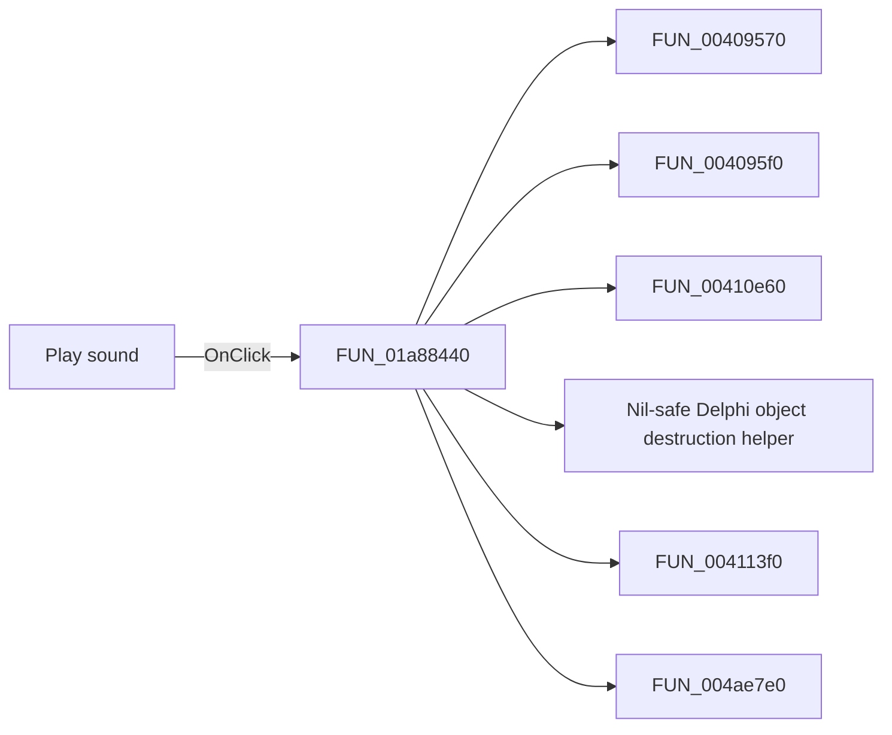

# Play sound

> Analysis status: Pending individual source review.

## Control

| Property | Recovered value |
| --- | --- |
| Form | DFWindow |
| Component path | DFWindow.DFToolPanel.ToolNoteBook.Diagram.PlaySoundBtn |
| Control class | TSpeedButton |
| Caption | Not present in the recovered resource. |
| Hint | Play sound |
| Text | Not present in the recovered resource. |
| Handler name | PlaySoundBtnClick |
| Handler address | 01a88440 |
| Graph node | `resource:dfm:DFWindow/DFWindow.DFToolPanel.ToolNoteBook.Diagram.PlaySoundBtn` |
| Handler node | `function:01a88440` |
| Graph layer | UI |

## What happens when clicked

Pending individual analysis. An agent must read the recovered handler source and its relevant callees before it replaces this text.

## Click flow

## Handler evidence

- Source: [DecompiledSources/Tina16/functions/0000000001A88440__FUN_01a88440.c](../../../DecompiledSources/Tina16/functions/0000000001A88440__FUN_01a88440.c)
- Recovered role: Not present in the recovered resource.
- Current graph summary: Handles 1 Delphi UI event: DFWindow.DFToolPanel.ToolNoteBook.Diagram.PlaySoundBtn.OnClick.
- Current graph behavior: Not present in the recovered resource.
- Current graph evidence: Not present in the recovered resource.
- Complexity: complex
- Distinct outgoing calls: 16

## Direct calls

- `function:00409570` — FUN_00409570
- `function:004095f0` — FUN_004095f0
- `function:00410e60` — FUN_00410e60
- `function:00410f20` — Nil-safe Delphi object destruction helper
- `function:004113f0` — FUN_004113f0
- `function:004ae7e0` — FUN_004ae7e0
- `function:004aeac0` — FUN_004aeac0
- `function:0065b870` — FUN_0065b870
- `function:00b90620` — FUN_00b90620
- `function:00b90650` — FUN_00b90650
- `function:016d6770` — FUN_016d6770
- `function:016d6890` — FUN_016d6890
- `function:016d6ca0` — FUN_016d6ca0
- `function:016d6df0` — FUN_016d6df0
- `function:016d6fd0` — FUN_016d6fd0
- `function:01acff30` — FUN_01acff30

## Resource evidence

- Kind: Not present in the recovered resource.
- Modal result: Not present in the recovered resource.
- Checked state: Not present in the recovered resource.
- List items: Not present in the recovered resource.
- Image reference: Not present in the recovered resource.
- Extracted glyph: [`0107_DFWindow_DFWindow_DFToolPanel_ToolNoteBook_Diagram_PlaySoundBtn_Glyph_Data.png`](../../../glyph/0107_DFWindow_DFWindow_DFToolPanel_ToolNoteBook_Diagram_PlaySoundBtn_Glyph_Data.png)

## Nearby label candidates

Nearby labels are layout candidates only. They are not proof of behavior.

- No same-parent label candidate is available.

## Analysis limits

- Do not infer behavior from the control class, caption, hint, glyph, or nearby label alone.
- Do not replace the pending status until the handler source and relevant call path provide enough evidence.
