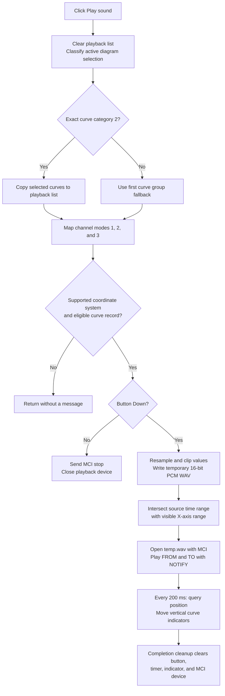

# Play diagram curves as sound

> Analysis status: Complete. The recovered handler, WAV conversion pipeline, Windows MCI commands, playback timer, and cleanup handler establish the control behavior.

## Control

| Property | Recovered value |
| --- | --- |
| Form | DFWindow |
| Component path | DFWindow.DFToolPanel.ToolNoteBook.Diagram.PlaySoundBtn |
| Control class | TSpeedButton |
| Caption | Not present in the recovered resource. |
| Hint | Play sound |
| Handler name | PlaySoundBtnClick |
| Handler address | 01a88440 |
| AllowAllUp | True |
| GroupIndex | 5 |
| NumGlyphs | 2 |
| Graph node | `resource:dfm:DFWindow/DFWindow.DFToolPanel.ToolNoteBook.Diagram.PlaySoundBtn` |
| Handler node | `function:01a88440` |
| Graph layer | UI |

`AllowAllUp`, group 5, and the two-frame glyph agree with the recovered use of the button's `Down` state: pressed starts playback and released stops it. The hint and play-triangle glyph support this interpretation, but the handler and MCI command path are the primary evidence.

## Enablement and curve selection

The shared DFWindow command-state refresher `FUN_01a7fc90` enables this button only when all of these conditions hold:

- An active diagram exists.
- The current selection category is exactly 2, the recovered curve category.
- The selected curve belongs to the supported coordinate-system type.
- The DFWindow mode byte at `+0x1088` is 1.

The click handler relies on this enablement and does not repeat the active-diagram null check.

For the normal enabled click, `FUN_01a88440` copies every selected curve into a temporary playback list at DFWindow `+0x1068`. If the handler is invoked with another selection category, it instead uses the first curve group in the first coordinate system. This fallback can be reached by direct or stale-state invocation, but it is not the normal enabled-button route.

The handler scans the candidate curves' channel-mode byte at `+0x3b`:

| Mode | Playback mapping |
| --- | --- |
| 1 | Use the same curve for both internal slots and produce mono output; stop the scan. |
| 2 | Use the curve as the first channel; a later mode-2 curve replaces it. |
| 3 | Use the curve as the second channel; a later mode-3 curve replaces it. |

A missing channel supplies zero. Playback proceeds only if the scan finds a candidate record and its byte at `+0x2b` is zero. An unsupported first coordinate-system type, no candidate record, or a nonzero `+0x2b` returns without a message.

## Pressed: build and play a temporary WAV

When `PlaySoundBtn.Down` is true, the handler reads the sample rate from the source metadata integer at `+0x4c` and passes the metadata double at `+0x40` as the WAV accumulator's buffer-sizing factor. It iterates the data provider's timestamped rows and selects each curve value through the curve index at `+0x154`.

The conversion is the same pipeline documented for [Export diagram curves as a WAV file](dfwavmnu-502e5d6f1a.md):

1. `FUN_016d6770` configures one or two channels in offline mode.
2. `FUN_016d6ca0` resamples timestamped values onto the uniform sample grid.
3. `FUN_016d6ae0` multiplies by 32,768, rounds, clips to signed 16-bit PCM, and writes mono or interleaved stereo samples.
4. `FUN_016d6890` writes the RIFF/WAVE header and samples to `temp.wav` in the application temporary directory because this handler supplies no output path.

The click therefore uses a temporary file rather than the accumulator's live-streaming mode. The recovered path always creates or replaces `temp.wav`; this handler does not delete the file afterward.

The MCI playback starter `FUN_016d6df0` opens that file as `waveaudio`. It converts seconds to integer milliseconds and plays only this interval:

- Start: the greater of the provider's first timestamp and the first X axis lower bound at `+0xb8`.
- Stop: the lesser of the provider's last timestamp and the first X axis upper bound at `+0xc0`.

The handler does not separately verify that the resulting start value is not greater than the stop value. It sets DFWindow's current playback position at `+0x1070` to -1 before starting MCI.

## Position indicator and completion

After MCI opens the temporary WAV, `FUN_016d6df0` registers `FUN_01a88bf0` as a 200 ms periodic callback and issues an MCI play command with FROM, TO, and NOTIFY.

On each timer callback, `FUN_01a88bf0` erases the previous vertical playback indicator for every curve in the temporary list, queries the current MCI position in milliseconds through `FUN_016d6f90`, stores the new position at `+0x1070`, and draws the indicator again. The shared drawing helper maps playback time to the curve's X coordinate and restricts the line to the visible axis bounds.

`FUN_01a88980` performs the recovered completion cleanup. It clears `PlaySoundBtn.Down`, removes the periodic callback, removes the current indicator through the same drawing operation, and closes the MCI device.

## Released: stop playback

The handler rebuilds the temporary curve list, classifies the selection, and applies the coordinate-system and candidate-record guards before it tests `PlaySoundBtn.Down`. If those guards pass and `Down` is false, it does not rebuild the WAV. It calls `FUN_016d6fd0`, which sends MCI stop and then calls `FUN_016d7000` to close the current device. An ineligible direct invocation returns before it sends the stop command.

This released-button branch does not directly remove the periodic callback or redraw the old indicator. Those operations exist in `FUN_01a88980`. The recovered source does not establish whether another notification always routes a manual stop through that cleanup handler, so this article does not claim that the stop click alone removes the timer and marker.

## Click flow

## State, errors, and persistence

- The temporary curve list at `+0x1068`, current position at `+0x1070`, button `Down` state, MCI device, and timer are runtime playback state. The recovered path does not serialize them or modify the diagram model.
- The visible indicator is transient drawing. It does not change curve data or plot visibility.
- Cancel does not apply because this control opens no dialog.
- WAV allocation and file I/O have no handler-level catch or rollback. A failure can propagate after `temp.wav` has been created or partly written.
- If MCI open fails, the starter does not register the timer and reports no application error. If the MCI play command fails after timer registration, it closes the device but does not explicitly clear the button or remove the timer in that helper.
- Repeated eligible released clicks send stop and close again. Repeated pressed-state entry rebuilds and overwrites the same temporary WAV.
- The click changes no saved diagram or application setting. Its only persistent external artifact is the overwritten temporary `temp.wav`, which this path does not remove.

## Evidence

- [Play button handler `FUN_01a88440`](../../../DecompiledSources/Tina16/functions/0000000001A88440__FUN_01a88440.c) branches on the button `Down` state, selects curve sources and channels, invokes the offline WAV pipeline, calculates the visible time bounds, and starts or stops playback.
- [DFWindow command-state refresher `FUN_01a7fc90`](../../../DecompiledSources/Tina16/functions/0000000001A7FC90__FUN_01a7fc90.c) supplies the active-diagram, exact curve-selection, owner-type, and mode guards. This shared helper is documented by TIARA-diz.6.7.270 and is not re-annotated here.
- [MCI playback starter `FUN_016d6df0`](../../../DecompiledSources/Tina16/functions/00000000016D6DF0__FUN_016d6df0.c) opens `temp.wav` as `waveaudio`, registers the 200 ms callback, and sends the bounded play command.
- [MCI stop helper `FUN_016d6fd0`](../../../DecompiledSources/Tina16/functions/00000000016D6FD0__FUN_016d6fd0.c) sends the stop command and closes the device.
- [MCI position query `FUN_016d6f90`](../../../DecompiledSources/Tina16/functions/00000000016D6F90__FUN_016d6f90.c) requests the current position.
- [MCI close helper `FUN_016d7000`](../../../DecompiledSources/Tina16/functions/00000000016D7000__FUN_016d7000.c) closes the current playback device.
- [Playback position timer `FUN_01a88bf0`](../../../DecompiledSources/Tina16/functions/0000000001A88BF0__FUN_01a88bf0.c) erases the prior indicators, queries the playback position, and draws the indicators at the new time.
- [Playback cleanup handler `FUN_01a88980`](../../../DecompiledSources/Tina16/functions/0000000001A88980__FUN_01a88980.c) clears the toggle, removes the callback and indicator, and closes MCI.
- [Playback indicator renderer `FUN_01ab4370`](../../../DecompiledSources/Tina16/functions/0000000001AB4370__FUN_01ab4370.c) maps time to a curve X coordinate and draws the bounded vertical indicator. It is shared evidence and is not re-annotated here.
- [WAV export analysis](dfwavmnu-502e5d6f1a.md) provides the canonical descriptions for `FUN_016d6770`, `FUN_016d6ca0`, `FUN_016d6ae0`, `FUN_016d2470`, and `FUN_016d6890`; this fragment does not duplicate them.
- [Extracted two-frame play glyph](../../../glyph/0107_DFWindow_DFWindow_DFToolPanel_ToolNoteBook_Diagram_PlaySoundBtn_Glyph_Data.png) corroborates the recovered playback role.

## Evidence limits

- The domain name of source metadata field `+0x40` is not established. It is described only by its proven use in buffer sizing.
- The recovered sources prove the numeric MCI command sequence and `waveaudio` device type. They do not expose a direct imported function name for the command thunk.
- The handler does not validate sample rate, time-bound order, or MCI return errors itself. Normal curve data is expected to satisfy these constraints, but this analysis does not infer validation outside the traced path.
- The completion cleanup entry point is proven by its body and state effects. Its exact Delphi message-method name is not recovered.
