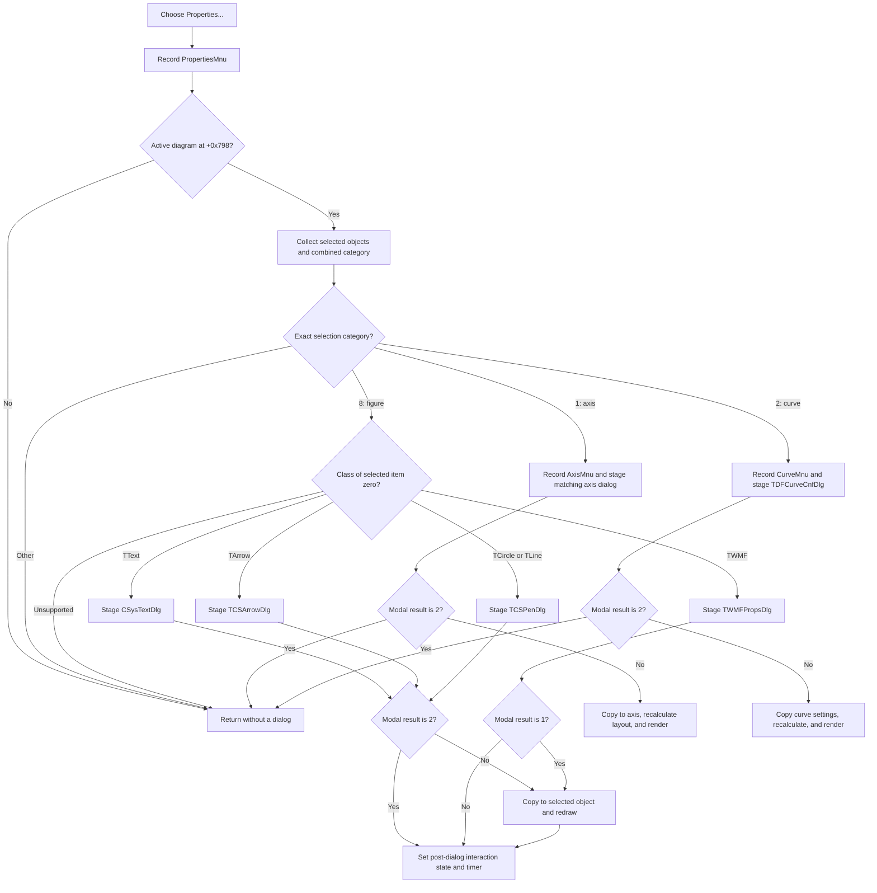

# Properties...

> Analysis status: Reviewed from the recovered popup handler, selection classifier, axis and curve launchers, figure property helpers, dialog modal-result checks, DFM resource, and recovered Delphi class and virtual-method tables.

## Control

| Property | Recovered value |
| --- | --- |
| Form | DFWindow |
| Component path | DFWindow.DFPopupMnu.PropertiesMnu |
| Control class | TMenuItem |
| Caption | Properties... |
| Hint | Not present in the recovered resource. |
| Text | Not present in the recovered resource. |
| Handler name | PropertiesMnuClick |
| Handler address | 01a7cb70 |
| Graph node | `resource:dfm:DFWindow/DFWindow.DFPopupMnu.PropertiesMnu` |
| Handler node | `function:01a7cb70` |
| Graph layer | UI |

## What happens when selected

[`FUN_01a7cb70`](../../../DecompiledSources/Tina16/functions/0000000001A7CB70__FUN_01a7cb70.c) first sends the token `PropertiesMnu` to the DFWindow command-recording path. This happens before the active-diagram and selection checks. If DFWindow field `+0x798` has no active diagram, the handler returns after this record and opens no dialog.

For an active diagram, the handler calls the shared [selection classifier](../../../DecompiledSources/Tina16/functions/0000000001ACFF30__FUN_01acff30.c). The classifier supplies both a selected-object list and a combined category mask. `PropertiesMnuClick` accepts only these exact results:

| Exact category | Recovered object kind | Property path |
| --- | --- | --- |
| `1` | Axis | Call the virtual Axis command, recovered as `FUN_01a78c00`, which records `AxisMnu` and starts the shared axis-property editor. |
| `2` | Curve | Call the virtual Curve command, recovered as `FUN_01a78cb0`, which records `CurveMnu` and starts the shared curve-property editor. |
| `8` | Figure-only selection | Test selected-list item zero for `TText`, `TArrow`, `TCircle`, `TLine`, or `TWMF`, and open the matching editor. |

An empty selection, a mixed category, another category, or an unsupported category-8 class causes a silent return. The handler does not show an invalid-selection message. For category 8, item zero selects the editor and the recovered helpers edit item zero only.

## Axis properties

[`FUN_01a78c00`](../../../DecompiledSources/Tina16/functions/0000000001A78C00__FUN_01a78c00.c) records `AxisMnu` and calls [`FUN_01ad4310`](../../../DecompiledSources/Tina16/functions/0000000001AD4310__FUN_01ad4310.c). The launcher collects the selection again, takes item zero as the axis, makes a comparison snapshot, and selects a dialog from the recovered axis-type byte:

| Axis type | Dialog class |
| --- | --- |
| `3` | `TDFAxisCnf2Dlg` |
| `6` or `7` | `TDFPAxisCnfDlg` |
| `4` or `5` | `TDFSAxisCnfDlg` |
| Other recovered values | `TDFAxisCnfDlg` |

The launcher copies the live axis range, scale, precision, text, and applicable fonts and options into the selected dialog. A modal result of `2` exits before copy-back and display updates. For any other result, it copies the staged fields to the live axis. Where an accepted lower and upper range are equal, the launcher changes the upper value to lower plus `1e-09`. Some axis kinds also update the recovered automatic X-axis or Y-axis adjustment setting.

After accepted copy-back, the launcher recalculates the diagram layout, performs a full diagram render, and invokes the selected axis refresh method. The individual dialog controls own their local input handling. The launcher does not return a separate validation status; it only treats modal result `2` as cancellation. The detailed font-staging evidence is in the [standard axis number-font article](../dfaxiscnfdlg/adnumbtn-e9f9b18919.md), [second axis-dialog font article](../dfaxiscnf2dlg/adfontbtn-d4bc94d24c.md), [P-axis number-font article](../dfpaxiscnfdlg/adnumbtn-d04368f4c1.md), and [S-axis number-font article](../dfsaxiscnfdlg/adnumbtn-85df932d1b.md).

## Curve properties

[`FUN_01a78cb0`](../../../DecompiledSources/Tina16/functions/0000000001A78CB0__FUN_01a78cb0.c) records `CurveMnu` and calls [`FUN_01ad5480`](../../../DecompiledSources/Tina16/functions/0000000001AD5480__FUN_01ad5480.c). The launcher constructs `TDFCurveCnfDlg`, collects the selection again, and searches the diagram's coordinate-system collection for the system that owns selected-list item zero. If it cannot find an owner, it opens no dialog and shows no error.

The launcher stages the selected curve's title and available display fields. Coordinate-system types `0`, `5`, and `6` use one group of curve controls. On acceptance, this branch applies the selected color, line style, line width, range-related values, and other staged display values to every curve in the curve-only selection, then recalculates the curves and diagram. The other recovered coordinate-system types use a second control group and update item zero. Both accepted branches redraw the diagram. Modal result `2` skips all model writes and redraw calls.

## Text and figure properties

For an exact category-8 selection, the first selected object's recovered Delphi class selects one of these paths:

| First selected class | Dialog and accepted effect |
| --- | --- |
| `TText` | [`FUN_01ae3c10`](../../../DecompiledSources/Tina16/functions/0000000001AE3C10__FUN_01ae3c10.c) loads the object into `CSysTextDlg`. Result `2` discards the staged text object. Another result erases the old drawing, copies the staged text data to the live object, finalizes it, and draws it again. |
| `TArrow` | [`FUN_01ae5040`](../../../DecompiledSources/Tina16/functions/0000000001AE5040__FUN_01ae5040.c) loads `TCSArrowDlg` with the text, pen, arrow option, attachment state, and a list of other arrows. Result `2` discards the staged values. Another result copies them to the live arrow, recalculates its attachment when present, and redraws it. |
| `TCircle` or `TLine` | [`FUN_01ae4cc0`](../../../DecompiledSources/Tina16/functions/0000000001AE4CC0__FUN_01ae4cc0.c) loads `TCSPenDlg` with the object's pen. Result `2` discards the staged pen. Another result copies the pen to the circle or line, redraws the object, and updates the corresponding default width, color, and style settings. The [Circle command article](circlemnu-6d9942c71f.md) gives the related creation path. |
| `TWMF` | [`FUN_01ae7100`](../../../DecompiledSources/Tina16/functions/0000000001AE7100__FUN_01ae7100.c) loads `TWMFPropsDlg` with 100-percent size defaults and the selected WMF fields. Only modal result `1` commits. It derives new object coordinates from the accepted percentages, erases the old drawing, writes the accepted style fields and coordinates, and draws the object again. |

After any recognized category-8 helper returns, including after its Cancel path, `PropertiesMnuClick` clears DFWindow field `+0x1000`, sets interaction-state byte `+0x7A8` to `0x13`, and enables `RefuseClickTimer` at `+0x8E8`. The recovered names do not establish a more specific meaning for state `0x13`. This post-dialog state change does not prove that the object changed.

## Click flow

## State, validation, and persistence boundaries

- Axis, curve, text, arrow, and pen paths use modal result `2` as Cancel. The WMF path is stricter and commits only for result `1`.
- The editors stage their values before the modal call. Their accepted paths write directly to live model objects. Their Cancel paths skip these writes.
- The recovered launchers have no visible application-level catch or rollback transaction. If a copy-back or refresh call fails after an earlier live write, this source does not prove atomic recovery.
- This call path contains no explicit document serializer, file write, undo-record creation, or recovered document-dirty flag update. It proves in-memory model changes and redraws only. The early command-recording calls must not be described as document persistence.
- There is no handler-local message for no active diagram, no selection, mixed selection, an unsupported figure class, or a curve whose owning coordinate system is not found.

## Resource evidence

- The recovered DFM identifies a `TMenuItem` captioned `Properties...` under `DFPopupMnu` and binds `OnClick` to `PropertiesMnuClick` at `01a7cb70`.
- No hint, action, image index, embedded glyph, checked state, or nearby same-parent label is present for this menu item.
- Recovered Delphi RTTI identifies the tested figure classes as `TText`, `TArrow`, `TCircle`, `TLine`, and `TWMF`, and identifies the constructed property-dialog classes listed above.

## Evidence limits

- The numeric axis and coordinate-system type values have no recovered enum names. This article keeps the numeric values instead of inventing business names.
- The exact storage backend of the recovered default-setting writes is not established here.
- Redraw and command-recording calls are not proof that a document was serialized or saved.
