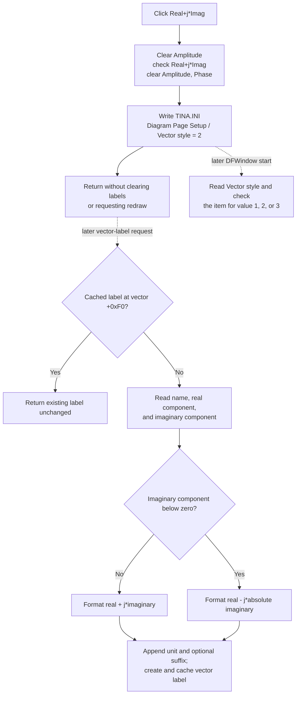

# Real+j*Imag

> Analysis status: Complete from the recovered resource, unique handler, shared vector-label formatter, initialization path, and persistence path.

## Control

| Property | Recovered value |
| --- | --- |
| Form | DFWindow |
| Component path | DFWindow.DFMainMenu.DFViewMnu.Vectorlabelstyle1.RealImagMnu |
| Control class | TMenuItem |
| Parent menu | Vector label style |
| Caption | Real+j*Imag |
| Hint | Not present in the recovered resource. |
| Handler name | RealImagMnuClick |
| Handler address | 01a87ca0 |
| Graph node | `resource:dfm:DFWindow/DFWindow.DFMainMenu.DFViewMnu.Vectorlabelstyle1.RealImagMnu` |
| Handler node | `function:01a87ca0` |
| Graph layer | UI |

## What happens when clicked

`TDFWindow.RealImagMnuClick` selects real-plus-imaginary formatting for diagram vector labels. It does not read `Sender`, an active diagram, a selected vector, a page, or a cursor.

The handler performs four operations in this order:

1. Clear `AmplitudeMnu` at `TDFWindow +0x9f8`.
2. Check `RealImagMnu` at `TDFWindow +0xa00`.
3. Clear `AmplitudePhaseMnu` at `TDFWindow +0xa08`.
4. Write integer value `2` to `TINA.INI` under `[Diagram Page Setup] Vector style`.

The sibling handlers persist value `1` for **Amplitude** and value `3` for **Amplitude, Phase**. Thus, value `2` is an enumerated display style. It is not a complex value, numeric precision, or property of one vector.

## Later vector-label format

The click does not call the shared formatter. It communicates the choice through the checked menu items and the persisted value.

When [`FUN_00f15c70`](../../../DecompiledSources/Tina16/functions/0000000000F15C70__FUN_00f15c70.c) later creates an uncached vector label, it reads the vector name, real component at `+0xb8`, and imaginary component at `+0xc0`. With `RealImagMnu` checked, it builds one of these forms:

- nonnegative imaginary component: `<name> = (<real> + j*<imaginary>)`;
- negative imaginary component: `<name> = (<real> - j*<absolute imaginary>)`.

The shared numeric formatter selects the displayed precision and scaling. The label builder then appends the unit selected by vector byte `+0x9d` and an optional suffix from `+0xa0`. This path formats the components for display; it does not modify their stored double values.

The formatter creates a diagram text object, stores it in the vector's cache field at `+0xf0`, positions it at the vector, and registers it as `Text for Vector Label`. Recovered callers request these labels during an interactive vector operation, automatic vector-label creation, and coordinate-based diagram lookup.

## Existing labels and display boundary

The formatter returns the existing object immediately when vector field `+0xf0` is nonzero. The click handler does not clear this field on any vector. It also makes no layout, invalidation, repaint, or redraw call.

As a result, existing cached vector labels and existing pixels remain unchanged after the click. The real-plus-imaginary choice applies when a later operation creates a label for a vector whose cache field is empty, or after another path removes and recreates a cached label.

The command does not change vector samples, curve legends, axis captions, cursor values, page state, or independent text objects.

## Reload and persistence

DFWindow initialization reads `[Diagram Page Setup] Vector style` from `TINA.INI` with default value `1`. It checks `AmplitudeMnu` for value `1`, `RealImagMnu` for value `2`, or `AmplitudePhaseMnu` for value `3`.

This is a global Diagram Page Setup preference. The handler writes it even when there is no active diagram or vector. It does not serialize a diagram, mark a document as changed, or require a later Save command. A later DFWindow can restore value `2` directly from the INI file.

## Repeated, empty, invalid, and error paths

- A repeated click requests the same three check states. The VCL checked-state setter skips native menu work for each unchanged item, but the handler still rewrites INI value `2`.
- The click works with no selected vector or with an empty diagram because the handler never reads diagram content.
- A vector with an imaginary component of zero uses the nonnegative branch and displays `+ j*0` after numeric formatting.
- A missing INI value loads default style `1`, not style `2`.
- If the INI reader returns a value outside `1` through `3`, initialization checks no style item. Clicking `Real+j*Imag` repairs the three checks and writes valid value `2`.
- The handler has no local validation message, status result, exception handler, retry, or rollback.
- Menu checks change before the INI write. If persistence fails, the current window can show `Real+j*Imag` while a later process still reads the earlier value.
- A failure during one of the three menu updates can leave a partial checked-state group and prevents the later INI write.
- A later formatter failure can leave its newly allocated label cached before its text, position, or collection registration is complete. That later failure is not part of the click and does not roll back the saved style.

## Click and later-label flow

## Handler and call-path evidence

- [`FUN_01a87ca0`](../../../DecompiledSources/Tina16/functions/0000000001A87CA0__FUN_01a87ca0.c) is the DFM-bound handler. It writes the three menu checks and persists value `2` without any branch or diagram access.
- [`FUN_007e2d20`](../../../DecompiledSources/Tina16/functions/00000000007E2D20__FUN_007e2d20.c) is the change-aware VCL checked-state setter used for all three menu items.
- [`FUN_00f069f0`](../../../DecompiledSources/Tina16/functions/0000000000F069F0__FUN_00f069f0.c) writes the supplied integer under section `Diagram Page Setup` in `TINA.INI`.
- [`FUN_01a72620`](../../../DecompiledSources/Tina16/functions/0000000001A72620__FUN_01a72620.c) reads `Vector style` with default value `1` and maps values `1`, `2`, and `3` to the three menu checks.
- [`FUN_00f15c70`](../../../DecompiledSources/Tina16/functions/0000000000F15C70__FUN_00f15c70.c) owns the shared cached-label construction and the real-plus-or-minus-imaginary formatting branch. Its canonical annotation belongs to `TIARA-diz.6.7.324` and is not duplicated here.
- [`FUN_01a87c20`](../../../DecompiledSources/Tina16/functions/0000000001A87C20__FUN_01a87c20.c) and [`FUN_01a87d20`](../../../DecompiledSources/Tina16/functions/0000000001A87D20__FUN_01a87d20.c) are the comparison handlers for values `1` and `3`.
- [`ui-evidence.json`](../../../DecompiledSources/Tina16/resources/dfm/ui-evidence.json) supplies the parent and child captions and binds `RealImagMnuClick`. It provides no hint, image, initial checked state, or nearby label evidence for this item.

## Analysis limits

- The recovered type and field names for the vector record, unit selector, and optional suffix are not published. Their roles follow from data flow and label construction.
- Several unit strings remain anonymous data references. One recovered literal is styled `W`; this article does not assign names to the other unit values.
- The exact numeric display precision depends on the shared numeric formatter and vector values. The click handler does not select precision.
- This fragment owns only the unique `RealImagMnuClick` role. Shared formatter, VCL, and INI helper annotations remain with their canonical owners.
