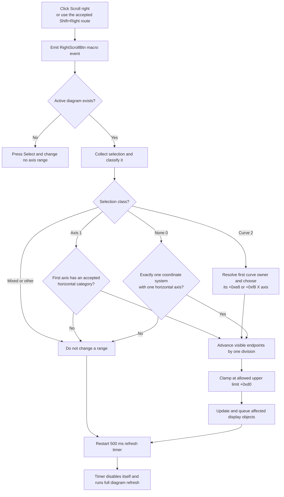

# Scroll the selected horizontal axis right

> Analysis status: Recovered resource, unique click handler, right-scroll target selection, linear and logarithmic step calculation, upper-bound clamping, redraw timer, keyboard reuse, and guard, repeat, error, and persistence boundaries reviewed.

## Control

| Property | Recovered value |
| --- | --- |
| Form | DFWindow |
| Component path | DFWindow.DFToolPanel.ToolNoteBook.Diagram.RightScrollBtn |
| Control class | TSpeedButton |
| Caption | Not present in the recovered resource. |
| Hint | Scroll right |
| Handler name | RightScrollBtnClick |
| Handler address | 01a79f20 |
| Graph node | `resource:dfm:DFWindow/DFWindow.DFToolPanel.ToolNoteBook.Diagram.RightScrollBtn` |
| Handler node | `function:01a79f20` |
| Graph layer | UI |

## What happens when clicked

[`FUN_01a79f20`](../../../DecompiledSources/Tina16/functions/0000000001A79F20__FUN_01a79f20.c) first builds and sends the macro event named `RightScrollBtn`. It then reads the active diagram manager from DFWindow offset `+0x798`.

- If there is no active diagram, it presses the Select speed button and calls the normal Select handler. No axis range changes.
- If a diagram exists, it calls [`FUN_01ae2e30`](../../../DecompiledSources/Tina16/functions/0000000001AE2E30__FUN_01ae2e30.c), which selects one horizontal axis, moves its visible interval right, queues affected objects for drawing, and schedules a delayed full refresh.

The command changes an axis view. It does not move curve samples, cursor coordinates, figures, or the diagram page.

## Which axis is scrolled

The right-scroll dispatcher rebuilds the current diagram selection through the canonical selection collector. It uses only the first selected item.

### Selected axis

For selection class `1`, which other recovered DFWindow paths establish as axes, the dispatcher checks the first axis's recovered type category. It calls the right-step helper only for recovered horizontal-axis categories `0`, `4`, and `6`, represented by mask `0x51`. It then queues the selected axis for drawing.

An unsupported selected-axis category does not change a range. The dispatcher still queues the item and schedules the delayed full refresh.

### Selected curve

For selection class `2`, which the recovered call sites establish as curves, the dispatcher resolves the first curve's containing coordinate system. It uses that coordinate system's recovered type category to choose one of the curve's X-axis links at `+0xe8` or `+0xf8`. It scrolls and queues that axis.

Additional selected curves are not iterated. A mixed selection has a combined class other than `1` or `2`, so it does not enter either range-change branch.

### No selection

For selection class `0`, the dispatcher supplies a default only when both conditions are true:

1. the diagram has exactly one coordinate system in collection `+0xd8`; and
2. that coordinate system has exactly one horizontal axis in collection `+0x70`.

It scrolls that sole horizontal axis. If either count differs from one, the command makes no range change. It does not choose an arbitrary coordinate system or axis.

## Direction, step, and limits

[`FUN_01cd3b70`](../../../DecompiledSources/Tina16/functions/0000000001CD3B70__FUN_01cd3b70.c) delegates the numeric range change to [`FUN_01cd3950`](../../../DecompiledSources/Tina16/functions/0000000001CD3950__FUN_01cd3950.c). The axis fields have these recovered roles:

- `+0xb8`: visible lower endpoint;
- `+0xc0`: visible upper endpoint;
- `+0xc8`: allowed lower limit;
- `+0xd0`: allowed upper limit;
- `+0x70`: scale mode; and
- `+0x74`: division count.

For the normal linear branches, the helper calculates one step as:

`(visible upper - visible lower) / division count`

It adds that step to both visible endpoints. This keeps the visible span constant. If the proposed upper endpoint exceeds the allowed upper limit, it reduces the step so the final upper endpoint equals `+0xd0` and keeps the same span. At the upper limit, the effective step is zero and the range does not move.

For scale mode `2`, the helper converts both visible endpoints to the recovered logarithmic domain, advances them by one transformed division, clamps the upper endpoint to the transformed allowed upper limit, and converts both values back. The result is a multiplicative right shift that preserves the visible span in logarithmic space.

The command writes only the visible endpoints `+0xb8` and `+0xc0`. It does not change the allowed limits, scale mode, division count, axis assignment, or a recovered automatic/manual-scale flag. The visible range change is immediate live view state; the source does not show a separate mode conversion.

## Drawing and the 500 ms timer

When the axis step reports movement, `FUN_01cd3b70` paints an orientation-specific rectangle white, invokes the axis update and drawing methods, and returns. The dispatcher also adds the affected axis, active cursors, and resolved coordinate-system display object to the diagram's draw queue where applicable.

The dispatcher then restarts the diagram timer at `+0x88`:

1. disable the timer;
2. set its interval to 500 ms;
3. install [`FUN_01ae5d60`](../../../DecompiledSources/Tina16/functions/0000000001AE5D60__FUN_01ae5d60.c) with the diagram manager as context; and
4. enable the timer.

When the timer fires, its callback disables the timer and calls the canonical full diagram refresh [`FUN_01ae5650`](../../../DecompiledSources/Tina16/functions/0000000001AE5650__FUN_01ae5650.c). The 500 ms timer therefore coalesces the final redraw. It is not an application repeat timer for the button.

## Repeated input and keyboard route

Each click shifts the visible interval by at most one division. Repeated clicks move it by more divisions until the upper allowed limit stops further movement. Every invocation restarts the same 500 ms refresh timer, so a sequence of quick requests postpones the final full refresh until 500 ms after the last restart.

The DFM binds only `OnClick` for this horizontal button; it has no recovered `OnMouseDown` repeat handler. [`FUN_01a7d460`](../../../DecompiledSources/Tina16/functions/0000000001A7D460__FUN_01a7d460.c) also calls the same handler for Right Arrow (`0x27`) with the recovered Shift-state bit set and Control-state bit clear in the applicable branch. Operating-system key repeat can therefore cause repeated handler calls, but the handler contains no repeat loop.

## Guards, no-op cases, and errors

- No active diagram uses the Select fallback and does not call the scroll dispatcher.
- No selection with an ambiguous coordinate-system or horizontal-axis count makes no range change.
- An unsupported selected-axis category, a mixed selection, or a curve whose owner cannot be resolved makes no range change.
- At the upper allowed limit, the linear range helper reports no movement. The outer dispatcher still queues applicable objects and restarts the delayed refresh timer.
- A zero visible span gives a zero linear step. The range stays unchanged, but refresh work can still run.
- The numeric helper divides by axis division count `+0x74` without a local zero check. It also applies logarithmic conversion without a local positive-value check. Safe results for inconsistent axis state are not established.
- The selected-axis and selected-curve branches rely on the selection collector's class and item-zero invariants. There is no independent item-count guard before each item-zero access.
- Macro-event construction and optional recording occur before the diagram guard. An error there prevents the scroll attempt.
- Range writes, partial drawing, queue insertion, timer setup, and full refresh occur in sequence without an exception handler or rollback. An error after the endpoint writes can leave the range changed while the display or draw queue is stale.
- The click path shows no validation message, confirmation, retry, or error dialog.

## Persistence boundary

The action changes the live visible axis endpoints. It does not call a document serializer, file writer, settings writer, Save command, explicit dirty-state setter, or undo registrar. The click path does not establish whether a later document save includes the current visible range.

## Right-scroll flow

## Handler and call-path evidence

- Click handler: [FUN_01a79f20](../../../DecompiledSources/Tina16/functions/0000000001A79F20__FUN_01a79f20.c)
- Right-scroll selection and redraw dispatcher: [FUN_01ae2e30](../../../DecompiledSources/Tina16/functions/0000000001AE2E30__FUN_01ae2e30.c)
- One-axis right-step and redraw helper: [FUN_01cd3b70](../../../DecompiledSources/Tina16/functions/0000000001CD3B70__FUN_01cd3b70.c)
- Visible-range numeric update: [FUN_01cd3950](../../../DecompiledSources/Tina16/functions/0000000001CD3950__FUN_01cd3950.c)
- Selection collector: [FUN_01acff30](../../../DecompiledSources/Tina16/functions/0000000001ACFF30__FUN_01acff30.c)
- Curve-to-coordinate-system resolver: [FUN_01ad1090](../../../DecompiledSources/Tina16/functions/0000000001AD1090__FUN_01ad1090.c)
- Draw-queue insertion: [FUN_01a8dee0](../../../DecompiledSources/Tina16/functions/0000000001A8DEE0__FUN_01a8dee0.c)
- Delayed refresh callback: [FUN_01ae5d60](../../../DecompiledSources/Tina16/functions/0000000001AE5D60__FUN_01ae5d60.c)
- Full diagram refresh: [FUN_01ae5650](../../../DecompiledSources/Tina16/functions/0000000001AE5650__FUN_01ae5650.c)
- Select fallback: [FUN_01a794b0](../../../DecompiledSources/Tina16/functions/0000000001A794B0__FUN_01a794b0.c)
- Keyboard reuse: [FUN_01a7d460](../../../DecompiledSources/Tina16/functions/0000000001A7D460__FUN_01a7d460.c)
- Mirrored left-scroll control and canonical shared concepts: [Left Scroll button](leftscrollbtn-335b6c18ff.md)
- Right-arrow glyph: [0092 RightScrollBtn Glyph](../../../glyph/0092_DFWindow_DFWindow_DFToolPanel_ToolNoteBook_Diagram_RightScrollBtn_Glyph_Data.png)

## Resource and graph evidence

- The hint is `Scroll right`.
- The extracted 9-by-9 raster glyph is a black triangle that points right. It confirms direction, but the range calculations prove the effect and step.
- The control has no caption, action, image-list reference, modal result, checked state, or nearby label.
- The recovered DFM binds `OnClick` to `FUN_01a79f20` and does not bind a horizontal `OnMouseDown` repeat handler.
- The read-only graph places the handler in the `UI` layer. Its outgoing calls are the macro helpers, Select fallback, speed-button state setter, UnicodeString cleanup, and `FUN_01ae2e30`. It also has an incoming call from the DFWindow key-down handler.

## Analysis limits and annotation ownership

- Original Delphi names are not recovered for the diagram manager, coordinate system, axis classes, scale-mode enumeration, and several virtual update and draw methods.
- The type-category masks prove which recovered classes enter each branch, but their original Delphi enum labels are unavailable.
- `.372` owns the mirrored left-scroll concepts. `.375` owns the unique right handler `FUN_01a79f20`, the right dispatcher `FUN_01ae2e30`, and the one-axis right helper `FUN_01cd3b70`.
- Canonical selection, coordinate-system resolution, timer, draw-queue, and full-refresh functions are cited and not re-annotated here.
- No proprietary UI action was executed. The findings use recovered resource, glyph, graph, handler, callee, and mirrored left-path evidence.
