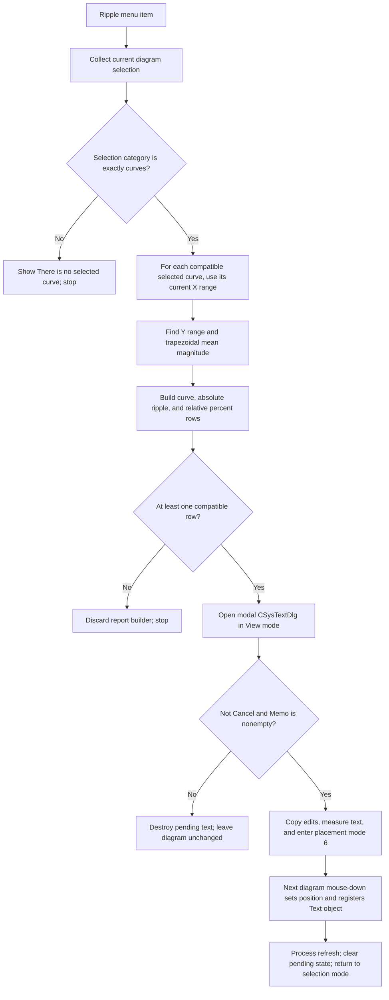

# Calculate and place curve-ripple text

> Analysis status: Source reviewed through curve selection, ripple calculation,
> result formatting, text editing, interactive placement, and failure bounds.

## Control

| Property | Recovered value |
| --- | --- |
| Form | DFWindow |
| Component path | DFWindow.DFMainMenu.DFProcessingMnu.RippleMnu |
| Control class | TMenuItem |
| Caption | Ripple ... |
| Hint | Not present in the recovered resource. |
| Text | Not present in the recovered resource. |
| Handler name | RippleMnuClick |
| Handler address | 01a85470 |
| Graph node | `resource:dfm:DFWindow/DFWindow.DFMainMenu.DFProcessingMnu.RippleMnu` |
| Handler node | `function:01a85470` |
| Graph layer | UI |

## What happens when clicked

This command calculates absolute and relative ripple for every compatible
curve in the current curve-only selection. It opens `CSysTextDlg` with a
fixed-width report and, after acceptance, lets the user place the report as a
text annotation on the current diagram.

It does not create a processed curve, change curve samples, or save a result
file. The only accepted output is a diagram text object.

`FUN_01ae6d30` rebuilds the current diagram selection and requires its combined
selection-category byte to equal 2. Other recovered DFWindow callers establish
that category as curves. A mixed or noncurve selection shows the recovered
message **There is no selected curve** and stops before a text object or dialog
is created.

Unlike the neighboring Averages command, this command iterates the complete
rebuilt selection list. It calculates one report row for each item with the
recovered sampled-curve class. If category 2 is returned but no item has that
class, the helper returns false and the handler silently stops.

## Ripple domain and formulas

For each compatible selected curve, `FUN_01ab5600` passes its sample reader and
the current X-axis lower and upper values at axis offsets `0xb8` and `0xc0` to
`FUN_01abe230`. There is no ripple-parameter dialog and the user does not enter
a separate interval, tolerance, or reference value. Changing the curve's
current X-axis range before the click changes the calculation domain.

The calculator reads consecutive `(x, y)` samples. When the left endpoint is
inside the inclusive requested range, it:

- includes both endpoint Y values in the minimum and maximum;
- includes both endpoint X values in the covered-span minimum and maximum; and
- adds the segment trapezoid `(x1 - x0) * (y0 + y1) / 2` to an integral.

The recovered formulas are:

- **absolute ripple** = `maximum Y - minimum Y`;
- **mean magnitude** = `abs(trapezoidal integral / covered X span)`; and
- **relative ripple** = `absolute ripple / mean magnitude * 100`.

Absolute ripple therefore has the curve's Y dimension. Relative ripple is a
percentage. The report path formats both as scalar values and does not append
an explicit unit suffix in the recovered handler. The curve name in the first
column supplies the result context.

The domain test applies to the left endpoint only. A segment whose left point
is in range can contribute its right point even when that right point is
outside the requested range. The routine does not interpolate a sample at
either boundary.
It divides by the actual minimum-to-maximum X span of included endpoints, not
directly by the two requested axis limits.

## Result text and dialog

The helper builds a fixed-width, three-column report. It first adds a localized
header, then one row per compatible curve. Each row contains:

1. the curve's display name;
2. its absolute ripple; and
3. its relative ripple.

The three recovered resource-string descriptors are not resolved to literal
header text in the source export. Their positions and the row data establish
the column meanings. The row format reserves 16 characters for the curve name
and 18 characters for each ripple value.

The handler creates a pending system-text object, selects Courier at size 10,
and assigns the report lines. It creates `TCSysTextDlg`, loads the object into
the dialog's staged text model, switches to the rendered View page, and calls
`ShowModal`. The dialog has the recovered caption **Text**. The user can edit
the report and its text style, but this dialog has no ripple inputs and does not
recalculate values after an edit.

Modal result 2 is the cancel path. The handler also rejects a result whose Memo
has no lines. Either path destroys the pending text object and the dialog; no
diagram element is added.

## Acceptance, placement, redraw, and persistence

For an accepted, nonempty result, the handler copies the dialog's staged text
and style back to the pending object. It also copies the accepted font to
DFWindow's current text-font field. It measures the report on the diagram
canvas, assigns the active diagram as owner, prepares the pending object at
`(-100, -100)`, draws its temporary placement rectangle, and sets DFWindow
interaction mode 6.

Acceptance does not yet commit the annotation at a diagram coordinate. The
next DFWindow mouse-down in mode 6:

1. moves the pending text object to the clicked canvas coordinate;
2. links it to selection item 0 when the current selection is still category 2
   and the text has no existing curve link;
3. registers it in the active diagram under the recovered collection key
   `Text`;
4. processes the diagram-element refresh, clears the pending-object field,
   restores selection mode, and invalidates the affected view.

The menu handler draws only the temporary rectangle. The placement click
commits the object and redraws the diagram. No diagram-save or settings-write
function occurs in either path. The annotation becomes part of the in-memory
diagram model and requires a separate save command for persistence.

## Guards, errors, and partial state

The normal menu-state path is expected to provide an active diagram. The
handler contains a later null-diagram fallback that activates the selection
tool, but it calls the selection helper before that check. A direct call with a
null diagram is therefore not a supported safe no-op path.

`FUN_01abe230` has no guard for an empty covered span or a zero mean magnitude.
No qualifying segment can leave sentinel-derived results, a zero covered span
can cause division by zero, and a zero mean makes relative ripple nonfinite.
The handler still passes returned values to the formatter; no recovered warning
identifies these cases.

The handler has no local exception recovery and no transaction. Allocation,
sample access, formatting, dialog, measurement, or drawing errors can propagate
after it creates temporary state. After dialog acceptance, the diagram model is
not changed until the placement click, but DFWindow owns the pending object and
mode-6 state. A later registration or refresh failure can leave the insertion
or selection state partly updated.

## Click flow

## Handler evidence

- Source: [FUN_01a85470](../../../DecompiledSources/Tina16/functions/0000000001A85470__FUN_01a85470.c)
- Recovered role: Calculates selected-curve ripple values, edits the report as
  system text, and starts interactive placement of that text.
- Selection evidence: `FUN_01ae6d30` requires curve-only category 2 and
  iterates all compatible items in the rebuilt selection list.
- Calculation evidence: Each selected curve's X-axis limits and sample reader
  flow through `FUN_01ab5600` to `FUN_01abe230`.
- Output evidence: Accepted nonempty text is stored at DFWindow offset `0xff0`,
  measured, outlined, and left for mouse interaction mode 6 to place.
- Complexity: complex
- Distinct outgoing calls: 22

## Relevant calls

- [`FUN_01acff30`](../../../DecompiledSources/Tina16/functions/0000000001ACFF30__FUN_01acff30.c)
  collects selected diagram members and returns their combined category mask.
- [`FUN_01ae6d30`](../../../DecompiledSources/Tina16/functions/0000000001AE6D30__FUN_01ae6d30.c)
  validates curve-only selection and builds the header and one ripple row for
  each compatible selected curve.
- [`FUN_01ab5600`](../../../DecompiledSources/Tina16/functions/0000000001AB5600__FUN_01ab5600.c)
  passes one curve's sample reader and current X-axis bounds to the calculator.
- [`FUN_01abe230`](../../../DecompiledSources/Tina16/functions/0000000001ABE230__FUN_01abe230.c)
  computes absolute and relative ripple from sampled extrema and a trapezoidal
  mean.
- [`FUN_0146a9a0`](../../../DecompiledSources/Tina16/functions/000000000146A9A0__FUN_0146a9a0.c)
  loads the pending system-text object into `CSysTextDlg` staging and controls.
- [`FUN_0146a6e0`](../../../DecompiledSources/Tina16/functions/000000000146A6E0__FUN_0146a6e0.c)
  selects the dialog's rendered View page and refreshes its preview.
- [`FUN_01a5eb60`](../../../DecompiledSources/Tina16/functions/0000000001A5EB60__FUN_01a5eb60.c)
  copies the accepted staged system-text object back to the pending object.
- [`FUN_01a730e0`](../../../DecompiledSources/Tina16/functions/0000000001A730E0__FUN_01a730e0.c)
  is DFWindow's mouse-down handler. Its mode-6 branch commits the pending text
  at the clicked position and requests a diagram-element refresh.

## Resource evidence

- The menu item has caption **Ripple ...**. It has no recovered hint, action,
  image reference, or embedded glyph.
- `CSysTextDlg` has caption **Text** and includes View/Edit pages, a Memo,
  `bkOK`, and `bkCancel` buttons. The report is editable before placement, but
  its calculated values are already fixed before the dialog opens.

## Analysis limits

- The Delphi field names for the selection list, sampled curve, X axis, pending
  text object, and interaction-mode byte are not recovered.
- The source establishes the formulas, left-endpoint domain test, and row
  contents. It does not establish special handling for decreasing or duplicate
  X values.
- The localized header literals and exact numeric notation depend on resources
  and shared formatter state that the recovered handler does not expose.
