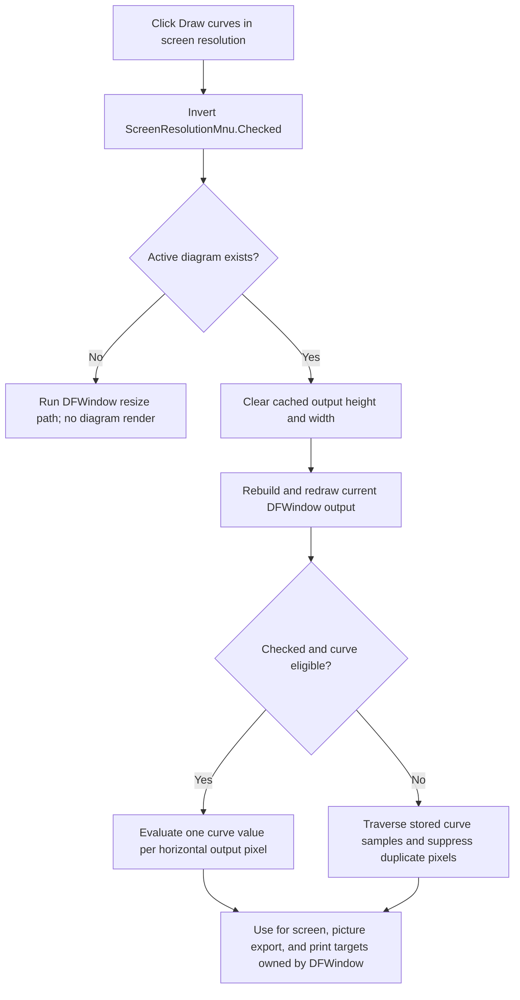

# Draw curves in screen resolution

> Analysis status: Source reviewed through menu state, curve sampling,
> screen redraw, picture export, printing, and persistence boundaries.

## Control

| Property | Recovered value |
| --- | --- |
| Form | DFWindow |
| Component path | DFWindow.DFMainMenu.DFViewMnu.ScreenResolutionMnu |
| Control class | TMenuItem |
| Caption | Draw curves in screen resolution |
| Hint | Not present in the recovered resource. |
| Text | Not present in the recovered resource. |
| Handler name | ScreenResolutionMnuClick |
| Handler address | 01a88200 |
| Graph node | `resource:dfm:DFWindow/DFWindow.DFMainMenu.DFViewMnu.ScreenResolutionMnu` |
| Handler node | `function:01a88200` |
| Graph layer | UI |

## What happens when clicked

The command changes how eligible continuous curves are sampled for drawing. It
does not change the Windows display mode, monitor resolution, diagram size,
axis limits, or stored curve samples.

`FUN_01a88200` reads the menu item's Checked byte and sends its inverse to the
shared VCL checked-state setter. It does not use `Sender`. Each click therefore
changes the option from off to on, or from on to off.

If an active diagram exists at DFWindow offset `0x798`, the handler clears its
cached output height and width at offsets `0x100` and `0x104`. It then always
calls the DFWindow resize handler. The resize path rebuilds the active diagram
for the current drawable client rectangle, paints it, invalidates the window,
and stores the current client height and width in those two cache fields. This
makes the new sampling mode visible immediately. When there is no active
diagram, the menu check still changes, but the resize path has no diagram to
redraw.

## Meaning of screen resolution

The two recovered curve renderers, `FUN_01ab2f90` and `FUN_01ab3990`, read this
menu check only when their render owner is the current DFWindow. For an eligible
curve and a checked menu item, they:

1. Map the visible X-axis lower bound to an integer output pixel.
2. Map the next horizontal pixel back to an X-axis value.
3. Use the difference as the X step.
4. Evaluate the curve at each step up to the visible X-axis upper bound.
5. Map each result to an output pixel and add it to the rendered curve.

Thus, the option evaluates approximately one curve point for each horizontal
pixel column in the current output. There is no recovered DPI value in this
calculation. The axis value-to-pixel and pixel-to-value mappings define the
step for the current drawing target.

When the option is off, the renderers traverse the curve's stored samples. They
still suppress consecutive results that map to the same output pixel. A
nonzero curve-data byte at offset `0x2B` also forces this stored-sample path
when the menu item is checked. The recovered source does not name this field,
so this article does not assign a curve category to it.

## Screen, export, and print consumers

The normal resize path binds the current DFWindow as the render owner and the
window canvas as the output. The option therefore controls on-screen curve
sampling.

Picture export uses the same owner identity. `DFPictureMnuClick` creates an EMF,
BMP, JPEG, GIF, or PNG drawing target with the active diagram's output width and
height. `FUN_01a80e70` temporarily binds that target to the diagram but keeps
the current DFWindow as owner. The curve renderers consequently apply the
checked option to the exported picture and use the image target's pixel
mapping. The helper restores the window canvas and drawable rectangle after
the export render.

Printing also keeps the current DFWindow as the render owner. `DFPrintMnuClick`
calls `FUN_01ceca50` for the selected pages. That function binds the printer
canvas and its pixel bounds, renders a page, and then restores the window
canvas and diagram bounds. A checked option therefore selects per-output-pixel
curve evaluation for print output too. Print preview changes the diagram mode
and redraws it in the DFWindow; it uses the same checked option during that
redraw.

The setting changes the sampling density for these targets. It does not set a
physical printer DPI or an image DPI field.

## Persistence and initial state

The click path does not call an INI writer or a document serializer. The
recovered DFWindow construction path does not load a value for this menu item.
The DFM resource also has no explicit Checked property, so the recovered
initial state is unchecked.

The only recovered reads of the Checked byte outside the click handler are the
two curve renderers. The option is therefore a session-local DFWindow state. It
is not stored in `TINA.INI` and is not part of a saved diagram in the recovered
paths.

## Guards, repeated clicks, and errors

There is no dialog, selection requirement, confirmation, or cancel path. A
repeated click always toggles the state again. The active-diagram test protects
the two cache writes. The resize handler independently stops before diagram
rendering when no active diagram exists.

There is no local exception handling or rollback. The menu state changes before
the cache fields are cleared and before redraw starts. If a later redraw fails,
the new check can remain visible while the active diagram cache stays cleared
or the picture is only partly updated. Export and print failures belong to
their separate commands; this click does not start either operation.

## Click flow

## Handler evidence

- Source: [FUN_01a88200](../../../DecompiledSources/Tina16/functions/0000000001A88200__FUN_01a88200.c)
- Recovered role: Toggles per-output-pixel curve sampling and forces a current
  diagram redraw.
- State evidence: The handler inverts menu field `0xA18` Checked byte `0x80`.
  For an active diagram, it clears output-dimension cache fields `0x100` and
  `0x104` before it invokes DFWindow `OnResize`.
- Consumer evidence: Both recovered sampled-curve renderers compare their
  render owner with the current DFWindow before they read the menu check. Their
  checked branch derives an axis-value step from adjacent horizontal pixels and
  calls the curve evaluator at each step.
- Complexity: moderate
- Distinct outgoing calls: 2

## Relevant calls

- [`FUN_007e2d20`](../../../DecompiledSources/Tina16/functions/00000000007E2D20__FUN_007e2d20.c)
  changes a VCL menu item's Checked state and updates the native menu when the
  state changes.
- [`FUN_01a77f90`](../../../DecompiledSources/Tina16/functions/0000000001A77F90__FUN_01a77f90.c)
  is DFWindow `OnResize`; it rebuilds the diagram and records the current client
  pixel dimensions.
- [`FUN_01a782f0`](../../../DecompiledSources/Tina16/functions/0000000001A782F0__FUN_01a782f0.c)
  calculates the drawable client-pixel rectangle after visible panels and
  minimum-size constraints.
- [`FUN_01ab2f90`](../../../DecompiledSources/Tina16/functions/0000000001AB2F90__FUN_01ab2f90.c)
  renders the visibility-guarded sampled-curve variant and applies the optional
  per-pixel evaluation path.
- [`FUN_01ab3990`](../../../DecompiledSources/Tina16/functions/0000000001AB3990__FUN_01ab3990.c)
  renders the dispatcher-selected sampled-curve variant with the same optional
  per-pixel evaluation path.
- [`FUN_01a80e70`](../../../DecompiledSources/Tina16/functions/0000000001A80E70__FUN_01a80e70.c)
  temporarily binds an image-export target while keeping DFWindow as the
  diagram render owner.
- [`FUN_01ceca50`](../../../DecompiledSources/Tina16/functions/0000000001CECA50__FUN_01ceca50.c)
  binds printer output for each selected page and restores window rendering
  afterward.

## Resource evidence

- The caption is **Draw curves in screen resolution**.
- The item has no recovered hint, action, image reference, embedded glyph, or
  explicit initial Checked property.
- No nearby label is required because the caption and source data flow agree.

## Analysis limits

- The Delphi class names of the two sampled-curve renderer variants are not
  recovered.
- The source proves a one-horizontal-pixel sampling step for eligible curves.
  It does not identify a physical monitor or printer DPI.
- The curve-data byte at offset `0x2B` has no recovered Delphi field name.
