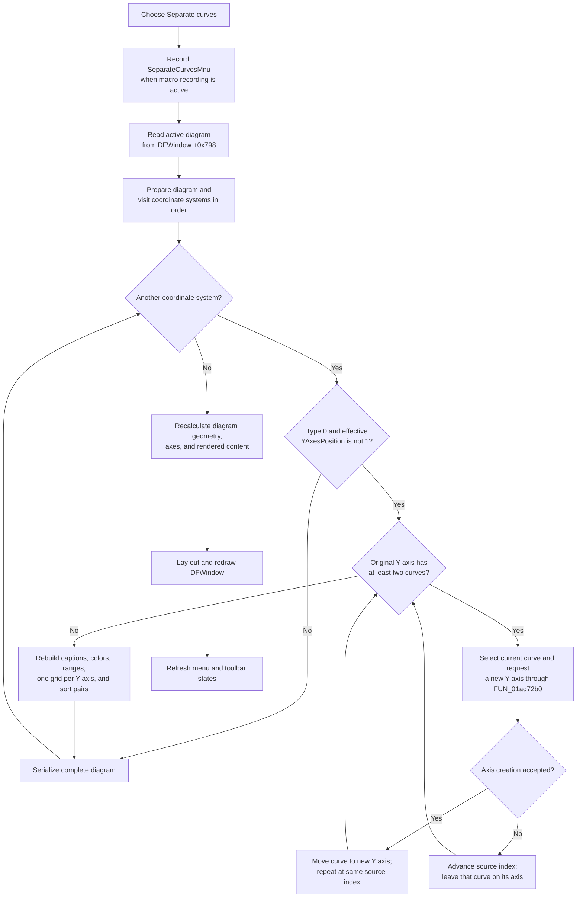

# Separate each curve onto its own Y axis

> Analysis status: Complete. This command separates curves in every eligible coordinate system of the active diagram, saves after each system, redraws the diagram, and refreshes command states.

## Control

| Property | Recovered value |
| --- | --- |
| Form | DFWindow |
| Component path | DFWindow.DFMainMenu.DFViewMnu.SeparateCurvesMnu |
| Control class | TMenuItem |
| Caption | Separate curves |
| Hint | Not present in the recovered resource. |
| Handler name | SeparateCurvesMnuClick |
| Handler address | 01a78e30 |
| Graph node | `resource:dfm:DFWindow/DFWindow.DFMainMenu.DFViewMnu.SeparateCurvesMnu` |
| Handler node | `function:01a78e30` |
| Graph layer | UI |

## What happens when clicked

`TDFWindow.SeparateCurvesMnuClick` first records the macro action `SeparateCurvesMnu` when macro recording is active. It then passes the active diagram at DFWindow field `+0x798` to `FUN_01ae6250`. The grouping argument is false for this command. The same outer helper receives true from the separate `Separate outputs` command.

`FUN_01ae6250` prepares the active diagram and visits every coordinate system in its ordered `+0xD8` collection. It calls `FUN_01ce6ab0` for each system and serializes the complete diagram after that call. The process stays inside the active diagram. It does not visit another DFWindow page and does not move a curve between coordinate systems.

The per-system separator changes only a base `TCoordSystem` whose recovered type byte is `0` and whose effective `YAxesPosition` is not already `1`. `FUN_01ce33d0` reports the stored `YAxesPosition` only when at least two Y axes pass its active-axis query. Other coordinate-system types and a system that already reports state `1` return without structural changes. The outer loop still serializes the diagram after these no-change calls.

## Curve and Y-axis separation

For an eligible coordinate system, `FUN_01ce6ab0` sets `YAxesPosition` to `1`. It records the original Y-axis count and processes those axes in list order. A Y axis with no curves is skipped during the curve-splitting and range steps.

For each original Y axis with at least two curves, the separator repeats these steps:

1. It marks the curve at the current source-list index as selected.
2. It calls the shared Y-axis creator `FUN_01ad72b0` without its immediate-layout or Twin guard options.
3. On success, that helper creates a Y axis and moves the selected curve from its old axis to the new one. The same source-list index now refers to the next curve, so the loop can move that curve next.
4. The loop stops when only one curve remains on the original axis. Thus the original axis keeps its final source curve, while new axes receive the earlier curves.

The grouping flag is `0` for Separate curves. The branch that selects curves with the same recovered output-group ID is therefore inactive. The intended result is one curve on each Y axis. `Separate outputs` passes `1` and can move an output group together instead.

The shared Y-axis creator is canonically documented by `TIARA-diz.6.7.272`. It copies the first selected curve's Y-axis scale mode, color, caption basis, and range into the new axis. The separator also rebuilds the caption and color of each original non-empty Y axis from its remaining first curve. It recomputes that axis's minimum and maximum across all curves still assigned to it, copies the results into its working limits, and runs the axis range and tick-normalization helpers.

No X axis is added, removed, or reordered. After the curve moves, the separator:

- sets recovered Y-axis field `+0x74` to `1` for every Y axis;
- destroys all old grid objects and clears the grid collection;
- creates one new `Grid` for each Y axis;
- links every new grid to X-axis item `0` and to the Y axis at the same index;
- sorts the Y-axis and grid lists as pairs, so each grid stays with its Y axis.

The sort compares the identifier text of the first curve on adjacent Y axes. Its comparator first uses a recovered numeric rank and then a Unicode string comparison for equal ranks. It swaps both list entries together. The final axis order can therefore differ from both the original axis order and the temporary append order of newly created axes.

## Selection boundary and silent partial separation

This command does not use the user's selection to choose which coordinate systems or source axes to process. However, it reuses the normal selection-based Add-Y-axis helper. It marks a source curve selected and then that helper reads the complete diagram-wide selection through `FUN_01acff30`.

The recovered `TCoordSystem` virtual callback at slot `43`, `FUN_01ce2600`, redraws selected axes and curves. It does not clear their selected bytes. The separator also has no explicit selection reset or restoration. Therefore, a pre-existing selected object can remain in the helper's input. If the combined selection is not the required curve class or spans different plots, `FUN_01ad72b0` returns false. The separator does not report the rejection. It advances to the next source-list index and continues, so that source Y axis can keep more than one curve. Curves that the routine marks selected are not explicitly deselected before return.

## Persistence, redraw, and comparison with Collect curves

After each coordinate system, including one that was skipped or only partially separated, `FUN_01ae6250` calls `FUN_01add6f0`. The serializer writes the complete diagram configuration. Its recovered keys include `CS.Count`, `YAxesPosition`, `XAxis.Count`, `YAxis.Count`, axis captions, scales, colors, and curve data. A diagram with three coordinate systems is therefore serialized three times.

After the loop, the model path recalculates diagram bounds and coordinate-system geometry, updates every X and Y axis when required, and renders the diagram. The click handler then calls the DFWindow resize and redraw routine `FUN_01a77f90` and the shared command-state refresh `FUN_01a7fc90`.

[Collect curves](collectcurvesmnu-2684405b08.md) is the inverse layout operation for eligible separated systems:

| Separate curves | Collect curves |
| --- | --- |
| Creates Y axes and transfers one curve to each when the grouping flag is false. | Keeps Y-axis item `0` and transfers later-axis curves into it. |
| Sets `YAxesPosition` to `1`. | Clears `YAxesPosition` to `0`. |
| Creates one grid for every resulting Y axis. | Creates one grid linked to the surviving Y axis. |
| Sorts resulting axis-grid pairs by first-curve identifier. | Preserves existing curves first, then appends migrated curves in source-axis order. |

Both commands work per coordinate system in the active diagram, serialize after every system, redraw the DFWindow, refresh command states, and have no recovered undo snapshot or rollback call. The recorded macro action supports replay or recording; the source does not use it as an undo record.

## Click flow

## Empty, error, and partial-state paths

- The handler has no null check for active-diagram field `+0x798`. A direct invocation without a diagram can fail before redraw or command-state refresh.
- A valid diagram with no coordinate systems skips mutation and serialization. The later model and window refreshes still run.
- An unsupported or already separated coordinate system is unchanged but is still followed by a full-diagram serialization.
- A coordinate system with no Y axes sets `YAxesPosition` to `1`, clears its old grids, creates no new grid, and then continues to serialization.
- With at least two Y axes, the final sort reads the first curve of each axis. The source has no guard for an empty Y axis in this comparator path. Such inconsistent input can fail after earlier axes, grids, or persistence writes have changed state.
- When a selected-curve axis creation returns false, the command continues without a message and can leave multiple curves on a Y axis.
- Creating a grid assumes that X-axis item `0` exists. There is no local empty-X-axis guard when at least one Y axis requires a grid.
- There is no confirmation dialog, returned-status check, local exception handler, retry, undo snapshot, or rollback branch.
- Persistence occurs after each coordinate system. If a later split, grid rebuild, sort, serialization, model refresh, or redraw fails, earlier coordinate systems can already be changed and the last successful save can contain a partially separated diagram.

## Recovered evidence

- Primary handler: [`FUN_01a78e30`](../../../DecompiledSources/Tina16/functions/0000000001A78E30__FUN_01a78e30.c) records the macro action, calls the whole-diagram separator with grouping false, redraws DFWindow, and refreshes command state.
- Whole-diagram separator: [`FUN_01ae6250`](../../../DecompiledSources/Tina16/functions/0000000001AE6250__FUN_01ae6250.c) visits every coordinate system, invokes the separator, serializes after each item, and runs model refresh and rendering.
- Per-system separator: [`FUN_01ce6ab0`](../../../DecompiledSources/Tina16/functions/0000000001CE6AB0__FUN_01ce6ab0.c) applies the type and separation-state guards, creates Y axes through selected curves, rebuilds captions and ranges, replaces grids, and sorts the result.
- Y-axis creator: [`FUN_01ad72b0`](../../../DecompiledSources/Tina16/functions/0000000001AD72B0__FUN_01ad72b0.c) validates the complete selected-curve list, creates a Y axis, and changes every accepted curve's Y-axis owner. Its canonical annotation belongs to `TIARA-diz.6.7.272`.
- Separation-state query: [`FUN_01ce33d0`](../../../DecompiledSources/Tina16/functions/0000000001CE33D0__FUN_01ce33d0.c) returns zero when fewer than two Y axes are active; otherwise, it returns the stored `YAxesPosition` byte.
- Axis-grid sorter: [`FUN_01ce8740`](../../../DecompiledSources/Tina16/functions/0000000001CE8740__FUN_01ce8740.c) bubble-sorts the resulting Y axes and calls the paired-list swap helper.
- Sort comparator: [`FUN_01ce81c0`](../../../DecompiledSources/Tina16/functions/0000000001CE81C0__FUN_01ce81c0.c) obtains the first curve's identifier text for type `0` coordinate systems and compares adjacent axes.
- Paired-list swap: [`FUN_01ce83a0`](../../../DecompiledSources/Tina16/functions/0000000001CE83A0__FUN_01ce83a0.c) swaps the same indexes in the Y-axis and grid lists.
- Coordinate-system callback: [`FUN_01ce2600`](../../../DecompiledSources/Tina16/functions/0000000001CE2600__FUN_01ce2600.c) updates selected X axes, Y axes, Twin axes, and curves but does not clear their selected state.
- Diagram serializer: [`FUN_01add6f0`](../../../DecompiledSources/Tina16/functions/0000000001ADD6F0__FUN_01add6f0.c) writes the complete curve, coordinate-system, axis, and figure configuration.
- DFWindow redraw: [`FUN_01a77f90`](../../../DecompiledSources/Tina16/functions/0000000001A77F90__FUN_01a77f90.c) lays out and draws the active diagram and stores its drawing dimensions.
- Shared command-state refresh: [`FUN_01a7fc90`](../../../DecompiledSources/Tina16/functions/0000000001A7FC90__FUN_01a7fc90.c) recalculates DFWindow menu and toolbar states. Its canonical annotation belongs to `TIARA-diz.6.7.270`.
- Recovered component tree: [`ui-evidence.json`](../../../DecompiledSources/Tina16/resources/dfm/ui-evidence.json) supplies the caption and `SeparateCurvesMnuClick` binding.

## Resource evidence and analysis limits

- `SeparateCurvesMnu` is a `TMenuItem` under the DFWindow View menu. Its caption is `Separate curves`.
- It has no hint, text, action, image reference, or extracted glyph. The source path, not the caption alone, proves the behavior.
- Undelphi RTTI identifies the guarded class as `TCoordSystem`, unit `Coor_Sys`, and confirms the public `YAxesPosition` property. Its VMT maps slot `43` to `01ce2600`.
- The source does not recover semantic names for the coordinate-system type byte, Y-axis field `+0x74`, or the first-curve identifier ranking syntax. These values are described only by their observed tests and writes.
- A live UI test was not performed. The DFM binding, recovered VMT, graph call paths, and decompiled state changes agree on the result.
