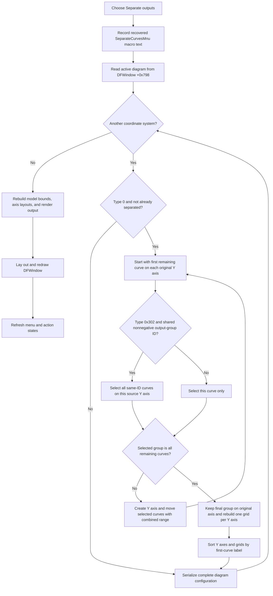

# Separate output groups onto Y axes

> Analysis status: Reviewed from the recovered handler, output-group comparison, axis creation, range calculation, ordering, persistence, and redraw evidence.

## Control

| Property | Recovered value |
| --- | --- |
| Form | DFWindow |
| Component path | DFWindow.DFMainMenu.DFViewMnu.SeparateOutputsMnu |
| Control class | TMenuItem |
| Caption | Separate outputs |
| Hint | Not present in the recovered resource. |
| Text | Not present in the recovered resource. |
| Handler name | SeparateOutputsMnuClick |
| Handler address | 01a78f10 |
| Graph node | `resource:dfm:DFWindow/DFWindow.DFMainMenu.DFViewMnu.SeparateOutputsMnu` |
| Handler node | `function:01a78f10` |
| Graph layer | UI |

## What happens when clicked

`TDFWindow.SeparateOutputsMnuClick` records a macro command and calls the shared diagram-separation routine with mode `1`. The macro text is the recovered literal `SeparateCurvesMnu`, not `SeparateOutputsMnu`.

The separation routine visits every coordinate system in the active diagram's ordered `+0xd8` collection. For each coordinate system, it passes mode `1` to `FUN_01ce6ab0`. This mode changes how curves are grouped before the routine creates Y axes.

Only a recovered type-`0` coordinate system that is not already in the separated-Y-axis state enters the separation body. An accepted system gets a nonzero persisted `YAxesPosition` state. Other coordinate-system types and a system already reported as separated are not changed by this helper.

## Output grouping criterion

The routine processes each original Y axis separately. It begins with the first remaining curve on that axis.

For a curve whose underlying result object is the recovered class registered as type `0x302`, mode `1` selects every later curve on the same source Y axis whose result object has the same integer at offset `+0x15c`. The identifier must not be `-1`.

The recovered result-building code initializes this field to `-1` and assigns nonnegative values from an output counter. This establishes `+0x15c` as an output-group identifier. Its Delphi field name is not recovered.

The grouping rules are therefore:

- equal nonnegative output-group identifiers in recovered type-`0x302` result objects stay on one Y axis;
- a type-`0x302` curve with identifier `-1` is separated by itself;
- a curve backed by another result class is separated by itself;
- comparison occurs only inside the current source Y axis.

Equal identifiers on different source Y axes are not merged. Equal identifiers in different coordinate systems are not merged. The code does not compare captions alone and does not use the user's current curve selection as the grouping key.

## Axis creation, ranges, and ordering

When the selected output group is not the complete remaining curve list, `FUN_01ad72b0` creates a Y axis in the same coordinate system and moves the selected curves to it. The helper updates each moved curve's Y-axis owner pointer and curve-list membership. The new axis is appended to the coordinate system's Y-axis list.

The first output group is extracted first, followed by each next group in first-occurrence order. The last remaining group stays on the original Y axis. The outer loop uses the original Y-axis count, so the newly appended axes are not split again in the same pass.

For every new axis, the axis-creation helper calculates the minimum lower bound and maximum upper bound across all curves in that group. It stores those bounds as the axis data and current range, then runs the shared range-normalization function. The separation routine performs the same combined-range calculation for the group that remains on the original axis.

After partitioning, the routine destroys the old grids and creates one `Grid` object for each Y axis. Each grid is linked to the first X axis and the corresponding Y axis.

For type-`0` coordinate systems, the final pass sorts the Y axes by the first curve's recovered label. The comparator first uses a parsed numeric key and then text as a tie-breaker. It swaps the matching grid entries at the same time. Thus final display order is the label-based order, not necessarily the temporary append order.

## Coordinate systems and pages

The whole-diagram wrapper repeats this process for each coordinate system, but curve movement remains inside the source coordinate system. It does not add, remove, or reorder coordinate systems in the diagram's `+0xd8` list.

The call path does not access a page collection and does not move a curve, axis, or coordinate system to another page. It changes Y-axis grouping inside the active diagram only.

## Comparison with adjacent commands

- `Separate curves` calls the same shared routine with mode `0`. That mode does not run the output-ID grouping comparison, so it extracts curves one at a time.
- `Separate outputs` uses mode `1`. It keeps same-ID recovered output curves together when they share a source Y axis.
- `Collect curves`, documented by `TIARA-diz.6.7.303`, runs the inverse structural direction for eligible separated systems: it keeps the first Y axis and migrates later-axis curves back to it.

These commands share model and redraw infrastructure, but their mode values and per-system structural functions are different.

## Persistence, redraw, and undo

After each coordinate system, including one that was not changed, the whole-diagram wrapper calls `FUN_01add6f0`. That function serializes the complete diagram configuration, including `AllCurves`, `CS.Count`, `YAxesPosition`, axis counts, captions, ranges, colors, and figures.

The serializer is inside the coordinate-system loop. A diagram with three coordinate systems is written after system `0`, then after system `1`, and then after system `2`. There is no final serializer after the loop.

After separation, the model path recalculates diagram bounds, updates the X-axis and Y-axis layouts, rebuilds render associations, and renders the coordinate systems and figures. The click handler then lays out and redraws the DFWindow and refreshes its shared menu and action states.

No undo-snapshot helper or rollback call appears in this call tree. The macro event is a replay or recording command, not a recovered undo record.

## Click flow

## Empty, no-op, and error paths

- The handler has no null check for the active diagram at DFWindow `+0x798`. A direct invocation without a diagram can fail before the later state refresh.
- A valid diagram with no coordinate systems skips separation and serialization. The later model and window refresh calls still run.
- An unsupported coordinate-system type or a system already reported as separated is unchanged, but the whole diagram is still serialized after that system.
- A type-`0` system with no curves can still receive the separated state and grid rebuild path. The function does not require a selected UI curve.
- If the shared new-axis helper rejects an internally selected group, the separator advances to another curve and continues. It does not show a control-specific error or roll back prior axis moves.
- There is no confirmation dialog, local exception handler, returned-status check, retry, or rollback.
- Serialization occurs after each coordinate system. A failure on a later system can leave earlier systems changed and the most recent successful serialization can contain a partially separated whole-diagram state.
- The diagram configuration is persisted before the final model and window redraw stages. A later redraw failure does not restore the prior grouping.

## Handler evidence

- Primary handler: [FUN_01a78f10](../../../DecompiledSources/Tina16/functions/0000000001A78F10__FUN_01a78f10.c) records the recovered macro literal, passes mode `1` to the shared separator, redraws the DFWindow, and refreshes action state.
- Whole-diagram separator: [FUN_01ae6250](../../../DecompiledSources/Tina16/functions/0000000001AE6250__FUN_01ae6250.c) visits every coordinate system, separates it with the supplied mode, serializes after each system, and refreshes the model render state.
- Per-system separator: [FUN_01ce6ab0](../../../DecompiledSources/Tina16/functions/0000000001CE6AB0__FUN_01ce6ab0.c) applies the type and separated-state guards, groups mode-`1` output curves by class and identifier, creates Y axes, calculates ranges, rebuilds grids, and sorts axes.
- Recovered type registry: [FUN_011569a0](../../../DecompiledSources/Tina16/functions/00000000011569A0__FUN_011569a0.c) registers the grouped result class as type `0x302`.
- Output-result constructor: [FUN_01cc0b90](../../../DecompiledSources/Tina16/functions/0000000001CC0B90__FUN_01cc0b90.c) initializes output-group field `+0x15c` to `-1`.
- Output-group assignment: [FUN_01cc2aa0](../../../DecompiledSources/Tina16/functions/0000000001CC2AA0__FUN_01cc2aa0.c) assigns field `+0x15c` from the recovered output counter when it creates type-`0x302` result objects.
- New Y-axis helper: [FUN_01ad72b0](../../../DecompiledSources/Tina16/functions/0000000001AD72B0__FUN_01ad72b0.c) creates an axis, derives its combined curve range, moves selected curves, and repairs ownership and list membership. Its canonical annotation is owned by `TIARA-diz.6.7.272`.
- Axis and grid sort: [FUN_01ce8740](../../../DecompiledSources/Tina16/functions/0000000001CE8740__FUN_01ce8740.c) compares adjacent Y axes and swaps matching grid entries with them.
- Numeric-aware label comparator: [FUN_01ce7a60](../../../DecompiledSources/Tina16/functions/0000000001CE7A60__FUN_01ce7a60.c) orders parsed numeric keys first and uses a string comparison when those keys match.
- Diagram serializer: [FUN_01add6f0](../../../DecompiledSources/Tina16/functions/0000000001ADD6F0__FUN_01add6f0.c) writes the complete curve, coordinate-system, axis, and figure configuration.
- DFWindow redraw: [FUN_01a77f90](../../../DecompiledSources/Tina16/functions/0000000001A77F90__FUN_01a77f90.c) lays out and draws the active diagram and stores its output dimensions.
- Command-state refresh: [FUN_01a7fc90](../../../DecompiledSources/Tina16/functions/0000000001A7FC90__FUN_01a7fc90.c) refreshes shared DFWindow menu and action states. Its canonical annotation is owned by `TIARA-diz.6.7.270`.
- Recovered component tree: [ui-evidence.json](../../../DecompiledSources/Tina16/resources/dfm/ui-evidence.json) supplies the `Separate outputs` caption and `SeparateOutputsMnuClick` binding.
- Complexity: complex; the graph records six distinct outgoing calls from `FUN_01a78f10`.

## Resource evidence

- `SeparateOutputsMnu` is a `TMenuItem` under the DFWindow View menu.
- Its caption is `Separate outputs`.
- It has no hint, text, action, image reference, or extracted glyph.
- The grouping call path, not the caption alone, proves the output-ID behavior.

## Analysis limits

- The Delphi class and field names for recovered result type `0x302` and field `+0x15c` are not available. The constructor and grouping comparisons prove only the output-counter origin and grouping use.
- Group equality does not prove that two output IDs represent the same named physical quantity across different analyses. The helper compares only the stored integer inside one source Y axis.
- The source proves numeric-aware label ordering, but the exact user-facing label normalization characters are not recovered as readable text.
- No undo integration is visible in this call tree. This does not prove that a separate project reload command cannot restore older saved content.
