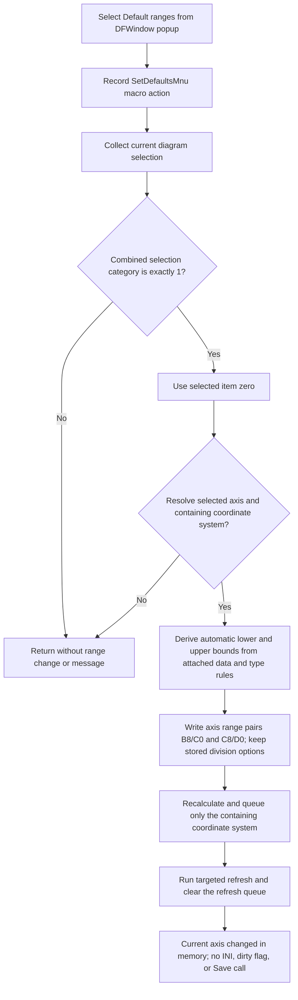

# Restore the automatic range of the first selected axis

> Analysis status: Source reviewed through axis selection, automatic-range
> calculation, targeted redraw, model writes, and persistence boundaries.

## Control

| Property | Recovered value |
| --- | --- |
| Form | DFWindow |
| Component path | DFWindow.DFPopupMnu.SetdefaultsMnu |
| Control class | TMenuItem |
| Caption | Default ranges |
| Hint | Not present in the recovered resource. |
| Text | Not present in the recovered resource. |
| Handler name | SetdefaultsMnuClick |
| Handler address | `01a793f0` |
| Graph node | `resource:dfm:DFWindow/DFWindow.DFPopupMnu.SetdefaultsMnu` |
| Handler node | `function:01a793f0` |
| Graph layer | UI |

## What happens when selected

This command restores an automatically derived range on one existing axis. It
does not save the current range as a default for later axes.

[`FUN_01a793f0`](../../../DecompiledSources/Tina16/functions/0000000001A793F0__FUN_01a793f0.c)
submits the macro action `SetDefaultsMnu`. It then passes the current diagram at
DFWindow offset `0x798` to
[`FUN_01ad8540`](../../../DecompiledSources/Tina16/functions/0000000001AD8540__FUN_01ad8540.c).
The handler does not read `Sender`, the popup position, or a hovered object. Its
target comes from the selection already stored in the active diagram.

## Selected axis

The coordinator calls the canonical selected-object collector
[`FUN_01acff30`](../../../DecompiledSources/Tina16/functions/0000000001ACFF30__FUN_01acff30.c)
and continues only when its combined selection category is exactly `1`. Other
recovered axis commands establish category `1` as axes. A mixed selection fails
because the collector combines category bits.

The command uses selection-list item zero. If several axes are selected and the
combined category remains `1`, only the first collected axis changes. Other
selected axes and all unselected axes remain unchanged.

The automatic-range helper resolves the selected axis, or its recovered
selection proxy, to a containing coordinate system through
[`FUN_01ad1090`](../../../DecompiledSources/Tina16/functions/0000000001AD1090__FUN_01ad1090.c).
An unresolved object is left unchanged.

## Range calculation

The coordinator calls the `.305`-owned automatic-range calculator
[`FUN_01ad85f0`](../../../DecompiledSources/Tina16/functions/0000000001AD85F0__FUN_01ad85f0.c)
with reset flag `0`. The helper uses the selected axis's orientation, its
containing coordinate-system type, and the objects attached to the axis to
derive new lower and upper limits.

The recovered type-specific branches include:

- minimum and maximum bounds across attached curves;
- a fixed range from `-1` through `1`;
- a range symmetric around zero from the largest absolute extent; and
- compatible figure bounds with ten-percent padding.

Eligible numeric branches call the shared range normalizer to expand a
degenerate or very narrow interval, choose usable endpoints, and calculate
axis divisions. The resulting lower and upper limits are written to both
recovered range-field pairs at axis offsets `0xB8`/`0xC0` and
`0xC8`/`0xD0`.

The reset flag is important. It is zero for this popup command, so
`FUN_01ad85f0` does not call the option-removal helper. Existing entries in the
axis option store at `0x110`, including the recovered `main/divs` entry, remain
present. The separate **Normal zoom** command passes reset flag `1` and clears
those stored per-axis option entries before it recalculates all axes.

## Existing objects and future objects

Only the first selected axis object receives the four range-field writes. The
command does not enumerate other axes, copy style properties, change attached
curve samples, create an axis, or update an axis template.

No future-axis constructor reads a value written by this command because it
writes no global default record. A later axis is therefore unaffected. A
repeated click recalculates the same selected axis from its then-current
attached data and type rules; it does not copy the displayed range into a
default store.

## Redraw and persistence

After the range calculation, the coordinator resolves the containing
coordinate system again. On success, it runs that coordinate system's current
render/recalculation path, adds the coordinate system to the diagram refresh
list if it is not already present, and calls the shared targeted-refresh
processor. That processor performs type-specific redraw work and clears the
refresh list. The command does not run the full all-axis layout sequence used
by **Normal zoom**.

The selected axis is an existing object in the current diagram model, so its
range fields change in memory. However, this command does not:

- write `TINA.INI`;
- call the `ManualScale` option serializer;
- write a temporary options file;
- set the recovered document-modified byte; or
- call a document Save routine.

The recovered click path therefore has no immediate persistence operation.
Whether a later explicit document Save serializes these live range fields is
outside this handler.

## No-op and error boundaries

- A selection category other than exactly `1` is a silent no-op after the macro
  action attempt. No selection-error message is shown.
- An axis or selection proxy that cannot be resolved to a containing coordinate
  system is left unchanged and is not redrawn.
- There is no confirmation dialog, cancel branch, equality guard, or success
  result. The command recalculates again on every accepted click.
- The handler has no active-diagram null guard. Normal popup availability can
  prevent such a call, but the recovered click body itself does not prove that
  policy.
- Some type branches assume that required attached-object collections contain
  item zero. A malformed or unexpectedly empty compatible collection can reach
  an invalid access instead of a controlled message.
- There is no local exception handler, transaction, retry, or rollback. The
  range fields change before the redraw sequence. A later failure can leave the
  selected axis changed in memory while the display remains old. The handler
  does not restore the prior range.

## Click flow

## Handler evidence

- Source: [`FUN_01a793f0`](../../../DecompiledSources/Tina16/functions/0000000001A793F0__FUN_01a793f0.c)
- Recovered role: Restores the automatic range of the first selected diagram
  axis.
- Input evidence: The wrapper reads only DFWindow's active diagram field and
  does not use a popup target. The coordinator requires exact selection
  category `1` and reads item zero.
- State evidence: The `.305`-owned calculator writes both recovered range pairs
  from attached-data extrema or type-specific bounds. This caller supplies
  reset flag `0`, so stored axis option entries are not removed.
- Output evidence: The coordinator queues only the containing coordinate system
  for targeted refresh and contains no persistence or document-modified call.
- Complexity: complex
- Distinct outgoing calls: 4

## Relevant calls

- [`FUN_01ad8540`](../../../DecompiledSources/Tina16/functions/0000000001AD8540__FUN_01ad8540.c)
  selects the first axis, invokes automatic-range calculation, and coordinates
  the targeted redraw.
- [`FUN_01acff30`](../../../DecompiledSources/Tina16/functions/0000000001ACFF30__FUN_01acff30.c)
  rebuilds the selected-object list and returns its combined category.
- [`FUN_01ad1090`](../../../DecompiledSources/Tina16/functions/0000000001AD1090__FUN_01ad1090.c)
  resolves an axis or selection proxy to its containing coordinate system.
- [`FUN_01ad85f0`](../../../DecompiledSources/Tina16/functions/0000000001AD85F0__FUN_01ad85f0.c)
  is the `.305`-owned automatic range calculator. This command calls it with
  option reset disabled.
- [`FUN_01cd43b0`](../../../DecompiledSources/Tina16/functions/0000000001CD43B0__FUN_01cd43b0.c)
  normalizes eligible numeric bounds and calculates axis divisions.
- [`FUN_01a8dee0`](../../../DecompiledSources/Tina16/functions/0000000001A8DEE0__FUN_01a8dee0.c)
  adds the containing coordinate system to the refresh list only when absent.
- [`FUN_01ae5650`](../../../DecompiledSources/Tina16/functions/0000000001AE5650__FUN_01ae5650.c)
  processes the targeted diagram refresh list and clears it.

## Resource evidence

- `DFWindow.DFPopupMnu.SetdefaultsMnu` has caption **Default ranges** and binds
  `OnClick` to `SetdefaultsMnuClick` at `01a793f0`.
- The menu item has no recovered hint, action, image reference, embedded glyph,
  checked state, or same-parent label candidate.
- The parent `DFPopupMnu` has no recovered `OnPopup` event. The click path, not
  the popup position, determines the target from the current selection.

## Analysis limits

- The Delphi enum names for selection category `1`, axis orientation, and the
  coordinate-system type byte are not recovered. Their roles are established
  by the downstream axis collections, fields, and range data.
- Two other option keys that **Normal zoom** can remove are not recovered. This
  command does not remove any of the three keys.
- The source does not prove whether a later explicit document Save includes the
  live axis range fields.
- No live UI test was performed. The conclusions use the DFM binding, read-only
  graph, handler, selection collector, axis resolver, automatic-range helper,
  and redraw path.
