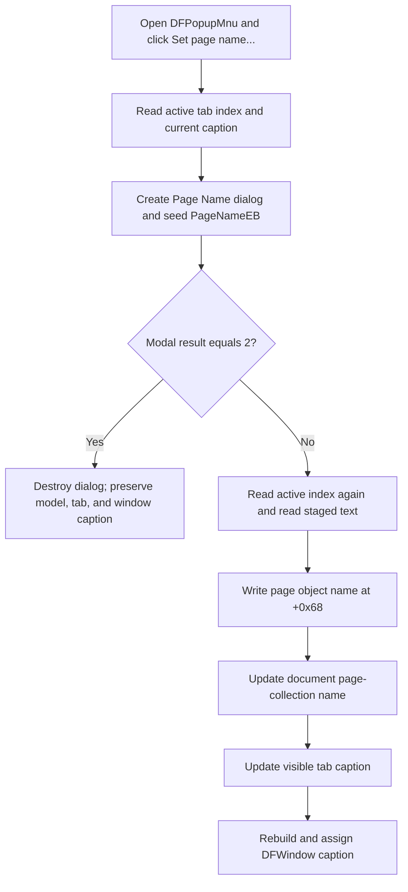

# Rename the active page from the popup menu

> Analysis status: Evidence-backed source review complete.

## Control

| Property | Recovered value |
| --- | --- |
| Form | DFWindow |
| Component path | DFWindow.DFPopupMnu.Setpagename1 |
| Control class | TMenuItem |
| Caption | Set page name... |
| Hint | Not present in the recovered resource. |
| Text | Not present in the recovered resource. |
| Handler name | PageNameMnuClick |
| Handler address | 01a79c00 |
| Graph node | `resource:dfm:DFWindow/DFWindow.DFPopupMnu.Setpagename1` |
| Handler node | `function:01a79c00` |
| Graph layer | UI |

## Popup route and rename target

`Setpagename1` is a child of DFWindow's `DFPopupMnu`. The popup menu has no recovered `OnPopup` event, and this item has no separate adapter. Its `OnClick` goes directly to `FUN_01a79c00`, the same `PageNameMnuClick` handler used by the main View-menu item. The handler records command name `PageNameMnu` for both routes.

The popup location and the diagram object under the pointer do not select the rename target. The handler reads the active index from DFWindow's tab control at form offset `+0xa68`. It does not read the sender, popup coordinates, current curve, axis, selected figure, or popup-menu state. Therefore, this popup command renames the active page tab.

## Dialog staging and cancellation

The handler creates the centered modal `TPageNameDlg` and reads the active tab's current caption. It copies that caption into `PageNameEB` before `ShowModal`. The edit is staging state: changing it does not update the page while the dialog remains open.

The dialog resource has label `Enter page name::`, a built-in `bkOK` button, and a built-in `bkCancel` button. It has no custom edit, validation, or button-click events. If `ShowModal` returns `2`, which matches `bkCancel`, the handler destroys the dialog and makes no model, tab, or window-caption change. The source explicitly tests only result `2`; every other modal result takes the rename path.

The dialog is created with the application's recovered global owner value, not with the popup menu or clicked item. The decompilation does not recover a symbolic name for that owner.

## Accepted rename and synchronization

After a non-`2` result, the handler reads the active tab index again and obtains the text from `PageNameEB`. It passes the document model, current index, new text, and tab control to `.319`-owned `FUN_01cec3f0`. That helper writes the name in this order:

1. The active page object's Unicode string field at offset `+0x68`.
2. The document page-collection entry at the same index.
3. The tab control's strings entry at the same index.

The third write changes the visible tab caption. The handler then reads that updated caption and combines the document name or path at model offset `+0x48`, a recovered literal separator, and the page caption. It assigns this text to the DFWindow caption. The active index and diagram contents do not change.

## Name validation and no-op cases

There is no validation or normalization before the ordered writes:

- An empty string becomes the model name and blank tab caption.
- A duplicate sibling-page name is accepted because the handler performs no sibling scan.
- Leading and trailing spaces and letter case are preserved.
- Accepting the unchanged current name repeats all three writes and rebuilds the DFWindow caption.
- Result `2` is the only explicit no-change branch. The source does not define special handling for another modal result.

The popup item has no checked-state, enable-state, or selection guard in its handler. An invalid active-tab index is not handled as a normal no-op.

## Redraw, dirty state, undo, and persistence

The tab strings setter and DFWindow text setter make the tab and window captions current immediately. No diagram redraw, layout, or explicit form-repaint helper is called. The handler does not create an undo record or retain the old name for rollback.

Other DFWindow code establishes document field `+0x40` as a modified-state flag: page creation sets it, and destructive commands test it before offering to save. Neither `FUN_01a79c00` nor `FUN_01cec3f0` writes this flag. This rename path therefore does not mark the document modified.

The page serializer `FUN_01ae6130` writes page name field `+0x68`, and `FUN_01ae5fa0` reads it. A later document save can persist the accepted name. The popup click does not call these serializers or a save routine. Because the path does not mark the document modified, the source does not prove that this rename alone causes a later save prompt.

## Error and partial-update boundaries

The handler reads indexed tab text before it opens the dialog. There is no guard for an invalid active index, so an indexed access can fail before user input. It reads the active index again after the modal result. The accepted text applies to this second index. Normal modal ownership prevents direct interaction with the owner window, but the source itself does not require both index values to match.

The shared helper writes the page object, document collection, and tab strings in sequence. It has no transaction, return status, or rollback. If an indexed lookup, virtual collection operation, or Unicode assignment raises, earlier writes can remain while later stores and the DFWindow caption remain unchanged. The handler has no local exception handler or user-facing error branch.

## Popup click flow

## Handler and model evidence

- Shared popup and main-menu handler: [FUN_01a79c00](../../../DecompiledSources/Tina16/functions/0000000001A79C00__FUN_01a79c00.c)
- Ordered model, collection, and tab-name synchronization, canonically annotated by `.319`: [FUN_01cec3f0](../../../DecompiledSources/Tina16/functions/0000000001CEC3F0__FUN_01cec3f0.c)
- Page-object name-field assignment: [FUN_01ae5ef0](../../../DecompiledSources/Tina16/functions/0000000001AE5EF0__FUN_01ae5ef0.c)
- Native active-tab query through `TCM_GETCURSEL`: [FUN_006d5120](../../../DecompiledSources/Tina16/functions/00000000006D5120__FUN_006d5120.c)
- Tab strings collection access: [FUN_006d6380](../../../DecompiledSources/Tina16/functions/00000000006D6380__FUN_006d6380.c)
- Page-name serialization and deserialization: [FUN_01ae6130](../../../DecompiledSources/Tina16/functions/0000000001AE6130__FUN_01ae6130.c) and [FUN_01ae5fa0](../../../DecompiledSources/Tina16/functions/0000000001AE5FA0__FUN_01ae5fa0.c)
- Modified-flag consumer and page-add producer: [FUN_01a83f90](../../../DecompiledSources/Tina16/functions/0000000001A83F90__FUN_01a83f90.c) and [FUN_01cec150](../../../DecompiledSources/Tina16/functions/0000000001CEC150__FUN_01cec150.c)
- Recovered popup-item and `TPageNameDlg` resources: [ui-evidence.json](../../../DecompiledSources/Tina16/resources/dfm/ui-evidence.json)

## Resource and annotation limits

- The popup item has caption `Set page name...`; the main-menu sibling has caption `Set page name ...`. Both bind to `PageNameMnuClick` at `01a79c00`.
- The popup item has no recovered hint, action, image-list reference, embedded glyph, or same-parent label candidate.
- `PageNameEB` has no recovered `MaxLength` or validation event. The dialog's `bkOK` and `bkCancel` buttons have no custom click handlers.
- This fragment duplicates `.319`'s complete canonical `FUN_01a79c00` annotation because both controls bind the same handler. It omits `.319`-owned `FUN_01cec3f0`.
