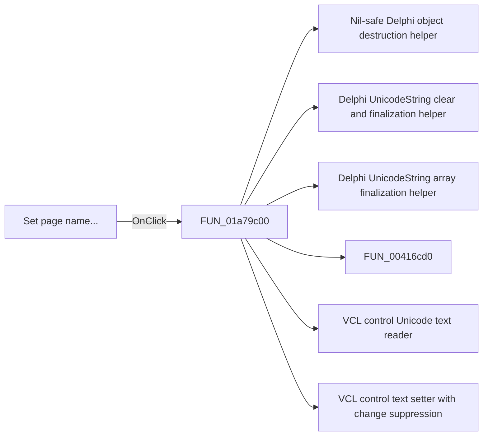

# Set page name...

> Analysis status: Pending individual source review.

## Control

| Property | Recovered value |
| --- | --- |
| Form | DFWindow |
| Component path | DFWindow.DFPopupMnu.Setpagename1 |
| Control class | TMenuItem |
| Caption | Set page name... |
| Hint | Not present in the recovered resource. |
| Text | Not present in the recovered resource. |
| Handler name | PageNameMnuClick |
| Handler address | 01a79c00 |
| Graph node | `resource:dfm:DFWindow/DFWindow.DFPopupMnu.Setpagename1` |
| Handler node | `function:01a79c00` |
| Graph layer | UI |

## What happens when clicked

Pending individual analysis. An agent must read the recovered handler source and its relevant callees before it replaces this text.

## Click flow

## Handler evidence

- Source: [DecompiledSources/Tina16/functions/0000000001A79C00__FUN_01a79c00.c](../../../DecompiledSources/Tina16/functions/0000000001A79C00__FUN_01a79c00.c)
- Recovered role: Not present in the recovered resource.
- Current graph summary: Handles 2 Delphi UI events: DFWindow.DFMainMenu.DFViewMnu.PageNameMnu.OnClick, DFWindow.DFPopupMnu.Setpagename1.OnClick.
- Current graph behavior: Not present in the recovered resource.
- Current graph evidence: Not present in the recovered resource.
- Complexity: complex
- Distinct outgoing calls: 12

## Direct calls

- `function:00410f20` — Nil-safe Delphi object destruction helper
- `function:00414480` — Delphi UnicodeString clear and finalization helper
- `function:00414560` — Delphi UnicodeString array finalization helper
- `function:00416cd0` — FUN_00416cd0
- `function:0064dd90` — VCL control Unicode text reader
- `function:0064de00` — VCL control text setter with change suppression
- `function:006d5120` — FUN_006d5120
- `function:006d6380` — FUN_006d6380
- `function:007fc180` — FUN_007fc180
- `function:01aed550` — FUN_01aed550
- `function:01aee720` — FUN_01aee720
- `function:01cec3f0` — FUN_01cec3f0

## Resource evidence

- Kind: Not present in the recovered resource.
- Modal result: Not present in the recovered resource.
- Checked state: Not present in the recovered resource.
- List items: Not present in the recovered resource.
- Image reference: Not present in the recovered resource.
- Extracted glyph: None.

## Nearby label candidates

Nearby labels are layout candidates only. They are not proof of behavior.

- No same-parent label candidate is available.

## Analysis limits

- Do not infer behavior from the control class, caption, hint, glyph, or nearby label alone.
- Do not replace the pending status until the handler source and relevant call path provide enough evidence.
