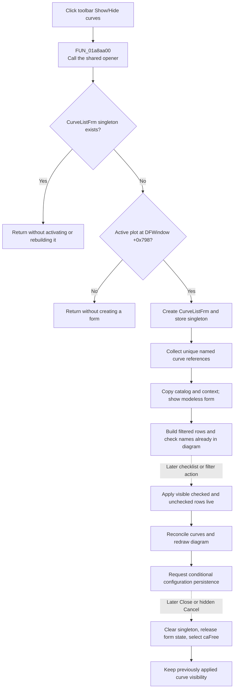

# Open the modeless Show/hide curves catalog from the toolbar

> Analysis status: Reviewed from the toolbar wrapper, canonical CurveList opener, form initialization, live checklist synchronization, close lifecycle, DFM resource, and extracted glyph.

## Control

| Property | Recovered value |
| --- | --- |
| Form | DFWindow |
| Component path | DFWindow.DFToolPanel.ToolNoteBook.Diagram.ShowHideCurvesBtn |
| Control class | TSpeedButton |
| Caption | Not present in the recovered resource. |
| Hint | Show/Hide curves |
| Size | 25 by 25 |
| Glyph states | `NumGlyphs = 2` |
| Handler name | ShowHideCurvesBtnClick |
| Handler address | 01a8aa00 |
| Graph node | `resource:dfm:DFWindow/DFWindow.DFToolPanel.ToolNoteBook.Diagram.ShowHideCurvesBtn` |
| Handler node | `function:01a8aa00` |
| Graph layer | UI |

## What the toolbar click does

[`FUN_01a8aa00`](../../../DecompiledSources/Tina16/functions/0000000001A8AA00__FUN_01a8aa00.c) is a toolbar-specific wrapper. It makes one call to [`FUN_01a8aa10`](../../../DecompiledSources/Tina16/functions/0000000001A8AA10__FUN_01a8aa10.c) and returns. It does not read a selected curve, change a check state, create a modal result, redraw the diagram, or persist data itself.

`FUN_01a8aa10` is also the `ShowHidecurvesMnuClick` handler for the **Show/Hide curves ...** View-menu item. The toolbar and menu therefore enter the same opener and have the same guards, initialization, modeless lifetime, and later live-update behavior. The [menu-command analysis](showhidecurvesmnu-2c12fb1db1.md) owns the canonical opener annotation.

## Singleton and active-diagram guards

The shared opener creates a form only when both conditions are true:

1. the global `CurveListFrm` instance slot is null; and
2. DFWindow field `+0x798` contains an active plot.

If the form is already open, this toolbar click returns without creating another instance. The source does not activate, focus, rebuild, or bring the existing form to the front. If no active plot exists, the click also returns without creating a form or showing an error.

These are the only local opener guards. The handler does not require a selected curve, axis, coordinate system, or figure.

## Form creation and initial checks

On the accepted path, the shared opener constructs `CurveListFrm`, stores it in the global singleton slot, and builds a temporary catalog from the currently available curve registries. Only usable entries with a nonempty display name and positive recovered object count are collected, and duplicate display names are not added. The opener copies each display name and curve-object reference into the form's private master list; it does not clone or take ownership of the curve object.

The opener copies recovered context fields, can replace the active Schematic Editor controller for the applicable schematic context, and then calls the recovered modeless `Show` wrapper. There is no modal wait or result copy-back.

When the form is shown, `CurveListFrm.OnShow` initializes its category filters and rebuilds `CurvesLB` from the private master list. Each visible row is checked when its display name is already present in the current live diagram. Thus, the initial checklist reflects shown curves by name. It does not restore an earlier form's highlighted row, scroll position, or row index. Form initialization does not apply a second diagram change, redraw, or persistence write.

## Live changes while the form is open

The form is an immediate editor, not a staged dialog:

- clicking a `CurvesLB` row, **Check all curves**, or **Check only first curve** applies the current visible check states;
- changing a category filter or filter text rebuilds the visible rows and then applies that visible state;
- checked visible rows are reconciled as shown curves, and unchecked visible rows are explicit removals; and
- rows excluded by the active filters are absent from both sets and remain unchanged.

The shared synchronization path guards form population and a missing current diagram. On its normal path it reconciles curve objects with the diagram, rebuilds or repaints the diagram window, and requests configuration persistence. The persistence writer serializes this update only under its recovered `ManualScale` condition. The [CurveList checklist analysis](../curvelistfrm/curveslb-88c40341be.md) owns the canonical live-synchronization details and annotations.

## Close, Cancel, and ownership

The visible `OKBtn` is a `bkClose` button. The hidden `CancelBtn` is `bkCancel`, but both handlers only request the same VCL close path. Neither button commits staged values or restores an earlier curve set because each checklist or filter change has already updated the live diagram.

If the form's virtual close query permits closure, `CurveListFrm.FormClose` clears the singleton slot, releases four form-owned helper containers, performs applicable editor-controller cleanup, and selects `caFree`. VCL then releases the modeless form. The copied curve objects remain owned by their application collections.

Cancel therefore does not roll back curve visibility. A later toolbar click creates a fresh form and reconstructs its checks from the then-current diagram. The [Cancel and form-close analysis](../curvelistfrm/cancelbtn-b20a6db802.md) owns the canonical lifecycle annotations.

## Click and lifecycle flow

## Repeat, no-op, and error boundaries

- Repeated toolbar clicks while `CurveListFrm` is open do not create duplicates and do not refresh the existing form.
- A click with no active plot is a silent no-op.
- Opening the form does not itself alter curve visibility. The initial checked state is reconstructed from the live diagram while the initialization guard prevents application callbacks.
- Repeated checklist actions with unchanged checks can still repeat reconciliation, redraw, and the conditional persistence request. The live synchronizer has no unchanged-state short circuit.
- Closing through the visible Close button, hidden Cancel button, or normal form close does not undo changes that were already applied.
- The wrapper and opener have no local validation message, exception handler, retry, or rollback. The opener stores the singleton before catalog population and modeless Show, so a later failure can leave a partially prepared object in the global slot.
- A later live update is also not transactional. A failure after curve reconciliation but before redraw or persistence can leave the checklist, live diagram, display, and stored settings out of agreement. Deeper curve insertion can report its own incompatibility message; the toolbar wrapper does not handle it.

## Resource evidence

- The DFM binds `ShowHideCurvesBtn.OnClick` to `ShowHideCurvesBtnClick` at `01a8aa00` and supplies the direct hint **Show/Hide curves**.
- The speed button is 25 by 25 and has `NumGlyphs = 2`. Its extracted 42-by-21 bitmap strip contains a colored curve trace with a red plus in one frame and gray curve traces in the other. This supports a curve-visibility command, but the wrapper and shared opener prove the behavior.
- Extracted glyph: [`0104_DFWindow_DFWindow_DFToolPanel_ToolNoteBook_Diagram_ShowHideCurvesBtn_Glyph_Data.png`](../../../glyph/0104_DFWindow_DFWindow_DFToolPanel_ToolNoteBook_Diagram_ShowHideCurvesBtn_Glyph_Data.png)
- Caption, action, checked state, modal result, image-list reference, and group index are not present in the recovered control resource.

## Handler evidence and annotation ownership

- The graph has one outgoing call from `function:01a8aa00` to `function:01a8aa10` and one `OnClick` trigger from this toolbar resource.
- This Bead annotates only the toolbar wrapper `FUN_01a8aa00`.
- `TIARA-diz.6.7.323` owns `FUN_01a8aa10`, the singleton modeless CurveList opener.
- `TIARA-diz.6.7.228` owns the CurveList close handler, cleanup, and its coordinated duplicate opener annotation.
- The CurveList checklist and filter Beads own the shared live-synchronization helpers. They are evidence-only here.

## Analysis limits

- The recovered names of the global form slot, active-plot field, context fields, curve registries, and editor controller are not available.
- The decompiler omits an explicit receiver argument at the wrapper call. The DFM binds both functions as DFWindow event handlers, and the callee reads DFWindow field `+0x798`; this establishes that the wrapper routes the current DFWindow instance to the shared opener, but not the original Delphi source syntax.
- Conditional persistence after a live update does not prove when the owning project file is later saved to its final path.
