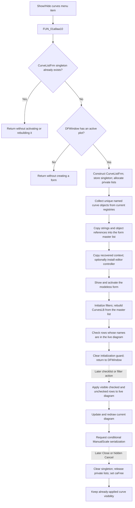

# Open the modeless Show/hide curves catalog

> Analysis status: Source reviewed through singleton creation, curve-catalog
> assembly, check-state reconstruction, live updates, persistence, and close.

## Control

| Property | Recovered value |
| --- | --- |
| Form | DFWindow |
| Component path | DFWindow.DFMainMenu.DFViewMnu.ShowHidecurvesMnu |
| Control class | TMenuItem |
| Caption | Show/Hide curves ... |
| Hint | Not present in the recovered resource. |
| Text | Not present in the recovered resource. |
| Handler name | ShowHidecurvesMnuClick |
| Handler address | 01a8aa10 |
| Graph node | `resource:dfm:DFWindow/DFWindow.DFMainMenu.DFViewMnu.ShowHidecurvesMnu` |
| Handler node | `function:01a8aa10` |
| Graph layer | UI |

## What happens when clicked

The command opens one modeless `CurveListFrm` with the resource caption
**Show/hide curves**. It does not show a modal dialog and does not wait for a
result. The handler first tests two conditions:

1. the global `CurveListFrm` instance slot must be null;
2. DFWindow must have a non-null active plot at offset `0x798`.

If either condition fails, the handler returns. A repeated click while the
form is open does not create another form, activate the existing form, rebuild
its catalog, or move it to the front. A click with no active plot is also a
no-op.

The separate [View-menu state refresh](dfviewmnu-efccbe9f99.md) normally
enables this item only when an active diagram exists, the current tab is the
final tab, and DFWindow mode byte `0x1088` equals 1. The click handler itself
checks only the active-plot pointer and singleton slot. It does not require a
selected curve, axis, or diagram object.

## Form creation and curve catalog

On the create branch, `FUN_01a8aa10` constructs `TCurveListFrm` and stores the
object in the global singleton slot before it prepares the catalog. The form's
`OnCreate` handler allocates four private helper containers, including the
master curve list at offset `0x728`, and sets initialization guard `0x748`.

The opener then creates a temporary string-and-object list and passes it to
`FUN_00f1e090`. That collector refreshes the current application curve-source
handles and scans the available global curve registries. Its lower enumerator
adds only entries with a non-empty display name and a positive recovered
object count, and it does not add a second entry with the same display name.
Each list entry contains the display string and the original curve-object
reference.

`FUN_0135e230` clears the form's private master list and copies every temporary
entry into it in source order. It copies the string and object reference. It
does not clone the curve object, select it, check it, or apply it to the
diagram. The temporary list is destroyed after the copy on the normal path.

The opener also copies recovered context fields into the form. When the
applicable schematic context exists, it ends the editor's current controller,
constructs the CurveList controller, and installs it as the new current
controller. The semantic Delphi names of the copied byte at form offset
`0x749` and string at `0x750` are not recovered. They do not replace the curve
catalog or the active-plot guard.

Finally, `FUN_008059a0` makes the form visible and activates it. This is the
recovered modeless `Show` path.

## Initial filters and check state

`CurveListFrm.OnShow` initializes the category controls, calls
`FUN_0135e310`, clears initialization guard `0x748`, and refreshes the related
editor UI. The list rebuild clears the four design-time placeholder strings
and scans the private master list. It applies the enabled category union and
the current case-insensitive text filter before it adds visible rows.

For every accepted row, the rebuild collects the names of curves that are
already present in the active diagram. A matching display name marks the new
row checked. Therefore, the form opens as a view of the current live diagram:
checked means that the named curve is already shown. It does not restore
checks by an earlier row index, and it does not restore a prior highlighted
row or scroll position from an older form instance.

Opening the form does not call `FUN_0135ed00`. It does not add or remove a
curve, redraw the diagram, or serialize diagram settings. The initialization
guard also prevents the shared live-update path from applying while the form
is being prepared.

## Live visibility and persistence

Curve changes are live after the form opens. They are not staged for the
visible Close button:

- Clicking `CurvesLB`, **Check all curves**, or **Check only first curve**
  applies the current visible checks through `FUN_0135ed00`.
- A category-filter click or filter-text key-up rebuilds the visible rows and
  then calls the same live-update path.
- The shared update treats checked visible rows as shown curves and unchecked
  visible rows as explicit removals. Rows excluded by the current filters are
  in neither set and remain unchanged.

After reconciliation, the shared path updates and redraws the current diagram.
The control actions pass persistence flag 1, so it also calls
`FUN_01add6f0`. That writer serializes the updated diagram configuration,
including `AllCurves`, only when **Diagram Page Setup / ManualScale** is
enabled. Opening and closing the form do not make a second persistence call.

The separate [checklist analysis](../curvelistfrm/curveslb-88c40341be.md)
documents the canonical reconciliation path. The
[filter analysis](../curvelistfrm/currentscb-1de0ebfcb2.md) documents check
reconstruction and filtered-row preservation.

## Close, ownership, and no rollback

The visible `OKBtn` is a `bkClose` button. Its handler only requests the
common VCL form-close path. The hidden `CancelBtn` requests the same close
path. Neither button commits staged checks, restores old checks, or calls the
diagram writer.

When closure is allowed, `CurveListFrm.FormClose` clears the global singleton
slot, releases the four form-owned helper containers, performs the related
editor-controller cleanup, and sets `CloseAction` to `caFree`. VCL then frees
the modeless form. It does not free the curve objects whose references were
copied into the catalog.

Any curve visibility already applied while the form was open remains in the
diagram. Close has no snapshot and no rollback path. A later menu click creates
a new form, collects the then-current catalog, and reconstructs checks from the
then-current diagram. See the canonical
[CurveList close lifecycle](../curvelistfrm/cancelbtn-b20a6db802.md).

## Error and partial-state behavior

The opener has no validation message, local exception handler, retry, or
rollback. It stores the global form instance before catalog collection,
context setup, and modeless Show. An error after that store can therefore
leave a partially prepared object in the singleton slot and make a later click
take the already-open no-op branch. An error during the catalog copy can leave
a partial private master list.

The opener does not change diagram visibility before Show. Later checklist or
filter handlers change the diagram before redraw and conditional
serialization. If one of those lower calls fails, the diagram, visible list,
display, and stored options can disagree. Closing the form does not repair or
roll back such a partial live update. No user-facing error is recovered in the
opener or close handlers; deeper curve insertion can report its own
incompatibility message.

## Click flow

## Handler evidence

- Source: [FUN_01a8aa10](../../../DecompiledSources/Tina16/functions/0000000001A8AA10__FUN_01a8aa10.c)
- Recovered role: Creates and shows the singleton modeless curve-list form for
  an active plot.
- Current graph summary: Handles
  `DFWindow.DFMainMenu.DFViewMnu.ShowHidecurvesMnu.OnClick`.
- Guard evidence: The handler tests the global form slot and DFWindow field
  `0x798` before it constructs anything.
- Output evidence: The successful path stores the global instance, copies the
  curve inventory and context, optionally installs an editor controller, and
  calls the modeless Show wrapper.
- Complexity: complex
- Distinct outgoing calls: 12

## Relevant calls

- [`FUN_00f1e090`](../../../DecompiledSources/Tina16/functions/0000000000F1E090__FUN_00f1e090.c)
  collects current curve-source entries into the temporary catalog.
- [`FUN_00f1df90`](../../../DecompiledSources/Tina16/functions/0000000000F1DF90__FUN_00f1df90.c)
  enumerates one source and adds unique usable names with object references.
- [`FUN_0135e230`](../../../DecompiledSources/Tina16/functions/000000000135E230__FUN_0135e230.c)
  copies the temporary catalog into the form-owned master list.
- [`FUN_008059a0`](../../../DecompiledSources/Tina16/functions/00000000008059A0__FUN_008059a0.c)
  makes the existing form visible and activates it.
- [`FUN_0135edf0`](../../../DecompiledSources/Tina16/functions/000000000135EDF0__FUN_0135edf0.c)
  handles `CurveListFrm.OnShow`, initializes filters, rebuilds rows, and clears
  the initialization guard.
- [`FUN_0135e310`](../../../DecompiledSources/Tina16/functions/000000000135E310__FUN_0135e310.c)
  filters the master catalog and restores live diagram-backed checks.
- [`FUN_0135ed00`](../../../DecompiledSources/Tina16/functions/000000000135ED00__FUN_0135ed00.c)
  applies visible checks, redraws, and conditionally requests persistence.
- [`FUN_0135ef50`](../../../DecompiledSources/Tina16/functions/000000000135EF50__FUN_0135ef50.c)
  clears the singleton and selects `caFree` during form close.
- [`FUN_0135daa0`](../../../DecompiledSources/Tina16/functions/000000000135DAA0__FUN_0135daa0.c)
  releases the form-owned lists and related editor interaction.

## Resource evidence

- The menu item has caption **Show/Hide curves ...**. It has no recovered
  hint, text, action, shortcut, image reference, or embedded glyph.
- The opened form has caption **Show/hide curves**, a `TCheckListBox` below the
  label **Curves:**, a **Show** filter group, `Check all curves` and `Check
  only first curve` image controls, a visible `bkClose` button, and a hidden
  `bkCancel` button.
- The checklist's recovered strings `elso`, `masodik`, `harmadik`, and
  `negyedik` are design-time placeholders. `FUN_0135e310` clears them before
  it adds runtime curve names.
- The menu command has no direct glyph. The two form image controls have
  extracted pictures, but their hints and handlers describe later check-state
  actions, not the opening action.

## Analysis limits

- The exact Delphi names of the global form slot, context globals, editor
  controller class, and form fields `0x749` and `0x750` are not recovered.
- The source proves that object references are copied. It does not prove that
  the form owns the referenced curve objects; the close path does not destroy
  them.
- The normal View-menu gate is stricter than the click handler's local guard.
  A direct programmatic call can reach the handler without the final-tab and
  DFWindow-mode checks.
- The conditional diagram writer's later project-file persistence is outside
  this click path.
