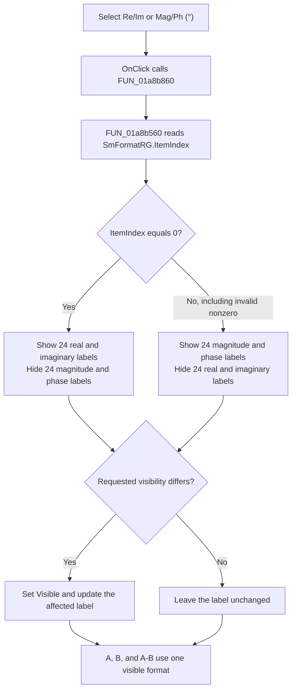

# Select the Smith matrix readout format

> Analysis status: Complete. The recovered handler, label-visibility helper, resource items, and separate Smith value writers establish the control behavior.

## Control

| Property | Recovered value |
| --- | --- |
| Form | DFWindow |
| Parent page | Smith |
| Component path | DFWindow.CursorPanel.Notebook1.Smith.SmFormatRG |
| Control class | TRadioGroup |
| Caption | Format |
| Items | `Re/Im`, `Mag/Ph (°)` |
| Hint | Not present in the recovered resource. |
| Handler name | SmFormatRGClick |
| Handler address | 01a8b860 |
| Graph node | `resource:dfm:DFWindow/DFWindow.CursorPanel.Notebook1.Smith.SmFormatRG` |
| Handler node | `function:01a8b860` |
| Graph layer | UI |

## What happens when clicked

When `OnClick` runs, `SmFormatRG.ItemIndex` identifies the selected item. `FUN_01a8b860` delegates to `FUN_01a8b560`, which reads that index from the radio group at form field `+0xd90`.

The helper applies one common format to the Smith A, B, and A-B groups. Each group contains rows 11, 12, 21, and 22. Each row has one real/imaginary label pair and one magnitude/phase label pair at the same display position.

| `SmFormatRG.ItemIndex` | Selected item | Labels shown in A, B, and A-B |
| --- | --- | --- |
| 0 | `Re/Im` | The `rLB` and `iLB` label pair in each A, B, and A-B row |
| 1 | `Mag/Ph (°)` | The `aLB` and `pLB` label pair in each A, B, and A-B row |

The label names combine the group, row, and value suffix, such as `SmA11rLB`, `SmB22aLB`, and `SmAB12pLB`. The resource spells two A-B phase controls as `SmAB21pLb` and `SmAB22pLb`; they are part of the same phase set. The helper makes 24 labels visible and hides the 24 labels for the other representation. It does not change the selected cursor, cursor frequency, parameter family, or any stored matrix value.

## Value and refresh behavior

The cursor value writer `FUN_01abfbd0` prepares both representations in separate labels. It writes real and imaginary values to the `rLB` and `iLB` controls. It calculates magnitude for the `aLB` controls and multiplies phase by `57.29577951308232` for the `pLB` controls, which proves that the phase display uses degrees. The click only selects which prepared captions are visible.

`FUN_01ad1740` prepares the A-B group only when both cursor objects exist and both are active. For each matrix element, it first subtracts the B real and imaginary parts from the A parts. It then calculates magnitude and degree phase from that complex difference. Thus, the polar A-B fields show the polar form of the complex A-minus-B result. They do not show `magnitude(A) - magnitude(B)` or `phase(A) - phase(B)`.

The general cursor refresh `FUN_01ae4310` calls the A-B updater and then calls `FUN_01a8b560` to reapply the current format after cursor state changes. If both cursors are absent, that refresh returns before the format helper. The click handler itself has no cursor or data guard. If it runs without current data, it only changes visibility; the labels keep their existing captions. The recovered resource initializes these value-label captions to `0`, and the no-data path does not clear or replace them.

## Boundary, repeated-click, and persistence behavior

The two recovered radio items normally produce indices 0 and 1. `FUN_01a8b560` tests only whether the index equals 0. Therefore, any unexpected nonzero index, including -1 or a value greater than 1, selects the magnitude/phase label set. It does not report or reject the invalid index.

If the event runs again with the same index, the helper still requests visibility for all 48 labels. The shared VCL visibility setter checks each current `Visible` value and returns when it already matches. Therefore, the repeated event does not cause another visibility change or repaint for labels that already have the requested state.

The handler and helper contain no message, retry, exception handler, or rollback. They call the visibility setter in sequence. A VCL exception would leave normal handler flow, and the handler does not undo earlier visibility changes.

This selection is live state in the current radio-group instance. The handler and direct helper do not write a model, configuration value, registry value, or file. The recovered form resource defines the two items but does not define an `ItemIndex`, and the recovered form create, close, and destroy handlers do not save this field. The recovered code therefore does not establish a persistent choice or a selected default after the form is recreated.

## Difference from CursorWindow

The `CursorWindow` control with the same `SmFormatRG` name and item text uses a different implementation. Its handler `FUN_00f102b0` passes the index to three `TNotebook` page setters. That setter rejects negative and out-of-range indices. `DFWindow` does not call that handler or notebook setter. It switches overlapping labels directly, and every nonzero index takes its polar branch.

## Click flow

## Evidence

- [Click handler `FUN_01a8b860`](../../../DecompiledSources/Tina16/functions/0000000001A8B860__FUN_01a8b860.c) delegates the event to the format synchronization helper.
- [Smith label-visibility helper `FUN_01a8b560`](../../../DecompiledSources/Tina16/functions/0000000001A8B560__FUN_01a8b560.c) reads `ItemIndex`, tests it against zero, and sets visibility for all A, B, and A-B real, imaginary, magnitude, and phase labels.
- [Cursor value writer `FUN_01abfbd0`](../../../DecompiledSources/Tina16/functions/0000000001ABFBD0__FUN_01abfbd0.c) populates separate rectangular and polar labels and converts phase from radians to degrees.
- [A-B value writer `FUN_01ad1740`](../../../DecompiledSources/Tina16/functions/0000000001AD1740__FUN_01ad1740.c) requires two active cursors and derives both representations from the complex A-minus-B matrix elements.
- [General cursor refresh `FUN_01ae4310`](../../../DecompiledSources/Tina16/functions/0000000001AE4310__FUN_01ae4310.c) reapplies the label format after the cursor-state update path and returns early when both cursors are absent.
- [VCL visibility setter `FUN_0064dbe0`](../../../DecompiledSources/Tina16/functions/000000000064DBE0__FUN_0064dbe0.c) changes a control only when the requested visibility differs from its current value.
- [CursorWindow handler `FUN_00f102b0`](../../../DecompiledSources/Tina16/functions/0000000000F102B0__FUN_00f102b0.c) and [notebook page setter `FUN_0074a520`](../../../DecompiledSources/Tina16/functions/000000000074A520__FUN_0074a520.c) prove the separate notebook-based behavior used by the other form.
- The recovered `DFWindow` resource binds `SmFormatRG.OnClick` to `SmFormatRGClick` at `01a8b860`. It defines the item order and the A, B, and A-B groups with rows 11, 12, 21, and 22.
- Recovered role: Select the visible rectangular or polar representation for all DFWindow Smith matrix readouts.
- Complexity: simple.
- Distinct outgoing calls: 1.

## Evidence limits

- The resource does not contain a selected `ItemIndex`, so the initial selected item is not established.
- Normal user interaction cannot produce an index outside the two recovered items. The nonzero invalid-index behavior is a property of the helper if an unexpected value reaches it.
- The recovered sources do not prove persistence outside the form instance. They prove only that this click path has no persistence write.
