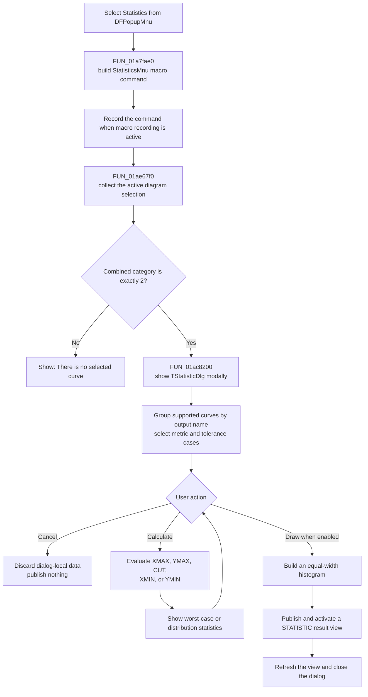

# Open curve tolerance statistics from the diagram popup

> Analysis status: Evidence-backed source review complete.

## Control

| Property | Recovered value |
| --- | --- |
| Form | DFWindow |
| Popup path | DFPopupMnu > Statistics... |
| Component path | DFWindow.DFPopupMnu.StatisticsMnu |
| Control class | TMenuItem |
| Caption | Statistics... |
| Hint | Not present in the recovered resource. |
| Handler name | StatisticsMnuClick |
| Handler address | 01a7fae0 |
| Graph node | `resource:dfm:DFWindow/DFWindow.DFPopupMnu.StatisticsMnu` |
| Handler node | `function:01a7fae0` |
| Graph layer | UI |

## What happens when clicked

`StatisticsMnuClick` first builds the popup-specific macro command with the token `StatisticsMnu`. It passes resource identifier `0x406` and the form value at `+0x6b8` into the common command-string builder, then sends that string to the macro recorder. The recorder submits the event only when the global macro-recording flag is set.

The handler then passes the active diagram at `DFWindow +0x798` to `FUN_01ae67f0`. This is the same shared selection and dialog launcher used by the main-menu `DFStatisticsMnu` command. The popup wrapper and main-menu wrapper differ only in their recovered event handlers and macro token names.

The shared launcher collects selected diagram objects and requires the combined selection category to equal exactly `2`, the recovered curve category. One or more selected curves pass. An empty, mixed, axis, cursor, text, or other selection does not pass. On failure, the launcher shows `There is no selected curve.` and does not construct the statistics dialog.

For a curve-only selection, `FUN_01ac8200` constructs `TStatisticDlg` with the application-global owner and the temporary selected-curve list. It calls `ShowModal`, ignores the returned modal result, destroys the dialog, and then the selection launcher destroys the temporary list.

## Statistics dialog behavior

`TStatisticDlg` groups supported analog curves by their output name before the first `[` character. Its initial metric is `XMAX`; the recovered metric choices are `XMAX`, `YMAX`, `CUT`, `XMIN`, and `YMIN`. `CUT` enables a numeric input. Calculate evaluates the selected metric for each matching tolerance case and displays one of two result sets:

- Worst Case mode `3` shows maximum, minimum, span, and available reference-case differences.
- Other recovered modes show arithmetic mean and population standard deviation, plus an available reference value.

Calculate changes dialog-local result state only. When more than one matching case exists, it enables Draw. Draw builds an equal-width histogram and publishes it as a new `STATISTIC` application result view with `Values` and `Samples` axes. Successful publication activates and refreshes the new diagram, then closes the statistics dialog with modal result `1`.

Cancel closes the dialog, destroys its local numeric buffer, and publishes no histogram. Opening the dialog or calculating the grid does not change the selected source curves or the active diagram.

The detailed selection, calculation, reference-case, unit, histogram, and publication evidence is documented in the canonical [main-menu Statistics article](dfstatisticsmnu-82734b56f6.md). `TIARA-diz.6.7.299` owns the graph annotations for the shared launcher `FUN_01ae67f0` and modal wrapper `FUN_01ac8200`.

## Click flow

## Guards, errors, and no-op paths

- A selection category other than exact curve category `2` shows the common no-selected-curve message and creates no dialog.
- The popup handler itself does not test the active-diagram pointer before it calls the selection launcher. The normal command-state logic can prevent an invalid launch, but this handler has no local null guard.
- A curve-only selection with no supported analog output can open the dialog. Calculate then has no matching cases, produces no aggregate result, and leaves Draw disabled.
- Invalid `CUT` numeric text uses the dialog's floating-point error path and leaves the dialog open for correction.
- Calculate frees and replaces its earlier result buffer when it runs again. Input changes hide the old result and disable Draw.
- The recovered histogram path does not explicitly reject a zero bar count or a zero-width value interval before division. UI editor constraints are not recovered.
- The popup wrapper, shared launcher, and dialog calculation path have no local exception rollback that establishes recovery from a provider or drawing failure.

## State, output, and persistence

The macro event is the first potential output and occurs before selection validation. It is conditional on macro recording, but it can therefore record an attempted command that later fails the curve-only selection check.

The selected curves are inputs. The opening and Calculate paths do not modify them. Draw can add a new histogram diagram to the live application result model. No traced function in this workflow writes the histogram, source curves, or dialog settings to a file, INI file, registry, or database. Saving a published result is a separate action.

## Recovered evidence

- [`FUN_01a7fae0`](../../../DecompiledSources/Tina16/functions/0000000001A7FAE0__FUN_01a7fae0.c) builds the `StatisticsMnu` macro command, sends it to the recorder, and delegates the active diagram to the shared launcher.
- [`FUN_01a841f0`](../../../DecompiledSources/Tina16/functions/0000000001A841F0__FUN_01a841f0.c) is the parallel main-menu wrapper. It has the same call sequence but uses macro token `DFStatisticsMnu`.
- [`FUN_01aee720`](../../../DecompiledSources/Tina16/functions/0000000001AEE720__FUN_01aee720.c) formats the macro command from the resource identifier, form value, and command token.
- [`FUN_01aed550`](../../../DecompiledSources/Tina16/functions/0000000001AED550__FUN_01aed550.c) wraps the command as a macro event and submits it only while recording is enabled.
- [`FUN_01ae67f0`](../../../DecompiledSources/Tina16/functions/0000000001AE67F0__FUN_01ae67f0.c) requires selection category `2`, shows the common error on failure, or opens the statistics dialog. Its canonical annotation belongs to `TIARA-diz.6.7.299`.
- [`FUN_01ac8200`](../../../DecompiledSources/Tina16/functions/0000000001AC8200__FUN_01ac8200.c) constructs, shows, and destroys `TStatisticDlg`. Its canonical annotation belongs to `TIARA-diz.6.7.299`.
- UI binding and captions: [`ui-evidence.json`](../../../DecompiledSources/Tina16/resources/dfm/ui-evidence.json)

## Popup-specific limits

The recovered resource places this item directly under `DFPopupMnu`, but the popup has no recovered `OnPopup` handler. `StatisticsMnuClick` does not inspect an event sender or popup target; it always reads the active diagram from `DFWindow +0x798`. The evidence therefore proves the popup menu route and active-diagram behavior, but it does not prove which diagram surface or mouse gesture opened the popup.
