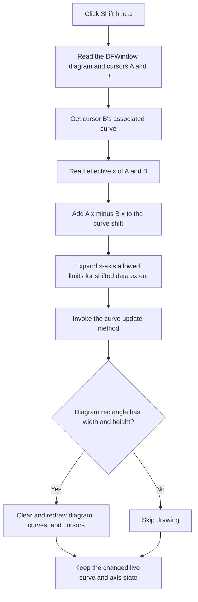

# Shift cursor B's curve to cursor A

> Analysis status: Reviewed from the recovered DFWindow handler, cursor-coordinate helpers, curve-range and rendering paths, the source-equivalent CursorWindow handler, DFM context, and extracted glyph evidence.

## Control

| Property | Recovered value |
| --- | --- |
| Form | DFWindow |
| Component path | DFWindow.CursorPanel.Notebook1.Normal.NormalPC.SelectedCurves.nBGB.SynchBtn |
| Control class | TSpeedButton |
| Caption | Not present in the recovered resource. |
| Hint | `Shift b to a` |
| Handler name | SynchBtnClick |
| Handler address | 01a7fb90 |
| Graph node | `resource:dfm:DFWindow/DFWindow.CursorPanel.Notebook1.Normal.NormalPC.SelectedCurves.nBGB.SynchBtn` |
| Handler node | `function:01a7fb90` |
| Graph layer | UI |

## What happens when clicked

The button shifts the complete plotted curve associated with cursor B along its x axis. The shift makes cursor B's effective x position equal to cursor A's effective x position sampled at the start of the click. The handler does not copy cursor A into cursor B, and it does not change either cursor's y value.

The handler gets the current diagram from `DFWindow` field `+0x798`. In that diagram, cursor A is at `+0xf0` and cursor B is at `+0xf8`. The adjacent ` A ` and ` B ` group boxes agree with this mapping. More directly, the A x editor's Enter-key handler calls the common cursor-position setter with selector `1`, which selects `+0xf0`; the B x editor uses selector `0`, which selects `+0xf8`.

The click performs these operations in order:

1. It gets the curve through cursor B's associated-object field `+0x58`.
2. It reads the effective x positions of A and B. For the recognized curve type, an effective cursor x is the cursor-local x at `+0x78` plus the associated curve's horizontal shift at `+0xf0`.
3. It adds `effective A - effective B` to the B curve's horizontal shift.
4. It asks the B curve's data source for its unshifted minimum and maximum x values.
5. It expands the target x-axis allowed range to include the shifted curve. The lower allowed limit becomes `min(old lower limit, data minimum + new shift)`. The upper allowed limit becomes `max(old upper limit, data maximum + new shift)`.
6. It invokes the curve's virtual update method and requests a full redraw of the current diagram and its registered plot children.

When A is not attached to the curve that is shifted, B's new effective x equals A's sampled effective x after step 3.

## Synchronization flow

## State, axes, and readouts

The operation is a generic x-axis translation. It does not contain a time conversion, frequency conversion, phase conversion, phase wrapping, or unit-specific branch. The meaning and unit of x come from the curve and its x axis. Therefore, the same code can align cursor positions on different diagram types, but the source does not support calling this specifically a time or phase alignment command.

These live values can change:

- B curve field `+0xf0` receives the adjusted horizontal shift.
- The B curve's x-axis object at `+0xf8` can receive a lower allowed limit at axis field `+0xc8` and an upper allowed limit at `+0xd0`.
- The curve and current diagram receive update and redraw requests.

The handler does not directly assign these values:

- cursor A or B local x fields;
- either cursor's y value, sampled y result, style, visibility, or curve association;
- the visible x-axis interval at axis fields `+0xb8` and `+0xc0`;
- the DFWindow x, y, difference, frequency, or slope controls;
- the active notebook page, focus, or curve selection.

The button is on the `SelectedCurves` page, but the handler does not read a selection list. Its target is specifically the curve already associated with cursor B. The full diagram redraw includes curve and cursor drawing paths. The handler has no direct text or label write, so the recovered path does not establish when the separate numeric readouts refresh.

## Hint and glyph evidence

The button has no caption. Its hint is `Shift b to a`. The extracted 20-by-20 PNG shows a red lowercase `a` and a blue arrow pointing left toward it. The hint, the glyph, the surrounding A and B groups, and the handler's A-minus-B data flow agree on the direction: A supplies the reference x position, and B's associated curve is shifted.

The glyph supports direction only. The handler source proves that the command moves the complete curve along x, not only the cursor marker and not its y value.

## Guards and required state

The DFM does not set `Enabled = false`, so the speed button uses the normal enabled default. The handler has no null check, type check, same-curve check, selected-curve check, or enabled-state check before it follows the diagram, cursor B, curve, data-source, and axis pointers.

The effective-coordinate helper can return the cursor-local x when a cursor has no associated object of the recognized curve type. That fallback can apply to A. It cannot protect the B path because the handler dereferences B's associated object before it reads the effective positions.

The recovered source therefore requires a valid diagram in `DFWindow +0x798`, both cursor objects, a B-associated curve with the expected layout, its data source, and its x axis. No runtime function that disables this embedded button when these requirements fail was established.

The final redraw helper has a separate drawing guard. It skips drawing when the diagram rectangle has zero width or zero height. This check occurs after the curve shift and axis-limit writes. It does not prevent or undo those state changes.

## Repeated clicks and no-op cases

- If A's effective x already equals B's effective x, the delta is zero. The shift stays unchanged. The axis-limit writes are idempotent after the allowed limits include the curve, but the curve update and diagram redraw still run.
- If A is attached to a different, unchanged curve, the first click aligns B with A. A repeated click then has a zero delta unless another action moved a cursor or curve.
- There is no same-curve guard. If A and B are attached to the same shifted curve, both effective positions move when the shared curve moves. B reaches A's pre-click effective x, but A moves by the same delta. A repeated click can add the same cursor-local difference again instead of becoming a no-op.
- If the diagram rectangle is degenerate, only drawing is skipped. The live curve shift and expanded allowed limits remain changed.

## Errors and partial state

The handler has no local exception handler, validation message, retry, undo snapshot, or rollback.

- A missing diagram, cursor B, B-associated curve, axis, or required data object can cause an invalid dereference instead of a controlled no-op.
- A failure after the shift assignment can leave the curve moved without complete axis-limit updates or without a redraw.
- A failure after the lower-limit write but before the upper-limit write can leave only one allowed bound expanded.
- A curve-update or redraw failure occurs after all direct shift and axis writes, so those changes can remain while the display is stale.
- The recovered path does not establish how the application reports object, rendering, or floating-point failures.

## Persistence boundary

The command writes directly to live curve and axis objects. It does not call a file writer, settings service, document-save command, explicit dirty-state setter, or undo service. The shift lasts at least for the lifetime of those in-memory diagram objects.

The click path does not prove whether a later diagram or document save serializes the curve shift or expanded allowed limits.

## Handler and call-path evidence

- DFWindow handler: [FUN_01a7fb90](../../../DecompiledSources/Tina16/functions/0000000001A7FB90__FUN_01a7fb90.c) reads the diagram from the current form, selects B's associated curve, changes its x shift by the effective A-to-B delta, expands the x-axis allowed range, invokes the curve update, and redraws the diagram.
- Standalone CursorWindow handler: [FUN_00f10310](../../../DecompiledSources/Tina16/functions/0000000000F10310__FUN_00f10310.c) has the same calculations, field accesses, bound updates, virtual curve call, and redraw call. Its material difference is that it reaches the diagram through the global CursorWindow instance instead of the current DFWindow instance.
- Effective cursor x: [FUN_01abfb00](../../../DecompiledSources/Tina16/functions/0000000001ABFB00__FUN_01abfb00.c) returns cursor-local x plus the associated curve shift for the recognized curve type, or cursor-local x otherwise.
- Effective cursor x setter: [FUN_01abfb40](../../../DecompiledSources/Tina16/functions/0000000001ABFB40__FUN_01abfb40.c) subtracts the associated curve shift before it stores cursor-local x.
- Curve data bounds: [FUN_01ab2a30](../../../DecompiledSources/Tina16/functions/0000000001AB2A30__FUN_01ab2a30.c) and [FUN_01ab2a60](../../../DecompiledSources/Tina16/functions/0000000001AB2A60__FUN_01ab2a60.c) ask the curve data source for minimum and maximum x.
- Curve rendering: [FUN_01ab2f90](../../../DecompiledSources/Tina16/functions/0000000001AB2F90__FUN_01ab2f90.c) adds curve field `+0xf0` to source x values before x-axis conversion. This establishes that the field is a horizontal curve shift.
- Axis limits: [FUN_01cd3cd0](../../../DecompiledSources/Tina16/functions/0000000001CD3CD0__FUN_01cd3cd0.c), [FUN_01cd3950](../../../DecompiledSources/Tina16/functions/0000000001CD3950__FUN_01cd3950.c), and [FUN_01cd4050](../../../DecompiledSources/Tina16/functions/0000000001CD4050__FUN_01cd4050.c) use axis fields `+0xc8` and `+0xd0` as the lower and upper limits that constrain the visible interval.
- Diagram redraw: [FUN_01aceb90](../../../DecompiledSources/Tina16/functions/0000000001ACEB90__FUN_01aceb90.c) checks the diagram bounds, optionally clears the drawing area, and redraws registered plot children, including the cursor objects.
- A x-entry path: [FUN_01a88a30](../../../DecompiledSources/Tina16/functions/0000000001A88A30__FUN_01a88a30.c) sends selector `1` to the shared cursor-position setter.
- B x-entry path: [FUN_01a88b10](../../../DecompiledSources/Tina16/functions/0000000001A88B10__FUN_01a88b10.c) sends selector `0` to the same setter.
- Cursor-position setter: [FUN_01ae24a0](../../../DecompiledSources/Tina16/functions/0000000001AE24A0__FUN_01ae24a0.c) maps selector `1` to diagram field `+0xf0` and selector `0` to `+0xf8`.

## Resource evidence

- The control is on `CursorPanel.Notebook1.Normal.NormalPC.SelectedCurves`, inside the ` B ` group. That group also contains B x and y editors.
- The adjacent ` A ` group contains the corresponding A x and y editors. The ` B - A ` group contains x and y difference readouts.
- The button has hint `Shift b to a`, `ShowHint = true`, and `ParentShowHint = false`.
- It has no recovered caption, action, built-in button kind, modal result, checked state, separate image-list reference, or explicit disabled state.
- Its 1,482-byte Delphi BMP glyph was extracted as [a 20-by-20 PNG](../../../glyph/0111_DFWindow_DFWindow_CursorPanel_Notebook1_Normal_NormalPC_SelectedCurves_nBGB_SynchBtn_Glyph_Data.png).
- The nearby `x:` and `y:` labels identify the B coordinate editors. The source proves that this command changes only the curve's x shift.

## Analysis limits

- The original Delphi class and field names for the diagram, cursor, curve, data source, and axis objects are not recovered. Selector use, repeated field access, coordinate conversion, rendering, and the parallel handler establish their responsibilities.
- No runtime button-enable update was identified. The DFM default and missing handler guards are proven; broader UI-state enforcement is not.
- The curve's virtual `+0xc0` method is not named, so this article describes it only as an update method and does not claim a specific cache policy.
- The handler does not directly update DFWindow's numeric controls. The timing of any indirect readout refresh is not recovered.
- The click path has no persistence call. Later serialization of the shifted curve or axis limits is not established.
