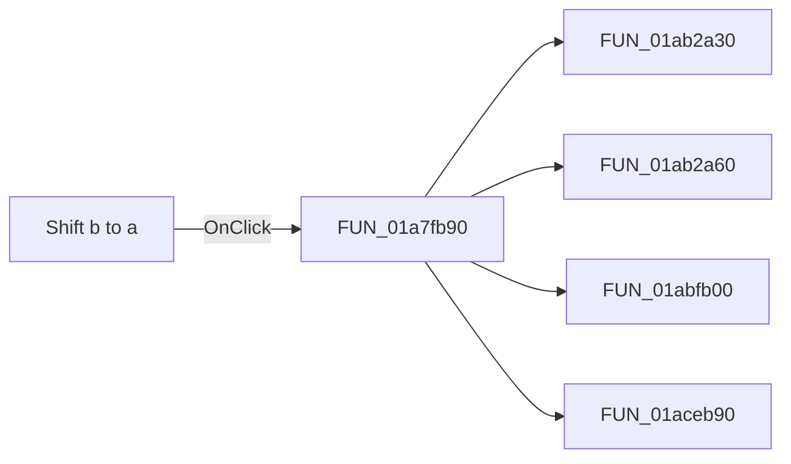

# Shift b to a

> Analysis status: Pending individual source review.

## Control

| Property | Recovered value |
| --- | --- |
| Form | DFWindow |
| Component path | DFWindow.CursorPanel.Notebook1.Normal.NormalPC.SelectedCurves.nBGB.SynchBtn |
| Control class | TSpeedButton |
| Caption | Not present in the recovered resource. |
| Hint | Shift b to a |
| Text | Not present in the recovered resource. |
| Handler name | SynchBtnClick |
| Handler address | 01a7fb90 |
| Graph node | `resource:dfm:DFWindow/DFWindow.CursorPanel.Notebook1.Normal.NormalPC.SelectedCurves.nBGB.SynchBtn` |
| Handler node | `function:01a7fb90` |
| Graph layer | UI |

## What happens when clicked

Pending individual analysis. An agent must read the recovered handler source and its relevant callees before it replaces this text.

## Click flow

## Handler evidence

- Source: [DecompiledSources/Tina16/functions/0000000001A7FB90__FUN_01a7fb90.c](../../../DecompiledSources/Tina16/functions/0000000001A7FB90__FUN_01a7fb90.c)
- Recovered role: Not present in the recovered resource.
- Current graph summary: Handles 1 Delphi UI event: DFWindow.CursorPanel.Notebook1.Normal.NormalPC.SelectedCurves.nBGB.SynchBtn.OnClick.
- Current graph behavior: Not present in the recovered resource.
- Current graph evidence: Not present in the recovered resource.
- Complexity: complex
- Distinct outgoing calls: 4

## Direct calls

- `function:01ab2a30` — FUN_01ab2a30
- `function:01ab2a60` — FUN_01ab2a60
- `function:01abfb00` — FUN_01abfb00
- `function:01aceb90` — FUN_01aceb90

## Resource evidence

- Kind: Not present in the recovered resource.
- Modal result: Not present in the recovered resource.
- Checked state: Not present in the recovered resource.
- List items: Not present in the recovered resource.
- Image reference: Not present in the recovered resource.
- Extracted glyph: [`0111_DFWindow_DFWindow_CursorPanel_Notebook1_Normal_NormalPC_SelectedCurves_nBGB_SynchBtn_Glyph_Data.png`](../../../glyph/0111_DFWindow_DFWindow_CursorPanel_Notebook1_Normal_NormalPC_SelectedCurves_nBGB_SynchBtn_Glyph_Data.png)

## Nearby label candidates

Nearby labels are layout candidates only. They are not proof of behavior.

- Rank 1: y: at distance 75.
- Rank 2: x: at distance 150.

## Analysis limits

- Do not infer behavior from the control class, caption, hint, glyph, or nearby label alone.
- Do not replace the pending status until the handler source and relevant call path provide enough evidence.
