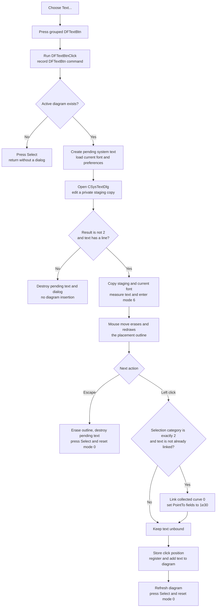

# Create and place text

> Analysis status: Complete from recovered popup, toolbar, dialog staging, mouse preview, placement, selection-link, Escape, redraw, and serialization evidence.

## Control

| Property | Recovered value |
| --- | --- |
| Form | DFWindow |
| Component path | DFWindow.DFPopupMnu.TextMnu |
| Control class | TMenuItem |
| Caption | Text... |
| Hint | Not present in the recovered resource. |
| Handler name | TextMnuClick |
| Handler address | 01a7b8f0 |
| Graph node | `resource:dfm:DFWindow/DFWindow.DFPopupMnu.TextMnu` |
| Handler node | `function:01a7b8f0` |
| Graph layer | UI |

## What happens when clicked

The popup command starts the same new-text workflow as the diagram toolbar's **Text** speed button. It opens the text editor before placement. If the user accepts non-empty text, DFWindow shows a text-sized placement outline that follows the pointer. One later left click places the text and returns to the **Select** tool.

This command creates a new text object. It does not edit a selected text object. A selected curve can become an association for the new object at placement time, but the command does not copy or edit the curve's sample data.

## Popup and toolbar activation

[`FUN_01a7b8f0`](../../../DecompiledSources/Tina16/functions/0000000001A7B8F0__FUN_01a7b8f0.c) first presses the speed button at DFWindow offset `+0xAB0`, then calls [`FUN_01a7a4a0`](../../../DecompiledSources/Tina16/functions/0000000001A7A4A0__FUN_01a7a4a0.c), the recovered `DFTextBtnClick` handler. The DFM gives the Text and Select buttons the same nonzero group index. The recovered speed-button setter sends the VCL group notification when it presses Text, so another button in that group is released.

The shared handler records the command as `DFTextBtn`, even when it was reached through this popup item. If DFWindow has no active diagram at offset `+0x798`, it presses **Select**, runs the Select handler, and returns without constructing an object or opening the dialog.

## Dialog staging and acceptance

With an active diagram, the shared handler creates a new system-text object in the DFWindow pending-object field at `+0xFF0`. It initializes the nested text style from DFWindow's current font at `+0x1038` and loads the recovered Background, BgndColor, and Border preferences. It then constructs `CSysTextDlg` and loads a deep copy of this new object into the dialog's private staging object.

The dialog edits its private copy. Its close path copies the Memo lines and font into that staging object for both OK and Cancel. The DFWindow owner performs the actual commit test after `ShowModal` returns:

- modal result `2` is rejected;
- any other result is still rejected when the staged Memo has no line;
- any other result with at least one line is accepted.

On acceptance, the owner copies the complete staged text and style back to the pending object. It also copies the accepted font to DFWindow's current-font object at `+0x1038`, so later text objects in the same live DFWindow start with that font. It sets the pending object's provisional position to `(-100, -100)`, calculates its width and height, assigns the active diagram as owner, and draws an outline for the provisional bounds. The object is not yet added to the diagram's figure collection. The handler sets interaction mode `6`, which is the recovered pending-text placement mode.

## Pointer preview and final placement

While mode `6` is active, [`FUN_01a74a50`](../../../DecompiledSources/Tina16/functions/0000000001A74A50__FUN_01a74a50.c), the DFWindow `OnMouseMove` handler, erases the previous outline, stores the current pointer coordinates as the new top-left point, and draws the same measured-width and measured-height outline there. The text object itself remains pending at `+0xFF0` until placement.

The ordinary left-click branch in [`FUN_01a730e0`](../../../DecompiledSources/Tina16/functions/0000000001A730E0__FUN_01a730e0.c), the DFWindow `OnMouseDown` handler, commits the pending object:

1. It collects the current diagram selection.
2. If the combined category is exactly `2`, the recovered curve category, and the text has no curve link, it links the text to collected selection item zero. It calls that curve's attach method and writes the sentinel value `1e30` to the serialized `PointToX` and `PointToY` fields.
3. It writes the click coordinates to the text object, assigns the active diagram, recalculates its display state, and registers it under the name `Text`.
4. It clears the object's byte at `+0x80`, erases the placement outline, adds the object to the active diagram's figure collection, and refreshes the diagram objects.
5. It clears DFWindow's pending-object pointer, presses **Select**, and resets interaction mode to `0`.

The curve check occurs at placement time, not when the popup opens. No selection, a non-curve selection, or a mixed selection does not block placement; it leaves the text unbound. If several selected objects produce the pure curve category, only collected item zero is linked.

## Cancel, repeat, and error behavior

- Cancel result `2` destroys the temporary object and dialog and clears `+0xFF0`. An accepted dialog with no text line uses the same rejection path.
- The dialog-rejection branch does not explicitly press **Select** or change the interaction-mode byte. Because the popup wrapper already pressed the grouped Text button, the recovered call path does not prove an immediate visual button reset after dialog rejection.
- After the dialog accepts non-empty text, pressing Escape before placement calls [`FUN_01a7d1a0`](../../../DecompiledSources/Tina16/functions/0000000001A7D1A0__FUN_01a7d1a0.c). For mode `6`, it erases the outline, destroys the pending object, clears the pointer, presses **Select**, resets mode to `0`, restores the normal cursor value, and refreshes the active diagram's interaction state.
- Escape does not restore DFWindow's prior current font. The accepted font was copied before placement, so that live style change remains even when the pending object is then discarded.
- Each successful activation constructs one new object. Placement returns to Select, so another text object requires another activation.
- A selected curve is attached before the pending text is registered in the diagram collection. The recovered functions have no local exception handler or rollback. An error after curve attachment can therefore leave a partial relationship. An error later in registration, collection insertion, or refresh can leave a partly placed object or stale pixels.
- Dialog construction, staging copy, measurement, outline drawing, and destruction also have no local error message, retry, or rollback path.

## Redraw and persistence boundary

The preview rectangle path draws the old bounds again before it draws the new bounds. Final placement adds the text to the live diagram collection and refreshes diagram objects. It does not show a second confirmation dialog.

The system-text class is registered with persistence type `0x408`. During a later diagram save, its serializer writes the text content, font, screen coordinates, relative sizing, background and border fields, and `PointCurve`, `PointToX`, and `PointToY` association fields. Thus a successfully placed text object can be saved with its diagram. A canceled or Escape-discarded pending object is not added to the figure collection and is not available to that serializer.

The activation and placement paths do not directly call a file writer, Save command, settings writer, recovered undo registrar, or recovered document-modified helper. The source proves later serialization support, but it does not prove an immediate save, dirty flag, or undo entry.

## Click flow

## Evidence

- [Popup wrapper `FUN_01a7b8f0`](../../../DecompiledSources/Tina16/functions/0000000001A7B8F0__FUN_01a7b8f0.c) presses form field `+0xAB0` and delegates to `FUN_01a7a4a0`.
- [Toolbar Text handler `FUN_01a7a4a0`](../../../DecompiledSources/Tina16/functions/0000000001A7A4A0__FUN_01a7a4a0.c) implements the no-diagram fallback, system-text construction, dialog ownership, acceptance and empty-text checks, copy-back, measurement, provisional bounds, and mode-`6` transition. Its canonical annotation is reserved for the toolbar control.
- [Speed-button setter `FUN_0082a6c0`](../../../DecompiledSources/Tina16/functions/000000000082A6C0__FUN_0082a6c0.c) changes the Down state and invokes the group notifier. [Its notifier](../../../DecompiledSources/Tina16/functions/000000000082A670__FUN_0082a670.c) sends the recovered VCL group message to the parent.
- [Dialog loader `FUN_0146a9a0`](../../../DecompiledSources/Tina16/functions/000000000146A9A0__FUN_0146a9a0.c) deep-copies the source object into dialog staging and loads its font and text controls. [The complete-copy helper](../../../DecompiledSources/Tina16/functions/0000000001A5EB60__FUN_01a5eb60.c) performs the accepted copy back.
- [Dialog close `FUN_0146ab60`](../../../DecompiledSources/Tina16/functions/000000000146AB60__FUN_0146ab60.c) updates staging for both close results. The caller's result and non-empty-line tests remain the commit boundary.
- [DFWindow mouse move `FUN_01a74a50`](../../../DecompiledSources/Tina16/functions/0000000001A74A50__FUN_01a74a50.c) has a mode-`6` branch that updates the outline from pointer coordinates. [The rectangle helper](../../../DecompiledSources/Tina16/functions/0000000001A8DD40__FUN_01a8dd40.c) configures the canvas and draws the requested bounds.
- [DFWindow mouse down `FUN_01a730e0`](../../../DecompiledSources/Tina16/functions/0000000001A730E0__FUN_01a730e0.c) has the mode-`6` curve-link, position, registration, collection insertion, refresh, and Select-reset path.
- [Escape dispatcher `FUN_01a7d460`](../../../DecompiledSources/Tina16/functions/0000000001A7D460__FUN_01a7d460.c) routes key code `0x1B` to [mode cleanup `FUN_01a7d1a0`](../../../DecompiledSources/Tina16/functions/0000000001A7D1A0__FUN_01a7d1a0.c), which destroys the pending mode-`6` text and resets Select.
- [Persistence registration](../../../DecompiledSources/Tina16/functions/00000000011569A0__FUN_011569a0.c) maps system text to type `0x408`. [System-text serialization](../../../DecompiledSources/Tina16/functions/0000000001A5F630__FUN_01a5f630.c) writes content, font, coordinates, display fields, curve link, and point-to values. [Diagram serialization](../../../DecompiledSources/Tina16/functions/0000000001ADD6F0__FUN_01add6f0.c) serializes the diagram's figure objects.

## Resource evidence

- The popup item has caption **Text...** and no hint, action, image-list reference, embedded glyph, picture, checked state, or shortcut.
- The delegated `DFTextBtn` has hint **Text**, group index `1`, and a 20 by 20 extracted bitmap glyph that shows a black letter `T`: [Text tool glyph](../../../glyph/0098_DFWindow_DFWindow_DFToolPanel_ToolNoteBook_Diagram_DFTextBtn_Glyph_Data.png).
- The `DFSelectBtn` also has group index `1`. This agrees with the recovered group notification and the final return to Select.
- The text glyph and hint identify the tool, while the handler and mouse paths establish creation, staging, and placement behavior.

## Analysis limits

- Private Delphi field and class names are not recovered. Offsets and repeated callers establish the pending object, active diagram, tool mode, and current font roles.
- The selected curve's attach and detach virtual method names are not recovered. The category test, object link, call direction, and serialized `PointCurve` field establish the association.
- `1e30` is the exact stored `PointToX` and `PointToY` sentinel. The recovered source does not name its semantic enum or constant.
- The source proves that a later save can serialize the placed object. It does not prove dirty-state timing, undo support, or automatic saving.
