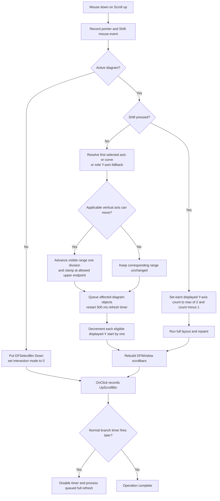

# Scroll an applicable vertical axis toward its upper range

> Analysis status: Source reviewed through DFM event order, target-axis
> selection, one-division range movement, Shift behavior, coordinate-system
> window movement, delayed refresh, scrollbars, and persistence boundaries.

## Control

| Property | Recovered value |
| --- | --- |
| Form | DFWindow |
| Component path | DFWindow.DFToolPanel.ToolNoteBook.Diagram.UpScrollBtn |
| Control class | TSpeedButton |
| Caption | Not present in the recovered resource. |
| Hint | Scroll up |
| Text | Not present in the recovered resource. |
| Handler name | UpScrollBtnClick |
| Handler address | 01a7a010 |
| Graph node | `resource:dfm:DFWindow/DFWindow.DFToolPanel.ToolNoteBook.Diagram.UpScrollBtn` |
| Handler node | `function:01a7a010` |
| Graph layer | UI |

## Two events make one normal button press

The resource binds both `OnMouseDown` and `OnClick`:

- `FUN_01a857b0`, `UpScrollBtnMouseDown`, performs the scroll operation. It
  also records a mouse event with the pointer position and Shift state.
- `FUN_01a7a010`, `UpScrollBtnClick`, records the macro/action name
  `UpScrollBtn`. It contains no range, layout, timer, scrollbar, or persistence
  call.

A normal mouse press reaches `OnMouseDown` before the later `OnClick`. Calling
the click handler alone records the action but does not scroll. The DFM has no
`OnMouseUp` handler for this control.

The mouse-down handler first tests DFWindow's active-diagram field at offset
`0x798`. With no diagram, it puts `DFSelectBtn` in its Down state and calls the
Select handler. No axis range, displayed-axis window, layout, timer, or
scrollbar state changes in that branch.

## Normal press: choose one vertical axis

Without Shift, `FUN_01a857b0` first calls `FUN_01ae31b0`. That dispatcher
rebuilds the current diagram selection and uses these recovered cases:

- Selection category `1` is an axis selection. It uses item zero and scrolls
  it only when its recovered orientation belongs to vertical-axis mask
  `0xA6`. Other selected-axis orientations do not move.
- Selection category `2` is a curve selection. It resolves item zero to its
  containing coordinate system and chooses the curve's vertical-axis link at
  offset `0x100` or `0xF0`, according to the recovered coordinate-system type.
- Selection category `0` supplies a default only when the diagram has exactly
  one coordinate system and that system has exactly one Y axis in collection
  `0x78`. It scrolls that Y axis and its linked secondary axis at `0x118`, when
  present.
- Mixed or other selection categories do not select a vertical axis.

Multiple selected objects are not processed as a group. The axis and curve
branches use only selection item zero. An unsupported or ambiguous selection
does not show a message.

## Exact upward range step and clamp

The selected vertical-axis path uses the shared upper-direction axis helper
`FUN_01cd3b70`. The same helper is used by the horizontal **Scroll right**
command and has its canonical annotation in Bead `.375`.

The relevant recovered axis fields are:

- `0xB8`: visible lower endpoint;
- `0xC0`: visible upper endpoint;
- `0xC8`: allowed lower endpoint;
- `0xD0`: allowed upper endpoint;
- `0x70`: scale mode; and
- `0x74`: division count.

For the common linear branches, the numeric helper calculates:

`step = (visible upper - visible lower) / division count`

It adds one step to both visible endpoints. This moves the visible interval
toward larger axis values without changing its span. If the proposed upper
endpoint exceeds the allowed upper endpoint, the helper shortens the effective
step so the final upper endpoint equals `0xD0` and preserves the visible span.
At that boundary, a further request produces no range movement.

Scale mode `2` performs the same one-division operation in the recovered
logarithmic domain and converts the endpoints back. The operation changes only
the visible range at `0xB8`/`0xC0`. It does not change allowed limits, scale
mode, division count, axis assignment, or curve sample data.

When the step reports movement, `FUN_01cd3b70` clears the affected axis label
rectangle and invokes the axis update and draw methods. The dispatcher also
queues the applicable axis and related display objects for a later full
refresh.

## Normal press: displayed Y-axis window

After the selected-axis dispatcher returns, the normal branch calls the
`.378`-owned `FUN_01ad1480`. It visits every coordinate system in the active
diagram. For each system whose displayed-Y window start at offset `0x94` is
greater than zero, its lower helper decrements that start by one, recalculates
the coordinate-system layout, and redraws its owned objects.

This is separate from numeric axis scrolling. The `0x94` change selects the
previous consecutive group of displayed Y axes. It does not change an axis's
numeric endpoints. A system already at start zero stays unchanged. If any
system moves, the helper also redraws the optional diagram cursor objects.

Thus one normal mouse-down can produce both effects:

1. move one applicable vertical numeric range toward its upper allowed value;
2. move every eligible coordinate system's displayed-Y window toward index
   zero.

Either effect can be a no-op while the other still changes.

## Shift press: reduce the displayed Y-axis count

When the recovered Shift-state bit is set, `FUN_01a857b0` skips both the
selected-axis range dispatcher and the displayed-window-start helper. It calls
`FUN_01ad16a0` instead.

That helper visits every coordinate system and replaces its displayed Y-axis
count at offset `0x98` with:

`max(2, displayed count - 1)`

It then runs full diagram layout and repaint. This changes how many Y axes can
be displayed at once; it does not move a numeric axis range or change the
displayed-window start at `0x94`. When every count is already two, the values
stay unchanged, but the helper still performs layout and repaint.

## Delayed refresh, repeat behavior, and scrollbars

The normal selected-axis dispatcher restarts a diagram timer at offset `0x88`:

1. disable the timer;
2. set its interval to 500 ms;
3. install `FUN_01ae5d60` with the diagram as context; and
4. enable the timer.

When the timer fires, the callback disables it and calls `FUN_01ae5650` to
process and clear the queued diagram objects. The timer coalesces the final
refresh. It is not a button-repeat timer. Every non-Shift mouse-down restarts
the 500 ms delay, even when no axis range moves. The Shift branch does not
configure this timer because it performs immediate full layout and repaint.

After either active-diagram branch, `FUN_01a857b0` calls `FUN_01a89e80` to
reset and rebuild DFWindow's horizontal and vertical scrollbar controls. For a
single supported coordinate system, the vertical scrollbar can reflect either
the displayed-Y start/count or the scrollable numeric range of its sole Y
axis. Other layouts leave that shared window scrollbar disabled.

There is no recovered loop that repeats the operation while the mouse button
is held. Repeated presses can move by more divisions or displayed-axis
positions, and each normal press restarts the delayed refresh timer.

## Manual-scale and persistence boundary

The path does not call the `ManualScale` option serializer, remove axis option
keys, write `TINA.INI`, save a document, set a recovered document-modified
flag, or create an undo record. It also does not switch an axis between
automatic and manual scale modes.

The operation changes live in-memory visible endpoints and can change
coordinate-system fields `0x94` and `0x98`. The normal axis writer
`FUN_01cd8e40` serializes the visible and allowed range pairs. Coordinate-system
writer `FUN_01ce6660` serializes `0x94` and `0x98`. A later normal document save
can therefore preserve these view fields, but this control does not perform
that save. The 500 ms timer is a redraw boundary, not a persistence boundary.

## Guards, errors, and partial state

- The shared DFWindow state updater normally disables the six scroll controls
  when there is no active diagram, when its coordinate-system list is empty,
  or when the first coordinate system has recovered type `7`. The mouse-down
  handler still has its own null-diagram fallback but does not repeat the empty
  or type guard.
- An unsupported selected axis, ambiguous no-selection context, unresolved
  curve owner, upper range boundary, or displayed-window start of zero causes
  the corresponding part of the operation to do nothing without a message.
- The numeric helper divides by the axis division count without a local zero
  check. Its logarithmic branch has no local positive-endpoint validation.
- The handler does not test which mouse button caused `OnMouseDown`; it branches
  only on the recovered Shift bit.
- No confirmation, error dialog, exception handler, retry, transaction, or
  rollback is recovered. A numeric range can change before a later
  coordinate-system, scrollbar, or timer operation fails. Earlier live changes
  remain if a later call raises an exception.

## Event flow

## Handler and downstream evidence

- [OnClick recorder](../../../DecompiledSources/Tina16/functions/0000000001A7A010__FUN_01a7a010.c)
  records `UpScrollBtn` and performs no model operation.
- [OnMouseDown dispatcher](../../../DecompiledSources/Tina16/functions/0000000001A857B0__FUN_01a857b0.c)
  owns the active-diagram and Shift branches and the final scrollbar refresh.
- [`FUN_01ae31b0`](../../../DecompiledSources/Tina16/functions/0000000001AE31B0__FUN_01ae31b0.c)
  chooses the applicable vertical axis, queues display objects, and configures
  the delayed refresh timer.
- [`FUN_01cd3b70`](../../../DecompiledSources/Tina16/functions/0000000001CD3B70__FUN_01cd3b70.c)
  and [`FUN_01cd3950`](../../../DecompiledSources/Tina16/functions/0000000001CD3950__FUN_01cd3950.c)
  implement the shared upper-direction one-axis step and clamp. Their canonical
  upper-step annotation belongs to [Scroll right](rightscrollbtn-e1e157bfc3.md).
- [`FUN_01ad1480`](../../../DecompiledSources/Tina16/functions/0000000001AD1480__FUN_01ad1480.c)
  and [`FUN_01ce6390`](../../../DecompiledSources/Tina16/functions/0000000001CE6390__FUN_01ce6390.c)
  move each coordinate system's displayed-Y start. Their canonical annotations
  belong to [Shift up](upscrollcsbtn-51c02eb031.md).
- [`FUN_01ad16a0`](../../../DecompiledSources/Tina16/functions/0000000001AD16A0__FUN_01ad16a0.c)
  implements the Shift-only displayed-axis-count change.
- [`FUN_01ae5d60`](../../../DecompiledSources/Tina16/functions/0000000001AE5D60__FUN_01ae5d60.c)
  disables the timer and calls the shared queued refresh processor.
- [`FUN_01a89e80`](../../../DecompiledSources/Tina16/functions/0000000001A89E80__FUN_01a89e80.c)
  rebuilds DFWindow's horizontal and vertical scrollbar controls.
- [`FUN_01cd8e40`](../../../DecompiledSources/Tina16/functions/0000000001CD8E40__FUN_01cd8e40.c)
  and [`FUN_01ce6660`](../../../DecompiledSources/Tina16/functions/0000000001CE6660__FUN_01ce6660.c)
  are the later normal writers for the affected range and coordinate-system
  view fields. This control does not call them.
- [Scroll down](downscrollbtn-a4c47423e3.md) owns the mirrored down-specific
  dispatcher and Shift path.

## Resource and glyph evidence

- The control is a `TSpeedButton` with hint **Scroll up** and DFM bindings for
  `OnMouseDown` and `OnClick`.
- [The extracted 9 by 9 pixel glyph](../../../glyph/0090_DFWindow_DFWindow_DFToolPanel_ToolNoteBook_Diagram_UpScrollBtn_Glyph_Data.png)
  is a black upward triangle. It confirms direction only. The event and range
  sources establish the affected state and step.
- The resource has no recovered caption, action, checked state, group index,
  or same-parent label candidate.

## Analysis limits

- Original Delphi names are not recovered for selection categories, axis
  orientations, scale modes, and coordinate-system type values.
- The source proves that `TShiftState` bit zero selects the alternate branch.
  It does not provide a user-facing label for the displayed-axis-count action.
- The timer and queued refresh helpers are shared infrastructure and remain
  evidence only. This Bead also cites `.375` and `.378` canonical helpers
  without duplicating their annotations.
