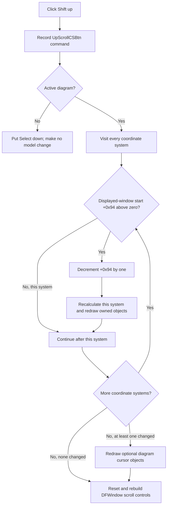

# Shift every coordinate system up by one displayed Y-axis position

> Analysis status: Evidence-backed source review complete.

## Control

| Property | Recovered value |
| --- | --- |
| Form | DFWindow |
| Component path | DFWindow.DFToolPanel.ToolNoteBook.Diagram.UpScrollCSBtn |
| Control class | TSpeedButton |
| Caption | Not present in the recovered resource. |
| Hint | Shift up |
| Text | Not present in the recovered resource. |
| Handler name | UpScrollCSBtnClick |
| Handler address | 01a7a2b0 |
| Graph node | `resource:dfm:DFWindow/DFWindow.DFToolPanel.ToolNoteBook.Diagram.UpScrollCSBtn` |
| Handler node | `function:01a7a2b0` |
| Graph layer | UI |

## What happens when clicked

`UpScrollCSBtn` moves the displayed Y-axis window of every coordinate system in the active diagram up by one position. It does not pan one selected axis's numeric range and does not select, reorder, add, or remove an axis.

`FUN_01a7a2b0` first records command name `UpScrollCSBtn` in the recovered macro-command path. If DFWindow field `+0x798` has no active diagram, the handler puts the Select speed button down and calls `DFSelectBtnClick`. It changes no coordinate-system state and shows no error.

With an active diagram, the handler calls `FUN_01ad1480` and then refreshes the DFWindow scroll controls through `FUN_01a89e80`.

## Per-coordinate-system shift

`FUN_01ad1480` visits every coordinate system in diagram collection `+0xd8`. It calls `FUN_01ce6390` for each system and combines the returned changed flags.

The per-system helper reads the displayed-window start at coordinate-system offset `+0x94`:

- If `+0x94` is zero or negative, it returns false. It does not change the system, recalculate layout, or redraw its owned objects.
- If `+0x94` is above zero, it decrements that field by exactly one. It then recalculates that coordinate system's layout and redraws its owned diagram objects.

The separate layout path explains the field's meaning. `FUN_01ce34b0` clears the display flag on all Y axes, begins at index `+0x94`, and marks up to visible-span field `+0x98` active Y-axis entries for display. Therefore, decrementing `+0x94` moves the consecutive displayed Y-axis window toward its first eligible entry. It does not change an axis's numeric minimum or maximum.

## Whole-diagram scope and redraw

The outer helper does not read a selected curve, selected axis, pointer position, or active-coordinate-system index. It attempts the same one-position shift on every coordinate system. Systems can reach the upper boundary independently: a system at start zero stays unchanged while another system with a positive start still moves.

Each changed system performs its own layout and owned-object redraw. If at least one system moved, `FUN_01ad1480` also invokes the redraw method on the two optional diagram objects at manager offsets `+0xf0` and `+0xf8`, recovered elsewhere as the diagram cursor objects. If no system moved, it skips those cursor redraws.

The click handler then always calls the shared scrollbar refresh for an active diagram. That routine resets both DFWindow scroll controls before it rebuilds their state. It exposes the coordinate-system vertical position only when the diagram has exactly one coordinate system and the recovered layout mode supports a displayed-Y-axis window. In that case the scrollbar position is `+0x94`, and its upper limit is the active Y-axis count minus visible-span field `+0x98`. A diagram with multiple coordinate systems still shifts every eligible system, but the window scrollbar does not represent one of those systems.

## Difference from Scroll up

`UpScrollCSBtn` performs the whole-coordinate-system displayed-window shift directly from `OnClick`.

The separate `UpScrollBtn` control has a click wrapper that only records its command. Its `OnMouseDown` handler supplies the actual repeated interaction. Without Shift, that mouse path can pan an applicable selected Y-axis numeric range and then calls the same whole-diagram `FUN_01ad1480` helper. With Shift, it changes the visible-span field instead. Those extra numeric-range and span operations are not part of this `UpScrollCSBtn` click.

## Repeated clicks, boundaries, and errors

- Each accepted click decrements each eligible coordinate system by one position. It does not jump by visible-span field `+0x98`.
- A system at start zero or below does not change and produces no message.
- If every system is at the boundary, the handler still refreshes the scroll controls. It does not perform per-system layout, owned-object redraw, or optional cursor redraw.
- An empty coordinate-system collection performs no model change and then refreshes the scroll controls.
- The direct handler does not test the speed button's enabled state. Normal VCL event dispatch supplies that UI boundary; a direct programmatic handler call does not.
- The path has no local confirmation, returned-error check, exception handler, retry, transaction, or rollback. The outer loop changes systems in collection order. A failure after an earlier system changed can leave a partial live update.

## Persistence boundary

The click changes live coordinate-system field `+0x94` and records a command for macro replay. It does not call a serializer, project-save routine, file writer, explicit document-modified setter, or undo helper.

The recovered coordinate-system archive writer `FUN_01ce6660` stores both `+0x94` and `+0x98`, and loader `FUN_01ce6500` restores them. A later normal diagram save can therefore preserve the displayed-axis window. This click does not perform that save. A failure before a later save can leave only the in-memory shift.

## Shift-up flow

## Handler and model evidence

- Direct click handler and no-diagram fallback: [FUN_01a7a2b0](../../../DecompiledSources/Tina16/functions/0000000001A7A2B0__FUN_01a7a2b0.c)
- Whole-diagram coordinate-system loop and changed-result aggregation: [FUN_01ad1480](../../../DecompiledSources/Tina16/functions/0000000001AD1480__FUN_01ad1480.c)
- One-position upper-bound guard and state mutation: [FUN_01ce6390](../../../DecompiledSources/Tina16/functions/0000000001CE6390__FUN_01ce6390.c)
- Displayed Y-axis selection from window start and visible span: [FUN_01ce34b0](../../../DecompiledSources/Tina16/functions/0000000001CE34B0__FUN_01ce34b0.c)
- Coordinate-system relayout: [FUN_01ce4cd0](../../../DecompiledSources/Tina16/functions/0000000001CE4CD0__FUN_01ce4cd0.c) and [FUN_01ce3940](../../../DecompiledSources/Tina16/functions/0000000001CE3940__FUN_01ce3940.c)
- Owned-object redraw: [FUN_01ce0100](../../../DecompiledSources/Tina16/functions/0000000001CE0100__FUN_01ce0100.c)
- DFWindow scrollbar refresh: [FUN_01a89e80](../../../DecompiledSources/Tina16/functions/0000000001A89E80__FUN_01a89e80.c)
- Coordinate-system load and save fields: [FUN_01ce6500](../../../DecompiledSources/Tina16/functions/0000000001CE6500__FUN_01ce6500.c) and [FUN_01ce6660](../../../DecompiledSources/Tina16/functions/0000000001CE6660__FUN_01ce6660.c)
- `UpScrollBtn` mouse-handler contrast and shared-helper reuse: [FUN_01a857b0](../../../DecompiledSources/Tina16/functions/0000000001A857B0__FUN_01a857b0.c)
- Opposite whole-diagram down-shift dispatcher and bounded step: [FUN_01ad1550](../../../DecompiledSources/Tina16/functions/0000000001AD1550__FUN_01ad1550.c) and [FUN_01ce63e0](../../../DecompiledSources/Tina16/functions/0000000001CE63E0__FUN_01ce63e0.c)
- Recovered control resources: [ui-evidence.json](../../../DecompiledSources/Tina16/resources/dfm/ui-evidence.json)

## Resource and annotation limits

- The control has hint **Shift up**, no recovered caption, action, image-list reference, checked state, or same-parent label candidate.
- [The extracted 9 by 9 pixel glyph](../../../glyph/0093_DFWindow_DFWindow_DFToolPanel_ToolNoteBook_Diagram_UpScrollCSBtn_Glyph_Data.png) is an upward arrow. It supports direction only. The handler and model helpers prove the affected state and whole-diagram scope.
- The recovered source does not publish Delphi field names for offsets `+0x94` and `+0x98`. Their layout, scrollbar, and archive uses establish the displayed Y-axis-window roles used here.
- This Bead owns canonical annotations for `FUN_01a7a2b0`, `FUN_01ad1480`, and `FUN_01ce6390`. The opposite down-shift pair and shared layout, redraw, cursor, scrollbar, macro, Select-mode, and archive helpers remain evidence only.
