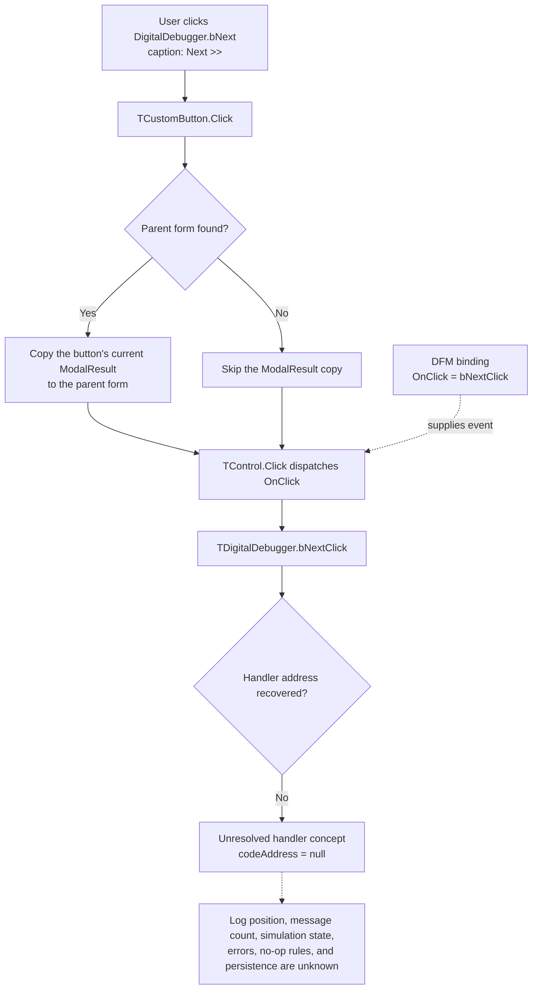

# Digital Debugger Next button

> Analysis status: The DFM control and standard VCL click dispatch are recovered. The custom `TDigitalDebugger.bNextClick` address and behavior remain unresolved.

## Control

| Property | Recovered value |
| --- | --- |
| Form | DigitalDebugger |
| Form class | TDigitalDebugger |
| Form caption | Digital Debugger |
| Form visibility in the DFM | true |
| Component path | DigitalDebugger.bNext |
| Control class | TButton |
| Caption | Next >> |
| Position and size | Left 348, Top 353, Width 75, Height 25 |
| Tab order | 1 |
| Handler name | bNextClick |
| Handler address | Not recovered |
| Graph node | `resource:dfm:DigitalDebugger/DigitalDebugger.bNext` |
| Handler node | `concept:dfm-handler:TDigitalDebugger/bNextClick` |
| Graph layer | tina.exe |

## What happens when clicked

The recovered evidence proves only the VCL dispatch boundary:

1. The DFM creates `bNext` as a plain `TButton` and assigns `OnClick = bNextClick`.
2. When the button click reaches `TCustomButton.Click`, VCL looks for the parent form. If it finds the form, it copies the button's current modal-result field to the form. The DFM does not configure a `ModalResult` for `bNext`.
3. VCL then calls the common control click dispatcher. The DFM does not assign an `Action`, so the stored resource binding is the direct `OnClick` event.
4. The event name is `TDigitalDebugger.bNextClick`, but the recovered resource has `codeAddress = null`. The graph therefore ends at an unresolved-handler concept.

No address-backed source proves that this click selects another log item, removes a message, continues a simulation, waits for an event, or updates the count label. The word **Next** is only the stored button caption.

## Click evidence flow

## Form and related-control evidence

The recovered form has six components:

- `lCnt`, a bold label with stored caption `0`;
- `Label1`, a bold label with stored caption `Message count: `;
- `lbLog`, a `TListBox` aligned to the top of the form;
- `bNext`, this button;
- `bStop`, a second button with caption `Stop` and `OnClick = bStopClick`;
- the `TDigitalDebugger` form itself, with `OnCreate = FormCreate`.

All three custom methods, `FormCreate`, `bNextClick`, and `bStopClick`, have null code addresses in the recovered DFM evidence. The list box and count labels give a message-log context. They do not prove which control or model state `bNextClick` reads or changes. The sibling `bStop` handler is also unresolved, so it cannot establish the behavior of this button.

The DFM supplies no hint, text property, action, image reference, embedded glyph, default state, cancel state, checked state, or explicit modal result for `bNext`.

## Address-recovery evidence

### Graph neighborhood

The graph contains one `triggers` edge from `DigitalDebugger.bNext` to `concept:dfm-handler:TDigitalDebugger/bNextClick`. The concept has no function node, source path, address, incoming function-call edge, or outgoing call edge. The form has DFM `contains` edges, but no address-backed constructor, show call, or downstream consumer is linked to this handler.

### DFM, RTTI, and VMT

[Recovered DFM evidence](../../../DecompiledSources/Tina16/resources/dfm/ui-evidence.json) was produced from the rebuilt executable with the checked-in [UI evidence extractor](../../../analysis/undelphi/TiaraUiEvidence.rs). The extractor first uses the event binding address. If that address is absent, it tries to resolve the named method through the owning form class and its published method table.

The extractor parsed 4,596 classes, but its class set has no `TDigitalDebugger`. A read-only byte search found exactly one ASCII `TDigitalDebugger` instance and one exact `bNextClick` instance in each available runtime artifact:

- `tina-runtime-rebuilt.exe`;
- `tina-runtime-image.bin`;
- the complete `tina-runtime.dmp` process capture.

In each artifact, both instances are in the same `TPF0` form stream. No UTF-16 instance and no second ASCII instance exists for a class VMT name or a published-method-table entry. The recovered VMT set therefore cannot map `bNextClick` to code.

### Decompiled sources, imports, and callers

The [function index](../../../DecompiledSources/Tina16/functions/function-index.csv) records 89,226 decompiled functions. A case-insensitive search of that index and all function sources found no `TDigitalDebugger`, `DigitalDebugger`, `bNextClick`, `lCnt`, or `lbLog` reference. Numeric field-offset code cannot be excluded by a text search, but the missing class VMT gives no safe way to bind such code to this form.

The executable imports digital-debug routines such as `VHDL_DLL2.DLL::_Dbg_TraceInto`, `_Dbg_Stop`, and `_get_next_event_time`. Their recovered callers lead to other address-backed functions and controls, including the separate `HDLDebugger` form. No call path reaches the unresolved `TDigitalDebugger.bNextClick` concept. Similar words such as **next**, **step**, and **stop** are not enough to transfer those behaviors to this control.

## Recovered VCL path

- [`FUN_00687f30`](../../../DecompiledSources/Tina16/functions/0000000000687F30__FUN_00687f30.c) is the recovered `Vcl.StdCtrls.TCustomButton.Click` path. It finds the parent form, copies the button modal result when a form exists, and then calls the common click dispatcher.
- [`FUN_00650840`](../../../DecompiledSources/Tina16/functions/0000000000650840__FUN_00650840.c) is the recovered `Vcl.Controls.TControl.Click` path. It invokes the stored event with the control as `Sender`, or uses an action-link path when one applies.

These shared VCL functions establish how the event is dispatched. They do not establish the application-specific handler body.

## Inputs, outputs, and limits

| Question | Proven result |
| --- | --- |
| Immediate input | A click on `DigitalDebugger.bNext`; the event dispatcher passes the button as `Sender`. |
| Built-in form effect | VCL copies the button's current modal-result field when it finds a parent form. The resource does not configure a value for this button. |
| Log selection or list change | Unknown. No list-box getter, setter, item operation, or selection guard is tied to the event. |
| Message-count change | Unknown. The labels exist, but no recovered handler write is tied to them. |
| Simulation or debugger effect | Unknown. No step, continue, next-event, pause, or stop call is tied to this event. |
| Repeated-click or empty-log behavior | Unknown. No guard, no-op branch, or bounds check is recovered. |
| Error behavior | Unknown. No exception path, message, or recovery action is linked to the event. |
| Close behavior | Unknown beyond the shared VCL modal-result copy. The resource assigns no explicit modal result to `bNext`. |
| Persistence | Unknown. No settings, document, file, registry, or database operation is linked to the event. |

## Analysis limits

- The caption `Next >>` and the nearby message controls are context only. They do not prove a next-message operation.
- The similarly named handlers and imported debugger APIs belong to other recovered call paths. They are not substitutes for this missing handler.
- No function annotation fragment is added because no application function address has a proven `TDigitalDebugger` responsibility.
- Further analysis needs the binary module that owns the `TDigitalDebugger` VMT, a symbol or map file, or a runtime capture that contains the class RTTI and published method table.
