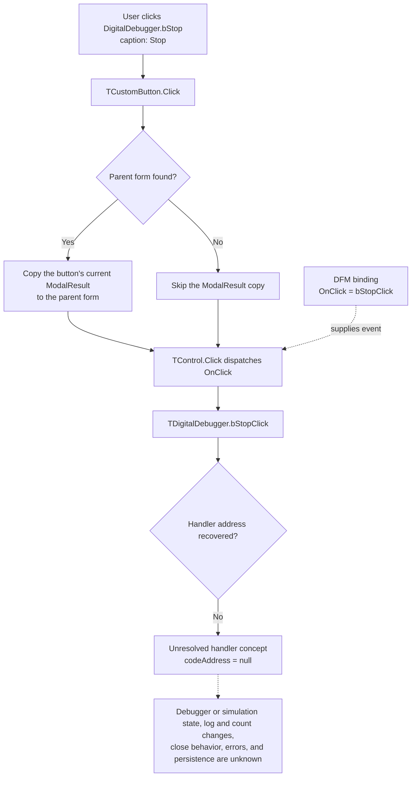

# Digital Debugger Stop button

> Analysis status: The DFM control and standard VCL click dispatch are recovered. The custom `TDigitalDebugger.bStopClick` address and behavior remain unresolved.

## Control

| Property | Recovered value |
| --- | --- |
| Form | DigitalDebugger |
| Form class | TDigitalDebugger |
| Form caption | Digital Debugger |
| Form visibility in the DFM | true |
| Component path | DigitalDebugger.bStop |
| Control class | TButton |
| Caption | Stop |
| Position and size | Left 264, Top 353, Width 75, Height 25 |
| Tab order | 2 |
| Handler name | bStopClick |
| Handler address | Not recovered |
| Graph node | `resource:dfm:DigitalDebugger/DigitalDebugger.bStop` |
| Handler node | `concept:dfm-handler:TDigitalDebugger/bStopClick` |
| Graph layer | tina.exe |

## What happens when clicked

The recovered evidence proves only the VCL dispatch boundary:

1. The DFM creates `bStop` as a plain `TButton` and assigns `OnClick = bStopClick`.
2. When the click reaches `TCustomButton.Click`, VCL looks for the parent form. If it finds the form, it copies the button's current modal-result field to the form. The DFM does not configure a `ModalResult` for `bStop`.
3. VCL then calls the common control click dispatcher. The DFM does not assign an `Action`, so the stored resource binding is the direct `OnClick` event.
4. The event name is `TDigitalDebugger.bStopClick`, but the recovered resource has `codeAddress = null`. The graph therefore ends at an unresolved-handler concept.

No address-backed source proves that this click stops a debugger, stops a simulation, pauses message delivery, clears the log, hides the form, or changes the message count. The word **Stop** is only the stored button caption.

## Click evidence flow

## Form and related-control evidence

The recovered form has six components:

- `lCnt`, a bold label with stored caption `0`;
- `Label1`, a bold label with stored caption `Message count: `;
- `lbLog`, a `TListBox` aligned to the top of the form;
- `bNext`, a button with caption `Next >>` and `OnClick = bNextClick`;
- `bStop`, this button;
- the `TDigitalDebugger` form itself, with `OnCreate = FormCreate`.

All three custom methods, `FormCreate`, `bNextClick`, and `bStopClick`, have null code addresses in the recovered DFM evidence. The list box, count labels, and sibling button establish a message-log and navigation context. They do not prove which operation the Stop click performs or which state it changes.

The DFM supplies no hint, text property, action, image reference, embedded glyph, default state, cancel state, checked state, or explicit modal result for `bStop`.

## Address-recovery evidence

### Graph neighborhood

The graph contains one `triggers` edge from `DigitalDebugger.bStop` to `concept:dfm-handler:TDigitalDebugger/bStopClick`. The concept has no function node, source path, address, incoming function-call edge, or outgoing call edge. The form has DFM `contains` edges, but no address-backed constructor, show call, or downstream consumer is linked to this handler.

### DFM, RTTI, and VMT

[Recovered DFM evidence](../../../DecompiledSources/Tina16/resources/dfm/ui-evidence.json) was produced from the rebuilt executable with the checked-in [UI evidence extractor](../../../analysis/undelphi/TiaraUiEvidence.rs). The extractor first uses the event binding address. If that address is absent, it tries to resolve the named method through the owning form class and its published method table.

A focused read-only run of the patched `undelphi` parser found 4,596 Delphi classes. It found nearby application form classes such as `TDigitalSignalGeneratorWin` and `TDFWindow`, but it found no `TDigitalDebugger` class. It still parsed the `DigitalDebugger` form stream, which confirms that form-resource extraction and VMT extraction are independent.

The rebuilt runtime executable and mapped runtime image each contain one exact `TDigitalDebugger` identifier and one exact `bStopClick` identifier. Both are inside the same `TPF0` form stream. The complete process dump contains that stream and other unrelated `bStopClick` strings, including a published method for another form, but it contains no second exact `TDigitalDebugger` identifier that can identify this class VMT. Thus, the recovered artifacts do not contain a class-and-method-table pair that maps this event name to code.

### Decompiled sources, imports, and callers

The [function index](../../../DecompiledSources/Tina16/functions/function-index.csv) records 89,226 decompiled functions. A case-insensitive search of that index and all function sources found no `TDigitalDebugger`, `DigitalDebugger`, or exact `bStopClick` reference. Numeric field-offset code cannot be excluded by a text search, but the missing class VMT gives no safe way to bind such code to this form.

The executable has a separate, resolved `HDLDebugger` form. Its stop control binds to [`FUN_0109f2a0`](../../../DecompiledSources/Tina16/functions/000000000109F2A0__FUN_0109f2a0.c), which calls [`FUN_00f7d120`](../../../DecompiledSources/Tina16/functions/0000000000F7D120__FUN_00f7d120.c) and then the `VHDL_DLL2.DLL::_Dbg_Stop` import. The graph links that path only to `HDLDebugger.pnToolbar.sbStop`; no edge connects it to the unresolved `TDigitalDebugger.bStopClick` concept. A similar caption and handler suffix are not enough to transfer that behavior to this control.

## Recovered VCL path

- [`FUN_00687f30`](../../../DecompiledSources/Tina16/functions/0000000000687F30__FUN_00687f30.c) is the recovered `Vcl.StdCtrls.TCustomButton.Click` path. It finds the parent form, copies the button modal result when a form exists, and then calls the common click dispatcher.
- [`FUN_00650840`](../../../DecompiledSources/Tina16/functions/0000000000650840__FUN_00650840.c) is the recovered `Vcl.Controls.TControl.Click` path. It invokes the stored event with the control as `Sender`, or uses an action-link path when one applies.

These shared VCL functions establish how the event is dispatched. They do not establish the application-specific handler body.

## Inputs, outputs, and limits

| Question | Proven result |
| --- | --- |
| Immediate input | A click on `DigitalDebugger.bStop`; the event dispatcher passes the button as `Sender`. |
| Built-in form effect | VCL copies the button's current modal-result field when it finds a parent form. The resource does not configure a value for this button. |
| Debugger or simulation effect | Unknown. No stop, pause, terminate, or state-flag operation is tied to this event. |
| Log or message-count change | Unknown. The list and labels exist, but no recovered handler read or write is tied to them. |
| Next-button interaction | Unknown. The sibling button exists, but no enable, disable, hand-off, or reset logic is recovered. |
| Repeated-click or inactive-state behavior | Unknown. No guard or no-op branch is recovered. |
| Error behavior | Unknown. No exception path, message, or recovery action is linked to the event. |
| Close behavior | Unknown beyond the shared VCL modal-result copy. The resource assigns no explicit modal result to `bStop`. |
| Persistence | Unknown. No settings, document, file, registry, or database operation is linked to the event. |

## Analysis limits

- The caption `Stop` and the message-log controls are context only. They do not prove a stop operation.
- The resolved stop actions on other debugger forms belong to different form classes and address-backed call paths. They are not substitutes for this missing handler.
- No function annotation fragment is added because no application function address has a proven `TDigitalDebugger` responsibility.
- Further analysis needs the binary module that owns the `TDigitalDebugger` VMT, a symbol or map file, or a runtime capture that contains the class RTTI and published method table.
