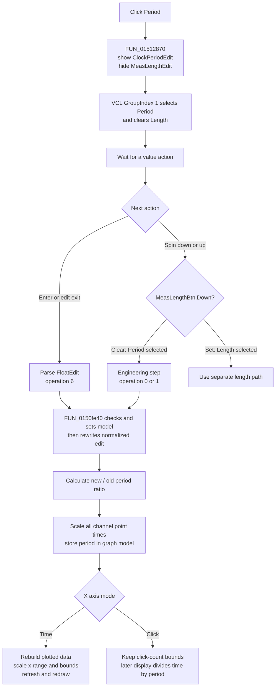

# Select the clock-period editor

> Analysis status: Reviewed from the recovered control resources, click handler, edit and spin handlers, timing model, graph-update path, and Digital Signal Generator file reader and writer.

## Control

| Property | Recovered value |
| --- | --- |
| Form | DigitalSignalGeneratorWin |
| Component path | DigitalSignalGeneratorWin.ClockGroupBox.ClockPeriodBtn |
| Control class | TSpeedButton |
| Caption | Period |
| Group index | 1, shared with `MeasLengthBtn` |
| Handler name | ClockPeriodBtnClick |
| Handler address | 01512870 |
| Graph node | `resource:dfm:DigitalSignalGeneratorWin/DigitalSignalGeneratorWin.ClockGroupBox.ClockPeriodBtn` |
| Handler node | `function:01512870` |
| Graph layer | UI |

## What happens when clicked

The **Period** button selects which clock value the shared edit area and spin button control. The click handler [`FUN_01512870`](../../../DecompiledSources/Tina16/functions/0000000001512870__FUN_01512870.c) makes `ClockPeriodEdit` visible and makes `MeasLengthEdit` invisible. Its sibling **Length** handler makes the opposite change.

The two buttons are `TSpeedButton` controls with the same `GroupIndex = 1`. Thus, the VCL keeps their pressed states exclusive. This state also controls the shared spin button. Its up and down handlers inspect `MeasLengthBtn.Down`: a clear state routes the action to the period-update coordinator, and a set state routes it to the measurement-length coordinator.

The click does not read, parse, validate, or change the period. It only selects the period controls. A later Enter key, edit exit, or spin action changes the value.

## Period edit and spin behavior

`ClockPeriodEdit` is a `TFloatEdit`. Its recovered resource text is `1m`, and the common float parser recognizes engineering suffixes. The edit handlers use the period path as follows:

- Enter consumes the key and calls [`FUN_0150fe40`](../../../DecompiledSources/Tina16/functions/000000000150FE40__FUN_0150fe40.c) with operation 6.
- Leaving the edit synthesizes the same Enter operation.
- The spin-down and spin-up handlers call the coordinator with operation 0 or 1 when **Length** is not selected.
- The edit error handler reads the current period from the timing model and restores that value in the edit. Invalid text therefore does not become the displayed model value.

For operation 6, `FUN_0150fe40` parses the edit as a floating-point value, sends it through the timing model's check operation, applies the checked value, reads the model value back, and rewrites the edit. This last step shows a normalized value, including any correction made by a hardware-backed model. The software model stores the period as a `double`; it initializes that field to `0.01`.

The spin operations do not add a fixed amount. The software timing model moves the value through an engineering-number sequence. The recovered step routine limits its period input to the range from `1e-13` through `1e7` before it selects the adjacent engineering step. In hardware mode, the model also uses dynamically resolved `CheckDSGClockPeriod`, `GetDSGClockPeriod`, and `SetDSGClockPeriod` functions. The exact hardware limits are not present in the recovered application source.

## Timing and display propagation

After a period change, `FUN_0150fe40` calculates `new period / old period` and passes that scale factor through the shared numeric-rounding helper with precision 2. It then:

1. stores the normalized period in the graph model;
2. applies the scale factor to the time value of every point in every digital-signal channel;
3. rewrites `ClockPeriodEdit` with the normalized model value.

The x-axis mode controls the remaining display work:

- In **Time** mode, the coordinator rebuilds the plotted channel data, scales the graph's x-axis range, multiplies the stored lower and upper x bounds by the same ratio, refreshes the selected x-limit editor, refreshes the channel display, and requests a graph redraw.
- In **Click** mode, plotted x coordinates are clock counts. The separate display builder divides each stored time by the current period and rounds it to a click index. Therefore, the period coordinator scales the stored channel times but does not scale the click-axis bounds or run the Time-mode redraw branch.

The model uses the period directly as time per clock step. Total Time-mode extent is `measurement length * period`. No separate unit conversion is present in this path. The recovered UI does not supply a unit label, so the source does not prove the human-readable base unit.

## Selection and update flow

## Persistence and load behavior

The button and period-update coordinator do not write a file or application setting. They change the live timing model, channel data, and graph state.

The Digital Signal Generator writer [`FUN_01510cb0`](../../../DecompiledSources/Tina16/functions/0000000001510CB0__FUN_01510cb0.c) persists the current model value only when a `.dsg` file is saved. It writes a `.# Period` marker followed by the period value. The loader [`FUN_01511720`](../../../DecompiledSources/Tina16/functions/0000000001511720__FUN_01511720.c) reads this field and applies it with the loaded measurement length after parsing. Thus, a changed period can survive only through a later save operation; selecting **Period** alone has no persistence effect.

## Validation, no-op, and error boundaries

- Clicking an already selected **Period** button requests the same visible states. The recovered visibility setter exits when the state is unchanged, so the handler produces no additional layout notification.
- The click handler has no local error handling or rollback. If one visibility operation fails after the other succeeds, the handler has no transaction that restores the prior state.
- Typed input first passes through the common floating-point parser. That parser rejects conversion failures and values outside `-1e50` through `1e50`; it can also call a control-specific validator. The timing model then checks and normalizes the period before storage.
- The software spin path has the recovered engineering-step bounds stated above. A hardware timing model can apply additional limits through `CheckDSGClockPeriod`; those limits are external to this source set.
- The period-update coordinator calculates a ratio from the old value and has no explicit zero guard, exception handler, or rollback. The normal software step path keeps the period positive, but the application source does not prove every hardware failure or invalid programmatic-input case.
- Model and channel changes occur before the Time-mode graph rebuild and redraw calls. A later failure can leave earlier period or channel-time changes applied.
- Hiding or showing the editors does not itself commit pending text. Any edit-exit event that the VCL dispatches is a separate event and enters the period-update path described above.

## Evidence

- Click handler: [FUN_01512870](../../../DecompiledSources/Tina16/functions/0000000001512870__FUN_01512870.c)
- Period update coordinator: [FUN_0150fe40](../../../DecompiledSources/Tina16/functions/000000000150FE40__FUN_0150fe40.c)
- Shared spin-down route: [FUN_01510020](../../../DecompiledSources/Tina16/functions/0000000001510020__FUN_01510020.c)
- Shared spin-up route: [FUN_01510050](../../../DecompiledSources/Tina16/functions/0000000001510050__FUN_01510050.c)
- Period Enter handler: [FUN_01510090](../../../DecompiledSources/Tina16/functions/0000000001510090__FUN_01510090.c)
- Period edit-exit handler: [FUN_015100b0](../../../DecompiledSources/Tina16/functions/00000000015100B0__FUN_015100b0.c)
- Period edit-error handler: [FUN_015100e0](../../../DecompiledSources/Tina16/functions/00000000015100E0__FUN_015100e0.c)
- Channel-time scaler: [FUN_015130b0](../../../DecompiledSources/Tina16/functions/00000000015130B0__FUN_015130b0.c)
- Time/click display builder: [FUN_01513140](../../../DecompiledSources/Tina16/functions/0000000001513140__FUN_01513140.c)
- Recovered resources: [ui-evidence.json](../../../DecompiledSources/Tina16/resources/dfm/ui-evidence.json)

The DFM proves the button caption, handler binding, shared speed-button group, edit class and seed text, and the shared spin-button events. It supplies no hint, action, image-list reference, or glyph for `ClockPeriodBtn`. The nearby `X :` label belongs to the x-axis mode row and does not describe the Period button.

## Analysis limits

- Recovered field offsets establish the connections between the button, editors, timing model, graph, and channels, but most original Delphi field names are not available.
- The application source proves a floating-point time-per-clock value and the Time/Click conversions. It does not identify the displayed base unit.
- The direct click selects the period editor. It does not start generation, change clock source, change stepping mode, or change trigger settings; those controls use separate handlers.
