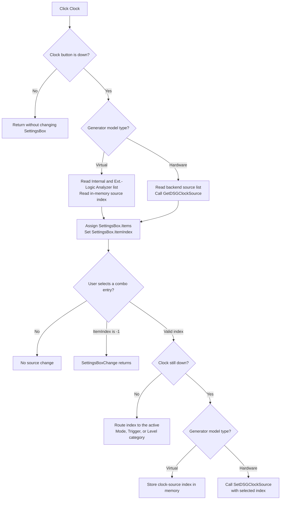

# Select the clock-source setting

> Analysis status: Complete. The recovered handler, grouped speed-button resources, shared Settings combo handler, virtual generator defaults, hardware source adapters, and run path establish the selection and propagation boundaries.

## Control

| Property | Recovered value |
| --- | --- |
| Form | DigitalSignalGeneratorWin (`Digital Signal Generator`) |
| Component path | DigitalSignalGeneratorWin.ClockGroupBox.ClockSourceBtn |
| Control class | TSpeedButton |
| Caption | Clock |
| GroupIndex | 3 |
| Handler name | ClockSourceBtnClick |
| Handler address | 01511ff0 |
| Graph node | `resource:dfm:DigitalSignalGeneratorWin/DigitalSignalGeneratorWin.ClockGroupBox.ClockSourceBtn` |
| Handler node | `function:01511ff0` |
| Graph layer | UI |

The button has no hint, image, or embedded glyph. Its caption identifies the setting category. The source code establishes what that category controls.

## What the click selects

Clock is not a two-state Internal/External button. It selects **clock source** as the property shown by the shared `SettingsBox` combo box.

Clock, Trigger, Mode, and Level are `TSpeedButton` controls with `GroupIndex = 3`. VCL group behavior makes them mutually exclusive. The click handler also checks Clock's `Down` byte at control offset `+0x328`. If Clock is not down, the handler returns without changing the combo box.

When Clock is down, `FUN_01511ff0`:

1. Gets the generator model's clock-source string list through virtual slot `+0xA0`.
2. Assigns that list to `SettingsBox.Items`.
3. Gets the model's current clock-source index through virtual slot `+0xA8`.
4. Sets `SettingsBox.ItemIndex` to that index.

The handler does not change the clock source itself. It displays the available sources and current selection. Clicking Clock again while it remains down refreshes both values from the model or hardware adapter.

## Internal and external source mapping

The form can construct two generator-model variants. Their clock-source interfaces share the same virtual slots, but their data sources differ.

| Generator model | Clock-source choices | Current value and update |
| --- | --- | --- |
| Virtual generator | `FUN_01503530` creates `Internal` at index 0 and `Ext.-Logic Analyzer` at index 1. It initializes the clock-source index to 0. | The getter and setter read and write the model's in-memory index. |
| Hardware-backed generator | `FUN_01503c70` fills the clock-source list from the dynamically resolved `GetDSGClockSources` export. The backend controls the text, order, and number of choices. | `FUN_01503f70` reads `GetDSGClockSource`. `FUN_01503f90` sends the chosen index to `SetDSGClockSource`. |

Only the virtual model proves a fixed index mapping. The hardware adapter passes indices through unchanged, so this article does not assume that every backend uses the same two entries or order.

## Changing the displayed source

`FUN_01510170`, `SettingsBoxChange`, reads `SettingsBox.ItemIndex`. It returns immediately when the index is `-1`. Otherwise, it tests which GroupIndex-3 category button is down and sends the selected index to that category's model setter.

When Clock is down, the dispatcher calls model slot `+0xB0`:

- The virtual implementation stores the index in the generator model.
- The hardware implementation calls `FUN_01503f90`, which forwards it to the dynamic `SetDSGClockSource` export.

There is no Apply or OK step. A hardware-backed selection is sent when the combo box changes. The Clock button click only loads the choices and current value.

## Other controls and generator operation

The click does not enable, disable, show, or hide a control. It replaces only `SettingsBox.Items` and `SettingsBox.ItemIndex`. In particular, it does not change the Period/Length editor selection or start and stop controls.

The Start handler later enters the generator run path with the model's current configuration. The hardware-backed clock-source setter has already sent the source index before Start. The Clock button itself does not start, stop, reset, or reconfigure the data pattern.

## Selection and update flow

## Evidence

- [Clock category handler `FUN_01511ff0`](../../../DecompiledSources/Tina16/functions/0000000001511FF0__FUN_01511ff0.c) checks the Clock speed button's Down state, assigns the model's virtual `+0xA0` list to the Settings combo, and sets the combo index from virtual `+0xA8`.
- [Shared Settings dispatcher `FUN_01510170`](../../../DecompiledSources/Tina16/functions/0000000001510170__FUN_01510170.c) ignores index `-1` and routes a valid combo index according to the Down states of Mode, Clock, Trigger, and Level. This article owns its canonical annotation; the sibling category articles cite it.
- [Virtual generator defaults `FUN_01503530`](../../../DecompiledSources/Tina16/functions/0000000001503530__FUN_01503530.c) build the fixed clock list at model `+0x68` and initialize its clock-source index at `+0xA0` to 0.
- [Hardware clock list adapter `FUN_01503f60`](../../../DecompiledSources/Tina16/functions/0000000001503F60__FUN_01503f60.c) returns the model's clock-source list at `+0x68`.
- [Hardware clock getter `FUN_01503f70`](../../../DecompiledSources/Tina16/functions/0000000001503F70__FUN_01503f70.c) delegates the current-index query to the dynamic DSG adapter.
- [Hardware clock setter `FUN_01503f90`](../../../DecompiledSources/Tina16/functions/0000000001503F90__FUN_01503f90.c) delegates the selected index to the dynamic DSG adapter.
- [Hardware list initialization `FUN_01503c70`](../../../DecompiledSources/Tina16/functions/0000000001503C70__FUN_01503c70.c) calls the dynamic source-list query and appends each returned source string to model list `+0x68`.
- [Dynamic list wrapper `FUN_00e1c1b0`](../../../DecompiledSources/Tina16/functions/0000000000E1C1B0__FUN_00e1c1b0.c), [getter wrapper `FUN_00e1c2c0`](../../../DecompiledSources/Tina16/functions/0000000000E1C2C0__FUN_00e1c2c0.c), and [setter wrapper `FUN_00e1c240`](../../../DecompiledSources/Tina16/functions/0000000000E1C240__FUN_00e1c240.c) resolve `GetDSGClockSources`, `GetDSGClockSource`, and `SetDSGClockSource` from the loaded hardware library. They remain evidence-only shared adapters.
- [Start handler `FUN_01512200`](../../../DecompiledSources/Tina16/functions/0000000001512200__FUN_01512200.c) and [run coordinator `FUN_01512260`](../../../DecompiledSources/Tina16/functions/0000000001512260__FUN_01512260.c) show that generator execution is a separate command.
- [Generator file writer `FUN_01510cb0`](../../../DecompiledSources/Tina16/functions/0000000001510CB0__FUN_01510cb0.c) writes period, length, channel groups, and pattern data. It does not serialize the clock-source selection.

## Guards, persistence, and failures

- A false Clock Down state makes the click a no-op. This protects programmatic or re-entrant calls that do not correspond to the active category.
- A `SettingsBox.ItemIndex` of `-1` makes the shared change handler a no-op.
- The click contains no running-state, backend-availability, index-range, or exception guard. Normal VCL group and combo behavior supplies the expected state.
- If the hardware library or `GetDSGClockSources` export is absent, the list wrapper returns a zero-length result and the hardware clock list stays empty.
- The dynamic getter wrapper does not initialize its result when the library or `GetDSGClockSource` export is absent. The recovered code therefore provides no defined fallback index for that failure.
- If `SetDSGClockSource` cannot be resolved, the setter wrapper returns without updating hardware and without reporting an error. The combo can still show the selected index.
- No handler in this flow writes the source selection to an INI file or the Digital Signal Generator data file. The virtual selection exists in the model's lifetime. The hardware selection is read from and written to the backend.
- The handlers contain no recovered application-level error message, rollback, or exception catch. An unexpected VCL, model, or backend exception can stop the flow after an earlier UI or hardware change.

## Analysis limits

- The names of the hardware exports are present in the recovered dynamic-resolution wrappers. The hardware library's implementation and persistence policy are outside the recovered executable.
- The source does not prove that every backend uses `Internal` at index 0. That mapping is documented only for the virtual generator's fixed list.
- The `SettingsBoxChange` code uses four independent Down-state tests. VCL GroupIndex behavior normally keeps one category down; if external code violates that invariant, one combo change can call more than one model setter.
