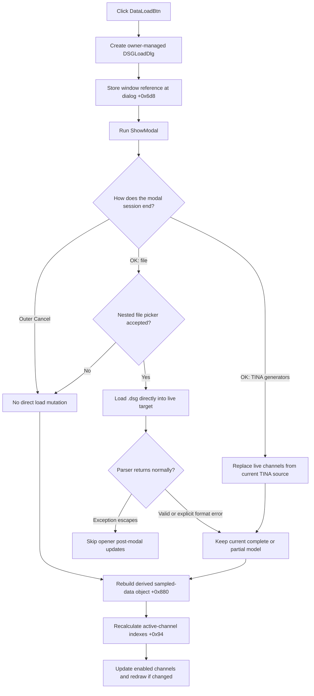

# Open the Digital Signal Generator data-load dialog

## Control

| Property | Recovered value |
| --- | --- |
| Form | DigitalSignalGeneratorWin |
| Component path | DigitalSignalGeneratorWin.DataGroupBox.DataLoadBtn |
| Control class | TSpeedButton |
| Explicit caption | Not present in the recovered resource. |
| Explicit hint | Not present in the recovered resource. |
| Handler name | DataLoadBtnClick |
| Handler address | 01511fa0 |
| Graph node | `resource:dfm:DigitalSignalGeneratorWin/DigitalSignalGeneratorWin.DataGroupBox.DataLoadBtn` |
| Handler node | `function:01511fa0` |
| Graph layer | UI |

The button has a 32-by-16 bitmap strip with `NumGlyphs = 2`. Its two folder-like frames support a load action, but the handler and dialog call path establish the exact behavior.

## What happens when clicked

`FUN_01511fa0` creates one `TDSGLoadDlg` instance and passes the current `DigitalSignalGeneratorWin` as its VCL component owner. It stores the same window reference in dialog field `+0x6d8`. The dialog uses that field as a borrowed target reference. The handler then calls the dialog's `ShowModal` virtual method.

The opener does not copy generator data into a private staging object. The dialog's OK handler changes the borrowed target directly before `ShowModal` returns. The opener also does not save the value returned by `ShowModal`. It therefore takes the same post-dialog path after OK, outer Cancel, and a canceled nested file picker.

## Operations inside `DSGLoadDlg`

The dialog offers two source choices. The sibling [OK control analysis](../dsgloaddlg/okbtn-845a682a61.md) owns their canonical handler and loader annotations.

### Load from file

Choice index `0` opens a file picker with `Digital data (*.dsg)|*.dsg`. When the picker is accepted, the dialog lowercases and converts the path, stores at most 80 encoded bytes in target field `+0xee8`, and runs the `.dsg` parser for a nonempty stored path.

The parser changes the live target. It clears mapped channel sample collections before it validates and fills their replacement values. Explicit marker or numeric errors show a localized message and stop parsing without rollback. The final apply path still updates the recovered timing and display state. Thus, a normal return after a format error can keep completed earlier channels and a cleared or partly filled current channel.

Canceling only the nested file picker does not write the path or channel samples. The outer OK action can still close `DSGLoadDlg`, after which this opener runs its unconditional refresh.

### Load from TINA generators

Choice index `1` clears the destination channel collection and copies channels from the current TINA generator source. It then synchronizes selection, timing, range controls, plot state, active-channel indexes, and channel attachment state. This is an immediate replacement of the live target, not a staged result.

### Outer Cancel

The sibling [Cancel control analysis](../dsgloaddlg/cancelbtn-2494935e04.md) owns the canonical cancel-handler annotation. Outer Cancel closes the modal dialog with `mrCancel` and does not enter either load branch. The opener still ignores that result and performs all three post-modal updates from the data that was already in the target.

## Unconditional post-modal updates

After every normal `ShowModal` return, `FUN_01511fa0` executes these calls in order:

1. `FUN_01513140` releases the old derived sampled-data object at window offset `+0x880`, creates a replacement, and rebuilds its per-channel series from the current channel collection. In sample-index mode, it converts recovered time values to period-relative positions; in time mode, it keeps the time values. It also adds the recovered terminal state at the source period multiplied by length boundary.
2. `FUN_01506c70` recalculates field `+0x94` for every channel as the count of prior enabled channels. The [Channel On analysis](fchannelonbtn-9eaa4588a8.md) owns this shared helper's canonical annotation.
3. `FUN_010f6920` visits enabled channels through the window's activation or update virtual method. It requests a plot redraw only when those calls report a change.

These calls rebuild derived state. They are not proof that the user accepted a new data source. The Data Save opener `FUN_01511f60` creates and shows its modal dialog but has no corresponding post-modal calls. The unconditional rebuild is therefore specific to Data Load.

## Modal result, ownership, and persistence

- The handler has no modal-result comparison and no accepted-result copy-back.
- `TDSGLoadDlg` holds only a borrowed reference to the caller. The Digital Signal Generator window remains the owner of the live channel, timing, and display objects.
- The handler creates the dialog with the Digital Signal Generator window as its VCL component owner. It does not explicitly destroy the dialog after `ShowModal`. Owner-managed VCL cleanup is outside this click path.
- Each click constructs a new dialog instead of looking up or reusing an earlier one.
- The opener and its post-modal calls do not write settings, a project file, or a dirty flag. The file branch reads a `.dsg` file into the current model. The TINA branch copies the current generator model. Longer persistence is outside this handler.

## Guards, repeated clicks, and errors

- The opener has no selection, running-state, current-source, or nonempty-data guard. It always attempts to create and show the dialog.
- A normal outer Cancel and a nested file-picker cancel still cause the derived-data rebuild, reindex, and enabled-channel update traversal.
- Repeated clicks create another modal dialog and repeat the same post-modal updates after each normal return.
- The opener has no local exception handler or `finally` block. If construction, modal display, file loading, or TINA-source loading raises, the later post-modal calls are not proven to run.
- The file parser's explicit format-error paths return normally after partial target mutations, so the opener then rebuilds derived state from that partial model.
- If a post-modal call raises, earlier calls in the ordered sequence are not rolled back. For example, the old sampled-data object can already have been replaced before reindexing or channel propagation fails.

## Click flow

## Evidence

- [Data Load handler `FUN_01511fa0`](../../../DecompiledSources/Tina16/functions/0000000001511FA0__FUN_01511fa0.c) creates the dialog, writes the borrowed target, calls `ShowModal`, ignores its result, and executes the three post-modal calls.
- [Common form constructor `FUN_007fc180`](../../../DecompiledSources/Tina16/functions/00000000007FC180__FUN_007fc180.c) receives the Digital Signal Generator window as the new dialog's component owner.
- [`FUN_01513140`](../../../DecompiledSources/Tina16/functions/0000000001513140__FUN_01513140.c) replaces and fills the derived sampled-data object from the current channels.
- [`FUN_01506c70`](../../../DecompiledSources/Tina16/functions/0000000001506C70__FUN_01506c70.c) rebuilds compact active-channel indexes.
- [`FUN_010f6920`](../../../DecompiledSources/Tina16/functions/00000000010F6920__FUN_010f6920.c) updates enabled channels and requests a plot redraw when reported changes require it.
- [Dialog OK handler `FUN_0150a2c0`](../../../DecompiledSources/Tina16/functions/000000000150A2C0__FUN_0150a2c0.c) selects the file or current-generator branch and mutates the borrowed target directly.
- [File parser `FUN_01511720`](../../../DecompiledSources/Tina16/functions/0000000001511720__FUN_01511720.c) provides the partial-update and explicit format-error evidence.
- [Current-generator loader `FUN_015103c0`](../../../DecompiledSources/Tina16/functions/00000000015103C0__FUN_015103c0.c) replaces the live channel collection and synchronizes dependent state.
- [Data Save handler `FUN_01511f60`](../../../DecompiledSources/Tina16/functions/0000000001511F60__FUN_01511f60.c) proves that the three post-modal updates are not a common property of both data-dialog openers.
- [Extracted two-frame glyph](../../../glyph/0119_DigitalSignalGeneratorWin_DigitalSignalGeneratorWin_DataGroupBox_DataLoadBtn_Glyph_Data.png) provides supporting load-button image evidence only.

## Annotation ownership

This Bead owns only `FUN_01511fa0`. The OK and Cancel handlers and the two direct load functions remain owned by `TIARA-diz.6.7.383` and `TIARA-diz.6.7.382`. Shared constructor, sampled-data, reindex, propagation, and VCL helpers are evidence-only here.
