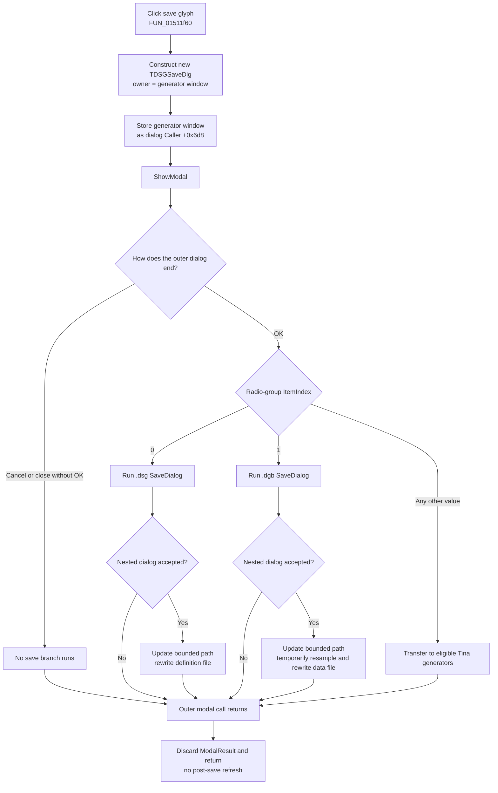

# Open the digital-signal generator save dialog

> Analysis status: Evidence-backed source review complete.

## Control

| Property | Recovered value |
| --- | --- |
| Form | DigitalSignalGeneratorWin |
| Component path | DigitalSignalGeneratorWin.DataGroupBox.DataSaveBtn |
| Control class | TSpeedButton |
| Caption | Not present in the recovered resource. |
| Hint | Not present in the recovered resource. |
| Handler name | DataSaveBtnClick |
| Handler address | 01511f60 |
| Graph node | `resource:dfm:DigitalSignalGeneratorWin/DigitalSignalGeneratorWin.DataGroupBox.DataSaveBtn` |
| Handler node | `function:01511f60` |
| Graph layer | UI |

The button has a 32 by 16 two-state bitmap glyph. Its two 16-pixel frames show a floppy-disk save symbol. This image supports the save intent, while the source establishes the exact behavior. The DFM disables the hint and supplies no caption.

## What happens when clicked

`TDigitalSignalGeneratorWin.DataSaveBtnClick` creates a new `TDSGSaveDlg`. It passes the Digital Signal Generator window as the Delphi component owner, stores the same window pointer in the dialog's recovered `Caller` field at `+0x6d8`, and invokes `ShowModal`.

The opener does not preset the radio selection, filter, or filename. Those controls belong to the new dialog. It also does not retain the returned dialog pointer in a Digital Signal Generator field.

When the modal call ends, the handler discards the modal result and returns. It does not copy staged data back, rebuild channels, refresh controls, or call a serializer itself. The actual operation occurs only if the dialog's OK handler runs.

## Save targets inside DSGSaveDlg

The modal dialog contains these recovered radio items:

| Item index | Resource text | Accepted OK behavior |
| --- | --- | --- |
| `0` | Save To file | Open a nested save dialog for `.dsg`, then write generator definitions if that dialog is accepted. |
| `1` | Save To binary file | Open a nested save dialog for `.dgb`, then write generated sample data if that dialog is accepted. |
| Any other value | Save To Tina generators | Transfer current data to eligible matching Tina generator objects without a file dialog. |

The third branch is the OK handler's `else` branch. It includes the expected index `2`, but it also includes `-1` or another unexpected value. Neither this opener nor the OK handler requires a valid selected index before that branch.

### `.dsg` definition file

The OK handler assigns filter `Digital data (*.dsg)|*.dsg` and seeds the nested save dialog with the leaf of the remembered target path at generator-window field `+0xee8`. If the user accepts, it ASCII-lowercases the selected full path, converts it to an ANSI ShortString capped at `0x50` bytes, stores it back at `+0xee8`, and calls the `.dsg` writer owned by Bead `.385`.

That writer rewrites the path and emits a structured text file. It includes the Digital Signal Generator header, current period and length, generator names and definition values, per-generator end markers, and the final end-of-file marker.

### `.dgb` sample-data file

The item `1` branch uses filter `Digital data (*.dgb)|*.dgb` and the same filename seed, lowercase conversion, bounded ShortString update, and target field `+0xee8`. The `.dgb` writer is also owned by `.385`.

Despite the resource text **binary file**, the recovered writer uses Delphi text-file output and emits text headers for period, length, data, and end of file. It temporarily requests `0x200` samples, adjusts the period to preserve the represented duration, generates and writes the sample array, and restores the original period and length on its normal completion path.

### Tina-generator transfer

For every item index other than `0` and `1`, the OK handler does not open the nested `TSaveDialog`. It sends the current Digital Signal Generator model at window field `+0xee0` to the `.385`-owned Tina-generator transfer path. The deeper routine updates only matching eligible generator objects and skips entries that fail its recovered object, type, or buffer checks. It returns no count or success result to this opener.

## Modal result, cancel, and refresh boundary

The outer OK button has built-in kind `bkOK`. VCL sets modal result `1` before its `OnClick` handler runs. A normal return therefore closes `DSGSaveDlg` as accepted. If the nested `.dsg` or `.dgb` save dialog is canceled, no path update or file write occurs, but the outer OK result remains set and the outer dialog still closes.

The outer Cancel button uses `bkCancel`. Its `.384`-owned handler closes the modal form with result `2` without reading the radio selection or running any save branch. Closing the form without activating OK also does not reach the OK handler's file or generator-transfer paths.

`DataSaveBtnClick` does not inspect any of these results. It performs no unconditional post-dialog refresh. The neighboring [`FUN_01511fa0`](../../../DecompiledSources/Tina16/functions/0000000001511FA0__FUN_01511fa0.c) is `DataLoadBtnClick`; that different handler opens `DSGLoadDlg` and runs channel rebuild, reindex, and active-channel refresh calls after its modal dialog returns. Those load effects do not belong to this save button.

## Click flow

## Ownership, overwrite, and failure behavior

- Every click constructs a new dialog instance. The constructor receives the Digital Signal Generator window as its Delphi component owner. The handler keeps only a local pointer and does not explicitly free the form after `ShowModal`; final component-lifetime cleanup remains with that owner.
- Canceling the outer dialog changes no remembered output path and starts no writer. Canceling the nested file dialog also starts no writer, although the outer dialog still closes with its already assigned OK result.
- The application code contains no explicit overwrite question. The recovered DFM does not store save-dialog options that prove an overwrite prompt. Once a path is accepted, each writer uses rewrite semantics, so an existing file can be truncated.
- The accepted file path is stored in `+0xee8` before the writer starts. A later write failure can leave the new lowercase, bounded path in memory.
- Both writers check Delphi I/O status after file assignment, rewrite, writes, and close. An error raises through the Delphi runtime after the file may already have been created, truncated, or partly written. There is no local catch, retry, temporary-file transaction, or rollback.
- The `.dgb` path restores the original period and length and releases the sample buffer only on the recovered normal path. It has no visible `finally`; an earlier exception can leave temporary model values or allocated data unrecovered.
- The Tina-generator branch has no transaction or rollback. It can skip ineligible entries after other eligible entries were already updated.
- Construction, `ShowModal`, conversion, writer, or transfer exceptions propagate out of `DataSaveBtnClick`. The handler has no local error message and no unconditional cleanup or refresh after such an exception.

## Recovered evidence

- [`FUN_01511f60`](../../../DecompiledSources/Tina16/functions/0000000001511F60__FUN_01511f60.c) is `TDigitalSignalGeneratorWin.DataSaveBtnClick`. It constructs class `PTR_FUN_015092c8`, stores the owner at dialog `+0x6d8`, calls virtual `ShowModal` slot `+0x2d0`, and returns without reading a result or making another call.
- [`FUN_007fc180`](../../../DecompiledSources/Tina16/functions/00000000007FC180__FUN_007fc180.c) is the shared Delphi form-construction path. The DataSave handler passes the Digital Signal Generator window as its owner argument.
- [`FUN_01509c50`](../../../DecompiledSources/Tina16/functions/0000000001509C50__FUN_01509c50.c) initializes the dialog's recovered `Caller` field during form creation. The opener then explicitly assigns the generator window to that field.
- [`FUN_01509840`](../../../DecompiledSources/Tina16/functions/0000000001509840__FUN_01509840.c) is the `.385`-owned OK handler. It reads the radio index, configures the `.dsg` or `.dgb` nested save dialog, updates the remembered path after acceptance, and dispatches the three save branches.
- [`FUN_01510cb0`](../../../DecompiledSources/Tina16/functions/0000000001510CB0__FUN_01510cb0.c), [`FUN_01511240`](../../../DecompiledSources/Tina16/functions/0000000001511240__FUN_01511240.c), and [`FUN_015103a0`](../../../DecompiledSources/Tina16/functions/00000000015103A0__FUN_015103a0.c) are the `.385`-owned `.dsg`, `.dgb`, and Tina-generator paths.
- [`FUN_01509c40`](../../../DecompiledSources/Tina16/functions/0000000001509C40__FUN_01509c40.c) and its shared close routine provide the `.384`-owned outer Cancel behavior.
- [`ui-evidence.json`](../../../DecompiledSources/Tina16/resources/dfm/ui-evidence.json) identifies `TDSGSaveDlg`, its three radio items, built-in OK and Cancel button kinds, nested `TSaveDialog`, and the save-button event and glyph metadata.
- [`0120_DigitalSignalGeneratorWin_DigitalSignalGeneratorWin_DataGroupBox_DataSaveBtn_Glyph_Data.png`](../../../glyph/0120_DigitalSignalGeneratorWin_DigitalSignalGeneratorWin_DataGroupBox_DataSaveBtn_Glyph_Data.png) is the extracted two-state floppy-disk glyph.

## Analysis limits

The original Delphi field names are not recovered. RTTI, the streamed form, and data flow establish the dialog, owner, caller, and target-field roles. The source does not prove the operating system's overwrite-prompt behavior or when the owner finally destroys accumulated dialog instances. Beads `.384` and `.385` own the Cancel handler, OK handler, file writers, and Tina-generator dispatcher; this article cites but does not annotate them.
