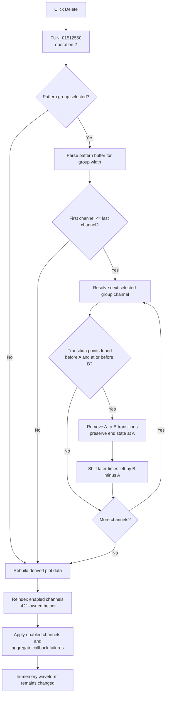

# Delete the Cursor A-to-B interval from a pattern group

> Analysis status: Evidence-backed source review complete.

## Control

| Property | Recovered value |
| --- | --- |
| Form | DigitalSignalGeneratorWin |
| Form caption | Digital Signal Generator |
| Parent caption | From Cursor A to B |
| Component path | DigitalSignalGeneratorWin.DataGroupBox.DataSetGroupBox.DeleteSpBtn |
| Control class | TSpeedButton |
| Caption | Delete |
| Handler name | DeleteSpBtnClick |
| Handler address | 01512550 |
| Graph node | `resource:dfm:DigitalSignalGeneratorWin/DigitalSignalGeneratorWin.DataGroupBox.DataSetGroupBox.DeleteSpBtn` |
| Handler node | `function:01512550` |
| Graph layer | UI |

## What happens when clicked

`FUN_01512550` passes delete opcode `2` to the shared data-set editor, then reindexes enabled channels and runs the common enabled-channel apply pass. There is no confirmation dialog.

The delete target comes from two independent selections:

- The `FPatternGroupBox` selection supplies a pattern-group object. Its fields `+0x3C` and `+0x40` are the first and last channel indexes. The dispatcher visits this inclusive channel range.
- The form-owned data-set state at `+0xED8` stores the Cursor A-to-B time interval at `+0x10` and `+0x18`. Cursor movement handlers refresh these values from the graph cursors.

For each selected channel, `FUN_01512f00` resolves that channel's transition list at channel offset `+0x148` and calls `FUN_01d3b080` with the same start and end times. This is an immediate mutation of the Digital Signal Generator's in-memory waveform data. It does not remove a channel, group, combo-box row, or separate data-set object.

## Exact interval deletion

`FUN_01d3b080` treats a digital waveform as ordered transition points with a time at point offset `+0x08` and a logic-state byte at `+0x10`. It:

1. searches backward for the last point strictly before Cursor A;
2. searches backward for the last point at or before Cursor B;
3. returns without a mutation unless both boundary points exist;
4. preserves the state that applies after the removed interval: if the states at the two boundaries differ, it moves the Cursor B boundary transition to Cursor A; if they are equal, it removes the redundant boundary transition;
5. removes the transition points inside the selected interval; and
6. subtracts `Cursor B - Cursor A` from every later transition time.

The operation therefore closes the selected time gap. It does not change the backend clock period or measurement-length count. The derived terminal point remains tied to `clock period * measurement length`, so the final logic state continues to the existing measurement end after the transition list is rebuilt.

The helper has no local `A <= B` check. The normal cursor manager supplies the two interval values, but this call path does not independently reorder or reject them.

## Pattern and group state

The shared dispatcher first parses the current `PatternEdit` string into the data-set state's byte buffer, even for delete opcode `2`. It sizes that parsed buffer to the selected group's channel count and maps the pattern characters to per-channel codes. The delete-specific branch does not read those codes, so pattern content does not decide what is deleted. The parse can still replace or resize the internal parsed-pattern buffer before channel deletion begins; it does not write the normalized local string back to `PatternEdit`.

The selected pattern group remains selected. Cursor A and Cursor B remain at their existing coordinates. There is no next-row selection because this command does not remove a UI row. A repeated click can delete another interval of the same duration from the already shortened waveform; it is not necessarily a no-op.

## Display and generator propagation

After the per-channel mutations, the shared dispatcher rebuilds the complete derived plot-data object. It copies each channel's current transition list and appends the measurement-end point in the selected Time or Click coordinate domain.

The handler then:

- calls `.421`-owned `FUN_01506c70`, which recomputes each enabled channel's compact active index; and
- calls `FUN_010f6920` with mode `0`, which visits enabled channels, invokes the form's virtual per-channel apply callback, accumulates callback failures, and notifies the owner status object if any callback reports failure.

The recovered indirect callback does not establish a direct hardware write. The handler does not start or stop generation and makes no direct operating-system, driver, or device call. The waveform model is changed before the apply pass, and a later generator run consumes the changed transitions.

## Guards, errors, and persistence

- If no pattern group is selected, `FUN_01512f00` skips parsing and every channel mutation. It still rebuilds derived plot data, and the wrapper still runs reindex and apply. No warning is shown.
- If the selected group's first channel index is greater than its last index, the channel loop is skipped. The same refresh path still runs.
- If a channel transition list has no point strictly before Cursor A or no point at or before Cursor B, that channel is unchanged. Other channels in the selected group can still be changed.
- The channel collection lookup and each mutation run sequentially without a transaction or local exception handler. An invalid index, allocation failure, or lower exception can leave the parsed buffer and earlier channel lists changed while later channels remain unchanged.
- A failure reported by the final per-channel apply callback occurs after the waveform mutation and display rebuild. The code reports the aggregate failure but does not roll back the waveform.
- The handler has no undo record, retry, or application-level recovery path.
- No file, registry, INI, or serialization function is called. The separate `DataSaveBtn` opens the save workflow; this click itself does not persist the edit to disk.

## Delete flow

## Source evidence

- Delete wrapper and refresh order: [FUN_01512550](../../../DecompiledSources/Tina16/functions/0000000001512550__FUN_01512550.c)
- Shared opcode dispatcher, selected group range, and per-channel transition-list routing: [FUN_01512f00](../../../DecompiledSources/Tina16/functions/0000000001512F00__FUN_01512f00.c)
- Delete-specific transition removal and later-time shift: [FUN_01d3b080](../../../DecompiledSources/Tina16/functions/0000000001D3B080__FUN_01d3b080.c)
- Start and end boundary predicates: [FUN_01d3b040](../../../DecompiledSources/Tina16/functions/0000000001D3B040__FUN_01d3b040.c) and [FUN_01d3b060](../../../DecompiledSources/Tina16/functions/0000000001D3B060__FUN_01d3b060.c)
- Pattern parsing and internal code-buffer preparation: [FUN_0150efa0](../../../DecompiledSources/Tina16/functions/000000000150EFA0__FUN_0150efa0.c)
- Cursor-to-data-set interval synchronization: [FUN_015126e0](../../../DecompiledSources/Tina16/functions/00000000015126E0__FUN_015126e0.c)
- Selected pattern-group assignment and editor refresh: [FUN_015106a0](../../../DecompiledSources/Tina16/functions/00000000015106A0__FUN_015106a0.c) and [FUN_01512450](../../../DecompiledSources/Tina16/functions/0000000001512450__FUN_01512450.c)
- Derived plot-data rebuild: [FUN_01513140](../../../DecompiledSources/Tina16/functions/0000000001513140__FUN_01513140.c)
- Canonical enabled-channel reindexer: [FUN_01506c70](../../../DecompiledSources/Tina16/functions/0000000001506C70__FUN_01506c70.c)
- Enabled-channel apply and aggregate-failure path: [FUN_010f6920](../../../DecompiledSources/Tina16/functions/00000000010F6920__FUN_010f6920.c)
- Save workflow boundary: [FUN_01511f60](../../../DecompiledSources/Tina16/functions/0000000001511F60__FUN_01511f60.c)
- Recovered captions, pattern-group items, edit defaults, and event bindings: [ui-evidence.json](../../../DecompiledSources/Tina16/resources/dfm/ui-evidence.json)

## Evidence and annotation limits

- The button has no recovered hint, action, image reference, or extracted glyph. The parent caption and source data flow establish the Cursor A-to-B scope.
- The virtual apply callback can propagate enabled-channel changes beyond the form, but its recovered target is indirect. It is not described as a confirmed hardware write.
- This Bead owns canonical annotations for `FUN_01512550`, shared dispatcher `FUN_01512f00`, and delete-specific mutator `FUN_01d3b080`. Sibling Set, Insert, and Repeat articles cite the dispatcher and own their operation-specific paths. Bead `.421` owns `FUN_01506c70`; generic pattern parsing, boundary predicates, plot rebuild, and apply helpers remain evidence only.
