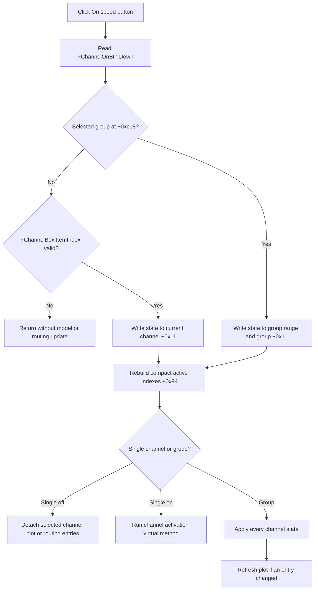

# Toggle the selected digital channel or channel group

## Control

| Property | Recovered value |
| --- | --- |
| Form | DigitalSignalGeneratorWin |
| Component path | DigitalSignalGeneratorWin.ChannelGroupBox.FChannelOnBtn |
| Control class | TSpeedButton |
| Caption | On |
| Handler name | ChannelOnBtnClick |
| Handler address | 0150f680 |
| Graph node | `resource:dfm:DigitalSignalGeneratorWin/DigitalSignalGeneratorWin.ChannelGroupBox.FChannelOnBtn` |
| Handler node | `function:0150f680` |
| Graph layer | UI |

The resource sets `GroupIndex` to 1 and `AllowAllUp` to true. Thus, the speed button can be either down or up. The recovered code confirms that its down state is the requested enabled state. The caption alone is not the basis for this conclusion.

## What happens when clicked

`FUN_0150f680` delegates the click to `FUN_01506d00`. The helper reads the current `Down` state of `FChannelOnBtn`. It then applies that state to one channel or to the selected channel group.

### One selected channel

When the form has no selected group object at offset `+0xc18`, the helper checks `FChannelBox.ItemIndex`.

- If the item index is `-1`, it returns. It does not change a channel, rebuild indexes, or update the plot-routing state. Because VCL changes a speed-button state before `OnClick`, the visible button can already have changed even though the model update is skipped.
- If the item index is valid, the helper writes the button state to byte `+0x11` of the current channel object at form offset `+0x870`.
- It then rebuilds the active-channel indexes.
- For an off state, it calls the existing channel-detachment path. This path removes the channel's plot or routing entries and clears its attachment state.
- For an on state, it calls the form's channel activation virtual method. The recovered static call graph does not resolve the concrete method at virtual slot `+0x550`, so the exact attachment implementation is not named here.

The selection synchronizer `FUN_01508260` supplies the reverse direction. It resolves the current channel from `FChannelBox.ItemIndex` and sets the speed-button state from that channel's byte `+0x11`. Thus, changing the combo selection shows the saved enabled state of the selected channel.

### Selected channel group

When offset `+0xc18` holds a selected group object, the helper reads the inclusive first and last channel indexes from group offsets `+0x3c` and `+0x40`.

1. It writes the button state to byte `+0x11` of every channel in that range.
2. It writes the same state to byte `+0x11` of the group object.
3. It rebuilds active-channel indexes.
4. It applies the stored state of every channel. Disabled channels use the detachment path. Enabled channels use the activation virtual method. If a plot entry changed, the common plot path recalculates geometry and redraws the plot.

This is an inclusive group operation. It does not affect channels outside the stored first-to-last range.

## Active-channel order and display propagation

`FUN_01506c70` scans channels in combo-list order. It writes each channel's byte count of prior enabled channels to field `+0x94`. It increments that count only for a channel whose enabled byte `+0x11` is true. Enabled channels therefore receive compact active/output indexes after each toggle.

The click path updates routing or plot attachments and can redraw the plot. It does not directly change the selected combo item, the stored group endpoints, or the visible group label.

## Generator and acquisition boundary

The On click does not read the form's running flag and does not call the generator engine's start or stop methods. The separate Start and Stop handlers own those operations. This click changes the in-memory channel set and its plot or routing attachments. The recovered path does not prove when an already running generator consumes the new set, so no immediate hardware reconfiguration is claimed.

## Guards, repeated clicks, and errors

- The only explicit guard is the `ItemIndex == -1` check in single-channel mode.
- A normal click toggles the speed button because the resource permits an all-up state. If code invokes the handler again without changing `Down`, the helper reapplies the same state, rebuilds indexes, and repeats the propagation calls.
- The group path trusts the stored inclusive range. If the first index is greater than the last index, it writes no channel byte but still changes the group byte, reindexes channels, and runs bulk propagation.
- The recovered functions have no local exception handler, user message, or rollback. An invalid group index or a failure in a later activation, detachment, or redraw call can leave earlier channel bytes changed.

## Persistence and ownership

The handler changes channel and group objects that the form already owns. It does not write a file, INI setting, serializer, or persistent store, and it does not set a recovered document-dirty flag. The form-show path rebuilds the channel list from the generator or controller model and then performs the same reindex and bulk-state application. Therefore, the enabled state is part of the current working model. Persistence beyond that model or session is outside the traced click path.

## Click flow

## Evidence

- [OnClick handler `FUN_0150f680`](../../../DecompiledSources/Tina16/functions/000000000150F680__FUN_0150f680.c) delegates directly to the shared state helper.
- [`FUN_01506d00`](../../../DecompiledSources/Tina16/functions/0000000001506D00__FUN_01506d00.c) contains the single-channel guard, the inclusive group loop, the model writes, and the single or bulk propagation branches.
- [`FUN_01506c70`](../../../DecompiledSources/Tina16/functions/0000000001506C70__FUN_01506c70.c) recomputes field `+0x94` from enabled byte `+0x11`.
- [`FUN_01508260`](../../../DecompiledSources/Tina16/functions/0000000001508260__FUN_01508260.c) resolves the selected channel or group and restores the button state from its enabled byte.
- [`FUN_010f6740`](../../../DecompiledSources/Tina16/functions/00000000010F6740__FUN_010f6740.c) is the established channel-detachment path.
- [`FUN_010f67e0`](../../../DecompiledSources/Tina16/functions/00000000010F67E0__FUN_010f67e0.c) applies all stored channel states and requests a plot refresh when entries change.
- [`FUN_010e8e30`](../../../DecompiledSources/Tina16/functions/00000000010E8E30__FUN_010e8e30.c) recalculates plot geometry and redraws plot entries.
- [`FUN_015103c0`](../../../DecompiledSources/Tina16/functions/00000000015103C0__FUN_015103c0.c) rebuilds and synchronizes channel state when the form is shown.
- [`FUN_01512200`](../../../DecompiledSources/Tina16/functions/0000000001512200__FUN_01512200.c) and [`FUN_01512410`](../../../DecompiledSources/Tina16/functions/0000000001512410__FUN_01512410.c) show that generator start and stop are separate commands.

## Annotation ownership

This Bead owns the canonical annotations for `FUN_0150f680`, `FUN_01506d00`, and `FUN_01506c70`. Sibling Digital Signal Generator control articles can cite the two shared helpers but must not publish competing annotations for them.
