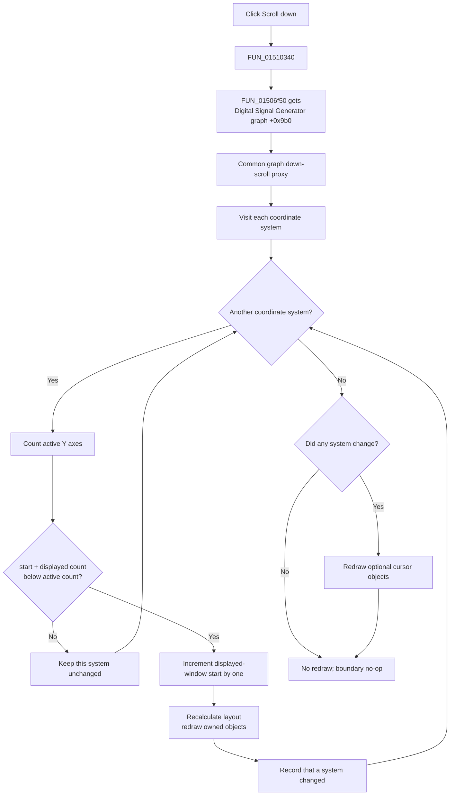

# Scroll the displayed channel-axis window down

> Analysis status: Reviewed from the recovered control resource, click wrapper, Digital Signal Generator graph wrapper, coordinate-system window step, layout, redraw, and archive paths.

## Control

| Property | Recovered value |
| --- | --- |
| Form | DigitalSignalGeneratorWin |
| Component path | DigitalSignalGeneratorWin.DisplayGroupBox.FDownScrollBtn |
| Control class | TSpeedButton |
| Caption | Not present in the recovered resource. |
| Hint | Scroll down |
| Handler name | DownScrollBtnClick |
| Handler address | 01510340 |
| Graph node | `resource:dfm:DigitalSignalGeneratorWin/DigitalSignalGeneratorWin.DisplayGroupBox.FDownScrollBtn` |
| Handler node | `function:01510340` |
| Graph layer | UI |

## What happens when clicked

The button moves the Digital Signal Generator graph's displayed Y-axis window down by one active-axis position. The direct handler [`FUN_01510340`](../../../DecompiledSources/Tina16/functions/0000000001510340__FUN_01510340.c) delegates to [`FUN_01506f50`](../../../DecompiledSources/Tina16/functions/0000000001506F50__FUN_01506f50.c). That wrapper obtains the form's graph object at offset `+0x9b0` and enters the common graph down-scroll path.

The common path visits every coordinate system in the graph. For each coordinate system, it uses:

- window-start field `+0x94`;
- displayed active-Y-axis count field `+0x98`; and
- the current count of active Y axes.

A coordinate system can move only when `window start + displayed count < active Y-axis count`. A successful move increments the start by exactly one. Thus, the visible window advances toward the next active Y-axis entry. It does not jump by a page or by the displayed count.

## Channel and group scope

The scroll path does not read the Data panel's pattern-group selector, the From or To channel controls, or a selected channel. It also does not change a channel's enabled state, pattern points, timing data, measurement length, clock period, or numeric axis range.

Instead, the active-axis list determines which entries are eligible for display. The control changes the start position of the consecutive displayed subset. In the Digital Signal Generator, those Y-axis entries present the active signal traces. Therefore, the button changes which trace axes are visible when more active axes exist than the current displayed count; it does not select or edit the underlying channel or group.

The graph helper supports more than one coordinate system and attempts the same one-position move on all of them. A system at its lower boundary stays unchanged while another system can still move. The recovered application source does not require the Digital Signal Generator graph to have exactly one coordinate system.

## Layout and redraw

After a successful step, the per-coordinate-system helper recalculates the coordinate-system layout and redraws its owned diagram objects. The outer graph helper combines the changed results from all coordinate systems. If at least one system changed, it also redraws the graph's two optional cursor objects. If no system changed, it skips these layout and redraw operations.

This is a live display-model mutation, not only a paint request: field `+0x94` remains changed after the click. However, the generator data and channel records remain unchanged.

## Scroll flow

## Repeated clicks and boundaries

- Each delivered click attempts one step for each coordinate system. The handler contains no loop that repeats the action for a held mouse button and no timer or acceleration logic.
- Repeated clicks advance an eligible window start by one each time until `start + displayed count` reaches the active-axis count.
- At that lower boundary, the per-system helper returns false without changing the start, recalculating layout, or redrawing that system.
- An empty coordinate-system collection or a graph with no eligible system produces no mutation and no cursor redraw.
- The button does not wrap from the last visible subset to the first.
- The handler does not read keyboard modifiers. Shift, Ctrl, and Alt do not select alternate branches in the recovered click path.

## Persistence and error boundaries

The click does not call the `.dsg` writer, a project-save routine, a settings writer, an undo helper, or a modified-state setter. The `.dsg` writer stores period, length, and channel pattern data, but it does not store this displayed-axis-window position.

The common coordinate-system archive writer can serialize fields `+0x94` and `+0x98`, and its reader can restore them. This establishes that the display state is serializable when an enclosing graph or diagram is archived. The recovered click path does not prove that the Digital Signal Generator invokes that archive operation, and it does not save the position immediately.

The handler and wrappers have no confirmation, returned-error test, exception handler, retry, transaction, or rollback. The common helper processes coordinate systems in order. If a later layout or redraw fails after an earlier system moved, the earlier in-memory change can remain. The direct handler also does not test the speed button's enabled state; normal VCL event dispatch is the UI boundary for disabled controls.

## Evidence

- Direct click handler: [FUN_01510340](../../../DecompiledSources/Tina16/functions/0000000001510340__FUN_01510340.c)
- Digital Signal Generator graph wrapper: [FUN_01506f50](../../../DecompiledSources/Tina16/functions/0000000001506F50__FUN_01506f50.c)
- Common graph proxy: [FUN_010eb6a0](../../../DecompiledSources/Tina16/functions/00000000010EB6A0__FUN_010eb6a0.c)
- All-coordinate-system down dispatcher: [FUN_01ad1550](../../../DecompiledSources/Tina16/functions/0000000001AD1550__FUN_01ad1550.c)
- One-position boundary and mutation: [FUN_01ce63e0](../../../DecompiledSources/Tina16/functions/0000000001CE63E0__FUN_01ce63e0.c)
- Active Y-axis count: [FUN_01ce3400](../../../DecompiledSources/Tina16/functions/0000000001CE3400__FUN_01ce3400.c)
- Coordinate-system archive reader and writer: [FUN_01ce6500](../../../DecompiledSources/Tina16/functions/0000000001CE6500__FUN_01ce6500.c) and [FUN_01ce6660](../../../DecompiledSources/Tina16/functions/0000000001CE6660__FUN_01ce6660.c)
- Recovered resources: [ui-evidence.json](../../../DecompiledSources/Tina16/resources/dfm/ui-evidence.json)
- Extracted glyph: [down-arrow PNG](../../../glyph/0114_DigitalSignalGeneratorWin_DigitalSignalGeneratorWin_DisplayGroupBox_FDownScrollBtn_Glyph_Data.png)

The resource gives the hint **Scroll down** and a 9 by 9 pixel downward-arrow glyph. The glyph confirms direction only. The source path proves the one-position displayed-axis-window mutation, scope, and boundary. The control has no recovered caption, action, checked state, or same-parent label candidate.

## Analysis limits

- The original Delphi names for coordinate-system fields `+0x94` and `+0x98` are not recovered. Their count guard, opposite up-step, layout use, and archive use establish the displayed-window roles.
- The source proves that active Y-axis entries are scrolled. It does not publish a stable one-to-one Delphi type name that identifies each entry as a specific generator channel.
- Canonical annotations for the shared all-coordinate-system dispatcher and bounded step belong to the DFWindow down-coordinate-system analysis. This article annotates only the Digital Signal Generator handler and its form-specific graph wrapper.
