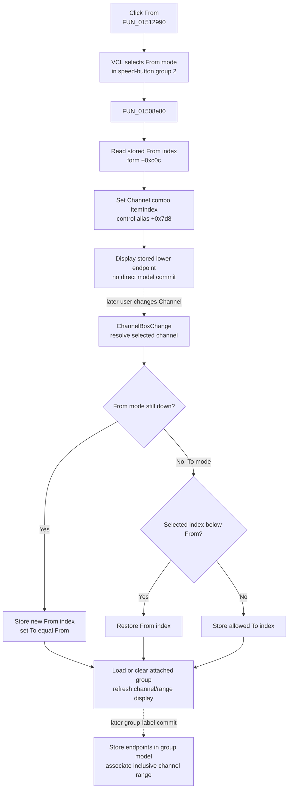

# Select the From channel endpoint

> Analysis status: Evidence-backed source review complete.

## Control

| Property | Recovered value |
| --- | --- |
| Form | DigitalSignalGeneratorWin |
| Component path | DigitalSignalGeneratorWin.ChannelGroupBox.FFromChnSpBtn |
| Control class | TSpeedButton |
| Caption | From |
| Group index | 2 |
| Handler name | FromChnSpBtnClick |
| Handler address | 01512990 |
| Graph node | `resource:dfm:DigitalSignalGeneratorWin/DigitalSignalGeneratorWin.ChannelGroupBox.FFromChnSpBtn` |
| Handler node | `function:01512990` |
| Graph layer | UI |

The **From** and **To** speed buttons share group index `2`, so they select which endpoint the Channel drop-down edits. The recovered Channel group also has a channel selector, a group-label selector and editor, **On**, and **Del** controls. Its DFM channel items start as `A`, `B`, `C`, and `D`; runtime initialization can replace or extend the list.

## What happens when clicked

`TDigitalSignalGeneratorWin.FromChnSpBtnClick` delegates to one helper. That helper sets the channel combo at form alias `+0x7d8` to the stored From index at `+0xc0c`.

The click therefore has two direct UI effects:

1. VCL selects the **From** speed button in the mutually exclusive From/To button group.
2. The Channel drop-down displays the stored lower endpoint.

It does not increment or decrement a channel number. It does not calculate a new From index from the current selection. It restores the already stored endpoint.

## Endpoint and bound semantics

The form maintains two zero-based channel indexes:

- `+0xc0c` is the From or lower endpoint.
- `+0xc10` is the To or upper endpoint.

The direct helper does not validate `+0xc0c` before it passes the value to the combo ItemIndex setter. Normal form flows keep the indexes valid:

- Selecting an existing group loads its saved lower and upper indexes from group-object fields `+0x3c` and `+0x40`.
- When the user changes the Channel drop-down while From mode is down, `ChannelBoxChange` stores the valid selected item index as the new From endpoint and initially sets To to the same index.
- When the user changes the drop-down while To mode is down, `ChannelBoxChange` rejects a selection below From by selecting From again. It then stores an allowed To endpoint.

This makes `From <= To` the recovered normal invariant. This click itself only selects the stored From value; it does not run the later bound-selection logic directly.

## Channel and group propagation

The recovered handler and helper contain no explicit call to `ChannelBoxChange`. Their direct call path only invokes the combo ItemIndex setter. The later channel-change handler owns model and display synchronization when the user chooses a different channel:

- It resolves the selected channel object.
- In From mode, it updates the lower endpoint, finds any existing group attached to that channel, selects and displays that group when present, or clears the group selection when absent.
- It sets the upper endpoint equal to the new lower endpoint so the user starts with a one-channel range.
- It rebuilds the visible single-channel or From/To range label and updates the applicable display state.

The To button uses the parallel helper and restores `+0xc10`. It does not share this handler.

Group-label selection can load an existing group's two endpoints and select whichever endpoint mode is active. Pressing Enter or leaving the group-label editor reaches the separate commit path. That path creates or updates the group object, stores its From and To fields, and associates every channel in the inclusive range with that group.

The From click reaches none of those group-commit calls. It also does not toggle **On**, delete a group, rename a group, rebuild the channel collection, or call a hardware interface.

## Click flow

The dotted steps are downstream context. They are not additional direct calls from the From click handler.

## Display, model, and persistence boundaries

- The immediate display change is the speed-button mode and Channel combo selection.
- The immediate form-state input is the existing From index. The handler does not write `+0xc0c` or `+0xc10`.
- Channel object selection, group label display, and range label rebuilding belong to `ChannelBoxChange` and group-selection logic.
- Group membership changes only in the separate group-label commit path.
- Channel enable or disable state belongs to the **On** control. Bead `.421` owns its shared toggle and reindex helpers.
- The From click does not serialize the generator, write a file, update the registry or an INI value, or send an external command. A later Data Save or other owner workflow is a separate persistence boundary.

## No-op and error behavior

- If From is already the active mode and the Channel combo already shows `+0xc0c`, the recovered handler has no additional model work. It calls the same setter with the same value.
- The helper has no empty-list or range guard. If the stored index is stale or outside the combo's current items, it passes that value to VCL. The recovered source does not establish whether that setter clears the selection, clamps it, or raises for this control state.
- No message, confirmation, fallback index, retry, or rollback is present.
- The handler has no local exception block. A VCL control exception would propagate through the click event.
- The click does not start or stop signal generation, so running-state failures are outside this path.

## Recovered evidence

- [`FUN_01512990`](../../../DecompiledSources/Tina16/functions/0000000001512990__FUN_01512990.c) is `TDigitalSignalGeneratorWin.FromChnSpBtnClick`; it contains only the call to the From-selection helper.
- [`FUN_01508e80`](../../../DecompiledSources/Tina16/functions/0000000001508E80__FUN_01508e80.c) passes form field `+0xc0c` to virtual ItemIndex setter `+0x268` on the combo at `+0x7d8`. This Bead owns its canonical annotation.
- [`FUN_015129b0`](../../../DecompiledSources/Tina16/functions/00000000015129B0__FUN_015129b0.c) and [`FUN_01508eb0`](../../../DecompiledSources/Tina16/functions/0000000001508EB0__FUN_01508eb0.c) are the parallel To handler and helper that use `+0xc10`; Bead `.424` owns that control.
- [`FUN_01512970`](../../../DecompiledSources/Tina16/functions/0000000001512970__FUN_01512970.c) delegates the Channel drop-down change event to [`FUN_01508260`](../../../DecompiledSources/Tina16/functions/0000000001508260__FUN_01508260.c). That helper enforces the endpoint order, updates the current channel and group selection, and refreshes display state.
- [`FUN_01512950`](../../../DecompiledSources/Tina16/functions/0000000001512950__FUN_01512950.c) and [`FUN_01508880`](../../../DecompiledSources/Tina16/functions/0000000001508880__FUN_01508880.c) load an existing group's saved endpoint indexes and select the endpoint for the active From/To mode.
- [`FUN_01507de0`](../../../DecompiledSources/Tina16/functions/0000000001507DE0__FUN_01507de0.c) creates or updates a named group and stores `+0xc0c` and `+0xc10` into group fields `+0x3c` and `+0x40`. [`FUN_01507c10`](../../../DecompiledSources/Tina16/functions/0000000001507C10__FUN_01507c10.c) assigns the inclusive channel range to that group.
- [`FUN_0150f3d0`](../../../DecompiledSources/Tina16/functions/000000000150F3D0__FUN_0150f3d0.c) establishes the control aliases used by the shared Digital Signal Generator and Logic Analyzer channel-group code.
- [`ui-evidence.json`](../../../DecompiledSources/Tina16/resources/dfm/ui-evidence.json) supplies the Channel group, From/To labels and speed-button group, channel and group-label controls, initial item text, and event bindings.

## Analysis limits

The original Delphi field names for `+0xc0c`, `+0xc10`, and the aliased control pointers are not recovered. Their endpoint roles are established by the paired From/To helpers and by the later group-object copy. The VCL ItemIndex setter is virtual, so this article does not claim an unobserved out-of-range result. Beads `.421`, `.423`, and `.424` own the neighboring On, Delete, and To controls; their helpers remain evidence-only here.
