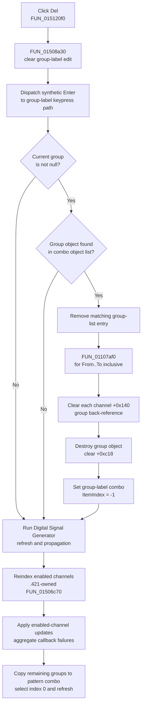

# Delete the selected channel group

> Analysis status: Evidence-backed source review complete.

## Control

| Property | Recovered value |
| --- | --- |
| Form | DigitalSignalGeneratorWin |
| Component path | DigitalSignalGeneratorWin.ChannelGroupBox.FGroupDeleteBtn |
| Control class | TSpeedButton |
| Caption | Del |
| Hint | Not present in the recovered resource. |
| Handler name | GroupDeleteBtnClick |
| Handler address | 015120f0 |
| Graph node | `resource:dfm:DigitalSignalGeneratorWin/DigitalSignalGeneratorWin.ChannelGroupBox.FGroupDeleteBtn` |
| Handler node | `function:015120f0` |
| Graph layer | UI |

The button is beside the group-label selector and editor in the Channel group. It has no recovered hint, action, image reference, or embedded glyph. The deletion meaning is established by the handler path, not by the short **Del** caption alone.

## What happens when clicked

`TDigitalSignalGeneratorWin.GroupDeleteBtnClick` delegates to a shared delete trigger. The trigger clears the group-label edit and sends an Enter key (`0x0d`) through the form's group-label keypress method. The Digital Signal Generator override calls the common group editor before it performs its form-specific refresh.

With the now-empty label, the common editor deletes only when both guards pass:

1. The form has a current group object at `+0xc18`.
2. That object is still present in the group-label combo's object list.

When both guards pass, the code removes the matching list entry, clears the deleted group's back-reference from each channel in the group's stored inclusive range, destroys the group object, clears the form's current-group pointer, and sets the group-label combo selection to `-1`. There is no confirmation dialog.

## Exact range and ownership changes

The group object stores zero-based From and To channel indexes at `+0x3c` and `+0x40`. `FUN_01107af0` walks every index from From through To, inclusive. For each index it resolves the channel object from the group's channel collection at `+0x50` and writes zero to the channel's group back-reference at `+0x140`.

The loop does not remove channel objects, shorten the channel list, change channel names, or change each channel's enabled byte at `+0x11`. It only detaches those channels from the deleted group. Channels outside the stored range are not touched by this helper.

After detachment, the call to the Delphi object-destruction helper releases the selected group object. The form does not select the next group in the group-label combo. It clears that combo's selection instead.

## Refresh and propagation

After every synthetic Enter, including a guarded no-op, the Digital Signal Generator keypress override runs the same downstream refresh sequence:

- `.421`-owned `FUN_01506c70` recomputes the sequential index stored at channel offset `+0x94` for enabled channels. Deleting a group does not itself change those enabled flags.
- `FUN_010f6920` visits enabled channels and invokes the form's virtual per-channel apply callback. It aggregates callback failure and notifies the owning status/error object if any callback reports failure. The recovered indirect call does not establish that this is a direct hardware write.
- The remaining group-label items are copied to the pattern-group combo. That combo is assigned item index `0`, and the form's pattern-group refresh callback runs. If no groups remain, the recovered Digital Signal Generator callback checks the combo item count and does no group assignment.

These calls update the live form and in-memory generator state. The click path has no file, registry, INI, or serialization call. A later save or owner workflow is the persistence boundary.

## Click flow

## Repeated clicks, failures, and partial state

- If no group is current, the click clears the edit again and performs the refresh sequence. It does not remove a list item or destroy an object.
- After a successful deletion, the current-group pointer is zero and the group-label selection is `-1`. A repeated click therefore follows the guarded no-op path unless another group was selected in the meantime.
- If the current pointer is nonzero but the object-list lookup returns `-1`, the path does not detach or destroy that object. The edit is still cleared and the downstream refresh still runs. No recovery or warning is present.
- The source has no confirmation, undo record, transaction, retry, or local exception handler.
- The mutation order is list removal, channel detachment, object destruction, current-pointer clear, and selection clear. An exception during that sequence propagates through the VCL event. The recovered code has no rollback, so it does not guarantee restoration of earlier steps after a partial failure.
- The detach helper enters its loop only when From is less than or equal to To. A malformed group with From greater than To is still destroyed, but its channel back-references are not cleared. An out-of-range index is passed to the collection accessor without a local guard.
- The pattern-group combo is assigned index `0` after the remaining items are copied. The common path does not guard an empty list before the setter, although the recovered Digital Signal Generator refresh callback checks the item count before it reads a group object.

## Recovered evidence

- [`FUN_015120f0`](../../../DecompiledSources/Tina16/functions/00000000015120F0__FUN_015120f0.c) is the DFM-bound `TDigitalSignalGeneratorWin.GroupDeleteBtnClick` wrapper and contains only the call to `FUN_01508a30`.
- [`FUN_01508a30`](../../../DecompiledSources/Tina16/functions/0000000001508A30__FUN_01508a30.c) clears aliased group-label edit `+0xbc0`, creates the Enter key value, and dispatches virtual keypress slot `+0x5d8`. The Digital Signal Generator and Logic Analyzer delete buttons share this trigger.
- [`FUN_015109f0`](../../../DecompiledSources/Tina16/functions/00000000015109F0__FUN_015109f0.c) is the Digital Signal Generator group-label keypress override. It calls the common editor, then runs the form-specific reindex, per-channel update, pattern-group list copy, selection, and refresh path for Enter.
- [`FUN_01507de0`](../../../DecompiledSources/Tina16/functions/0000000001507DE0__FUN_01507de0.c) implements the common Enter handling. Its empty-text branch checks the current group, finds it in the group combo, removes the list entry, detaches and destroys the object, clears `+0xc18`, and sets the combo index to `-1`.
- [`FUN_01107af0`](../../../DecompiledSources/Tina16/functions/0000000001107AF0__FUN_01107af0.c) iterates group fields `+0x3c` through `+0x40` inclusive and clears channel field `+0x140` for every resolved channel object.
- [`FUN_01507c10`](../../../DecompiledSources/Tina16/functions/0000000001507C10__FUN_01507c10.c) is the inverse group-assignment evidence: it writes the current group pointer to channel `+0x140` across the same stored inclusive range.
- [`FUN_01508880`](../../../DecompiledSources/Tina16/functions/0000000001508880__FUN_01508880.c) loads an existing group's stored endpoints and label into the form, proving the selected object and endpoint-field roles.
- [`FUN_01506c70`](../../../DecompiledSources/Tina16/functions/0000000001506C70__FUN_01506c70.c) performs the downstream enabled-channel reindex. Bead `.421` owns its canonical annotation.
- [`FUN_010f6920`](../../../DecompiledSources/Tina16/functions/00000000010F6920__FUN_010f6920.c) iterates enabled channels, calls the virtual apply method, aggregates its failure byte, and reports aggregate failure to the owner status object.
- [`FUN_015106a0`](../../../DecompiledSources/Tina16/functions/00000000015106A0__FUN_015106a0.c) checks the Digital Signal Generator pattern-group combo count and selection before it assigns the selected group to the current pattern settings.
- [`ui-evidence.json`](../../../DecompiledSources/Tina16/resources/dfm/ui-evidence.json) supplies the control hierarchy, caption, nearby Group Label/From/To text, and event bindings. It provides no hint or glyph for this button.

## Analysis limits

The original Delphi field names are not recovered. The group and channel roles are established by paired group creation, selection, assignment, and deletion data flow. Several downstream operations are virtual calls. This article describes their proven iteration and state effects, but does not label them as direct hardware I/O without a resolved implementation. The common group editor also creates and renames groups for nonempty text; those branches are outside this button because the delete trigger clears the text first. Beads `.422` and `.424` own the From and To controls and their endpoint-selection helpers.
