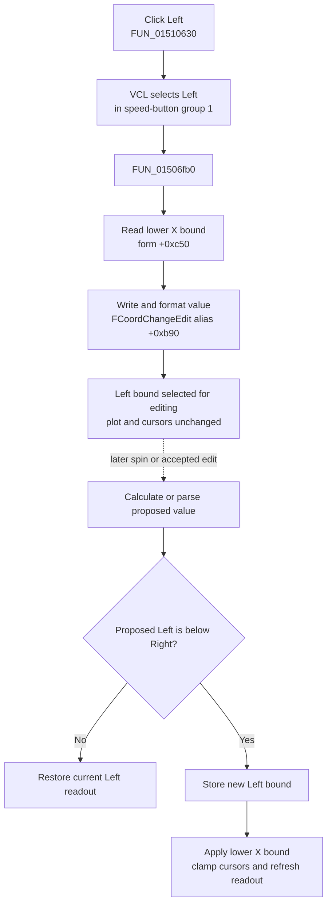

# Select the left X-coordinate bound for editing

> Analysis status: Evidence-backed source review complete.

## Control

| Property | Recovered value |
| --- | --- |
| Form | DigitalSignalGeneratorWin |
| Component path | DigitalSignalGeneratorWin.DisplayGroupBox.FLeftCoordBtn |
| Control class | TSpeedButton |
| Caption | Left |
| Group index | 1 |
| Handler name | LeftCoordBtnClick |
| Handler address | 01510630 |
| Graph node | `resource:dfm:DigitalSignalGeneratorWin/DigitalSignalGeneratorWin.DisplayGroupBox.FLeftCoordBtn` |
| Handler node | `function:01510630` |
| Graph layer | UI |

The **Left** and **Right** speed buttons share group index `1`. They select which horizontal display bound the adjacent `FCoordChangeEdit` and spin control operate on. This pair is separate from the four scroll buttons and from the two graph cursors.

## What happens when clicked

VCL selects **Left** in the mutually exclusive Left/Right button group. `TDigitalSignalGeneratorWin.LeftCoordBtnClick` then delegates to `FUN_01506fb0`.

The helper reads the stored lower X bound from form field `+0xc50` and writes that floating-point value to `FCoordChangeEdit`, aliased at `+0xb90`. The float-edit setter stores the numeric value and formats its displayed text with the edit's current format settings.

This click selects and displays an existing coordinate. It does not decrement the coordinate, move the visible plot, change a cursor, or select a channel.

## Direction and later step behavior

The direct handler has no direction argument and no step calculation. Direction belongs to the adjacent `FCoordChangeSpBtn`:

- **Down** asks the shared coordinate helper for the next lower normalized value.
- **Up** asks for the next higher normalized value.
- The step basis is one tenth of the current span, `(right - left) / 10`, passed through the shared numeric step normalizer. It is not a fixed one-unit movement.

When Left is selected, the later edit/spin path can write `+0xc50` only while the proposed value remains strictly below the right bound at `+0xc58`. A rejected value is replaced with the current left bound in the editor. The paired Right path similarly requires a proposed right bound to remain strictly above Left.

This means the current click chooses the lower-bound target; it does not itself execute any of those bound changes.

## Display, cursor, and channel scope

- `+0xc50` and `+0xc58` are the current horizontal display limits. Initialization copies them into the graph object, later axis setters apply them as lower and upper X bounds, and viewport synchronization reads them back.
- The immediate visible change is the selected speed button and the numeric readout in `FCoordChangeEdit`.
- The graph's visible range does not change in this click path because neither the handler nor its helper calls the axis-bound setter.
- The two graph cursor positions are not read or written. After a later bound commit, shared refresh code clamps any existing cursors into the new `[left, right]` interval and refreshes the coordinate readout.
- No channel object, channel index, signal pattern, generator timing value, or device callback appears in this path.
- The four scroll buttons use separate graph-scroll helpers. Selecting Left does not pan the plot.

## Click flow

The dotted edge is downstream context. It is not an additional direct call from the Left button handler.

## Model, redraw, and persistence boundaries

- The click writes only control-selection state and the float edit's value/text. It does not write `+0xc50` or `+0xc58`.
- The derived graph dataset and the underlying generator/channel model are unchanged.
- There is no direct invalidate, repaint, or graph-axis call. A later accepted bound change reaches shared graph methods; exact repaint timing remains inside those controls.
- The selected side and displayed edit value are form UI state. The handler does not write a generator file, registry key, INI value, or other persistent store.

## Repeat, no-op, and error behavior

- If Left is already selected, another click calls the same helper and reformats the same stored lower bound. It performs no additional graph or model work.
- The handler has no empty-channel, cursor, range, or running-state guard because none of those objects are required to display the stored bound.
- The click does not parse user text. Invalid text is handled later by `FCoordChangeEdit.OnError`, which reloads the bound for whichever Left/Right button is selected.
- A later manual or spin change that would make `left >= right` is rejected and the editor returns to the current bound.
- The handler and helper have no local exception block, message, retry, or rollback. A float-edit formatting exception would propagate through the UI event.

## Recovered evidence

- [`FUN_01510630`](../../../DecompiledSources/Tina16/functions/0000000001510630__FUN_01510630.c) is the Digital Signal Generator Left-coordinate click handler and contains only the call to the left-bound helper.
- [`FUN_01506fb0`](../../../DecompiledSources/Tina16/functions/0000000001506FB0__FUN_01506fb0.c) passes owner field `+0xc50` to the float-edit setter for control alias `+0xb90`. This Bead owns the shared helper's canonical annotation. Logic Analyzer handler [`FUN_01520660`](../../../DecompiledSources/Tina16/functions/0000000001520660__FUN_01520660.c) reuses it.
- [`FUN_00b90440`](../../../DecompiledSources/Tina16/functions/0000000000B90440__FUN_00b90440.c) stores the supplied double in the float edit and formats the edit text.
- [`FUN_015109e0`](../../../DecompiledSources/Tina16/functions/00000000015109E0__FUN_015109e0.c) and [`FUN_015073a0`](../../../DecompiledSources/Tina16/functions/00000000015073A0__FUN_015073a0.c) are the paired Right handler and helper that display `+0xc58`; Bead `.442` owns them.
- [`FUN_01507110`](../../../DecompiledSources/Tina16/functions/0000000001507110__FUN_01507110.c) implements the later coordinate edit/spin update, derives its step from one tenth of the span, enforces strict bound order, and applies the selected graph limit.
- [`FUN_01506fd0`](../../../DecompiledSources/Tina16/functions/0000000001506FD0__FUN_01506fd0.c) clamps recovered cursor positions to the current bounds after a later change and refreshes shared coordinate output.
- [`FUN_0150f3d0`](../../../DecompiledSources/Tina16/functions/000000000150F3D0__FUN_0150f3d0.c) establishes the shared display-control aliases used by the Digital Signal Generator and Logic Analyzer forms.
- [`ui-evidence.json`](../../../DecompiledSources/Tina16/resources/dfm/ui-evidence.json) supplies the Display group, Left/Right speed-button group, coordinate float edit and spin control, scroll buttons, and event bindings. The Left button has no hint or glyph.

## Analysis limits

The original Delphi field names for the bound fields and shared control aliases are not recovered. Their roles are established by the paired Left/Right copy helpers and by later graph-bound reads and writes. The click path does not expose graph-control internals, so this article does not assign it an unobserved redraw or persistence effect. Shared edit, step, cursor-refresh, and scroll helpers remain evidence-only under the neighboring Bead ownership assignments.
