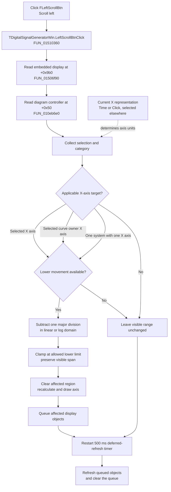

# Scroll the current display X axis toward lower values

> Analysis status: Recovered display forwarding, target-axis selection, Time/Click interaction, exact scale-aware step, lower bound, immediate and deferred redraw, repeat behavior, and persistence and error boundaries reviewed.

## Control

| Property | Recovered value |
| --- | --- |
| Form | DigitalSignalGeneratorWin |
| Form caption | Digital Signal Generator |
| Component path | DigitalSignalGeneratorWin.DisplayGroupBox.FLeftScrollBtn |
| Control class | TSpeedButton |
| Caption | Not present in the recovered resource. |
| Hint | Scroll left |
| Position and size | Left 16, Top 92, Width 21, Height 25 |
| Handler name | LeftScrollBtnClick |
| Handler address | 01510360 |
| Graph node | `resource:dfm:DigitalSignalGeneratorWin/DigitalSignalGeneratorWin.DisplayGroupBox.FLeftScrollBtn` |
| Handler node | `function:01510360` |
| Graph layer | UI |

## What happens when clicked

[`FUN_01510360`](../../../DecompiledSources/Tina16/functions/0000000001510360__FUN_01510360.c) contains one operation: it starts the shared left-scroll path. [`FUN_01506f90`](../../../DecompiledSources/Tina16/functions/0000000001506F90__FUN_01506f90.c) reads the form's embedded display object at `+0x9b0`, and [`FUN_010eb6e0`](../../../DecompiledSources/Tina16/functions/00000000010EB6E0__FUN_010eb6e0.c) reads that object's diagram controller at `+0x50`.

The resulting shared operation, [`FUN_01ae2ab0`](../../../DecompiledSources/Tina16/functions/0000000001AE2AB0__FUN_01ae2ab0.c), chooses an applicable X axis, moves its visible interval by one major division toward lower values, queues affected display objects, and restarts a 500 ms deferred-refresh timer.

The `Scroll left` hint and the inspected 9-by-9 black left-arrow glyph support the direction. The source establishes the target and the exact step; the glyph alone does not.

## Which X axis is affected

The shared operation uses [`FUN_01acff30`](../../../DecompiledSources/Tina16/functions/0000000001ACFF30__FUN_01acff30.c) to collect the current diagram selection and obtain its combined category value:

- For pure axis category `1`, it uses selected item zero only when the recovered orientation is `0`, `4`, or `6`. These are the accepted X-axis orientations in this path. A selected Y axis does not move.
- For pure curve category `2`, [`FUN_01ad1090`](../../../DecompiledSources/Tina16/functions/0000000001AD1090__FUN_01ad1090.c) resolves the curve's owning coordinate system from selected item zero. The operation uses that system's X-axis field at `+0xf8` or `+0xe8`, according to the recovered coordinate-system type.
- With category `0`, no selection, the operation uses an axis only when the diagram has exactly one coordinate system and that system has exactly one X axis in collection `+0x70`.
- Mixed selections, unsupported categories, unsupported axis orientations, and an unresolved curve owner do not select an axis.

The operation does not scroll every selected axis or every selected curve. Its selection and curve-owner branches start from item zero.

## Time and Click modes

The left-scroll handler does not read or change the Digital Signal Generator's Time/Click mode flag at form offset `+0xec2`. It scrolls the X-axis object in its current representation.

The separate mode controls establish how that representation is prepared:

- [`FUN_01512d60`](../../../DecompiledSources/Tina16/functions/0000000001512D60__FUN_01512d60.c), `XAxisTimeSpBtnClick`, changes `+0xec2` from false to true, rebuilds the trace values, rescales the horizontal values, and labels the first X axis of each coordinate system `Time`.
- [`FUN_01512e40`](../../../DecompiledSources/Tina16/functions/0000000001512E40__FUN_01512e40.c), `XAxisClickSpBtnClick`, changes `+0xec2` from true to false, rebuilds the values in click units, applies the reciprocal period scale, and labels those axes `Click`.
- Form creation at [`FUN_0150f690`](../../../DecompiledSources/Tina16/functions/000000000150F690__FUN_0150f690.c) initializes `+0xec2` to true.

Therefore, a left-scroll click changes one displayed major division in the current X-axis domain. In Time mode that domain is the prepared time axis; in Click mode it is the prepared click axis. The click does not convert between the modes.

## Exact step and lower bound

[`FUN_01cd3ef0`](../../../DecompiledSources/Tina16/functions/0000000001CD3EF0__FUN_01cd3ef0.c) invokes [`FUN_01cd3cd0`](../../../DecompiledSources/Tina16/functions/0000000001CD3CD0__FUN_01cd3cd0.c) for the selected X axis. The calculation uses:

- visible lower endpoint `+0xb8`;
- visible upper endpoint `+0xc0`;
- allowed lower limit `+0xc8`;
- scale mode `+0x70`; and
- major-division count `+0x74`.

For Linear, Linear-dB, and recovered mode `3`, the step is:

`step = (visible upper - visible lower) / major-division count`

The helper subtracts the step from both endpoints, so the visible width stays unchanged. Logarithmic mode `2` performs the same one-division movement in log space and preserves the visible ratio.

If the provisional lower endpoint would pass the allowed lower limit, the helper clamps the lower endpoint to the limit and moves the upper endpoint by the same effective amount. If the range is already at that limit, it reports no movement.

## Drawing, timer, and repeated clicks

When the range moves, `FUN_01cd3ef0` clears an orientation-specific display rectangle with white and invokes the axis recalculation and drawing methods. This is the immediate display update.

`FUN_01ae2ab0` adds affected axes and related display objects to a duplicate-free refresh queue. When it resolves a coordinate system, it also refreshes the first recovered grid or display member at `+0x88` when that member exists. It then disables the current timer, sets its interval to 500 ms, installs [`FUN_01ae5d60`](../../../DecompiledSources/Tina16/functions/0000000001AE5D60__FUN_01ae5d60.c), and enables the timer. The callback disables the timer and calls [`FUN_01ae5650`](../../../DecompiledSources/Tina16/functions/0000000001AE5650__FUN_01ae5650.c), which performs type-specific recalculation or drawing and clears the queue.

Each activation can move the axis by one more division until the lower bound is reached. Each activation also restarts the 500 ms delay, so repeated clicks postpone the deferred pass until 500 ms after the last click. The DFM has no recovered automatic-repeat property for this speed button; repeat movement requires repeated click or keyboard activation events.

## No-op, persistence, and errors

The following states produce no proven range movement:

- no selection when the diagram does not have exactly one coordinate system with exactly one X axis;
- a selected Y axis or unsupported orientation;
- a mixed or unsupported selection category;
- a selected curve whose owner cannot be resolved;
- a scale mode outside recovered values `0` through `3`; or
- an X-axis range already at its allowed lower limit.

The shared operation still restarts the 500 ms timer after these selection and movement branches. A no-range-change click can therefore schedule an empty or previously queued deferred pass.

The handler and its two forwarding wrappers contain no local nil guard, exception handler, error dialog, or rollback. Normal form setup is expected to supply the embedded display and diagram controller. The range calculation divides by the major-division count without a local zero check and applies logarithms without a local positive-endpoint check. Malformed model behavior is not proven.

The path changes live visible-axis endpoints. It does not call the known ManualScale serializer, save the document, write settings, set a recovered modified flag, or register an undo action. Later persistence of this view state is not established.

## Click flow

## Handler and call-path evidence

- Click handler: [FUN_01510360](../../../DecompiledSources/Tina16/functions/0000000001510360__FUN_01510360.c)
- Form-to-display bridge: [FUN_01506f90](../../../DecompiledSources/Tina16/functions/0000000001506F90__FUN_01506f90.c)
- Display-to-diagram bridge: [FUN_010eb6e0](../../../DecompiledSources/Tina16/functions/00000000010EB6E0__FUN_010eb6e0.c)
- Shared target selection, queue, and timer setup: [FUN_01ae2ab0](../../../DecompiledSources/Tina16/functions/0000000001AE2AB0__FUN_01ae2ab0.c)
- One-axis left-scroll drawing operation: [FUN_01cd3ef0](../../../DecompiledSources/Tina16/functions/0000000001CD3EF0__FUN_01cd3ef0.c)
- Scale-aware visible-range decrease: [FUN_01cd3cd0](../../../DecompiledSources/Tina16/functions/0000000001CD3CD0__FUN_01cd3cd0.c)
- Extracted glyph: [0113 FLeftScrollBtn Glyph](../../../glyph/0113_DigitalSignalGeneratorWin_DigitalSignalGeneratorWin_DisplayGroupBox_FLeftScrollBtn_Glyph_Data.png)

`.441` owns the handler and the two left-specific forwarding functions. `.372` owns the shared diagram left-scroll, range-decrease, and redraw functions; `.274` owns the shared selection collector. The right-scroll control uses a distinct right-specific chain owned by `.443`.

## Analysis limits

- Original Delphi names for the embedded display, diagram controller, coordinate-system, axis, selection-category, scale-mode, timer, and queue types are not recovered.
- The recovered Time/Click handlers prove axis conversion and labeling. They do not prove a different left-scroll algorithm for either mode.
- The source proves immediate axis drawing and deferred queued refresh. It does not prove animation, GPU use, or a full display repaint on every click.
- No later save or close path was attributed to this click. The article does not claim that the live view range is persisted.
