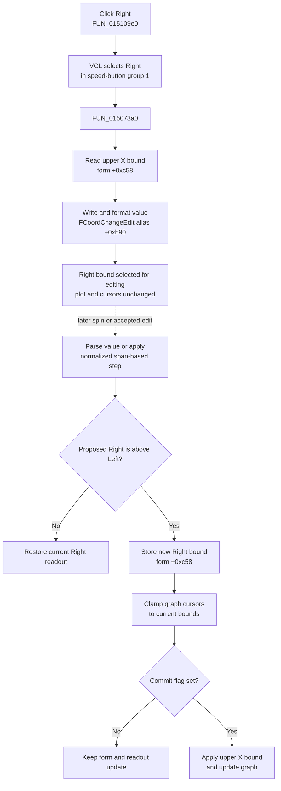

# Select the right X-coordinate bound for editing

> Analysis status: Evidence-backed source review complete.

## Control

| Property | Recovered value |
| --- | --- |
| Form | DigitalSignalGeneratorWin |
| Component path | DigitalSignalGeneratorWin.DisplayGroupBox.FRightCoordBtn |
| Control class | TSpeedButton |
| Caption | Right |
| Group index | 1 |
| Handler name | RightCoordBtnClick |
| Handler address | 015109e0 |
| Graph node | `resource:dfm:DigitalSignalGeneratorWin/DigitalSignalGeneratorWin.DisplayGroupBox.FRightCoordBtn` |
| Handler node | `function:015109e0` |
| Graph layer | UI |

The **Left** and **Right** speed buttons share group index `1`. They select which horizontal display bound the adjacent `FCoordChangeEdit` and `FCoordChangeSpBtn` controls operate on. This pair is separate from the four plot-scroll buttons.

## What happens when clicked

VCL selects **Right** in the mutually exclusive Left/Right group. `TDigitalSignalGeneratorWin.RightCoordBtnClick` then delegates to `FUN_015073a0`.

The helper reads the stored upper X bound from form field `+0xc58` and writes it to `FCoordChangeEdit`, aliased at `+0xb90`. The float-edit setter stores the numeric value and formats the visible text.

This click selects and displays an existing bound. It does not increment the value, parse text, change either bound, move a graph cursor, or redraw the plot.

## Stored bound mapping and units

The form stores its horizontal display limits as two doubles:

- `+0xc50` is the left or lower X bound.
- `+0xc58` is the right or upper X bound.

Initialization sets them to `0` and `1` and copies them into the graph model's lower and upper X fields. Other initialization paths replace the upper value with the current measurement length, either directly or multiplied by the clock period.

The same fields represent the active X-axis units:

- In **Time** mode, the form multiplies both bounds by the clock period and labels the axis `Time`.
- In **Click** mode, it divides both bounds by the clock period and labels the axis `Click`.

The Right click does not convert the value. It displays the already converted `+0xc58` value for the current mode. A later clock-period change can rescale both stored bounds while Time mode is active.

## Later edit and step behavior

The coordinate edit and spin control share `FUN_01507110` after a side is selected.

For a typed value, pressing Enter sets a commit flag and calls the shared helper with operation `6`, which parses the float without adding a step. Leaving the edit synthesizes the same Enter action.

For the spin control:

- Down requests the next lower normalized value.
- Up requests the next higher normalized value.
- The step basis is one tenth of the current span, `(right - left) / 10`, passed through the numeric step normalizer. It is not a fixed one-unit change.

When Right is selected, the shared helper accepts the proposed upper bound only when it is strictly greater than the current left bound. If the proposal is equal to or below Left, it restores the current right bound in the edit.

After an accepted change, the helper:

1. Stores the value in `+0xc58`.
2. Rewrites the formatted edit value.
3. Clamps any recovered graph cursor positions to the `[left, right]` interval.
4. Uses a commit flag to decide whether to send the new upper bound to the graph's axis-range setter and request its update.
5. Clears that flag.

`FCoordChangeSpBtn.OnEndClick` sets the commit flag used by this shared path. The recovered function bodies do not establish the custom spin control's callback order, so this article does not claim which repeated-spin callback performs the final graph write.

## Click flow

The dotted edge is downstream context. It is not an additional direct call from the Right button handler.

## Display, model, and persistence boundaries

- The immediate visible change is the selected speed button and the value shown in `FCoordChangeEdit`.
- The click does not write `+0xc50`, `+0xc58`, or the graph model.
- A later accepted edit or spin action changes the form's right bound. The committed path can also update the graph's upper X limit and clamp cursor positions.
- Time/Click conversion belongs to the separate X-axis mode buttons. Clock-period scaling belongs to the period-change path.
- No channel object, signal pattern, generator run state, hardware callback, measurement sample, or trigger setting is changed.
- The click and bound-update helper do not write a generator file, registry key, INI value, or other persistent store. The bound is display/model state for the active form and graph.
- No undo record is present in the recovered path.

## No-op and error behavior

- If Right is already selected, another click reloads and reformats the same stored upper bound. It performs no additional graph work.
- The direct handler has no down-state, range, channel, cursor, or running-state guard. It does not need those objects to display `+0xc58`.
- Invalid float text is handled later by `FCoordChangeEdit.OnError`, which reloads the current left or right bound according to the selected button.
- A proposed right value that is not strictly above Left is rejected and replaced with the current Right value.
- The direct click has no message, retry, fallback, rollback, or local exception block. A float-edit formatting exception can propagate through the click event.
- Later graph-update helpers contain their own numeric normalization. The direct click does not invoke them.

## Recovered evidence

- [`FUN_015109e0`](../../../DecompiledSources/Tina16/functions/00000000015109E0__FUN_015109e0.c) is the Digital Signal Generator Right-coordinate click handler and contains only the call to the right-bound helper.
- [`FUN_015073a0`](../../../DecompiledSources/Tina16/functions/00000000015073A0__FUN_015073a0.c) passes owner field `+0xc58` to the float-edit setter for control alias `+0xb90`. This Bead owns the shared helper's canonical annotation. Logic Analyzer handler [`FUN_015209b0`](../../../DecompiledSources/Tina16/functions/00000000015209B0__FUN_015209b0.c) reuses it.
- [`FUN_00b90440`](../../../DecompiledSources/Tina16/functions/0000000000B90440__FUN_00b90440.c) stores the supplied double in the float edit and formats its text.
- [`FUN_01510630`](../../../DecompiledSources/Tina16/functions/0000000001510630__FUN_01510630.c) and [`FUN_01506fb0`](../../../DecompiledSources/Tina16/functions/0000000001506FB0__FUN_01506fb0.c) are the paired Left handler and helper that display `+0xc50`; Bead `.440` owns them.
- [`FUN_01507110`](../../../DecompiledSources/Tina16/functions/0000000001507110__FUN_01507110.c) parses or steps the later coordinate value, derives its step from one tenth of the span, enforces strict bound order, stores the selected bound, and conditionally applies it to the graph.
- [`FUN_015072e0`](../../../DecompiledSources/Tina16/functions/00000000015072E0__FUN_015072e0.c) handles Enter by setting the commit flag before the typed-value path. [`FUN_01507310`](../../../DecompiledSources/Tina16/functions/0000000001507310__FUN_01507310.c) synthesizes Enter on edit exit. [`FUN_01507340`](../../../DecompiledSources/Tina16/functions/0000000001507340__FUN_01507340.c) restores the selected bound after an edit error.
- [`FUN_01506fd0`](../../../DecompiledSources/Tina16/functions/0000000001506FD0__FUN_01506fd0.c) clamps recovered graph cursor coordinates to the current bounds after a later change and refreshes shared coordinate output.
- [`FUN_01512d60`](../../../DecompiledSources/Tina16/functions/0000000001512D60__FUN_01512d60.c) and [`FUN_01512e40`](../../../DecompiledSources/Tina16/functions/0000000001512E40__FUN_01512e40.c) select Time and Click X-axis modes. Both use [`FUN_01506ac0`](../../../DecompiledSources/Tina16/functions/0000000001506AC0__FUN_01506ac0.c) to rescale the stored bounds and graph data.
- [`FUN_01506e40`](../../../DecompiledSources/Tina16/functions/0000000001506E40__FUN_01506e40.c) initializes the bounds. [`FUN_01506c40`](../../../DecompiledSources/Tina16/functions/0000000001506C40__FUN_01506c40.c) copies them into graph-model fields.
- [`FUN_0150f3d0`](../../../DecompiledSources/Tina16/functions/000000000150F3D0__FUN_0150f3d0.c) establishes the shared display-control aliases used by the Digital Signal Generator and Logic Analyzer forms.
- [`ui-evidence.json`](../../../DecompiledSources/Tina16/resources/dfm/ui-evidence.json) supplies the Display group, Left/Right speed-button group, coordinate float edit and spin control, scroll buttons, and event bindings. The Right button has no hint or glyph.

## Analysis limits

The original Delphi names for the bound fields, commit flag, and shared control aliases are not recovered. Their roles are established by the paired Left/Right copy helpers, later bound validation, graph-range updates, and Time/Click rescaling. The custom spin control's internal event order is not recovered. Shared edit, step, cursor-refresh, Time/Click, and scroll helpers remain evidence-only under neighboring Bead ownership; `.442` owns only the right handler and right-bound display helper.
