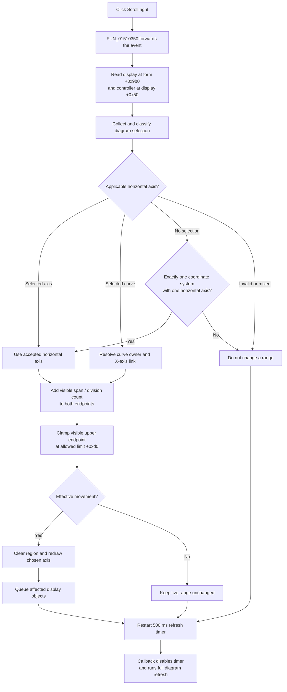

# Scroll the Digital Signal Generator X-axis view right

> Analysis status: Reviewed from the recovered resource and glyph, Digital Signal Generator wrapper chain, canonical diagram right-scroll dispatcher, numeric range step, paired left path, Time/Click conversion, redraw queue, and deferred refresh timer.

## Control

| Property | Recovered value |
| --- | --- |
| Form | DigitalSignalGeneratorWin |
| Form caption | Digital Signal Generator |
| Component path | DigitalSignalGeneratorWin.DisplayGroupBox.FRightScrollBtn |
| Control class | TSpeedButton |
| Caption | Not present in the recovered resource. |
| Hint | Scroll right |
| Handler name | RightScrollBtnClick |
| Handler address | 01510350 |
| Graph node | `resource:dfm:DigitalSignalGeneratorWin/DigitalSignalGeneratorWin.DisplayGroupBox.FRightScrollBtn` |
| Handler node | `function:01510350` |
| Graph layer | UI |

The extracted 9-by-9 glyph is a black triangle that points right. The hint and glyph confirm direction, while the recovered call path and axis arithmetic establish the effect.

## What happens when clicked

[`FUN_01510350`](../../../DecompiledSources/Tina16/functions/0000000001510350__FUN_01510350.c) is a one-call Delphi event wrapper. It enters this chain:

1. [`FUN_01506f70`](../../../DecompiledSources/Tina16/functions/0000000001506F70__FUN_01506f70.c) reads the Digital Signal Generator display object at form offset `+0x9b0`.
2. [`FUN_010eb6c0`](../../../DecompiledSources/Tina16/functions/00000000010EB6C0__FUN_010eb6c0.c) reads that display object's nested diagram controller at `+0x50`.
3. The adapter invokes the canonical shared right-scroll dispatcher [`FUN_01ae2e30`](../../../DecompiledSources/Tina16/functions/0000000001AE2E30__FUN_01ae2e30.c).

The handler and both wrappers add no range calculation, mode conversion, guard, message, or persistence. The shared dispatcher chooses an applicable horizontal axis, advances its visible range, queues affected display objects, and restarts a delayed full refresh.

## Which axis moves

The dispatcher rebuilds the diagram selection and uses the first selected item.

- For a selected axis, it scrolls only recovered horizontal-axis categories `0`, `4`, and `6`, represented by mask `0x51`. It does not apply the right step to an unsupported axis category.
- For a selected curve, it resolves the curve's coordinate system and chooses that curve's applicable X-axis link at `+0xe8` or `+0xf8` from the recovered coordinate-system category.
- With no selection, it chooses a default only when the display has exactly one coordinate system and that coordinate system has exactly one horizontal axis.
- A mixed selection, an unresolved curve owner, or an ambiguous no-selection display produces no range change.

Only the chosen axis moves. The command does not move signal samples, change cursor values, change channel enabled states, select a different coordinate system, or scroll a vertical axis.

## Direction, step, and bounds

The canonical right-step helper [`FUN_01cd3b70`](../../../DecompiledSources/Tina16/functions/0000000001CD3B70__FUN_01cd3b70.c) delegates the numeric update to [`FUN_01cd3950`](../../../DecompiledSources/Tina16/functions/0000000001CD3950__FUN_01cd3950.c). The recovered axis fields are:

- `+0xb8`: visible lower endpoint;
- `+0xc0`: visible upper endpoint;
- `+0xc8`: allowed lower limit;
- `+0xd0`: allowed upper limit;
- `+0x70`: scale mode; and
- `+0x74`: major-division count.

For linear scale modes, one click calculates:

`step = (visible upper - visible lower) / major-division count`

It adds the same step to both visible endpoints, so the visible span stays constant. If the proposed upper endpoint exceeds the allowed upper limit, it reduces the effective step so the final upper endpoint equals `+0xd0`. At that limit, the effective linear step is zero and the range does not move.

Scale mode `2` performs the same one-division operation in the recovered logarithmic domain and then converts both endpoints back. This preserves the visible span in logarithmic space and clamps at the allowed upper limit.

The path writes the selected axis's visible endpoints. It does not change the allowed limits, scale mode, division count, Digital Signal Generator fields `+0xc50` and `+0xc58`, or `FCoordChangeEdit`. The separate **Left** and **Right** coordinate buttons only choose which form-bound value is shown in that edit; they do not perform this scroll.

## Time and Click modes

The scroll handler does not read Time/Click mode byte `+0xec2` and does not branch on the current X-axis label. It operates in the axis coordinates that are already active:

- In **Time** mode, the visible endpoints and one-division step are time-coordinate values.
- In **Click** mode, [`FUN_01512e40`](../../../DecompiledSources/Tina16/functions/0000000001512E40__FUN_01512e40.c) has already divided the displayed range by the clock period, set the graph X scale to `1.0`, and rebuilt plotted X coordinates as rounded click indexes. Right scroll therefore advances one major division in click-coordinate values.

The paired Time handler [`FUN_01512d60`](../../../DecompiledSources/Tina16/functions/0000000001512D60__FUN_01512d60.c) applies the inverse period scaling before later scrolls. Right scroll itself does not read or change the clock period, measurement length, Time/Click choice, or underlying channel point times.

## Drawing and the 500 ms timer

When the numeric step reports movement, `FUN_01cd3b70` clears an orientation-specific display rectangle to white and invokes the axis update and draw methods. The dispatcher also queues the selected axis and related coordinate-system, cursor, or display objects when the resolved branch supplies them.

The dispatcher then restarts the diagram timer at `+0x88` on every invocation:

1. disable the timer;
2. set its interval to 500 ms;
3. install [`FUN_01ae5d60`](../../../DecompiledSources/Tina16/functions/0000000001AE5D60__FUN_01ae5d60.c) as the callback; and
4. enable the timer.

The callback disables the timer and invokes the full diagram refresh [`FUN_01ae5650`](../../../DecompiledSources/Tina16/functions/0000000001AE5650__FUN_01ae5650.c). The timer coalesces the final redraw. It is not a button-repeat timer.

## Repeat, no-op, and error behavior

- Each `OnClick` invocation requests at most one major-division step. Repeated clicks continue toward the allowed upper limit. Each request restarts the 500 ms refresh timer, so rapid clicks postpone the full refresh until 500 ms after the latest request.
- The DFM binds `OnClick` only. It has no recovered `OnMouseDown` repeat event, and the handler has no loop. The graph has no recovered function caller for `FUN_01510350` other than the DFM trigger.
- An invalid or ambiguous selection, unsupported axis category, zero visible span, or an axis already at the linear upper limit makes no numeric change. The outer dispatcher still performs its queue and timer-finalization path where applicable.
- Unlike the parallel Logic Analyzer wrapper, the Digital Signal Generator handler has no object-presence check before it enters the adapter chain. It assumes the form's display object and nested controller exist. A missing object is not handled locally.
- The numeric helper divides by major-division count `+0x74` without an explicit zero check. Its logarithmic branch has no local positive-value validation. Behavior for inconsistent programmatic axis state is not established.
- Selection, range writes, immediate drawing, queue insertion, timer setup, and full refresh occur without a local exception handler or rollback. A failure after the endpoint write can leave the live range changed while later display work is incomplete.
- No branch shows a validation dialog, confirmation, retry, or error message.

## Right-scroll flow

## Persistence boundary

This command changes live visible-axis endpoints. It does not call the Digital Signal Generator writer, a document serializer, settings writer, Save command, recovered dirty-state setter, or undo registrar. The `.dsg` writer stores Period, Length, and signal data, but not this visible range. The click path does not establish whether another later document-save path persists generic diagram view state.

## Evidence

- Digital Signal Generator handler: [FUN_01510350](../../../DecompiledSources/Tina16/functions/0000000001510350__FUN_01510350.c)
- Shared instrument right-scroll bridge: [FUN_01506f70](../../../DecompiledSources/Tina16/functions/0000000001506F70__FUN_01506f70.c)
- Nested display adapter: [FUN_010eb6c0](../../../DecompiledSources/Tina16/functions/00000000010EB6C0__FUN_010eb6c0.c)
- Canonical selection and right-scroll dispatcher: [FUN_01ae2e30](../../../DecompiledSources/Tina16/functions/0000000001AE2E30__FUN_01ae2e30.c)
- Canonical axis step and immediate redraw: [FUN_01cd3b70](../../../DecompiledSources/Tina16/functions/0000000001CD3B70__FUN_01cd3b70.c)
- Numeric visible-range update: [FUN_01cd3950](../../../DecompiledSources/Tina16/functions/0000000001CD3950__FUN_01cd3950.c)
- Selection collector: [FUN_01acff30](../../../DecompiledSources/Tina16/functions/0000000001ACFF30__FUN_01acff30.c)
- Curve-to-coordinate-system resolver: [FUN_01ad1090](../../../DecompiledSources/Tina16/functions/0000000001AD1090__FUN_01ad1090.c)
- Delayed refresh callback: [FUN_01ae5d60](../../../DecompiledSources/Tina16/functions/0000000001AE5D60__FUN_01ae5d60.c)
- Full diagram refresh: [FUN_01ae5650](../../../DecompiledSources/Tina16/functions/0000000001AE5650__FUN_01ae5650.c)
- Time-to-Click conversion: [FUN_01512e40](../../../DecompiledSources/Tina16/functions/0000000001512E40__FUN_01512e40.c)
- Click-to-Time conversion: [FUN_01512d60](../../../DecompiledSources/Tina16/functions/0000000001512D60__FUN_01512d60.c)
- Digital Signal Generator writer: [FUN_01510cb0](../../../DecompiledSources/Tina16/functions/0000000001510CB0__FUN_01510cb0.c)
- Recovered resources: [ui-evidence.json](../../../DecompiledSources/Tina16/resources/dfm/ui-evidence.json)
- Right-arrow glyph: [FRightScrollBtn Glyph](../../../glyph/0116_DigitalSignalGeneratorWin_DigitalSignalGeneratorWin_DisplayGroupBox_FRightScrollBtn_Glyph_Data.png)

## Annotation ownership

This Bead owns the Digital Signal Generator handler `FUN_01510350` and the right-specific wrapper chain `FUN_01506f70` and `FUN_010eb6c0`. Bead `.375` owns the canonical shared right dispatcher and axis-step annotations. Bead `.441` owns the mirrored left wrappers. The Left and Right coordinate buttons use separate handlers and helpers.
