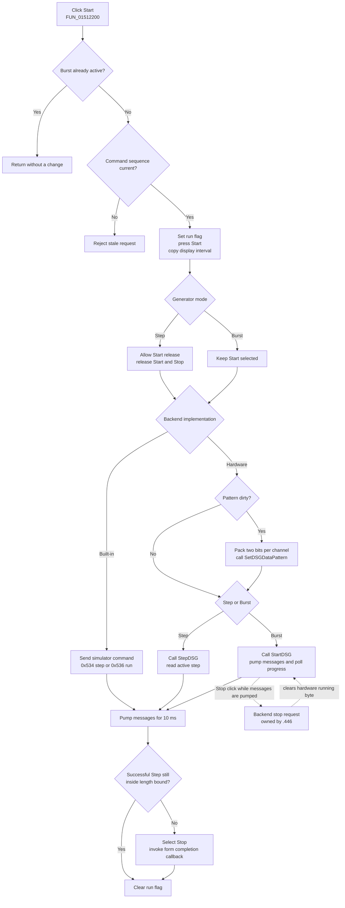

# Start digital signal generation

> Analysis status: Evidence-backed source review complete.

## Control

| Property | Recovered value |
| --- | --- |
| Form | DigitalSignalGeneratorWin |
| Form caption | Digital Signal Generator |
| Component path | DigitalSignalGeneratorWin.StartGroupBox.FStartBtn |
| Control class | TSpeedButton |
| Caption | Start |
| Group index | `1`, shared with `FStopBtn` |
| Handler name | StartBtnClick |
| Handler address | 01512200 |
| Graph node | `resource:dfm:DigitalSignalGeneratorWin/DigitalSignalGeneratorWin.StartGroupBox.FStartBtn` |
| Handler node | `function:01512200` |
| Graph layer | UI |

The resource has no hint, action, image reference, or extracted glyph for this button. The Start meaning is confirmed by the handler, the backend start slots, and the paired Stop path.

## Preconditions and request guard

`FUN_01512200` creates an internal command record with command value `0x538` and passes it to `FUN_01512260`. Both functions first test form run flag `+0x7ED` and the generator mode. A nonzero mode is Burst. If a Burst run is already active, Start returns without a change. Mode zero is Step, so an active Step operation does not use this rejection.

The coordinator next validates or assigns the command sequence through `FUN_00f83630`. A new command receives the next 16-bit sequence value, with `0xFFFF` wrapping to `1`. A record that already contains a different sequence is stale and is rejected. These are the only explicit preflight checks. Start does not parse the visible period or length edits, validate channel count, confirm a trigger, or show an error dialog. Those values must already be present in the model.

After preflight succeeds, the coordinator sets `+0x7ED`, presses Start, and copies the form's current horizontal interval to both recovered interval pairs in the trace model. It updates the two trace dimensions with the interval start and the backend's current generated-time value.

## Step and Burst execution

The coordinator reads mode zero as Step and a nonzero value as Burst.

- In Step mode, it makes Start releasable, releases Start, and releases Stop before backend dispatch. The built-in backend distinguishes its first post-reset step from later steps. The first path clears its reset flag and generated-time value, initializes the simulator state, and sends command `0x536` to the associated analysis window. Later steps capture the current simulator time and send command `0x534`. A failed built-in initialization returns a false status.
- In Burst mode, Start stays selected during dispatch. The built-in backend sends command `0x536` to the associated analysis window.
- The hardware backend rebuilds its output pattern only when its dirty flag is set. `FUN_015040f0` samples every channel for each configured output step. It keeps the low two bits of each channel's mapped logic value and places them at bit position `2 * channel index` in one 32-bit word. It passes the word buffer to the dynamically resolved `SetDSGDataPattern` export, then clears the dirty flag and generated-time value.
- For hardware Step mode, the backend calls `StepDSG`, gets `GetDSGActStep`, and stores `clock period * active step` as its generated-time value.
- For hardware Burst mode, it calls `StartDSG`. It then repeatedly processes application messages and polls `GetDSGActStep` until the active step reaches `GetDSGMeasLength - 1` or its backend-running byte is cleared. This message pumping lets the paired Stop click run while the burst call is active. The backend finally stores `clock period * active step` as its generated-time value.

Clock source, trigger source, mode, logic level, period, and measurement length are configured through separate controls before Start. This handler does not rewrite them. The hardware start exports use the configuration that the model or hardware adapter already holds. The recovered executable does not show the external trigger timing or hardware protocol.

## Completion, Stop, and visible state

After backend dispatch, `FUN_01512260` performs a timer-backed 10 ms wait that pumps application messages. There is no recovered `TTimer`, progress bar, or status control on this form. Hardware Burst progress is the polled active-step number converted to time in the backend model.

A successful Step whose generated-time value has not passed `period * measurement length` returns through the short step path. It does not select Stop or call the form-owned completion callback. A completed Burst, a Step beyond that bound, or a false backend status selects Stop and invokes virtual form method `+0x3D8`. Shared base-form callers use the same slot after they select Stop, so it is a form-owned completion or processing callback. Its concrete target is indirect and is not named in the recovered call graph.

All normal coordinator exits after dispatch clear run flag `+0x7ED`. Stop does not own this cleanup. While the flag is set, `FUN_01512410` invokes backend stop slot `+0x120`. The built-in stop implementation marks the model for reset and stops its simulator path. The hardware implementation clears its running byte and generated-time value and calls `StopDSG`. The hardware Burst polling loop observes the cleared running byte and unwinds. Bead `.446` owns the Stop handler annotation and the stop request remains evidence-only here.

The handler does not disable controls, start a form timer, write a progress widget, save a file, set a document-dirty flag, or persist generator settings. The Digital Signal Generator writer serializes period, length, and pattern data in a separate command. It does not run from Start.

## Start flow

## Failure and partial-state behavior

- A blocked active Burst or stale command sequence changes no run, button, trace, or backend state.
- The dynamic `StepDSG` and `StartDSG` wrappers initialize their result to false. If the hardware module or export is absent, backend dispatch reports false and the coordinator takes its Stop/completion path.
- `SetDSGDataPattern` has no result. The hardware backend clears its dirty flag after the wrapper returns even when the module or export is absent. Thus, missing pattern transmission can leave the live model marked clean without proof that hardware received the data.
- `GetDSGMeasLength` and `GetDSGActStep` wrappers do not initialize their output when their exports are absent. The recovered hardware run path can therefore use an undefined count or step after a partial DLL-resolution failure. It has no application-level error message, retry, or rollback.
- The built-in initialization path returns false when its simulator preparation fails. The coordinator selects Stop and calls its completion callback; it does not show a local error.
- The run flag is cleared only on normal control flow after backend dispatch. There is no local exception handler or `finally` block. An exception from a virtual backend call, trace update, VCL setter, or callback can leave the flag or button state partially changed.
- Repeated Start clicks in Step mode can request later steps. Repeated Start clicks during an active Burst are ignored. No maximum-click counter exists in the handler.

## Source evidence

- Start wrapper and active-mode guard: [FUN_01512200](../../../DecompiledSources/Tina16/functions/0000000001512200__FUN_01512200.c)
- Command preflight, UI state, trace preparation, backend dispatch, timing wait, completion branch, and run-flag cleanup: [FUN_01512260](../../../DecompiledSources/Tina16/functions/0000000001512260__FUN_01512260.c)
- Command sequence validator: [FUN_00f83630](../../../DecompiledSources/Tina16/functions/0000000000F83630__FUN_00f83630.c)
- Timer-backed message-pumping wait: [FUN_00f835c0](../../../DecompiledSources/Tina16/functions/0000000000F835C0__FUN_00f835c0.c)
- Built-in simulator start path: [FUN_01503950](../../../DecompiledSources/Tina16/functions/0000000001503950__FUN_01503950.c)
- Hardware pattern packer and run path: [FUN_015040f0](../../../DecompiledSources/Tina16/functions/00000000015040F0__FUN_015040f0.c) and [FUN_01504270](../../../DecompiledSources/Tina16/functions/0000000001504270__FUN_01504270.c)
- Dynamic hardware wrappers: [SetDSGDataPattern](../../../DecompiledSources/Tina16/functions/0000000000E1C130__FUN_00e1c130.c), [GetDSGMeasLength](../../../DecompiledSources/Tina16/functions/0000000000E1C6C0__FUN_00e1c6c0.c), [StartDSG](../../../DecompiledSources/Tina16/functions/0000000000E1C960__FUN_00e1c960.c), [StepDSG](../../../DecompiledSources/Tina16/functions/0000000000E1C9D0__FUN_00e1c9d0.c), and [GetDSGActStep](../../../DecompiledSources/Tina16/functions/0000000000E1CA40__FUN_00e1ca40.c)
- Stop handler and backend implementations: [FUN_01512410](../../../DecompiledSources/Tina16/functions/0000000001512410__FUN_01512410.c), [FUN_01503a90](../../../DecompiledSources/Tina16/functions/0000000001503A90__FUN_01503a90.c), and [FUN_01504370](../../../DecompiledSources/Tina16/functions/0000000001504370__FUN_01504370.c)
- Generator creation, initial mode, interval, and run-flag state: [FUN_0150f690](../../../DecompiledSources/Tina16/functions/000000000150F690__FUN_0150f690.c)
- Generator data-file writer: [FUN_01510cb0](../../../DecompiledSources/Tina16/functions/0000000001510CB0__FUN_01510cb0.c)
- Recovered captions, layout, group indexes, and event bindings: [ui-evidence.json](../../../DecompiledSources/Tina16/resources/dfm/ui-evidence.json)

## Evidence and annotation limits

- The model and form class names for the internal helper functions are not recovered. Their roles are established by the virtual slots, mode accessors, simulator commands, dynamic export names, state fields, and repeated callers.
- The completion callback target at form virtual slot `+0x3D8` is not directly recovered. This article does not claim a specific redraw, document commit, or timer action inside it.
- The external hardware library is not part of the recovered sources. Its trigger response, transfer protocol, device-side validation, final output level, and persistence policy remain unknown.
- This Bead owns the Start wrapper, coordinator, built-in start path, hardware pattern packer, and hardware run path. The paired Stop Bead `.446` owns `FUN_01512410`; the backend stop implementations and shared VCL, timing, trace, and dynamic-library wrappers remain evidence only.
