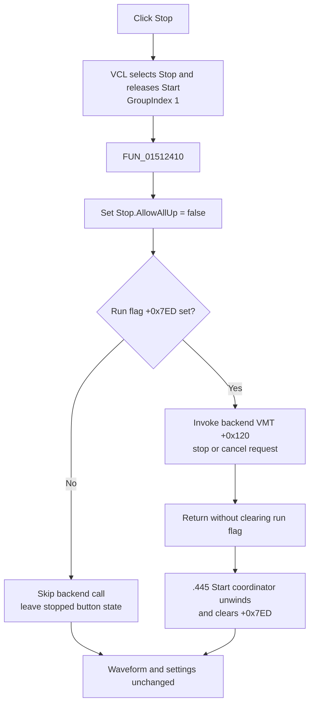

# Request cancellation of active digital generation

> Analysis status: Evidence-backed source review complete.

## Control

| Property | Recovered value |
| --- | --- |
| Form | DigitalSignalGeneratorWin |
| Form caption | Digital Signal Generator |
| Component path | DigitalSignalGeneratorWin.StartGroupBox.FStopBtn |
| Control class | TSpeedButton |
| Caption | Stop |
| Group index | `1`, shared with `FStartBtn` |
| Handler name | StopBtnClick |
| Handler address | 01512410 |
| Graph node | `resource:dfm:DigitalSignalGeneratorWin/DigitalSignalGeneratorWin.StartGroupBox.FStopBtn` |
| Handler node | `function:01512410` |
| Graph layer | UI |

## What happens when clicked

`FUN_01512410` performs two operations in order:

1. It sets `FStopBtn.AllowAllUp` to false through the shared VCL speed-button setter.
2. It tests the form's run flag at `+0x7ED`. Only when that flag is nonzero does it invoke virtual method `+0x120` on the Digital Signal Generator backend at form field `+0xEE0`.

The paired start coordinator invokes backend method `+0x118` to start work. The adjacent `+0x120` call, its Stop binding, and its run-flag guard establish this call as the backend stop or cancellation request. The target remains indirect, so its lower driver or hardware implementation is not recovered here.

The handler does not clear the run flag and does not wait for a completion status. It returns immediately after the backend call returns.

## Active-run ownership

The Start path owns the active interval:

- `FUN_01512260` rejects failed preflight before it sets `+0x7ED`.
- After preflight succeeds, it sets `+0x7ED = 1`, prepares graph limits and button state, and invokes the backend start operation.
- It can enter a form-owned generation or processing callback while the flag remains set. This is the interval in which a Stop click reaches backend method `+0x120`.
- The Start coordinator clears `+0x7ED` only when its run path unwinds.

Stop therefore requests cancellation but does not itself complete cleanup. It does not clear a timer, reset the run flag, release a backend object, or restore Start/Stop button state after the backend finishes. No timer object is read or written in this handler.

## Button-state behavior

`FStartBtn` and `FStopBtn` are in speed-button `GroupIndex = 1`. The VCL selects Stop and releases Start before it dispatches `OnClick`. The handler then enforces `AllowAllUp = false` for Stop, so the stopped state cannot be released into an all-buttons-up state through a normal click.

The shared setter first compares the current `AllowAllUp` byte. If it is already false, this call changes nothing. If it changes the property, it sends the VCL group update. The handler does not directly write either button's `Down`, `Enabled`, or `Visible` property.

Normal final run-state cleanup remains owned by the `.445` Start coordinator. The Stop click's visible state change is primarily the normal grouped-speed-button action that occurs before this event handler.

## Backend, data, and persistence boundaries

- While `+0x7ED` is nonzero, the handler sends one stop request to the current backend object. It does not choose a channel, pattern group, clock source, trigger source, or output mode.
- It does not alter the channel transition lists, parsed pattern buffer, cursor positions, display limits, clock period, measurement length, channel enabled flags, or loaded data.
- It does not rebuild the plot or erase captured or generated waveform data.
- It does not start a new backend operation or call a direct Windows, driver, or device API.
- It has no file, registry, INI, save-dialog, or serialization call. Stop does not persist or discard the current generator data.

The backend can stop active hardware or processing behind its virtual interface, but the recovered handler gives no direct evidence of the exact device command, final output level, or latency.

## Repeated clicks and failures

- If `+0x7ED` is zero, the backend call is skipped. The click only leaves Stop as the selected, non-releasable member of the button group.
- A later inactive Stop click follows the same guarded no-backend path.
- If the user clicks Stop again before the Start coordinator clears `+0x7ED`, the handler can invoke the backend stop method again. It has no one-shot cancellation byte.
- The backend method has no checked return value. The handler shows no success or failure message and performs no retry.
- There is no local exception handler. Because the VCL button-property step occurs first, an exception from the backend stop method can leave Stop selected while the run flag remains set. The Start coordinator must still unwind to clear that flag.
- The handler has no rollback or fallback cleanup. It does not destroy or replace the backend after a failed stop request.

## Stop flow

## Source evidence

- Stop handler, button-property update, run-flag guard, and backend stop call: [FUN_01512410](../../../DecompiledSources/Tina16/functions/0000000001512410__FUN_01512410.c)
- Shared VCL `AllowAllUp` setter: [FUN_0082a890](../../../DecompiledSources/Tina16/functions/000000000082A890__FUN_0082a890.c)
- Shared VCL `Down` setter and group-state behavior: [FUN_0082a6c0](../../../DecompiledSources/Tina16/functions/000000000082A6C0__FUN_0082a6c0.c)
- Start wrapper and active-run coordinator: [FUN_01512200](../../../DecompiledSources/Tina16/functions/0000000001512200__FUN_01512200.c) and [FUN_01512260](../../../DecompiledSources/Tina16/functions/0000000001512260__FUN_01512260.c)
- Backend creation and form run-flag initialization: [FUN_0150f690](../../../DecompiledSources/Tina16/functions/000000000150F690__FUN_0150f690.c)
- Recovered captions, group indexes, layout, and event bindings: [ui-evidence.json](../../../DecompiledSources/Tina16/resources/dfm/ui-evidence.json)

## Evidence and annotation limits

- `FStopBtn` has no recovered hint, action, image reference, or extracted glyph. The stop meaning is established by the event binding, active-run guard, and paired backend start and stop slots.
- The backend method target is indirect. This article describes it as a stop or cancellation request, not as a proven device-specific command.
- This Bead owns only the canonical annotation for `FUN_01512410`. The `.445` Start article owns its wrapper and coordinator. Generic VCL grouped-button helpers and indirect backend operations remain evidence only.
