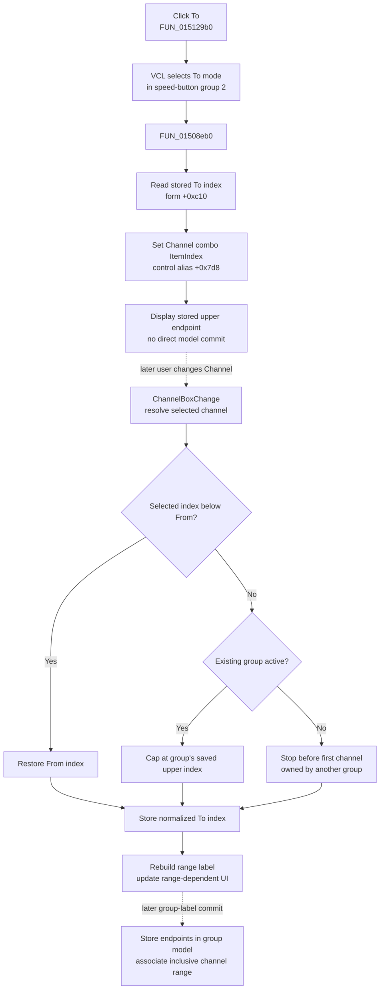

# Select the To channel endpoint

> Analysis status: Evidence-backed source review complete.

## Control

| Property | Recovered value |
| --- | --- |
| Form | DigitalSignalGeneratorWin |
| Component path | DigitalSignalGeneratorWin.ChannelGroupBox.FToChnSpBtn |
| Control class | TSpeedButton |
| Caption | To |
| Group index | 2 |
| Handler name | ToChnSpBtnClick |
| Handler address | 015129b0 |
| Graph node | `resource:dfm:DigitalSignalGeneratorWin/DigitalSignalGeneratorWin.ChannelGroupBox.FToChnSpBtn` |
| Handler node | `function:015129b0` |
| Graph layer | UI |

The **From** and **To** speed buttons share group index `2`. They select which endpoint the Channel drop-down edits. The recovered Channel group also has a group-label selector and editor, **On**, and **Del** controls. Its DFM channel items start as `A`, `B`, `C`, and `D`; runtime initialization can replace or extend the list.

## What happens when clicked

`TDigitalSignalGeneratorWin.ToChnSpBtnClick` delegates to one helper. The helper sets the channel combo at form alias `+0x7d8` to the stored To index at `+0xc10`.

The click therefore has two direct UI effects:

1. VCL selects the **To** speed button in the mutually exclusive From/To button group.
2. The Channel drop-down displays the stored upper endpoint.

It does not increment or decrement a channel number. It does not calculate a new To index from the current selection. It restores the already stored endpoint so that a later Channel selection edits the upper bound.

## Endpoint and range semantics

The form maintains two zero-based channel indexes:

- `+0xc0c` is the From or lower endpoint.
- `+0xc10` is the To or upper endpoint.

The direct helper does not validate or normalize `+0xc10`. Normal channel-selection flows maintain `From <= To`:

- Selecting an existing group loads its saved lower and upper indexes from group-object fields `+0x3c` and `+0x40`.
- Changing the Channel drop-down in From mode stores the selected index as From and initially makes To equal to From.
- Changing the Channel drop-down in To mode rejects an index below From by restoring the From index.
- When no group is active, To can extend through ungrouped channels only. The change helper stops before the first channel already attached to another group.
- When an existing group is active, the change helper caps To at that group's saved upper index.

The click itself only selects the stored To value. It does not call the later range-normalization helper explicitly.

## Channel, group, and display propagation

The recovered click handler and To helper contain no explicit call to `ChannelBoxChange`. Their direct path only invokes the combo ItemIndex setter. When the user later chooses a different Channel while To mode is down, the separate change path:

- resolves the selected channel object;
- applies the From lower bound and the active-group or ungrouped-channel upper bound;
- stores the resulting item index in `+0xc10`;
- rebuilds the visible single-channel or From/To range label; and
- updates the range-dependent control enable state.

The From button uses the parallel helper and restores `+0xc0c`. Changing From also selects or clears the group attached to the chosen channel and resets To to the new From index.

Group-label selection can load an existing group's endpoint indexes and select whichever endpoint mode is active. Pressing Enter or leaving the group-label editor reaches a separate commit path. That path creates or updates the group object, stores From and To, and associates every channel in the inclusive range with the group.

The To click reaches none of those group-commit calls. It does not toggle **On**, delete or rename a group, rebuild the channel collection, or call a signal-generator hardware interface.

## Click flow

The dotted steps are downstream context. They are not additional direct calls from the To click handler.

## Display, model, and persistence boundaries

- The immediate display change is the speed-button mode and Channel combo selection.
- The immediate form-state input is the existing To index. The handler does not write `+0xc0c` or `+0xc10`.
- Channel resolution, range normalization, label rebuilding, and range-dependent enable state belong to `ChannelBoxChange` and its shared helper.
- Group membership changes only in the separate group-label commit path.
- Channel enable or disable state belongs to the **On** control and its separate handler.
- The To click does not serialize the generator, write a file, update the registry or an INI value, or send an external command. A later Data Save or owner workflow is a separate persistence boundary.

## No-op and error behavior

- If To is already the active mode and the Channel combo already shows `+0xc10`, the recovered handler has no additional model work. It calls the same setter with the same value.
- The helper has no empty-list or range guard. If the stored index is stale or outside the combo's current items, it passes that value to VCL. The recovered source does not establish whether that setter clears the selection, clamps it, or raises for this control state.
- A later Channel change with item index `-1` returns without changing the endpoint or display state.
- No message, confirmation, fallback index, retry, or rollback is present in the click path.
- The handler has no local exception block. A VCL control exception would propagate through the click event.
- The click does not start or stop signal generation, so running-state failures are outside this path.

## Recovered evidence

- [`FUN_015129b0`](../../../DecompiledSources/Tina16/functions/00000000015129B0__FUN_015129b0.c) is `TDigitalSignalGeneratorWin.ToChnSpBtnClick`; it contains only the call to the To-selection helper.
- [`FUN_01508eb0`](../../../DecompiledSources/Tina16/functions/0000000001508EB0__FUN_01508eb0.c) passes form field `+0xc10` to virtual ItemIndex setter `+0x268` on the combo at `+0x7d8`. This Bead owns its canonical annotation.
- The [From endpoint article](ffromchnspbtn-1da42fb93d.md) documents the parallel [`FUN_01512990`](../../../DecompiledSources/Tina16/functions/0000000001512990__FUN_01512990.c) and [`FUN_01508e80`](../../../DecompiledSources/Tina16/functions/0000000001508E80__FUN_01508e80.c) path that uses `+0xc0c`; Bead `.422` owns those annotations.
- [`FUN_01512970`](../../../DecompiledSources/Tina16/functions/0000000001512970__FUN_01512970.c) delegates the Channel drop-down change event to [`FUN_01508260`](../../../DecompiledSources/Tina16/functions/0000000001508260__FUN_01508260.c). That shared helper enforces endpoint order and group boundaries, updates the current channel and endpoint state, and refreshes range display state.
- [`FUN_01512950`](../../../DecompiledSources/Tina16/functions/0000000001512950__FUN_01512950.c) and [`FUN_01508880`](../../../DecompiledSources/Tina16/functions/0000000001508880__FUN_01508880.c) load an existing group's saved endpoint indexes and select the endpoint for the active From/To mode.
- [`FUN_01507de0`](../../../DecompiledSources/Tina16/functions/0000000001507DE0__FUN_01507de0.c) creates or updates a named group and stores `+0xc0c` and `+0xc10` into group fields `+0x3c` and `+0x40`. [`FUN_01507c10`](../../../DecompiledSources/Tina16/functions/0000000001507C10__FUN_01507c10.c) assigns the inclusive channel range to that group.
- [`FUN_0150f3d0`](../../../DecompiledSources/Tina16/functions/000000000150F3D0__FUN_0150f3d0.c) establishes the control aliases used by the shared Digital Signal Generator and Logic Analyzer channel-group code.
- [`ui-evidence.json`](../../../DecompiledSources/Tina16/resources/dfm/ui-evidence.json) supplies the Channel group, From/To labels and speed-button group, channel and group-label controls, initial item text, and event bindings.

## Analysis limits

The original Delphi field names for `+0xc0c`, `+0xc10`, and the aliased control pointers are not recovered. Their endpoint roles are established by the paired From/To helpers and by the later group-object copy. The VCL ItemIndex setter is virtual, so this article does not claim an unobserved out-of-range result or an unobserved `OnChange` callback. Beads `.421`, `.422`, and `.423` own the neighboring On, From, and Delete controls; shared helpers remain evidence-only here.
