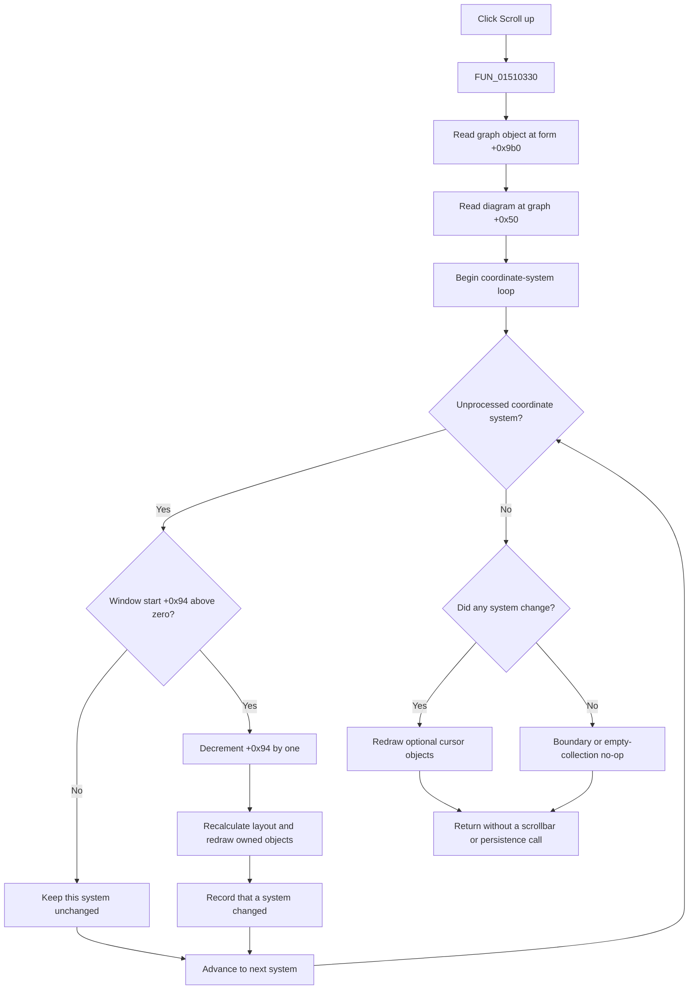

# Scroll the displayed signal-axis window up

## Control

| Property | Recovered value |
| --- | --- |
| Form | DigitalSignalGeneratorWin |
| Component path | DigitalSignalGeneratorWin.DisplayGroupBox.FUpScrollBtn |
| Control class | TSpeedButton |
| Caption | Not present in the recovered resource. |
| Hint | Scroll up |
| Handler name | UpScrollBtnClick |
| Handler address | 01510330 |
| Graph node | `resource:dfm:DigitalSignalGeneratorWin/DigitalSignalGeneratorWin.DisplayGroupBox.FUpScrollBtn` |
| Handler node | `function:01510330` |
| Graph layer | UI |

The resource includes a 9-by-9 upward-arrow glyph. The hint and glyph confirm the direction. The recovered model path establishes what moves and where it stops.

## What happens when clicked

`FUN_01510330` delegates the click to `FUN_01506f30`. The wrapper reads the Digital Signal Generator graph object at form offset `+0x9b0`. `FUN_010eb680` then obtains that graph's diagram object at offset `+0x50` and enters the shared whole-diagram up-shift operation.

The operation visits every coordinate system in the diagram. It does not read the selected channel, selected pattern group, From or To channel, pointer position, or keyboard modifiers. It therefore attempts the same one-position display shift for all coordinate systems.

## Displayed-axis window and direction

Each coordinate system stores:

- displayed-window start at offset `+0x94`; and
- displayed active-Y-axis count at offset `+0x98`.

The layout helper uses these fields to select a consecutive window of active Y-axis entries for display. In the Digital Signal Generator, these axes present active signal traces. The button changes which trace axes are displayed. It does not select, reorder, enable, or edit an underlying generator channel.

For each coordinate system, the shared bounded step does this:

- If start `+0x94` is greater than zero, subtract one.
- If start is zero or negative, make no change.

Thus, **Scroll up** moves the displayed window toward its first eligible axis. It moves by one position, not by the displayed count and not by one page. It does not wrap at zero. The paired **Scroll down** control uses the opposite lower-bound check and increments the start only while another active-axis position remains available.

## Layout, redraw, cursors, and scrollbars

A successful per-system step recalculates that coordinate system's layout. It then redraws the objects owned by that system, including its axes and related diagram content.

The whole-diagram helper combines the changed results. If at least one coordinate system moved, it redraws the two optional diagram objects at offsets `+0xf0` and `+0xf8`, which the established graph analysis identifies as cursor objects. This is a cursor redraw only. The click path does not change recovered cursor positions or selected cursors.

If no coordinate system moves, the helper skips per-system layout, owned-object redraw, and optional cursor redraw. Unlike the DFWindow UpScrollCSBtn handler, this Digital Signal Generator wrapper does not call the separate DFWindow scrollbar-state updater. No VCL scrollbar position, limit, or visibility update is present in this click path. The up and down speed buttons are the recovered display-navigation controls on this form.

## Scope and model effects

The click changes live diagram layout field `+0x94`. It does not change:

- channel sample or pattern data;
- channel enabled state or compact active-channel index;
- clock period, sample count, or displayed numeric axis limits;
- generator start or stop state; or
- group membership and selection.

The wrapper is also called by the Logic Analyzer's matching Scroll up handler. This repeated use supports a shared signal-instrument graph-navigation role. It does not change the Digital Signal Generator control's all-coordinate-system scope.

## Repeated clicks and bounds

- Each delivered `OnClick` attempts one decrement for each coordinate system.
- Repeated clicks move each eligible start toward zero, one position per click.
- Coordinate systems reach the zero boundary independently. One system can remain at zero while another still moves.
- When all systems are at the boundary, the click is a silent no-op with no redraw.
- An empty coordinate-system collection is also a silent no-op.
- The application handler contains no timer, acceleration, or repeat loop. The source proves one step per delivered event, not automatic repetition while the mouse button is held.

## Persistence and error boundaries

The coordinate-system archive writer stores fields `+0x94` and `+0x98`, and its reader restores them. A later enclosing diagram archive can therefore preserve this displayed-axis state. This click does not call that writer, the `.dsg` writer, a settings writer, a project-save routine, an undo helper, or a modified-state setter. The immediate effect is an in-memory display-model change.

The handler and wrapper have no null guard, returned-error test, exception handler, retry, transaction, or rollback. They assume that the form graph and its diagram are initialized. The whole-diagram helper processes coordinate systems in collection order. If layout or redraw fails after an earlier system moved, the earlier field change can remain while later systems are not processed.

## Scroll flow

## Evidence

- [Click handler `FUN_01510330`](../../../DecompiledSources/Tina16/functions/0000000001510330__FUN_01510330.c) delegates directly to the signal-instrument wrapper.
- [`FUN_01506f30`](../../../DecompiledSources/Tina16/functions/0000000001506F30__FUN_01506f30.c) reads graph field `+0x9b0` and calls the common up proxy.
- [`FUN_010eb680`](../../../DecompiledSources/Tina16/functions/00000000010EB680__FUN_010eb680.c) reads diagram field `+0x50` and delegates to the canonical whole-diagram helper.
- [`FUN_01ad1480`](../../../DecompiledSources/Tina16/functions/0000000001AD1480__FUN_01ad1480.c) visits all coordinate systems, combines their results, and redraws optional cursor objects only after a change.
- [`FUN_01ce6390`](../../../DecompiledSources/Tina16/functions/0000000001CE6390__FUN_01ce6390.c) contains the start-above-zero guard, one-position decrement, layout call, and owned-object redraw.
- [`FUN_01ce34b0`](../../../DecompiledSources/Tina16/functions/0000000001CE34B0__FUN_01ce34b0.c) uses `+0x94` and `+0x98` to select displayed active Y-axis entries.
- [`FUN_01ce6500`](../../../DecompiledSources/Tina16/functions/0000000001CE6500__FUN_01ce6500.c) and [`FUN_01ce6660`](../../../DecompiledSources/Tina16/functions/0000000001CE6660__FUN_01ce6660.c) restore and store the two display-window fields.
- [Paired Scroll down analysis](fdownscrollbtn-c0540b1b53.md) provides the opposite-direction comparison.
- [Extracted upward-arrow glyph](../../../glyph/0115_DigitalSignalGeneratorWin_DigitalSignalGeneratorWin_DisplayGroupBox_FUpScrollBtn_Glyph_Data.png) provides supporting direction evidence only.

## Annotation ownership

This Bead owns `FUN_01510330` and the shared signal-instrument up wrapper `FUN_01506f30`. `TIARA-diz.6.7.378` owns the whole-diagram dispatcher `FUN_01ad1480` and bounded coordinate-system step `FUN_01ce6390`. The common graph proxy, layout, redraw, cursor, archive, and scrollbar helpers are evidence-only here.
