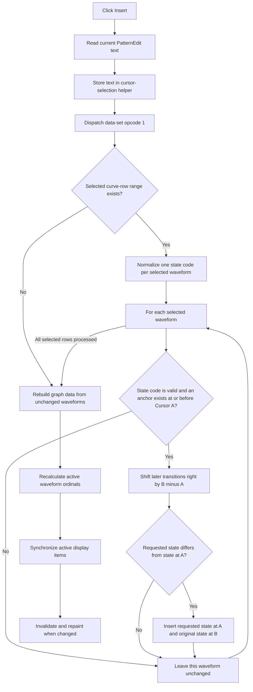

# Insert the cursor interval into the digital pattern

## Control

| Property | Recovered value |
| --- | --- |
| Form | DigitalSignalGeneratorWin |
| Component path | DigitalSignalGeneratorWin.DataGroupBox.DataSetGroupBox.InsertSpBtn |
| Control class | TSpeedButton |
| Caption | Insert |
| Hint | Not present in the recovered resource. |
| Data scope | `From Cursor A to B` |
| Handler name | InsertSpBtnClick |
| Handler address | 01512650 |
| Graph node | `resource:dfm:DigitalSignalGeneratorWin/DigitalSignalGeneratorWin.DataGroupBox.DataSetGroupBox.InsertSpBtn` |
| Handler node | `function:01512650` |
| Graph layer | UI |

## What happens when clicked

Insert adds one cursor-width interval to each selected digital waveform. It inserts at Cursor A, shifts all later transitions to the right by `Cursor B - Cursor A`, and uses the corresponding logic-state symbol from `PatternEdit` as the content of the inserted interval.

The handler reads the current `PatternEdit` text and stores it in the cursor-selection helper. It then calls the shared data-set operation dispatcher with opcode 1, the insert operation. The dispatcher does work only when a curve-row selection is present. It normalizes a copy of the pattern text to the count of selected rows, and then applies the insertion to each selected waveform's event list.

For one waveform, the insert mutator finds the last transition at or before Cursor A. If it cannot find that anchor, it leaves the waveform unchanged. Otherwise, it shifts every later transition by the cursor interval width. If the requested logic state differs from the state at the anchor, it creates a transition to the requested state at Cursor A and a transition back to the original state at Cursor B. If both states are equal, the time shift alone extends that state across the inserted interval.

## Pattern content and allocation

The DFM default text is `[01-00000]`, but the click always reads the current editor text. The shared normalizer removes the two delimiter characters, converts accepted lowercase symbols to uppercase, and maps four accepted symbols to internal state codes. It truncates extra symbols or pads missing symbols with its table-defined default until there is one byte for each selected waveform. An invalid symbol becomes internal code 5; the insert mutator explicitly skips that waveform. The handler does not write the normalized copy back to `PatternEdit`.

The cursor-selection helper owns the one-byte-per-selected-waveform state buffer. Normalization frees the previous buffer and allocates a replacement with the current selected-row count. Each waveform event list is dynamic. When a changed state needs two new transition objects, the mutator creates them and transfers them to that waveform's list. There is no fixed-capacity check or user confirmation in the click handler.

## Display, selection, and generator effects

After the per-waveform operation, the shared dispatcher replaces and rebuilds the graph data cache from all waveform event lists. The click handler then recalculates the ordinal of each active waveform and runs the shared active-item synchronization path. That path invalidates and repaints the graph when its item callback reports a change.

The handler does not change Cursor A, Cursor B, or the selected curve-row range. It does not select a newly created event because events are not exposed as a separate list selection. It also does not call the Start, Stop, generator-mode, clock, or direct device-output paths. The updated event lists are live generator-window model data, but an immediate hardware upload or output transition is not present in this call chain.

## Click flow

## No-op, repeated-click, and failure behavior

- With no selected curve-row range, no event list changes. The dispatcher still rebuilds the graph data cache, and the handler still runs the ordinal and display synchronization steps.
- A selected waveform is unchanged when its normalized pattern state is code 5 or its event list has no transition at or before Cursor A.
- The handler has no explicit guard for equal or reversed cursor times. Other cursor code supplies the two bounds, but this handler does not repair them.
- A repeated click is not idempotent. Each successful click inserts another interval and shifts later transitions again.
- Dynamic-list insertion checks its index and grows capacity. An invalid index, failed growth, allocation failure, or other exception is not caught here. There is no rollback across waveforms. If a later waveform fails, earlier waveforms can remain changed, and the final rebuild and synchronization calls are not reached.
- Pattern-buffer replacement occurs before waveform mutation. The helper frees its old buffer before it allocates and fills the replacement, and this path has no local recovery dialog.
- No file, registry, or INI write is present. The click changes the live waveform model only. Durable persistence is not proven.

## Handler evidence

- [Insert handler `FUN_01512650`](../../../DecompiledSources/Tina16/functions/0000000001512650__FUN_01512650.c) reads `PatternEdit`, stores the text in the selection helper, dispatches opcode 1, and then invokes the ordinal and active-item refresh helpers.
- [Shared data-set dispatcher `FUN_01512f00`](../../../DecompiledSources/Tina16/functions/0000000001512F00__FUN_01512f00.c) checks for a selected row range, normalizes the pattern once, applies opcode 1 to each selected waveform, and always calls the graph-data rebuild after the optional mutation loop.
- [Pattern normalizer `FUN_0150efa0`](../../../DecompiledSources/Tina16/functions/000000000150EFA0__FUN_0150efa0.c) resizes the owned state buffer to the selected-row count, pads or truncates the copied text, maps accepted characters, and assigns skip code 5 for invalid input.
- [Single-waveform insert mutator `FUN_01d3ab30`](../../../DecompiledSources/Tina16/functions/0000000001D3AB30__FUN_01d3ab30.c) finds the anchor at or before Cursor A, shifts later event times by the interval width, and inserts state transitions when needed.
- [Transition constructor `FUN_01d3aa00`](../../../DecompiledSources/Tina16/functions/0000000001D3AA00__FUN_01d3aa00.c) constructs the timed state objects. [Dynamic-list insertion `FUN_00b94f50`](../../../DecompiledSources/Tina16/functions/0000000000B94F50__FUN_00b94f50.c) grows the list or raises its standard list error.
- [Graph-data rebuild `FUN_01513140`](../../../DecompiledSources/Tina16/functions/0000000001513140__FUN_01513140.c) releases the previous cache, creates a replacement, and copies all waveform points into it.
- [Active-waveform ordinal repair `FUN_01506c70`](../../../DecompiledSources/Tina16/functions/0000000001506C70__FUN_01506c70.c) rewrites the sequential ordinal on active list items. [Shared active-item synchronization `FUN_010f6920`](../../../DecompiledSources/Tina16/functions/00000000010F6920__FUN_010f6920.c) visits active items and requests graph invalidation when its callback reports a change.
- [Graph invalidation helper `FUN_010e8e30`](../../../DecompiledSources/Tina16/functions/00000000010E8E30__FUN_010e8e30.c) updates the graph surface and requests a repaint.
- [Recovered Delphi resource evidence](../../../DecompiledSources/Tina16/resources/dfm/ui-evidence.json) establishes the `Insert` binding, the `From Cursor A to B` group caption, the pattern editor and its default text, and the sibling Set, Repeat, and Delete operations.

## Direct calls

- `FUN_0064dd90` reads the Unicode text from `PatternEdit`.
- `FUN_00414ad0` assigns that text to the cursor-selection helper.
- `FUN_01512f00` dispatches insert opcode 1 and rebuilds graph data.
- `FUN_01506c70` recalculates active waveform ordinals.
- `FUN_010f6920` synchronizes active display items.
- `FUN_00414480` finalizes the local Unicode string.

## Resource evidence

- `InsertSpBtn` is a `TSpeedButton` with caption `Insert`, `AllowAllUp = true`, and no recovered hint or glyph.
- Its parent group is captioned `From Cursor A to B`.
- `PatternEdit` has the recovered default text `[01-00000]` and key handlers that constrain or accept pattern input.
- `Set`, `Repeat`, and `Delete` are sibling operations over the same cursor range. `RepeatingEdit` defaults to `1`, but Insert does not read it.

## Analysis limits

- The four table-backed valid state symbols are not all named by the recovered code. The default resource text confirms `0`, `1`, and `-`, but this article does not invent a name for the fourth code.
- The active-item synchronization callback is virtual and unresolved. The code proves display invalidation after a reported change, but it does not prove an immediate device upload.
- This call chain has no save operation, undo transaction, or rollback transaction.
