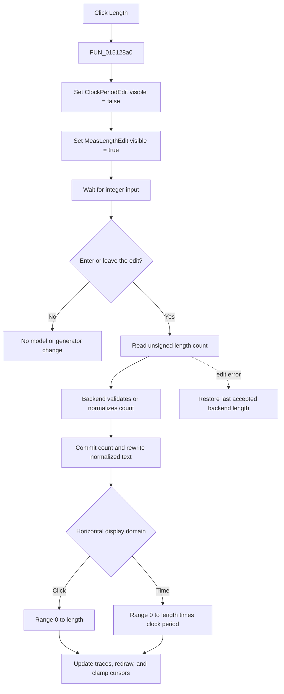

# Show the measurement-length editor

> Analysis status: Evidence-backed source review complete.

## Control

| Property | Recovered value |
| --- | --- |
| Form | DigitalSignalGeneratorWin |
| Form caption | Digital Signal Generator |
| Component path | DigitalSignalGeneratorWin.ClockGroupBox.MeasLengthBtn |
| Control class | TSpeedButton |
| Caption | Length |
| Group index | `1`, shared with `ClockPeriodBtn` |
| Handler name | MeasLengthBtnClick |
| Handler address | 015128a0 |
| Graph node | `resource:dfm:DigitalSignalGeneratorWin/DigitalSignalGeneratorWin.ClockGroupBox.MeasLengthBtn` |
| Handler node | `function:015128a0` |
| Graph layer | UI |

## What happens when clicked

`FUN_015128a0` switches the value editor in the Clock group from period to measurement length. It calls the VCL visibility setter with false for the control at form offset `+0xCD8`, and with true for the control at `+0xDF8`.

The event bindings identify these fields:

- `+0xCD8` is `ClockPeriodEdit`. Its error handler writes the backend clock-period value to this field.
- `+0xDF8` is `MeasLengthEdit`. Its error handler writes the backend measurement-length value to this field.

The resource confirms the visual switch. Both edits have `Left = 8`, `Top = 40`, `Width = 76`, and `Height = 21`, so they occupy the same location. `ClockPeriodEdit` is initially visible, while `MeasLengthEdit` has `Visible = false`. The paired **Period** handler performs the exact inverse visibility change. The two speed buttons also share `GroupIndex = 1`.

The click does not parse the current text, change the clock period, change the measurement length, start the generator, send data to hardware, update a trace, or write settings. Its complete application-level effect is to hide the period edit and show the length edit.

## Measurement-length value and units

`MeasLengthEdit` is a `TIntEdit` with recovered initial text `1000`. It is a count, not a suffixed time value. In contrast, the overlapping `ClockPeriodEdit` is a `TFloatEdit` with initial text `1m`.

The later edit-commit path proves the meaning of the integer:

1. Pressing Enter in `MeasLengthEdit`, or leaving the edit, reaches `FUN_0150fce0` with operation `6`.
2. The function reads an unsigned integer from the edit.
3. It passes the value by address to backend virtual method `+0xE0`, which can normalize or constrain it, then commits the resulting value through virtual method `+0xF0`.
4. It writes the normalized value back to `MeasLengthEdit`.
5. In the sample-index display mode, it sets the horizontal interval to `0 .. length`. In the time display mode, it sets the interval to `0 .. length * clock period`.
6. It updates the plot range, reconciles trace points, requests a redraw, and clamps existing cursor positions to the new interval.

The recovered indirect backend call does not expose fixed minimum or maximum constants. Therefore, the exact permitted count range is not proven. The click handler itself applies no range check. If the integer editor reports an error, `FUN_015128d0` reads the last accepted measurement length through backend virtual method `+0xE8` and restores that value in the edit.

The related **Time** and **Click** controls select the two horizontal domains. The time path uses `length * clock period`; the sample path divides time coordinates by the clock period and uses the resulting integer index. The **Length** click does not select either domain.

## Generator and hardware boundary

The length becomes operational only after the edit is committed. When generation starts, `FUN_01512260` copies the active interval to the trace model and invokes the backend start operation. In its zero-mode branch, it then reads the backend clock period and measurement length and compares their product with the generated data span before it selects the continuation path. This is the downstream timing and sample-count coupling.

No direct hardware or operating-system call occurs in `FUN_015128a0`. The click does not immediately transmit the displayed `1000`, and no recovered file, registry, or INI operation is in this path. Disk persistence of the measurement length is not established by this control's call tree.

## Repeated clicks and errors

- If the period edit is already hidden and the length edit is already visible, the VCL visibility setter detects that each requested state is unchanged and does no further work.
- The handler has no conditional validation, error message, retry, or rollback path because it changes only visibility.
- Invalid or rejected numeric text is handled later by the integer edit. Its error event restores the backend's accepted value.
- The two visibility changes are sequential and have no application-level exception handler. A lower VCL exception could leave only the first change applied, but no such failure is explicitly produced in the recovered code.

## Click and deferred commit flow

## Source evidence

- Length editor visibility switch: [FUN_015128a0](../../../DecompiledSources/Tina16/functions/00000000015128A0__FUN_015128a0.c)
- Inverse Period editor visibility switch: [FUN_01512870](../../../DecompiledSources/Tina16/functions/0000000001512870__FUN_01512870.c)
- Shared VCL visibility setter: [FUN_0064dbe0](../../../DecompiledSources/Tina16/functions/000000000064DBE0__FUN_0064dbe0.c)
- Measurement-length error rollback, Exit, and Enter handlers: [FUN_015128d0](../../../DecompiledSources/Tina16/functions/00000000015128D0__FUN_015128d0.c), [FUN_01512900](../../../DecompiledSources/Tina16/functions/0000000001512900__FUN_01512900.c), and [FUN_01512930](../../../DecompiledSources/Tina16/functions/0000000001512930__FUN_01512930.c)
- Deferred length validation, backend commit, display interval update, and redraw path: [FUN_0150fce0](../../../DecompiledSources/Tina16/functions/000000000150FCE0__FUN_0150fce0.c)
- Clock-period commit and time scaling: [FUN_0150fe40](../../../DecompiledSources/Tina16/functions/000000000150FE40__FUN_0150fe40.c)
- Time and sample-index display-mode handlers: [FUN_01512d60](../../../DecompiledSources/Tina16/functions/0000000001512D60__FUN_01512d60.c) and [FUN_01512e40](../../../DecompiledSources/Tina16/functions/0000000001512E40__FUN_01512e40.c)
- Generator start and period-times-length check: [FUN_01512260](../../../DecompiledSources/Tina16/functions/0000000001512260__FUN_01512260.c)
- Recovered positions, initial text, visibility, group index, and event bindings: [ui-evidence.json](../../../DecompiledSources/Tina16/resources/dfm/ui-evidence.json)

## Evidence and annotation limits

- The **Length** button has no recovered hint, image reference, or extracted glyph. The nearby `X :` label belongs to the separate horizontal-domain controls and is not used as proof of this button's action.
- The `TIntEdit` type, the backend getter and setter data flow, and the period-times-length calculations establish a unitless sample or step count. They do not establish the backend's exact allowed range.
- This Bead owns only the canonical annotation for `FUN_015128a0`. The inverse Period handler belongs to its sibling control. The generic VCL visibility setter and the later shared edit, display, trace, cursor, and start helpers remain evidence only.
