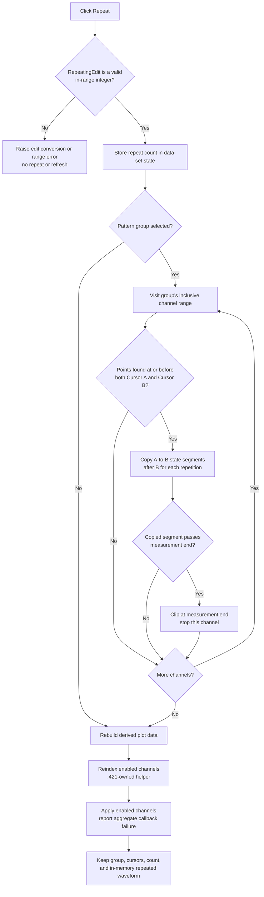

# Repeat the Cursor A-to-B waveform interval

> Analysis status: Evidence-backed source review complete.

## Control

| Property | Recovered value |
| --- | --- |
| Form | DigitalSignalGeneratorWin |
| Form caption | Digital Signal Generator |
| Parent caption | From Cursor A to B |
| Component path | DigitalSignalGeneratorWin.DataGroupBox.DataSetGroupBox.RepeatSpBtn |
| Control class | TSpeedButton |
| Caption | Repeat |
| Handler name | RepeatSpBtnClick |
| Handler address | 01512610 |
| Graph node | `resource:dfm:DigitalSignalGeneratorWin/DigitalSignalGeneratorWin.DataGroupBox.DataSetGroupBox.RepeatSpBtn` |
| Handler node | `function:01512610` |
| Graph layer | UI |

The button has no recovered hint, action, image reference, or glyph. Its sibling `RepeatingEdit` is a `TIntEdit` with initial text `1`. The parent caption and the handler data flow establish the Cursor A-to-B scope.

## What happens when clicked

`FUN_01512610` reads and validates the integer in `RepeatingEdit`. It stores that value as the data-set repeat count, sends repeat opcode `3` to the shared data-set operation dispatcher, rebuilds enabled-channel indexes, and runs the common enabled-channel apply pass.

The operation uses three selections:

- `FPatternGroupBox` supplies the selected pattern-group object. Its fields `+0x3C` and `+0x40` are the first and last channel indexes. The dispatcher visits this inclusive channel range.
- The form-owned data-set state at `+0xED8` supplies the Cursor A and Cursor B time values at `+0x10` and `+0x18`.
- `RepeatingEdit` supplies the number of additional copies. The recovered default is `1`, so the default action adds one copy after the original interval.

For each selected-group channel, the shared dispatcher resolves the channel's transition list at channel offset `+0x148`. Repeat-specific `FUN_01d3b2f0` then copies the waveform segment that applies from Cursor A through Cursor B into later intervals of the same width.

## Exact repeat operation

`FUN_01d3b2f0` treats the waveform as ordered transition points. Each point has a time at offset `+0x08` and a logic-state byte at `+0x10`. It finds the last point at or before Cursor A and the last point at or before Cursor B. If either point is absent, that channel is unchanged.

For repeat number `k`, starting at `1`, the helper adds `k * (B - A)` to every segment boundary in the selected interval. It writes the copied state intervals through the same transition-list interval setter used by the Set command. Thus, the original A-to-B data stays in place and the copies overwrite waveform data after Cursor B. The helper does not shift later data to make room.

The upper boundary is the current generator period multiplied by its measurement-length count. If a copied segment would pass that boundary, the helper writes only through the boundary and returns for that channel. It does not increase the measurement length or generator duration. A high repeat count can therefore request more copies than fit, but the result remains clipped to the existing duration.

## Capacity and partial updates

The repeat helper does not calculate or reserve the final transition count. The interval setter removes redundant interior points and inserts new boundary-point objects only when the copied state requires them. The underlying list insertion grows capacity when its count equals its capacity, using the list's virtual capacity setter with `count + growth`. It raises if capacity cannot grow or if the signed list-count limit is reached.

Mutation is incremental: channels are processed in order, repeats are processed in order, and transition segments are written in order. There is no transaction or rollback. An allocation or lower-level list exception can therefore leave earlier channels or earlier repetitions changed while later work is incomplete.

## Selection, display, and propagation

The handler does not change `FPatternGroupBox.ItemIndex`, the selected group pointer, Cursor A, Cursor B, or the repeat text after a successful parse. It also does not select the newly written transition points. A repeated click uses the same range and repeat count against the waveform produced by the previous click.

The shared dispatcher parses the current `PatternEdit` text into its per-channel code buffer before every operation. Repeat opcode `3` does not read those codes, so they do not determine the copied states. This parse can still resize or replace the internal pattern buffer.

After mutation, the call path:

1. rebuilds the complete derived plot-data object from all current channel transition lists and the existing measurement-end boundary;
2. calls `.421`-owned `FUN_01506c70` to recompute compact indexes for enabled channels; and
3. calls `FUN_010f6920` with mode `0` to visit enabled channels through the form's virtual apply callback and report aggregate callback failure to the owner status object.

The indirect apply callback can propagate the changed waveform beyond this editor, but the recovered call does not prove a direct hardware write. The click does not start or stop the generator.

## Guards, errors, and persistence

- Integer conversion and the `TIntEdit` bounds check happen before the data-set dispatcher. Invalid numeric text or an out-of-range value raises through the edit-control parser, so this handler does not begin the waveform mutation or refresh sequence.
- The edit's `OnError` handler restores the last stored repeat count to the control. Pressing Enter in the edit stores a valid value but does not itself repeat data.
- A repeat count of zero or less reaches the repeat helper but causes no copy loop. The shared display rebuild, reindex, and apply calls still run. The normal `TIntEdit` range can prohibit such a value, but its exact configured limits are not present in the extracted resource.
- If no pattern group is selected, the shared dispatcher skips parsing and channel mutation. It still rebuilds derived plot data, and the handler still reindexes and runs the apply pass. No warning is shown.
- If the group's first channel index is greater than its last index, the channel loop is skipped and the same refresh path still runs.
- If the final apply callback reports failure, the status path runs after the in-memory waveform and derived plot data have changed. There is no rollback.
- No file, registry, INI, project-dirty, or serialization function occurs in this click path. The separate Data Save control owns file persistence.

## Repeat flow

## Source evidence

- Repeat wrapper, count parse, opcode, and refresh order: [FUN_01512610](../../../DecompiledSources/Tina16/functions/0000000001512610__FUN_01512610.c)
- Shared opcode dispatcher, selected group range, and per-channel routing: [FUN_01512f00](../../../DecompiledSources/Tina16/functions/0000000001512F00__FUN_01512f00.c)
- Repeat-specific time shift, copy loop, count loop, and end clipping: [FUN_01d3b2f0](../../../DecompiledSources/Tina16/functions/0000000001D3B2F0__FUN_01d3b2f0.c)
- Transition interval mutation used for each copied segment: [FUN_01d3ad60](../../../DecompiledSources/Tina16/functions/0000000001D3AD60__FUN_01d3ad60.c)
- Dynamic transition-list insertion and capacity growth: [FUN_00b94f50](../../../DecompiledSources/Tina16/functions/0000000000B94F50__FUN_00b94f50.c)
- Integer conversion and configured-range validation: [FUN_00f04d50](../../../DecompiledSources/Tina16/functions/0000000000F04D50__FUN_00f04d50.c)
- Repeat edit restoration and Enter handling: [FUN_01512490](../../../DecompiledSources/Tina16/functions/0000000001512490__FUN_01512490.c) and [FUN_015124f0](../../../DecompiledSources/Tina16/functions/00000000015124F0__FUN_015124f0.c)
- Cursor-to-data-set interval synchronization: [FUN_015126e0](../../../DecompiledSources/Tina16/functions/00000000015126E0__FUN_015126e0.c)
- Selected pattern-group assignment: [FUN_015106a0](../../../DecompiledSources/Tina16/functions/00000000015106A0__FUN_015106a0.c)
- Derived plot-data rebuild: [FUN_01513140](../../../DecompiledSources/Tina16/functions/0000000001513140__FUN_01513140.c)
- Canonical enabled-channel reindexer: [FUN_01506c70](../../../DecompiledSources/Tina16/functions/0000000001506C70__FUN_01506c70.c)
- Enabled-channel apply and aggregate-failure path: [FUN_010f6920](../../../DecompiledSources/Tina16/functions/00000000010F6920__FUN_010f6920.c)
- Recovered captions, default repeat text, group items, and event bindings: [ui-evidence.json](../../../DecompiledSources/Tina16/resources/dfm/ui-evidence.json)

## Evidence and annotation limits

- Bead `.435` owns the canonical annotation for shared dispatcher `FUN_01512f00`. Bead `.421` owns `FUN_01506c70`. This Bead owns only repeat wrapper `FUN_01512610` and repeat-specific mutator `FUN_01d3b2f0`.
- The Set article owns the shared interval setter. Integer-edit, list-storage, pattern-parser, derived-display, and enabled-channel apply helpers remain evidence only here.
- The exact `TIntEdit` minimum and maximum are not in the extracted resource. The parser proves that it enforces configured bounds, but this article does not invent their values.
