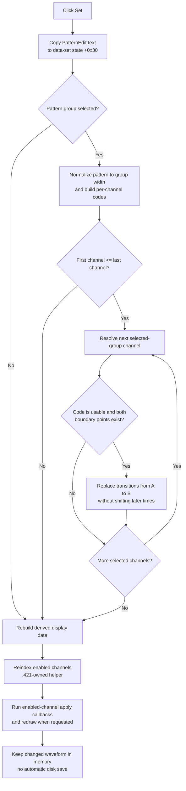

# Set the selected pattern-group state from Cursor A to B

> Analysis status: Evidence-backed source review complete.

## Control

| Property | Recovered value |
| --- | --- |
| Form | DigitalSignalGeneratorWin |
| Form caption | Digital Signal Generator |
| Parent caption | From Cursor A to B |
| Component path | DigitalSignalGeneratorWin.DataGroupBox.DataSetGroupBox.SetSpBtn |
| Control class | TSpeedButton |
| Caption | Set |
| Allow all up | true |
| Handler name | SetSpBtnClick |
| Handler address | 01512580 |
| Graph node | `resource:dfm:DigitalSignalGeneratorWin/DigitalSignalGeneratorWin.DataGroupBox.DataSetGroupBox.SetSpBtn` |
| Handler node | `function:01512580` |
| Graph layer | UI |

The button has no recovered hint, action, image reference, or glyph. The parent caption and the source data flow establish the Cursor A-to-B scope. `AllowAllUp` changes the speed-button presentation only. The handler does not read the button's `Down` state.

## What happens when clicked

`FUN_01512580` reads the current text from `PatternEdit` at form offset `+0xD68` and copies it to field `+0x30` of the form-owned data-set state at `+0xED8`. It then sends Set opcode `0` to the shared data-set dispatcher `FUN_01512f00`.

The command has two other selections:

- The `FPatternGroupBox` combo box contains groups `A`, `B`, `C`, and `D`. Its change handler stores the selected group object at data-set-state offset `+0x40`. That group supplies inclusive first and last channel indexes at `+0x3C` and `+0x40`.
- Cursor synchronization stores Cursor A and Cursor B times at data-set-state offsets `+0x10` and `+0x18`. The same synchronization also keeps period-relative cursor indexes at `+0x08` and `+0x0A`, but Set passes the double-precision time fields to the waveform mutator.

For every channel in the selected group's inclusive channel range, the dispatcher resolves the channel transition list at channel offset `+0x148`. It passes that list, Cursor A, Cursor B, and the channel's parsed pattern code to `FUN_01d3ad60`.

This changes the existing waveform interval. It does not insert or remove time, change the clock period, change the measurement length, add or remove a channel, move either cursor, or change the selected group.

## Pattern input and per-channel validation

`FUN_0150efa0` prepares one byte code for each channel in the selected group:

1. It copies the stored pattern string and removes the recovered opening and closing delimiter characters.
2. It pads a short pattern to the group width with the table's code-2 symbol, or truncates a long pattern to that width.
3. It converts lower-case letters to upper case.
4. It maps four accepted table symbols to codes `0` through `3`. Other recovered functions serialize these codes as `Low`, `High`, `Dontcare`, and `HighZ`. The default resource text `[01-00000]` confirms the displayed `0`, `1`, and `-` forms for the first three states.
5. It stores code `5` for a character that is not in the four-symbol table. The waveform mutator treats code `5` as "do not set this channel."

The parser changes only its local normalized string and the internal byte buffer at data-set-state offset `+0x28`. It does not write the normalized text back to `PatternEdit` in this click path. The edit's key handler filters and upper-cases normal typed input, but pasted or programmatically assigned text still reaches this parser.

Validation is per channel, not all-or-nothing. A code-5 entry leaves its channel unchanged, while valid entries for other channels can still be applied. An empty pattern is padded with code 2 for the complete selected group; it is not treated as a canceled command. The recovered Set path does not read the nearby `Bin` or `Hex` button state.

## Exact overwrite scope

Each channel waveform is an ordered list of transition points. A point stores its time at `+0x08` and its logic-state code at `+0x10`. `FUN_01d3ad60` first returns without a mutation for pattern code `5`. For another code, it searches backward for the last transition at or before Cursor A and the last transition at or before Cursor B. It also returns without a mutation if either boundary point is not available.

When both boundaries exist, the mutator removes redundant transitions inside the interval and adjusts or inserts boundary transitions so the requested state applies from Cursor A to Cursor B. If the requested state differs from an unchanged boundary state, it inserts a transition to the requested state at Cursor A and restores the previous state at Cursor B. If existing boundary transitions already provide the required state change, it moves or removes them instead of keeping duplicate points.

The mutator does not shift transition times after Cursor B. This is the important difference from sibling [Insert](insertspbtn-3a55e14297.md) and [Delete](deletespbtn-32d67193f1.md) operations. A repeated Set with the same pattern normally removes no additional information after the transition list is already normalized, but the handler still performs parsing and every refresh call.

## Display, apply path, and persistence

After all selected channels are processed, the shared dispatcher always calls `FUN_01513140`. This function releases the old derived sampled-data object at form offset `+0x880`, creates a replacement, and rebuilds one display series for every channel. It copies the current transition points, converts X values to Time or Click coordinates, and adds the terminal state at `clock period * measurement length`.

The Set wrapper then calls these shared functions:

1. `.421`-owned `FUN_01506c70` recalculates each enabled channel's compact active index at `+0x94`.
2. `FUN_010f6920` with mode `1` visits enabled channels through the form's indirect per-channel apply callback. If a callback returns the shared update flag, it requests the common plot geometry and redraw path.

This is immediate in-memory model and display propagation. The indirect callback does not prove a direct driver or hardware write. Set does not call the generator Start path, and it does not start or stop output. A later generator operation can use the changed channel model.

Set also does not call a file, registry, INI, or serialization function and does not set a proven dirty flag. The separate Data Save workflow serializes the channel transition lists. Therefore, this click does not persist the edit to disk by itself.

## Guards, partial failures, and repeated clicks

- If no pattern group is selected, the dispatcher skips parsing and every waveform mutation. It still rebuilds derived display data, and the wrapper still reindexes and runs the enabled-channel apply pass. No message is shown.
- If the group's first channel index is greater than its last index, no channel is changed. The same refresh path still runs.
- A code-5 pattern entry or a channel without both boundary points is a silent per-channel no-op. Other selected channels can still change.
- The handler copies `PatternEdit` into the data-set state before it checks whether a group is selected. Thus, a no-group click can still change the stored pattern string.
- Channel lookups and mutations occur in order. There is no transaction, local exception handler, undo record, or rollback. An invalid index, allocation failure, or lower exception can leave the stored pattern, parsed buffer, and earlier channel lists changed while later channels and refresh steps are incomplete.
- The display object is rebuilt before reindexing and the indirect apply pass. A later failure does not restore the old waveform or old derived display object.
- Repeated clicks execute the complete path again. The `AllowAllUp` property does not turn a second click into an Undo operation.

## Set flow

## Source evidence

- Set wrapper, pattern snapshot, operation code, and refresh order: [FUN_01512580](../../../DecompiledSources/Tina16/functions/0000000001512580__FUN_01512580.c)
- Shared opcode dispatcher, group range, and per-channel routing: [FUN_01512f00](../../../DecompiledSources/Tina16/functions/0000000001512F00__FUN_01512f00.c)
- Pattern normalization and code-buffer preparation: [FUN_0150efa0](../../../DecompiledSources/Tina16/functions/000000000150EFA0__FUN_0150efa0.c)
- Set-specific transition-list overwrite: [FUN_01d3ad60](../../../DecompiledSources/Tina16/functions/0000000001D3AD60__FUN_01d3ad60.c)
- Pattern state names used by file serialization: [FUN_01510bd0](../../../DecompiledSources/Tina16/functions/0000000001510BD0__FUN_01510bd0.c)
- Pattern editor key filter and upper-case path: [FUN_01510730](../../../DecompiledSources/Tina16/functions/0000000001510730__FUN_01510730.c)
- Cursor-to-data-set synchronization: [FUN_015126e0](../../../DecompiledSources/Tina16/functions/00000000015126E0__FUN_015126e0.c)
- Pattern-group selection and editor refresh: [FUN_015106a0](../../../DecompiledSources/Tina16/functions/00000000015106A0__FUN_015106a0.c) and [FUN_01512450](../../../DecompiledSources/Tina16/functions/0000000001512450__FUN_01512450.c)
- Derived plot-data rebuild: [FUN_01513140](../../../DecompiledSources/Tina16/functions/0000000001513140__FUN_01513140.c)
- Canonical enabled-channel reindexer: [FUN_01506c70](../../../DecompiledSources/Tina16/functions/0000000001506C70__FUN_01506c70.c)
- Enabled-channel apply and conditional redraw path: [FUN_010f6920](../../../DecompiledSources/Tina16/functions/00000000010F6920__FUN_010f6920.c)
- Separate save boundary: [FUN_01510cb0](../../../DecompiledSources/Tina16/functions/0000000001510CB0__FUN_01510cb0.c)
- Recovered captions, combo items, default text, and event bindings: [ui-evidence.json](../../../DecompiledSources/Tina16/resources/dfm/ui-evidence.json)

## Annotation ownership

This Bead owns canonical annotations for Set wrapper `FUN_01512580` and Set-specific transition mutator `FUN_01d3ad60`. Bead `.435` owns shared dispatcher `FUN_01512f00`, and Bead `.421` owns active-channel reindexer `FUN_01506c70`. Pattern parsing, cursor synchronization, display rebuild, apply, and persistence helpers remain evidence-only here.
