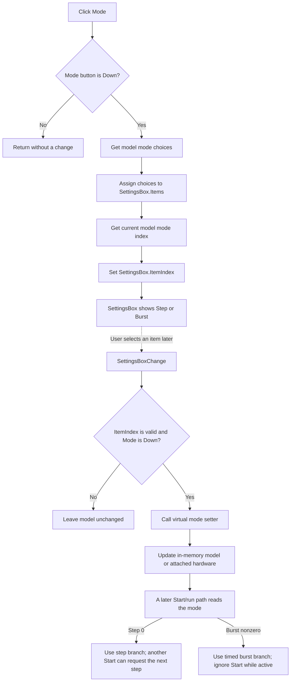

# Show the generator mode setting

## Control

| Property | Recovered value |
| --- | --- |
| Form | DigitalSignalGeneratorWin |
| Component path | DigitalSignalGeneratorWin.ClockGroupBox.SteppingModeBtn |
| Control class | TSpeedButton |
| Caption | Mode |
| Hint | Not present in the recovered resource. |
| Group | GroupIndex 3 with the Clock, Trigger, and Level setting selectors |
| Handler name | SteppingModeBtnClick |
| Handler address | 015102c0 |
| Graph node | `resource:dfm:DigitalSignalGeneratorWin/DigitalSignalGeneratorWin.ClockGroupBox.SteppingModeBtn` |
| Handler node | `function:015102c0` |
| Graph layer | UI |

## What happens when clicked

This button selects which generator property the shared `SettingsBox` drop-down edits. It is not a direct Step/Burst toggle.

The handler first tests the `Down` state of `SteppingModeBtn`. If the button is not down, the handler returns without a change. When it is down, the handler gets the mode-choice list from the generator model and assigns it to `SettingsBox.Items`. It then gets the current mode index from the same model and assigns that index to `SettingsBox.ItemIndex`. The recovered base model supplies two choices: `Step` at index 0 and `Burst` at index 1. Its initial value is index 1, `Burst`. The form-create path uses the same model list and current index, so the first Mode click restores the same model-backed presentation.

The selection change in `SettingsBox` performs the later write. Its shared change handler ignores `ItemIndex = -1`. If Mode is the down selector, it passes the valid index to the model's virtual mode setter. The base model stores the index in its in-memory mode field. The hardware-backed model sends the index to its device API. The Mode button handler itself does not write the mode, call hardware, start or stop generation, or change the period, measurement length, trigger source, level, display range, control visibility, or enabled state.

## Run and clock interaction

The start path reads the selected mode later:

- In Step mode, index 0, an active generator can accept another Start action. The run path uses its step branch and waits for the step-completion state while it pumps application messages.
- In Burst mode, a nonzero index, Start returns without action when generation is already active. The run path uses the timed burst branch. It derives the wait from the clock period and the sample count before it completes the output operation.
- Stop acts only when a run is active and calls the model's stop operation. The Mode selector does not invoke this path.

The run worker owns the Start/Stop button states, active flag, timing preparation, and conditional output-view refresh. No such transition occurs in `FUN_015102c0`. Therefore, clicking Mode while the generator is idle only changes the content shown in `SettingsBox`. A later valid drop-down selection changes the mode that the next run consumes.

## Click flow

## State, persistence, and boundary behavior

- The handler has no validation or error dialog. Its only explicit guard is the button's `Down` state.
- An empty choice list or an invalid current model index can leave the drop-down with no selected item. The later change handler ignores index `-1`.
- The list assignment occurs before the index assignment. The handler has no local exception handling or rollback, so a failure after the list assignment can leave a partial drop-down update. The mode model is still unchanged by this handler.
- Repeated clicks while Mode remains down reload the model's choices and current index. This is state-preserving when the model did not change.
- The base setter changes only the live model. The hardware-backed setter sends the new mode to the attached device. No file, registry, or INI write is present in the Mode click or shared drop-down change path. Durable persistence is not proven.
- Form destruction releases the model. No save action occurs in this handler.

## Handler evidence

- [Mode selector handler `FUN_015102c0`](../../../DecompiledSources/Tina16/functions/00000000015102C0__FUN_015102c0.c) tests `SteppingModeBtn.Down`, assigns the model's virtual mode list to the shared combo box, and sets its current index.
- [Shared `SettingsBoxChange` handler `FUN_01510170`](../../../DecompiledSources/Tina16/functions/0000000001510170__FUN_01510170.c) rejects index `-1` and calls the mode setter only when the Mode selector is down.
- [Base model initialization `FUN_01503530`](../../../DecompiledSources/Tina16/functions/0000000001503530__FUN_01503530.c) adds `Step` and `Burst` and sets the initial mode index to 1.
- The base model [returns its mode list](../../../DecompiledSources/Tina16/functions/0000000001503700__FUN_01503700.c), [returns its current mode](../../../DecompiledSources/Tina16/functions/0000000001503710__FUN_01503710.c), and [stores a new mode index](../../../DecompiledSources/Tina16/functions/0000000001503720__FUN_01503720.c).
- The hardware-backed model [returns the mode list](../../../DecompiledSources/Tina16/functions/0000000001503EE0__FUN_01503ee0.c), [reads the device mode](../../../DecompiledSources/Tina16/functions/0000000001503EF0__FUN_01503ef0.c), and [writes the device mode](../../../DecompiledSources/Tina16/functions/0000000001503F10__FUN_01503f10.c).
- [Form creation `FUN_0150f690`](../../../DecompiledSources/Tina16/functions/000000000150F690__FUN_0150f690.c) constructs the model and initializes `SettingsBox` from the same mode-list and mode-index virtual methods.
- [Start handler `FUN_01512200`](../../../DecompiledSources/Tina16/functions/0000000001512200__FUN_01512200.c) and [run worker `FUN_01512260`](../../../DecompiledSources/Tina16/functions/0000000001512260__FUN_01512260.c) use mode 0 as the step case and block a new Start during an active nonzero-mode run.
- [Hardware run path `FUN_01504270`](../../../DecompiledSources/Tina16/functions/0000000001504270__FUN_01504270.c) selects separate step and burst device operations from the mode index. [Downstream consumer `FUN_01517910`](../../../DecompiledSources/Tina16/functions/0000000001517910__FUN_01517910.c) also uses mode 0 for its step-completion wait and the nonzero mode for its timed path.
- [Stop handler `FUN_01512410`](../../../DecompiledSources/Tina16/functions/0000000001512410__FUN_01512410.c) calls the model stop operation only while the active flag is set.
- [Form destruction `FUN_01510120`](../../../DecompiledSources/Tina16/functions/0000000001510120__FUN_01510120.c) shuts down and releases the model without evidence of a settings-file write.
- [Recovered Delphi resource evidence](../../../DecompiledSources/Tina16/resources/dfm/ui-evidence.json) establishes the component class, caption, group index, event binding, sibling selectors, shared drop-down, and overlapping timing editors.

## Direct calls

The recovered graph has no direct call edge from `FUN_015102c0`. Its list getter, index getter, string-list assignment, and combo-box index setter are virtual dispatches in the recovered body.

## Resource evidence

- `SteppingModeBtn` is a `TSpeedButton` with caption `Mode`, GroupIndex 3, and no recovered hint or glyph.
- The same group contains the `Clock`, `Trigger`, and `Level` selectors. Their handlers use the same `SettingsBox` for their own model-backed choice lists.
- The DFM gives `SettingsBox` the drop-down-list style. Although its design-time items also contain a misspelled `Continous` entry, form creation clears and replaces that list from the model. The recovered model list used by this handler contains only `Step` and `Burst`.
- The nearby `X :` label belongs to a different layout context and does not establish Mode behavior.

## Analysis limits

- The recovered names of the model classes and device APIs are not available. Their roles are established from repeated virtual-slot use and the base and hardware-backed implementations.
- The code proves different step and burst execution branches. It does not prove that the model accepts any value other than the two recovered list indexes.
- No durable persistence behavior is present in the traced click, combo-change, form-create, start, stop, or form-destroy paths.
