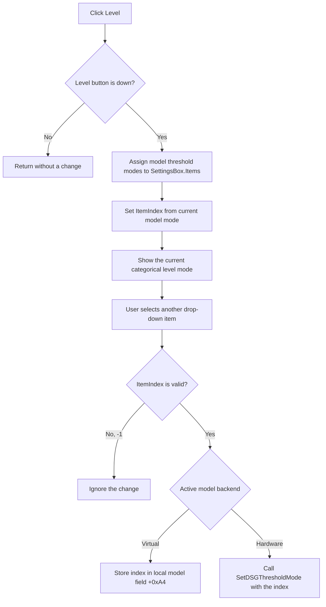

# Show the Digital Signal Generator level setting

> Analysis status: Reviewed from the Level-button handler, shared SettingsBox change handler, generator-model initialization, local model, hardware adapter, dynamic DLL wrappers, form creation, and DFM resources.

## Control

| Property | Recovered value |
| --- | --- |
| Form | DigitalSignalGeneratorWin |
| Component path | DigitalSignalGeneratorWin.ClockGroupBox.ThresholdBtn |
| Control class | TSpeedButton |
| Caption | Level |
| Group | GroupIndex 3 with the Mode, Clock, and Trigger setting selectors |
| Handler name | ThresholdBtnClick |
| Handler address | 01512070 |
| Graph node | `resource:dfm:DigitalSignalGeneratorWin/DigitalSignalGeneratorWin.ClockGroupBox.ThresholdBtn` |
| Handler node | `function:01512070` |
| Graph layer | UI |

## Direct click effect

[`FUN_01512070`](../../../DecompiledSources/Tina16/functions/0000000001512070__FUN_01512070.c) first tests the `Down` state of the Level speed button. If the button is not down, the handler returns and changes nothing.

When the button is down, the handler:

1. gets the generator model's threshold-mode string list;
2. assigns that complete list to `SettingsBox.Items`; and
3. reads the model's current threshold-mode index and assigns it to `SettingsBox.ItemIndex`.

Therefore, the click selects which setting the shared drop-down displays. It does not open a dialog, accept a number, or change the generator threshold mode by itself.

## Choices, units, and range

The threshold value is a categorical mode index, not a voltage value. `SettingsBox` has DFM style `csDropDownList`, so the user selects one of the supplied strings and cannot enter free text.

The model determines the available range as zero through one less than its threshold-list count. Hardware initialization in [`FUN_01503c70`](../../../DecompiledSources/Tina16/functions/0000000001503C70__FUN_01503c70.c) calls the dynamically resolved `GetDSGThresholdModes` export and copies every returned string into the model's threshold list. The exported C does not contain the hardware-specific list, its count, or a mapping from a mode name to a voltage. No volts or other unit is present in this control path.

The local virtual model constructor [`FUN_01503530`](../../../DecompiledSources/Tina16/functions/0000000001503530__FUN_01503530.c) supplies two fallback mode strings and defaults to index `0`. One recovered string is `CMOS`; the other string remains an opaque data reference in the exported C. This fallback list does not prove the choices returned by real hardware.

## Applying a selected mode

The shared [`FUN_01510170`](../../../DecompiledSources/Tina16/functions/0000000001510170__FUN_01510170.c) `SettingsBoxChange` handler performs the later write. It rejects `ItemIndex = -1`. When the Level button is down, it passes the valid selected index to model virtual setter `+0x108`.

The setting has two recovered backend implementations:

- [`FUN_01503920`](../../../DecompiledSources/Tina16/functions/0000000001503920__FUN_01503920.c) stores the selected index in local virtual-model field `+0xA4`. [`FUN_01503900`](../../../DecompiledSources/Tina16/functions/0000000001503900__FUN_01503900.c) returns that model's choice list, and [`FUN_01503910`](../../../DecompiledSources/Tina16/functions/0000000001503910__FUN_01503910.c) returns the stored index.
- [`FUN_015040c0`](../../../DecompiledSources/Tina16/functions/00000000015040C0__FUN_015040c0.c) forwards the selected index to the dynamic `SetDSGThresholdMode` wrapper for hardware. [`FUN_01504090`](../../../DecompiledSources/Tina16/functions/0000000001504090__FUN_01504090.c) returns the hardware model's cached choice list, and [`FUN_015040a0`](../../../DecompiledSources/Tina16/functions/00000000015040A0__FUN_015040a0.c) reads the current index through `GetDSGThresholdMode`.

The hardware setter accepts only one mode index. It has no channel number, input selection, or separate high and low values. Thus, this UI path selects the DSG-wide threshold mode exposed by the backend; it cannot target one digital channel. The recovered code does not define the electrical thresholds that the backend applies to generated signals.

## Click and selection flow

## Display, persistence, guards, and failures

- [`FUN_0150f690`](../../../DecompiledSources/Tina16/functions/000000000150F690__FUN_0150f690.c) initially fills `SettingsBox` with the Mode category. The Level click replaces those visible items with threshold-mode choices and selects the backend's current value.
- The Level click has no hardware call, drawing call, waveform rebuild, or channel update. The visible effect is the changed shared drop-down content and selection.
- The later SettingsBox change writes the selection immediately to the active model backend. No explicit Apply or OK step is present.
- The local backend keeps the value only in its model field. The hardware backend delegates ownership to the DSG DLL. No settings file, registry value, or document serialization call occurs in the traced path, so persistence after the model or hardware session ends is not proven.
- The drop-down rejects free text, and `SettingsBoxChange` rejects `-1`. There is no second local bounds check before the selected index reaches the model setter.
- The dynamic hardware wrapper resolves `SetDSGThresholdMode` at run time. If the hardware library or export is unavailable, it makes no external call and returns no success or error status. The UI path has no error message, retry, rollback, or read-back after a write.
- No running-generator or active-transfer guard is present in the click or shared change handler. Other UI state can disable access, but that behavior is outside this recovered path.
- GroupIndex 3 normally makes Mode, Clock, Trigger, and Level mutually exclusive. The shared change handler tests each button independently; this analysis relies on the normal VCL group invariant for one selected category.

## Resource and ownership evidence

- The button caption is **Level**. It has no hint, action, image reference, or extracted glyph.
- The nearby label **X :** belongs to the separate Time/Click axis controls. Its distance and the handler data flow do not associate it with Level.
- `TIARA-diz.6.7.426` owns the shared SettingsBox dispatcher `FUN_01510170`. This Bead cites it but does not duplicate its annotation.
- This Bead owns the unique Level handler and the six threshold-specific local and hardware model methods. Dynamic DLL resolution wrappers remain evidence-only.

## Analysis limits

- The original Delphi class and property names for the generator model are not recovered. The backend export names establish the term `DSGThresholdMode`.
- The recovered hardware DLL is not present, so its mode strings, voltage mapping, and device-side persistence are unknown.
- The source does not prove whether changing the mode while output is active takes effect immediately at the electrical outputs or only on the next generation cycle.
