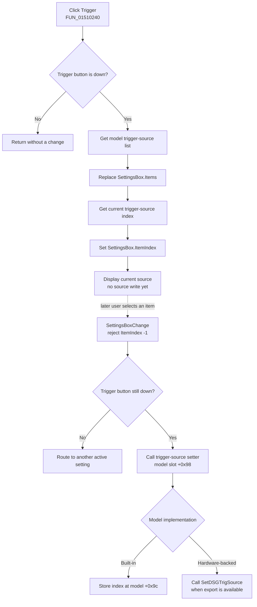

# Select the trigger source setting

> Analysis status: Evidence-backed source review complete.

## Control

| Property | Recovered value |
| --- | --- |
| Form | DigitalSignalGeneratorWin |
| Component path | DigitalSignalGeneratorWin.ClockGroupBox.TriggerSourceBtn |
| Control class | TSpeedButton |
| Caption | Trigger |
| Group index | 3 |
| Handler name | TriggerSourceBtnClick |
| Handler address | 01510240 |
| Graph node | `resource:dfm:DigitalSignalGeneratorWin/DigitalSignalGeneratorWin.ClockGroupBox.TriggerSourceBtn` |
| Handler node | `function:01510240` |
| Graph layer | UI |

The **Trigger**, **Clock**, **Mode**, and **Level** speed buttons share group index `3`. They select which setting the same `SettingsBox` drop-down displays and edits.

## What happens when clicked

VCL first makes **Trigger** the down button in group `3`. `TDigitalSignalGeneratorWin.TriggerSourceBtnClick` then checks that down state. If the button is not down, it returns without a change.

When the button is down, the handler:

1. Gets the trigger-source string list from the generator model.
2. Replaces `SettingsBox.Items` with that list.
3. Gets the model's current trigger-source index.
4. Sets `SettingsBox.ItemIndex` to that index.

This click selects and displays the trigger-source setting. It does not change the source. A later user selection in `SettingsBox` performs the write.

## Source mapping

The recovered built-in model creates this trigger-source list:

| Index | Source |
| ---: | --- |
| 0 | Internal |
| 1 | Ext.-Logic Analyzer |

It initializes the current trigger-source index to `1`. The fixed-list accessors expose the list at model field `+0x60`, read the index at `+0x9c`, and write a selected index back to `+0x9c`.

The form can also construct a hardware-backed model. That model does not assume the built-in list. During initialization it obtains supported strings through the dynamically resolved `GetDSGTrigSources` export. It reads the active index through `GetDSGTrigSource`. Therefore, the meaning of an index is the item at the same position in the model-provided list. Only the built-in model proves the two-value mapping above.

## Later selection and state propagation

`SettingsBoxChange` reads the selected item index. It returns when the index is `-1`. Otherwise, it checks which group-`3` button is down. For **Trigger**, it sends the index to model virtual setter `+0x98`.

The selected value then has one of two proven destinations:

- The built-in model stores the index at model field `+0x9c`.
- The hardware-backed model forwards the index to the dynamically resolved `SetDSGTrigSource` export.

This is the boundary where a drop-down change can reach external Digital Signal Generator state. It is not part of the direct button-click path. Bead `.426` owns the shared `SettingsBoxChange` dispatcher.

The button click does not change the clock source, stepping mode, logic level, clock period, measurement length, channel data, or plot data. It does not start, stop, arm, or trigger the generator. It also does not alter Logic Analyzer state directly. The `Ext.-Logic Analyzer` item proves an external trigger-source choice, but the recovered button path does not show the later device-to-device trigger exchange.

## Click flow

The dotted edge is downstream context. It is not a direct call from the button handler.

## Display, hardware, and persistence boundaries

- The immediate UI result is a changed group-`3` selection and refreshed `SettingsBox` items and index.
- The handler only reads the model. It does not call a trigger-source setter.
- The later built-in setter changes only its model field. No file, INI, registry, or document write is present.
- The later hardware setter crosses a dynamic-library boundary. The recovered executable does not show whether the library, device, or driver retains the value after the form or application closes.
- The recovered Digital Signal Generator save paths write period, length, channel-pattern, or sample data. They do not prove serialization of this trigger-source selection.
- No undo record, dirty-document flag, plot redraw, or measurement rebuild is present in the click or trigger-source setter path.

## No-op and error behavior

- If the button is not down when its handler runs, the handler is a no-op.
- A repeated click while **Trigger** is already active reloads the same model list and current index. It does not issue another source write.
- The handler has no list-count or index-range check. It passes the model's current index to the VCL combo setter. The recovered source does not prove how that setter handles a stale index.
- The hardware list wrapper returns an empty list when the module or `GetDSGTrigSources` export is unavailable. The handler has no empty-list fallback.
- The hardware setter wrapper calls `SetDSGTrigSource` only when the module and export are available. If either is unavailable, it performs no external call and reports no error.
- No confirmation, retry, rollback, or local exception handler is present. A VCL or model exception can leave through the event call.

## Recovered evidence

- [`FUN_01510240`](../../../DecompiledSources/Tina16/functions/0000000001510240__FUN_01510240.c) is `TDigitalSignalGeneratorWin.TriggerSourceBtnClick`. It checks the button's down state, assigns model virtual `+0x88` to `SettingsBox.Items`, and sets `SettingsBox.ItemIndex` from model virtual `+0x90`.
- [`FUN_01510170`](../../../DecompiledSources/Tina16/functions/0000000001510170__FUN_01510170.c) is the shared `SettingsBoxChange` dispatcher. The Trigger branch calls model setter `+0x98` only for an index other than `-1`; Bead `.426` owns its canonical annotation.
- [`FUN_01503530`](../../../DecompiledSources/Tina16/functions/0000000001503530__FUN_01503530.c) constructs the built-in lists and initializes the trigger index. [`FUN_01503730`](../../../DecompiledSources/Tina16/functions/0000000001503730__FUN_01503730.c), [`FUN_01503740`](../../../DecompiledSources/Tina16/functions/0000000001503740__FUN_01503740.c), and [`FUN_01503750`](../../../DecompiledSources/Tina16/functions/0000000001503750__FUN_01503750.c) expose and update that trigger-source state.
- [`FUN_01503c70`](../../../DecompiledSources/Tina16/functions/0000000001503C70__FUN_01503c70.c) fills hardware-backed option lists. [`FUN_01503f20`](../../../DecompiledSources/Tina16/functions/0000000001503F20__FUN_01503f20.c), [`FUN_01503f30`](../../../DecompiledSources/Tina16/functions/0000000001503F30__FUN_01503f30.c), and [`FUN_01503f50`](../../../DecompiledSources/Tina16/functions/0000000001503F50__FUN_01503f50.c) expose its trigger list, getter, and setter.
- [`FUN_00e1bfa0`](../../../DecompiledSources/Tina16/functions/0000000000E1BFA0__FUN_00e1bfa0.c), [`FUN_00e1c0b0`](../../../DecompiledSources/Tina16/functions/0000000000E1C0B0__FUN_00e1c0b0.c), and [`FUN_00e1c030`](../../../DecompiledSources/Tina16/functions/0000000000E1C030__FUN_00e1c030.c) dynamically resolve `GetDSGTrigSources`, `GetDSGTrigSource`, and `SetDSGTrigSource`.
- [`FUN_0150f690`](../../../DecompiledSources/Tina16/functions/000000000150F690__FUN_0150f690.c) constructs the appropriate generator model and initializes the shared Settings drop-down from it.
- [`FUN_01510cb0`](../../../DecompiledSources/Tina16/functions/0000000001510CB0__FUN_01510cb0.c) and [`FUN_01511240`](../../../DecompiledSources/Tina16/functions/0000000001511240__FUN_01511240.c) show the recovered generator save formats used for pattern and sample data.
- [`ui-evidence.json`](../../../DecompiledSources/Tina16/resources/dfm/ui-evidence.json) supplies the control caption, group index, Settings drop-down items, and event bindings.

## Analysis limits

The original Delphi model and field names are not recovered. The trigger-source roles are established by the fixed strings, the `GetDSGTrigSource*` and `SetDSGTrigSource` export names, the four grouped button handlers, and the Settings dispatcher. The external library implementation is not recovered, so this article does not claim its trigger timing, hardware protocol, or persistence behavior. Beads `.425` through `.429` own the neighboring Period, Clock, Length, Mode, and Level controls.
