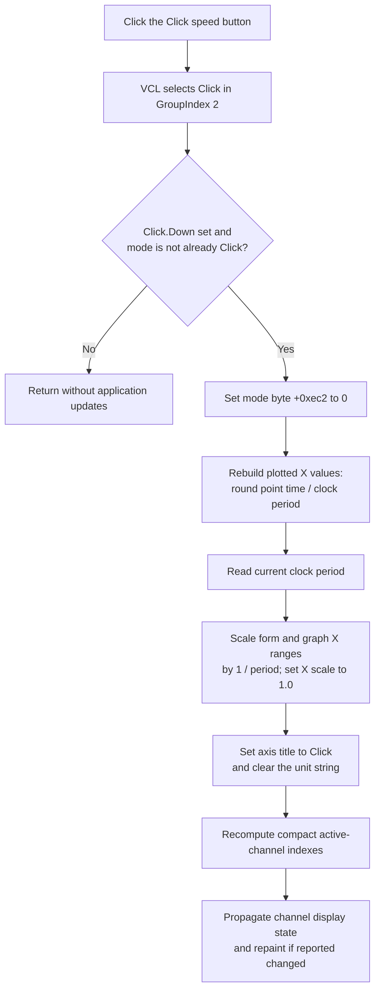

# Show the Digital Signal Generator X axis in clock clicks

> Analysis status: Reviewed from the recovered control resources, paired Time handler, display-data builder, graph-axis scaler, channel refresh path, and Digital Signal Generator save format.

## Control

| Property | Recovered value |
| --- | --- |
| Form | DigitalSignalGeneratorWin |
| Form caption | Digital Signal Generator |
| Component path | DigitalSignalGeneratorWin.ClockGroupBox.XAxisClickSpBtn |
| Control class | TSpeedButton |
| Caption | Click |
| Group index | 2, shared with `XAxisTimeSpBtn` |
| Handler name | XAxisClickSpBtnClick |
| Handler address | 01512e40 |
| Graph node | `resource:dfm:DigitalSignalGeneratorWin/DigitalSignalGeneratorWin.ClockGroupBox.XAxisClickSpBtn` |
| Handler node | `function:01512e40` |
| Graph layer | UI |

The nearby `X :` label and the common `GroupIndex = 2` establish that **Click** and **Time** are the two exclusive X-axis display choices. The recovered handlers establish what each choice does. The button has no hint, action, image reference, or glyph.

## What happens when clicked

The VCL changes the grouped speed-button state before it dispatches `OnClick`. [`FUN_01512e40`](../../../DecompiledSources/Tina16/functions/0000000001512E40__FUN_01512e40.c) continues only when both conditions are true:

- `XAxisClickSpBtn.Down` is set; and
- form mode byte `+0xec2` is not already zero.

If either condition is false, the handler returns without rebuilding data, scaling the graph, changing an axis label, or requesting a refresh. A repeated click while Click mode is already active is therefore a no-op at the application-handler level.

For a real Time-to-Click change, the handler performs these operations in order:

1. It sets mode byte `+0xec2` to zero for Click coordinates.
2. It rebuilds the plotted data through [`FUN_01513140`](../../../DecompiledSources/Tina16/functions/0000000001513140__FUN_01513140.c). For each signal point, this builder divides the stored point time by the current clock period and rounds the result to the nearest integer. The plotted X values therefore become clock-click indexes. The generated terminal point uses `period * measurement length`, which becomes the measurement-length count after division.
3. It reads the current clock period from the timing model and calls [`FUN_01506ac0`](../../../DecompiledSources/Tina16/functions/0000000001506AC0__FUN_01506ac0.c) with scale factor `1 / period` and graph X-scale value `1.0`.
4. It changes every graph-axis title to `Click` and clears the axis-unit string through [`FUN_010eb4a0`](../../../DecompiledSources/Tina16/functions/00000000010EB4A0__FUN_010eb4a0.c).
5. It recomputes active-channel indexes through the canonical shared helper [`FUN_01506c70`](../../../DecompiledSources/Tina16/functions/0000000001506C70__FUN_01506c70.c), then runs the shared channel-display propagation and redraw path through [`FUN_010f6920`](../../../DecompiledSources/Tina16/functions/00000000010F6920__FUN_010f6920.c).

The plotted click indexes are derived display data. This click does not divide or rewrite the underlying per-channel point times. The period-update path separately proves that those source times remain time values and are scaled when the period changes.

## Axis range and display scaling

`FUN_01506ac0` multiplies the form's lower and upper X bounds at `+0xc50` and `+0xc58` by `1 / period` and normalizes both to two decimal positions. It refreshes the currently selected bound edit, scales the graph object's stored X range, copies that range to each plot axis, and scales each axis's current secondary bounds with clamping. It also writes `1.0` as the graph's X-scale value. Thus, a Time range of `N * period` becomes a Click range of `N`.

The later refresh scans the current channel entries and applies their display or routing updates. It requests a graph repaint when a downstream channel callback reports a change. Reindexing does not enable or disable a channel; it recomputes the compact active index from the channel states that already exist.

## Paired Time behavior

The paired handler [`FUN_01512d60`](../../../DecompiledSources/Tina16/functions/0000000001512D60__FUN_01512d60.c) is the inverse operation. It requires `XAxisTimeSpBtn.Down` and an existing Click mode, sets `+0xec2` to one, rebuilds plotted X values without dividing them by the period, multiplies the graph range by the period, and changes the axis title to `Time` with its static unit string. Both handlers then use the same axis-label, channel-index, propagation, and refresh helpers.

The inverse factors make a normal Click-to-Time-to-Click round trip restore the prior range, subject to the two-decimal normalization and integer rounding used for Click coordinates.

## Editor state and generator boundary

This click does not show, hide, parse, or commit an edit control. The **Period** and **Length** speed buttons use a different group (`GroupIndex = 1`) and separate handlers. Those handlers choose between `ClockPeriodEdit` and `MeasLengthEdit`. Switching the X-axis to Click leaves that editor choice and both underlying timing-model values unchanged.

The handler also does not start or stop generation, change the clock source, change the stepping mode, acquire data, or write signal states to hardware. It changes the current form and graph display state.

## Click flow

## Persistence, errors, and partial state

- Form creation initializes mode byte `+0xec2` to one, which is Time mode. The recovered `.dsg` writer stores Period, Length, and signal data, but it does not store this Time/Click mode byte. The Click handler calls no file writer, settings writer, serializer, or recovered dirty-state setter. The selected representation is therefore proven only for the current live form and graph state.
- The handler does not validate the clock period and has no explicit zero guard before it calculates `1 / period`. Normal period controls and timing-model checks constrain the value, but an invalid programmatic zero is not handled here.
- There is no local exception handler, transaction, user message, or rollback. The mode byte changes before the old plotted-data object is released and rebuilt. A failure during allocation, conversion, scaling, labeling, or refresh can leave earlier mode or graph changes applied while later work is incomplete.
- Click conversion rounds each point coordinate to an integer. Two distinct time values that map to the same clock click can therefore have the same displayed X coordinate. The handler does not report this as an error.
- The direct source does not prove the human-readable base unit of the Time representation. This article does not infer one from the caption.

## Evidence

- Click handler: [FUN_01512e40](../../../DecompiledSources/Tina16/functions/0000000001512E40__FUN_01512e40.c)
- Paired Time handler: [FUN_01512d60](../../../DecompiledSources/Tina16/functions/0000000001512D60__FUN_01512d60.c)
- Time/click display builder: [FUN_01513140](../../../DecompiledSources/Tina16/functions/0000000001513140__FUN_01513140.c)
- Graph and bound scaler: [FUN_01506ac0](../../../DecompiledSources/Tina16/functions/0000000001506AC0__FUN_01506ac0.c)
- Graph-axis label setter: [FUN_010eb4a0](../../../DecompiledSources/Tina16/functions/00000000010EB4A0__FUN_010eb4a0.c)
- Active-channel reindexer: [FUN_01506c70](../../../DecompiledSources/Tina16/functions/0000000001506C70__FUN_01506c70.c)
- Channel propagation and redraw coordinator: [FUN_010f6920](../../../DecompiledSources/Tina16/functions/00000000010F6920__FUN_010f6920.c)
- Form initialization: [FUN_0150f690](../../../DecompiledSources/Tina16/functions/000000000150F690__FUN_0150f690.c)
- Digital Signal Generator writer: [FUN_01510cb0](../../../DecompiledSources/Tina16/functions/0000000001510CB0__FUN_01510cb0.c)
- Recovered resources: [ui-evidence.json](../../../DecompiledSources/Tina16/resources/dfm/ui-evidence.json)

## Annotation ownership

This Bead owns only the unique `FUN_01512e40` annotation. The shared axis, display, channel-index, propagation, and redraw helpers remain canonical in their existing or coordinating control Beads.
