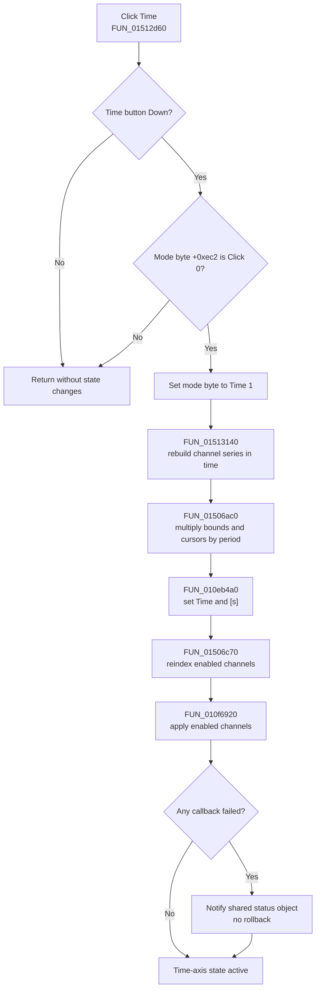

# Display the X axis as time

> Analysis status: Evidence-backed source review complete.

## Control

| Property | Recovered value |
| --- | --- |
| Form | DigitalSignalGeneratorWin |
| Component path | DigitalSignalGeneratorWin.ClockGroupBox.XAxisTimeSpBtn |
| Control class | TSpeedButton |
| Caption | Time |
| Group index | 2 |
| Handler name | XAxisTimeSpBtnClick |
| Handler address | 01512d60 |
| Graph node | `resource:dfm:DigitalSignalGeneratorWin/DigitalSignalGeneratorWin.ClockGroupBox.XAxisTimeSpBtn` |
| Handler node | `function:01512d60` |
| Graph layer | UI |

The **Time** and **Click** speed buttons share group index `2`. They select whether the horizontal graph coordinate is physical time or a period-normalized clock-step index. The nearby `X :` label identifies the pair as an X-axis setting; the recovered conversion code establishes the exact meaning.

## What happens when clicked

VCL first selects **Time** in the mutually exclusive speed-button group. `TDigitalSignalGeneratorWin.XAxisTimeSpBtnClick` then requires both of these conditions:

- the Time button's recovered `Down` byte at control offset `+0x328` is set; and
- the form mode byte at `+0xec2` is `0`, which is Click mode.

If both conditions are true, the handler performs this ordered conversion:

1. Set `+0xec2` to `1` for Time mode.
2. Rebuild the derived plot data at `+0x880` from every channel's sequence.
3. Multiply the horizontal lower and upper bounds at `+0xc50` and `+0xc58` by the current clock period.
4. Apply the same scale to the graph's horizontal coordinate system and its two recovered cursor positions.
5. Label the graph axis `Time` with unit `[s]`.
6. Reindex enabled channels and invoke the shared per-enabled-channel apply pass.

The mode is therefore a real data-presentation conversion. It does not only change the selected button or axis text.

## Data and axis conversion

`FUN_01513140` destroys the old derived plot-data object and creates a replacement. For every channel, it creates one plot series and copies its sequence points:

- In Time mode, each recovered point keeps its stored time coordinate.
- The generated terminal point uses `clock period * measurement length`.
- In Click mode, the paired path divides each time coordinate by the clock period and rounds it to an integer clock-step position.

`FUN_01506ac0` then converts the existing view instead of resetting it. It multiplies both stored X bounds by the same clock period, passes them through the shared numeric-normalization helper, writes the active bound to the coordinate editor, scales the horizontal axis, stores the period as axis metadata, copies the converted bounds to both recovered axis slots, and scales both recovered cursor positions when they are present.

`FUN_010eb4a0` assigns `Time` and `[s]` to the horizontal axes in the plot collection. The `[s]` text is the UTF-16 value at recovered constant `DAT_01512e38`. The paired Click handler assigns `Click` and an empty unit, divides the view by the clock period, and stores axis scale `1.0`.

## UI and model propagation

- The speed-button state and form byte `+0xec2` record the selected presentation mode.
- The old derived graph dataset is replaced with time-coordinate series. The underlying channel sequences are read, not rewritten.
- The current X bounds, the active coordinate-editor value, axis metadata, and cursor coordinates are converted in place. The current visible range is preserved in different units when the clock period is valid.
- `FUN_01506c70` recomputes the sequential indexes of enabled channels. Bead `.421` owns this shared helper.
- `FUN_010f6920` visits enabled channels, calls the form's shared virtual apply callback, accumulates callback failures, and notifies the owning status object when any callback reports failure. The recovered indirect call does not establish a direct hardware write.
- The handler contains no explicit repaint or invalidate call. The recovered axis and dataset setters establish the new display state, but exact repaint timing remains inside the shared graph controls.

## Editor visibility and other settings

This mode switch does not show or hide the clock-setting editors. `ClockPeriodEdit` is visible in the DFM and `MeasLengthEdit` starts hidden; their **Period** and **Length** speed buttons form a separate group with group index `1`. The Time handler does not access their visibility properties.

It does update the current coordinate value in the shared graph coordinate editor after converting the stored bounds. It does not change the clock period, measurement length, clock source, trigger source, threshold, or stepping mode.

## Click flow

## Persistence and repeat behavior

- The mode byte is form-instance state. Form creation initializes it to Time mode.
- Repeating the click while Time mode is already active fails the second guard and does not rebuild, rescale, relabel, or run the channel apply pass again.
- The recovered Digital Signal Generator save path writes the clock period, measurement length, and channel pattern data. It does not write `+0xec2`. This handler has no file, registry, or INI call.
- Switching back through the paired Click handler performs the reciprocal period division and rebuild. That paired handler is owned by Bead `.431`.

## Empty and error paths

- If the button is not down, including a programmatic event invocation in the wrong control state, the handler returns without work.
- If no channels exist, the rebuild produces an empty derived plot-data object and the channel reindex/apply loops perform no channel work. The axis conversion and label update still run.
- The handler reads the already accepted clock period from the generator model. It performs no zero, sign, finite-value, or range validation of its own. The clock-period editor has a separate error path that restores the model value after rejected input.
- A zero period would collapse the converted bounds and cursor values to zero in this handler. The recovered source does not show a local warning or fallback.
- A shared channel callback failure is reported after the conversion. The handler does not revert the mode byte, dataset, bounds, labels, or earlier successful callbacks.
- There is no local exception handler or transaction. The mode byte is written before data allocation and axis conversion, so an exception from a later helper can leave an intermediate Time-mode state.

## Recovered evidence

- [`FUN_01512d60`](../../../DecompiledSources/Tina16/functions/0000000001512D60__FUN_01512d60.c) is the Time click handler. Its two guards, mode write, and five ordered calls establish the complete direct path. This Bead owns its annotation.
- [`FUN_01512e40`](../../../DecompiledSources/Tina16/functions/0000000001512E40__FUN_01512e40.c) is the paired Click handler. It checks the reciprocal state, clears `+0xec2`, divides by the clock period, labels the axis `Click`, and calls the same rebuild and propagation helpers. Bead `.431` owns it.
- [`FUN_01513140`](../../../DecompiledSources/Tina16/functions/0000000001513140__FUN_01513140.c) rebuilds the per-channel derived plot series and selects physical time or period-normalized coordinates from `+0xec2`.
- [`FUN_01506ac0`](../../../DecompiledSources/Tina16/functions/0000000001506AC0__FUN_01506ac0.c) scales the two view bounds, active coordinate edit, horizontal-axis state, and recovered cursor positions.
- [`FUN_010eb4a0`](../../../DecompiledSources/Tina16/functions/00000000010EB4A0__FUN_010eb4a0.c) distributes the axis title and unit strings to the plot collection.
- [`FUN_01506c70`](../../../DecompiledSources/Tina16/functions/0000000001506C70__FUN_01506c70.c) reindexes enabled channels. [`FUN_010f6920`](../../../DecompiledSources/Tina16/functions/00000000010F6920__FUN_010f6920.c) runs the shared enabled-channel apply pass and reports aggregate failure.
- [`FUN_0150f690`](../../../DecompiledSources/Tina16/functions/000000000150F690__FUN_0150f690.c) initializes `+0xec2` to Time mode. [`FUN_01510cb0`](../../../DecompiledSources/Tina16/functions/0000000001510CB0__FUN_01510cb0.c) shows the generator file fields and does not serialize the axis-mode byte.
- [`ui-evidence.json`](../../../DecompiledSources/Tina16/resources/dfm/ui-evidence.json) supplies the Time/Click speed-button group, X label, clock editors, captions, visibility defaults, and event bindings.

## Analysis limits

The original Delphi names of the mode byte, plot-data field, bound fields, and shared graph object are not recovered. Their roles follow from the reciprocal Time/Click arithmetic and repeated reads and writes in the display path. The graph-control methods and per-channel apply callback are virtual, so this article does not claim a specific repaint schedule or direct device protocol. Shared helpers remain evidence-only here under the neighboring Bead ownership assignments.
