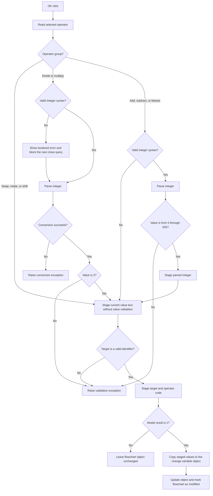

# OK

## Control

| Property | Recovered value |
| --- | --- |
| Form | dlgFlowChartChangeVariable |
| Component path | dlgFlowChartChangeVariable.bOK |
| Control class | TBitBtn |
| Caption | Supplied by the recovered `bkOK` button kind. |
| Hint | Not present in the recovered resource. |
| Text | Not present in the recovered resource. |
| Handler name | bOKClick |
| Handler address | 00f94a90 |
| Graph node | `resource:dfm:dlgFlowChartChangeVariable/dlgFlowChartChangeVariable.bOK` |
| Handler node | `function:00f94a90` |
| Graph layer | UI |

## What happens when clicked

The click validates and stages a change to a flowchart variable. The dialog has
three inputs: a target identifier, an operator row, and value text. The selected
operator determines how the handler processes the value text.

- `swap`, the four rotate rows, and the two shift rows do not use a value. The
  operator-change path disables the value editor and puts `<disabled>` in it.
  The click skips value validation for these rows.
- `/` and `*` require an integer value of exactly 2. Invalid integer syntax
  opens a localized error message and sets a one-use close guard. The next
  close query keeps the dialog open and resets the guard. The integer parser
  still runs after this message. A conversion failure follows the parser's
  exception path. A converted value other than 2 raises an exception with the
  text `Only value=2 is applicable`.
- `+`, `-`, `and`, `or`, and `xor` accept raw non-integer text without more
  syntax validation. If the text is a decimal or `H`-suffix hexadecimal
  integer, the handler parses it and requires a value from 0 through 255. An
  integer outside this range raises the localized
  `HDLStrings.Msg_FC_InvValue` exception.

After the operator-specific checks, the handler copies the current value text
to its staged value field. It then validates the target identifier. A valid
identifier is nonempty, starts with an ASCII letter or underscore, and contains
only ASCII letters, digits, or underscores. Invalid text raises the localized
`HDLStrings.Msg_FC_InvIdentifier` exception. Valid text is copied to the staged
target field. The handler then stores the selected combo-box row as the
operator code.

The click handler does not change the flowchart object directly. The `bkOK`
modal action returns control to `FUN_01050d90`. Only modal result 1 copies the
staged target, value text, parsed integer, and operator code to the selected
change-variable object. That accepted path calls the object's update method,
marks the flowchart as modified, and sets a flowchart state flag. Cancel or a
different modal result leaves the object unchanged in this function.

The click handler has no local catch, retry, fallback, or rollback block. A
raised validation or conversion exception interrupts normal completion.

## Click flow

## Handler evidence

- Handler source: [FUN_00f94a90](../../../DecompiledSources/Tina16/functions/0000000000F94A90__FUN_00f94a90.c)
- Identifier validator: [FUN_00f60aa0](../../../DecompiledSources/Tina16/functions/0000000000F60AA0__FUN_00f60aa0.c)
- Integer-form validator: [FUN_00f60f00](../../../DecompiledSources/Tina16/functions/0000000000F60F00__FUN_00f60f00.c)
- Integer parser: [FUN_00f60f70](../../../DecompiledSources/Tina16/functions/0000000000F60F70__FUN_00f60f70.c)
- Recoverable-error helper: [FUN_00f94a20](../../../DecompiledSources/Tina16/functions/0000000000F94A20__FUN_00f94a20.c)
- Close guard: [FUN_00f94970](../../../DecompiledSources/Tina16/functions/0000000000F94970__FUN_00f94970.c)
- Operator-state update: [FUN_00f953a0](../../../DecompiledSources/Tina16/functions/0000000000F953A0__FUN_00f953a0.c)
- Dialog initialization: [FUN_00f94900](../../../DecompiledSources/Tina16/functions/0000000000F94900__FUN_00f94900.c)
- Modal caller and commit path: [FUN_01050d90](../../../DecompiledSources/Tina16/functions/0000000001050D90__FUN_01050d90.c)
- Modified-state synchronizer: [FUN_01053e80](../../../DecompiledSources/Tina16/functions/0000000001053E80__FUN_01053e80.c)
- Recovered role: Validate and stage a flowchart change-variable operation for
  modal acceptance.
- Complexity: complex
- Distinct outgoing calls: 13

The DFM binds `dlgFlowChartChangeVariable.bOK.OnClick` to `bOKClick` at
`00f94a90` and assigns kind `bkOK`. The source reads `eIdentifier` at form
field `+0x6E0`, `eValue` at `+0x6E8`, and `cbOperator.ItemIndex` at `+0x6F0`.
It stages the target at `+0x700`, value text at `+0x708`, parsed integer at
`+0x710`, and operator code at `+0x714`. Field `+0x6F8` is the close guard.

`FUN_00f94900` initializes the staged fields from change-variable object
offsets `+0x110`, `+0x118`, `+0x120`, and `+0x126`. `FUN_01050d90` tests the
modal result for exact value 1 and copies those four fields back only on that
branch. This establishes the accepted-output boundary.

## Direct calls

- `function:0064dd90` - read Unicode text from `eValue` and `eIdentifier`.
- `function:00f60f00` - identify decimal or `H`-suffix hexadecimal integer
  text.
- `function:00f60f70` - parse decimal or hexadecimal integer text.
- `function:00f60aa0` - validate the target identifier.
- `function:00f94a20` - show an invalid-integer message and set the close
  guard.
- `function:00414ad0` - copy accepted strings to staged form fields.
- `function:00b89270`, `function:0041ddd0`, and `function:00b8e650` - load
  localized validation text.
- `function:00416cd0` - format the rejected input into a validation message.
- `function:0044d490` and `function:004134c0` - construct and raise a
  validation exception.
- `function:00414560` - finalize temporary Unicode strings.

## Resource evidence

- The form caption is `Change Variable`.
- The labels identify `Target variable`, `Operator`, and `Value or variable`.
- `cbOperator` is a `csDropDownList` with ordered rows `+`, `-`, `/`, `*`,
  `swap`, `and`, `or`, `xor`, `rotate left`, `rotate right`, `rotate left
  through carry`, `rotate right through carry`, `shift left`, and `shift
  right`.
- The OK control has kind `bkOK`. It has no recovered hint, custom glyph, or
  explicit modal-result property.

## Nearby label candidates

The handler and control fields confirm these labels; their distance alone is
not the evidence.

- `Value or variable` is the label for `eValue`.
- `Operator` is the label for `cbOperator`.
- `Target variable` is the label for `eIdentifier`.

## Analysis limits

- For `+`, `-`, `and`, `or`, and `xor`, non-integer value text does not reach
  the identifier validator or another syntax check in this handler. The label
  calls it a variable, but the recovered click path does not enforce that rule.
- The handler stores `cbOperator.ItemIndex` as one byte without an explicit
  bounds check. The drop-down-list resource constrains normal user selection,
  but the recovered handler does not guard a programmatic invalid index.
- The source proves the integer-parser exception path. It does not provide a
  form-specific message for a conversion failure.
